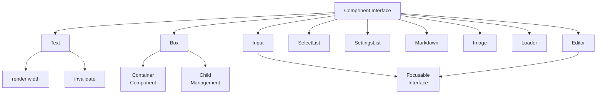
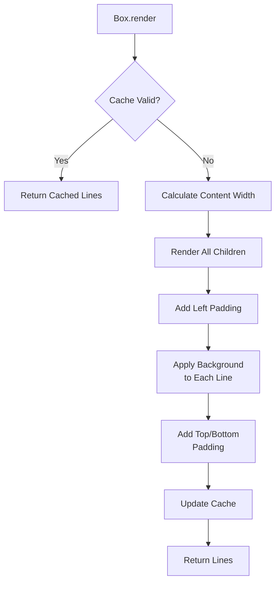
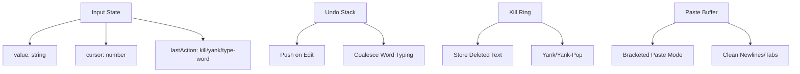
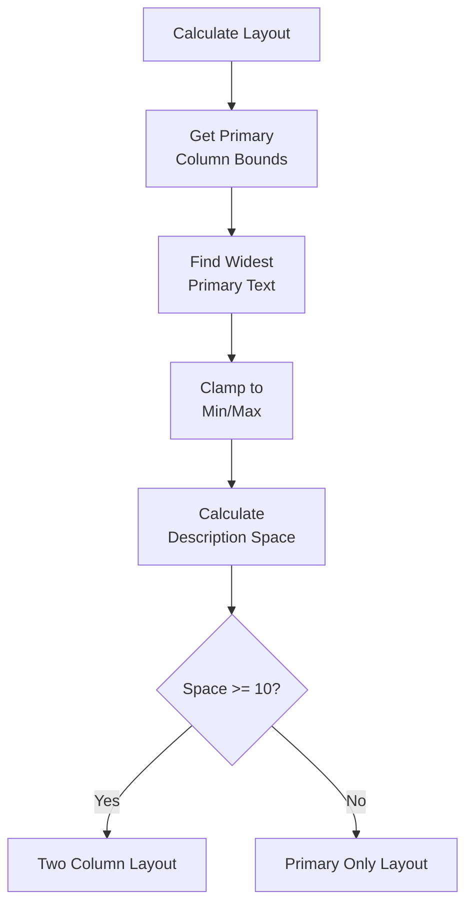
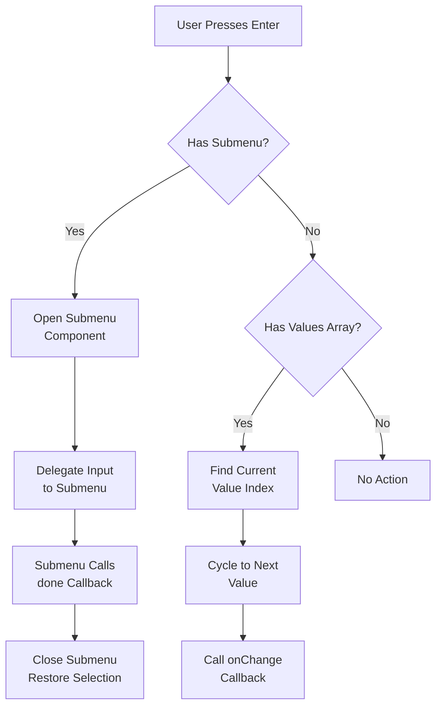
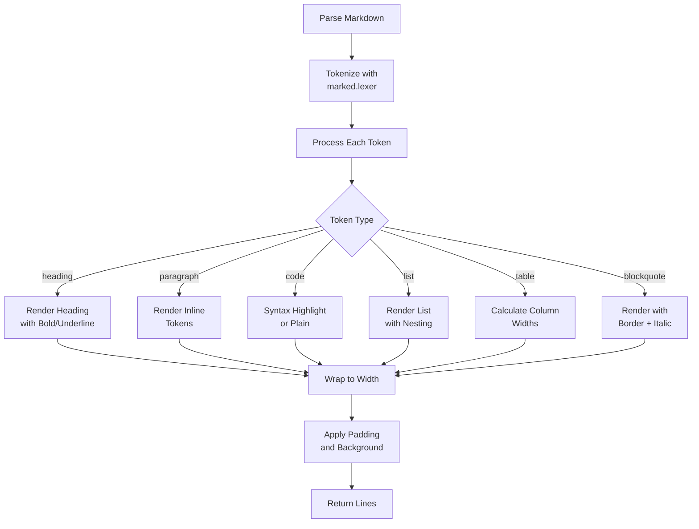
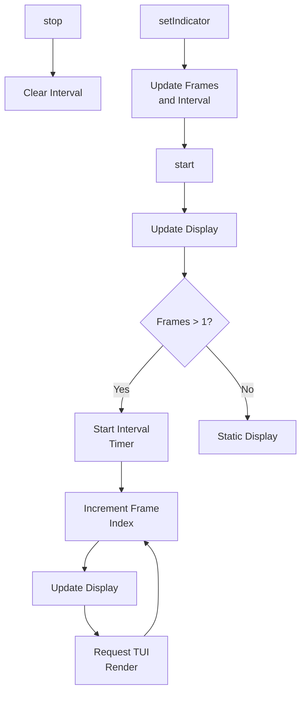

# TUI Components: Editor, Select List, Markdown & More

The `@pi-tui` package provides a comprehensive suite of reusable UI components for building terminal user interfaces. These components form the building blocks of the TUI framework, implementing the `Component` interface to provide consistent rendering, input handling, and state management. The component library includes text display, interactive input fields, selection lists, markdown rendering, image display, and a full-featured multi-line text editor with syntax highlighting and advanced editing capabilities.

This page documents the architecture, features, and usage patterns of the core TUI components, including the `Text`, `Box`, `Input`, `SelectList`, `SettingsList`, `Markdown`, `Image`, `Loader`, and `Editor` components. Each component is designed to work seamlessly within the TUI rendering system while providing specialized functionality for different UI scenarios.

## Component Architecture

All TUI components implement a common `Component` interface that defines the contract for rendering and interaction. The core methods include:

- `render(width: number): string[]` - Renders the component to an array of terminal lines
- `invalidate?(): void` - Clears cached rendering state
- `handleInput?(data: string): void` - Processes keyboard input

Components use caching strategies to optimize rendering performance, invalidating cached output when state changes. The rendering system passes available width to each component, allowing them to adapt their layout dynamically.

Sources: [packages/tui/src/tui.ts](../../../packages/tui/src/tui.ts), [packages/tui/src/components/text.ts:5-8](../../../packages/tui/src/components/text.ts#L5-L8), [packages/tui/src/components/box.ts:6-8](../../../packages/tui/src/components/box.ts#L6-L8)



## Text Component

The `Text` component provides basic multi-line text display with word wrapping, padding, and optional background colors. It preserves ANSI escape codes during wrapping and applies consistent styling across all lines.

### Features

- **Word Wrapping**: Automatically wraps text to fit available width while preserving ANSI codes
- **Padding**: Configurable horizontal and vertical padding
- **Background Colors**: Optional custom background function applied to entire component
- **Render Caching**: Caches rendered output based on text content and width

### Implementation Details

The component normalizes tabs to 3 spaces, calculates content width by subtracting padding, and uses `wrapTextWithAnsi()` to handle text wrapping. Background colors are applied using `applyBackgroundToLine()` which ensures full-width coverage including padding areas.

Sources: [packages/tui/src/components/text.ts:9-96](../../../packages/tui/src/components/text.ts#L9-L96)

```typescript
// Example usage from source
constructor(text: string = "", paddingX: number = 1, paddingY: number = 1, customBgFn?: (text: string) => string)
```

The rendering pipeline follows this flow:

1. Check cache validity (text + width)
2. Normalize text (replace tabs)
3. Calculate content width
4. Wrap text with ANSI preservation
5. Apply margins and background
6. Add top/bottom padding
7. Cache and return result

Sources: [packages/tui/src/components/text.ts:40-93](../../../packages/tui/src/components/text.ts#L40-L93)

## Box Component

The `Box` component serves as a container that applies padding and background colors to child components. It manages a collection of child components and renders them sequentially with consistent styling.

### Child Management

| Method | Description |
|--------|-------------|
| `addChild(component)` | Adds a component to the children array |
| `removeChild(component)` | Removes a specific component |
| `clear()` | Removes all children |
| `invalidate()` | Invalidates cache and all children |

Sources: [packages/tui/src/components/box.ts:23-42](../../../packages/tui/src/components/box.ts#L23-L42)

### Rendering Strategy

The Box component uses aggressive caching to avoid re-rendering when child output hasn't changed. It samples the background function output to detect style changes and compares child line arrays for content changes.



Sources: [packages/tui/src/components/box.ts:44-100](../../../packages/tui/src/components/box.ts#L44-L100)

## Input Component

The `Input` component provides a single-line text input field with advanced editing capabilities including horizontal scrolling, undo/redo, kill ring operations, and bracketed paste support.

### Key Features

- **Grapheme-Aware Editing**: Correctly handles multi-byte Unicode characters and emoji
- **Emacs-Style Keybindings**: Support for kill/yank operations with kill ring
- **Undo Stack**: Multi-level undo with smart coalescing for consecutive word typing
- **Bracketed Paste**: Handles pasted content as a single operation
- **Word Navigation**: Move and delete by word boundaries
- **Horizontal Scrolling**: Automatically scrolls to keep cursor visible

Sources: [packages/tui/src/components/input.ts:1-30](../../../packages/tui/src/components/input.ts#L1-L30)

### Input State Management



### Advanced Editing Operations

| Operation | Keybinding | Description |
|-----------|------------|-------------|
| Delete Word Back | Ctrl+W | Deletes word before cursor, adds to kill ring |
| Delete Word Forward | Alt+D | Deletes word after cursor, adds to kill ring |
| Delete to Line Start | Ctrl+U | Deletes from start to cursor, adds to kill ring |
| Delete to Line End | Ctrl+K | Deletes from cursor to end, adds to kill ring |
| Yank | Ctrl+Y | Inserts most recent kill ring entry |
| Yank Pop | Alt+Y | Rotates kill ring and replaces yanked text |
| Undo | Ctrl+Z | Restores previous state from undo stack |

Sources: [packages/tui/src/components/input.ts:80-175](../../../packages/tui/src/components/input.ts#L80-L175)

The kill ring accumulates consecutive kill operations, allowing users to delete multiple regions and yank them back as a single unit. The `lastAction` state tracks whether consecutive operations should accumulate.

Sources: [packages/tui/src/components/input.ts:176-234](../../../packages/tui/src/components/input.ts#L176-L234)

### Horizontal Scrolling Algorithm

The input field implements intelligent scrolling to keep the cursor visible within available width:

1. If content fits entirely, display all text
2. If cursor is near start (< half width), align to start
3. If cursor is near end (> total - half width), align to end  
4. Otherwise, center cursor in viewport

Sources: [packages/tui/src/components/input.ts:318-352](../../../packages/tui/src/components/input.ts#L318-L352)

## SelectList Component

The `SelectList` component provides a keyboard-navigable list of items with filtering, descriptions, and customizable layout. It's commonly used for command palettes, option selection, and menu systems.

### Component Structure

```typescript
interface SelectItem {
  value: string;           // Unique identifier
  label: string;           // Display text (primary column)
  description?: string;    // Optional secondary text
}
```

Sources: [packages/tui/src/components/select-list.ts:11-15](../../../packages/tui/src/components/select-list.ts#L11-L15)

### Layout System

The SelectList uses a two-column layout with configurable primary column width:

- **Primary Column**: Displays item labels with configurable min/max width
- **Description Column**: Shows optional descriptions in remaining space
- **Minimum Description Width**: 10 characters (won't show if less space available)



Sources: [packages/tui/src/components/select-list.ts:129-148](../../../packages/tui/src/components/select-list.ts#L129-L148)

### Filtering and Navigation

The component supports prefix-based filtering and wrapping navigation:

- **Up Arrow**: Move to previous item (wraps to bottom)
- **Down Arrow**: Move to next item (wraps to top)
- **Enter**: Select current item
- **Escape**: Cancel selection

When a filter is applied, the selection resets to the first matching item. Scroll indicators show position when not all items are visible.

Sources: [packages/tui/src/components/select-list.ts:86-117](../../../packages/tui/src/components/select-list.ts#L86-L117)

### Custom Truncation

The layout system supports custom truncation functions through the `truncatePrimary` callback, which receives context about the item being rendered:

```typescript
interface SelectListTruncatePrimaryContext {
  text: string;
  maxWidth: number;
  columnWidth: number;
  item: SelectItem;
  isSelected: boolean;
}
```

Sources: [packages/tui/src/components/select-list.ts:24-30](../../../packages/tui/src/components/select-list.ts#L24-L30)

## SettingsList Component

The `SettingsList` component provides an interactive settings interface with support for value cycling, submenus, fuzzy search, and detailed descriptions.

### Setting Item Structure

```typescript
interface SettingItem {
  id: string;              // Unique identifier
  label: string;           // Display label (left side)
  description?: string;    // Optional description when selected
  currentValue: string;    // Current value (right side)
  values?: string[];       // If provided, Enter/Space cycles values
  submenu?: (currentValue: string, done: (selectedValue?: string) => void) => Component;
}
```

Sources: [packages/tui/src/components/settings-list.ts:6-16](../../../packages/tui/src/components/settings-list.ts#L6-L16)

### Interaction Modes

The component supports two interaction patterns:

1. **Value Cycling**: If `values` array is provided, Enter/Space cycles through options
2. **Submenu Navigation**: If `submenu` function is provided, Enter opens a nested component



Sources: [packages/tui/src/components/settings-list.ts:150-173](../../../packages/tui/src/components/settings-list.ts#L150-L173)

### Fuzzy Search

When search is enabled (`enableSearch: true`), the component provides an integrated search input that uses fuzzy filtering to match items by label. The search input is rendered at the top of the list, and typing updates the filtered results in real-time.

Sources: [packages/tui/src/components/settings-list.ts:115-120](../../../packages/tui/src/components/settings-list.ts#L115-L120), [packages/tui/src/components/settings-list.ts:183-186](../../../packages/tui/src/components/settings-list.ts#L183-L186)

## Markdown Component

The `Markdown` component provides rich text rendering with support for headings, lists, tables, code blocks, blockquotes, and inline formatting. It uses the `marked` library for parsing and implements custom rendering logic for terminal output.

### Supported Elements

| Element | Features |
|---------|----------|
| Headings | H1-H6 with bold/underline styling |
| Paragraphs | Word wrapping with ANSI preservation |
| Code Blocks | Syntax highlighting support, configurable indent |
| Inline Code | Distinct styling for `code spans` |
| Lists | Ordered/unordered with nesting support |
| Tables | Width-aware rendering with cell wrapping |
| Blockquotes | Nested rendering with border and italic text |
| Links | Hyperlink support (OSC 8) or URL fallback |
| Emphasis | Bold, italic, strikethrough, underline |
| Horizontal Rules | Separator lines |

Sources: [packages/tui/src/components/markdown.ts:34-51](../../../packages/tui/src/components/markdown.ts#L34-L51)

### Theme System

The Markdown component uses a comprehensive theme interface that allows customization of all visual elements:

```typescript
interface MarkdownTheme {
  heading: (text: string) => string;
  link: (text: string) => string;
  linkUrl: (text: string) => string;
  code: (text: string) => string;
  codeBlock: (text: string) => string;
  codeBlockBorder: (text: string) => string;
  quote: (text: string) => string;
  quoteBorder: (text: string) => string;
  hr: (text: string) => string;
  listBullet: (text: string) => string;
  bold: (text: string) => string;
  italic: (text: string) => string;
  strikethrough: (text: string) => string;
  underline: (text: string) => string;
  highlightCode?: (code: string, lang?: string) => string[];
  codeBlockIndent?: string;
}
```

Sources: [packages/tui/src/components/markdown.ts:34-51](../../../packages/tui/src/components/markdown.ts#L34-L51)

### Default Text Styling

The component supports a `defaultTextStyle` that applies base styling to all text content before markdown formatting is applied:

```typescript
interface DefaultTextStyle {
  color?: (text: string) => string;
  bgColor?: (text: string) => string;
  bold?: boolean;
  italic?: boolean;
  strikethrough?: boolean;
  underline?: boolean;
}
```

Background colors are applied at the padding stage to ensure full-width coverage, while foreground colors and text decorations are applied during content rendering.

Sources: [packages/tui/src/components/markdown.ts:11-23](../../../packages/tui/src/components/markdown.ts#L11-L23), [packages/tui/src/components/markdown.ts:100-120](../../../packages/tui/src/components/markdown.ts#L100-L120)

### Rendering Pipeline



Sources: [packages/tui/src/components/markdown.ts:79-98](../../../packages/tui/src/components/markdown.ts#L79-L98), [packages/tui/src/components/markdown.ts:138-226](../../../packages/tui/src/components/markdown.ts#L138-L226)

### Table Rendering

Tables use sophisticated width calculation to fit within available space while maintaining readability:

1. Calculate natural column widths from content
2. Determine minimum word widths (max 30 chars per word)
3. If natural widths exceed available space, proportionally shrink columns
4. Wrap cell content to fit allocated column width
5. Render with box-drawing characters for borders

Sources: [packages/tui/src/components/markdown.ts:439-563](../../../packages/tui/src/components/markdown.ts#L439-L563)

### Inline Style Context

The rendering system uses a style context pattern to ensure proper ANSI code restoration after inline formatting. When rendering inline tokens within a styled context (e.g., headings, blockquotes), the context's style prefix is reapplied after each inline element's reset code.

```typescript
interface InlineStyleContext {
  applyText: (text: string) => string;
  stylePrefix: string;  // ANSI codes to restore parent style
}
```

This ensures that a bold word inside a heading remains in the heading style after the bold formatting ends.

Sources: [packages/tui/src/components/markdown.ts:53-56](../../../packages/tui/src/components/markdown.ts#L53-L56), [packages/tui/src/components/markdown.ts:228-311](../../../packages/tui/src/components/markdown.ts#L228-L311)

## Image Component

The `Image` component renders images in terminals that support graphics protocols (primarily Kitty). It handles base64-encoded image data and provides fallback text for unsupported terminals.

### Features

- **Kitty Graphics Protocol**: Native image rendering in compatible terminals
- **Image Reuse**: Optional `imageId` parameter for animations/updates
- **Dimension Handling**: Automatic or explicit image dimensions
- **Fallback Text**: Displays MIME type and dimensions when graphics unsupported

### Implementation

The component uses the terminal image rendering system to detect capabilities and generate appropriate output:

```typescript
interface ImageOptions {
  maxWidthCells?: number;
  maxHeightCells?: number;
  filename?: string;
  imageId?: number;  // Reuse ID for animations
}
```

Sources: [packages/tui/src/components/image.ts:11-17](../../../packages/tui/src/components/image.ts#L11-L17)

The rendering process:

1. Check terminal capabilities for image support
2. If supported, call `renderImage()` to generate Kitty protocol sequence
3. Return multiple lines with cursor positioning to account for image height
4. If unsupported, generate fallback text with MIME type and dimensions

Sources: [packages/tui/src/components/image.ts:46-75](../../../packages/tui/src/components/image.ts#L46-L75)

## Loader Component

The `Loader` component displays an animated loading indicator with customizable frames and intervals. It's used for showing progress during long-running operations.

### Configuration

```typescript
interface LoaderIndicatorOptions {
  frames?: string[];      // Animation frames (empty array hides indicator)
  intervalMs?: number;    // Frame interval in milliseconds
}
```

Default animation uses Unicode Braille patterns for a smooth spinner effect:

```typescript
const DEFAULT_FRAMES = ["⠋", "⠙", "⠹", "⠸", "⠼", "⠴", "⠦", "⠧", "⠇", "⠏"];
const DEFAULT_INTERVAL_MS = 80;
```

Sources: [packages/tui/src/components/loader.ts:4-12](../../../packages/tui/src/components/loader.ts#L4-L12)

### Animation Lifecycle



Sources: [packages/tui/src/components/loader.ts:36-60](../../../packages/tui/src/components/loader.ts#L36-L60)

The loader automatically requests TUI re-renders on each frame update, ensuring smooth animation without manual intervention.

Sources: [packages/tui/src/components/loader.ts:62-73](../../../packages/tui/src/components/loader.ts#L62-L73)

## Editor Component

The `Editor` component (referenced but file truncated) provides a full-featured multi-line text editor with syntax highlighting, line numbers, scrolling, and advanced editing operations. While the complete implementation wasn't provided, the component is mentioned in the component architecture and would include:

- Multi-line text editing with cursor management
- Syntax highlighting integration
- Vertical and horizontal scrolling
- Line number display
- Advanced keybindings for navigation and editing
- Undo/redo support
- Selection and clipboard operations

Sources: [packages/tui/src/components/editor.ts](../../../packages/tui/src/components/editor.ts)

## Summary

The TUI component library provides a comprehensive toolkit for building sophisticated terminal interfaces. Components follow consistent patterns for rendering, caching, and input handling while offering specialized functionality for different use cases. The architecture emphasizes performance through intelligent caching, accessibility through keyboard navigation, and flexibility through extensive theming and configuration options. From simple text display to complex markdown rendering and interactive editors, these components enable rich user experiences in terminal environments.