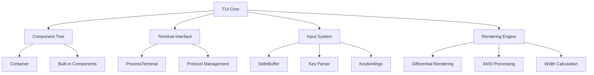
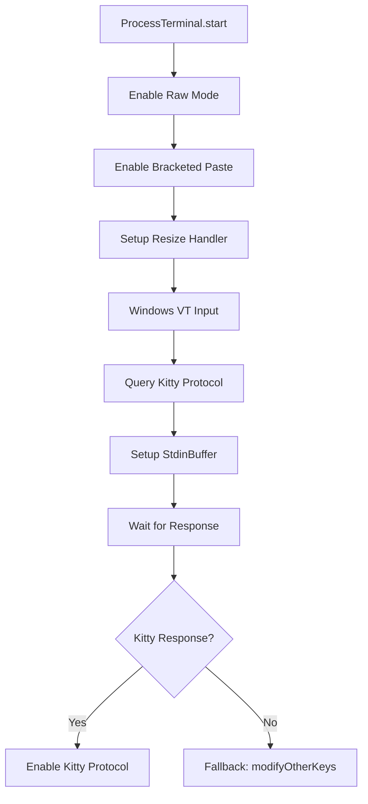
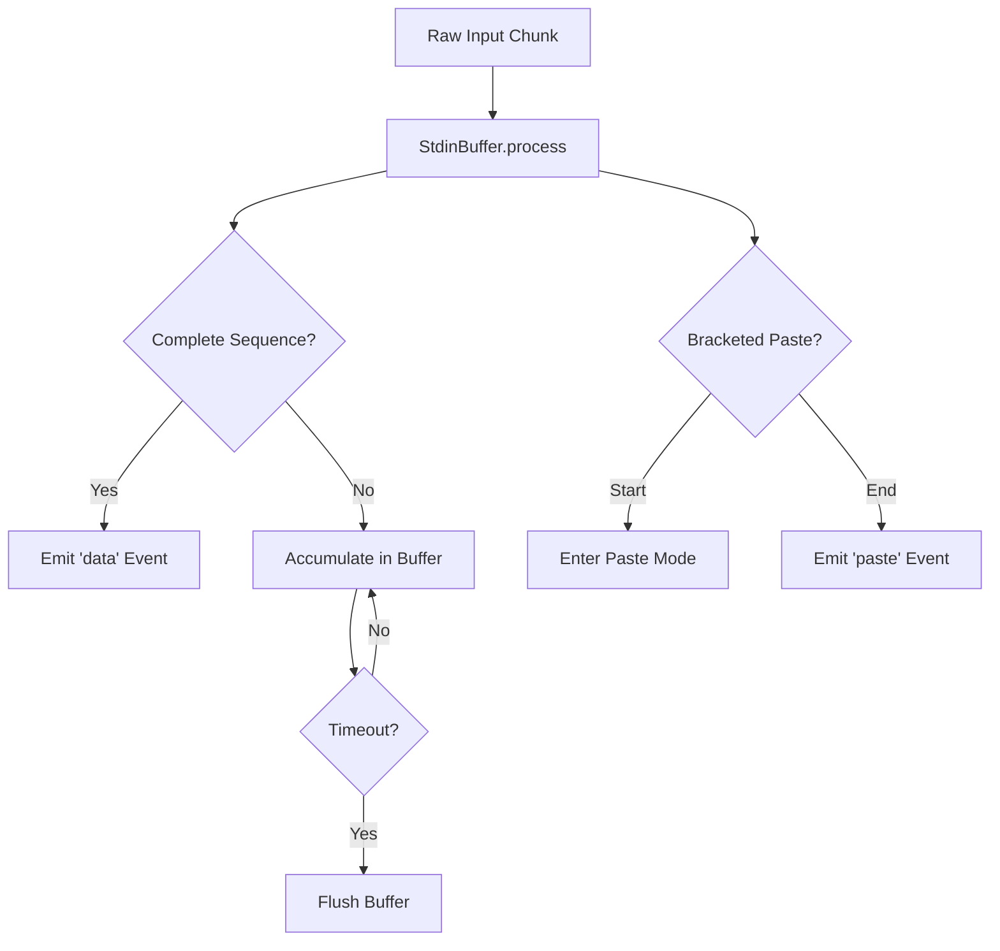
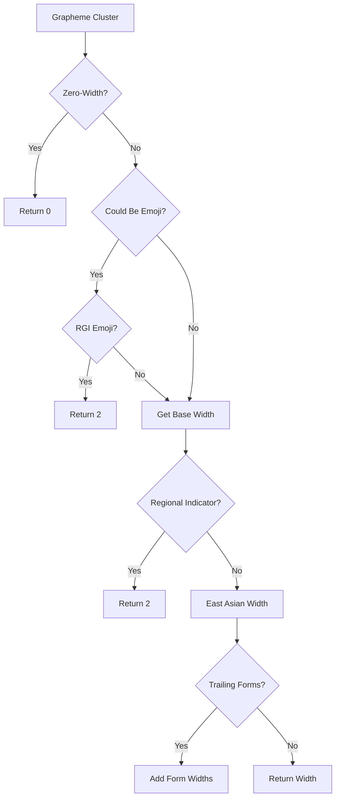
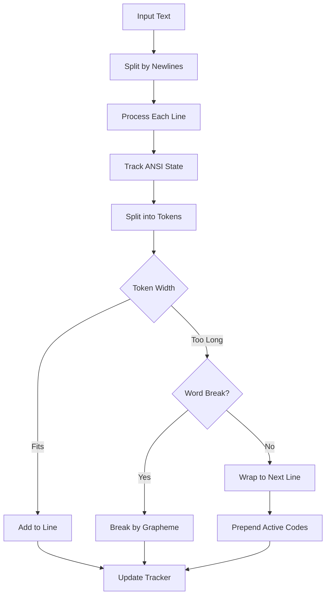
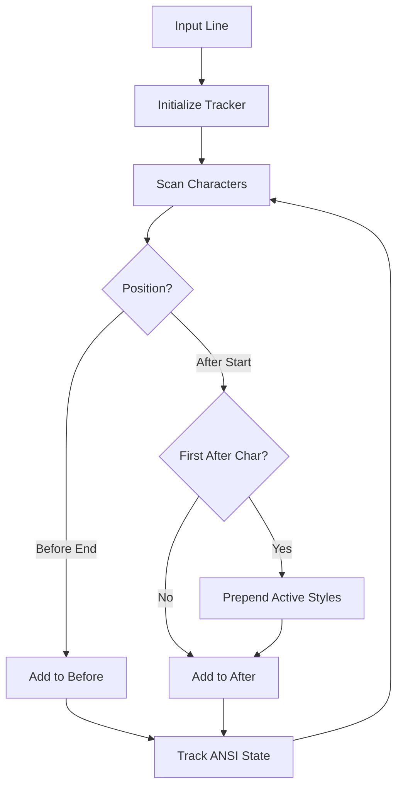
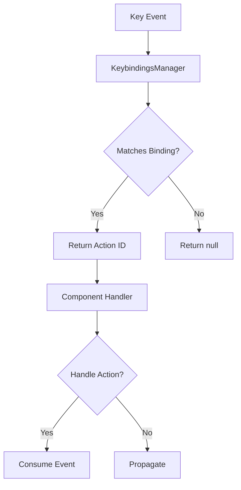
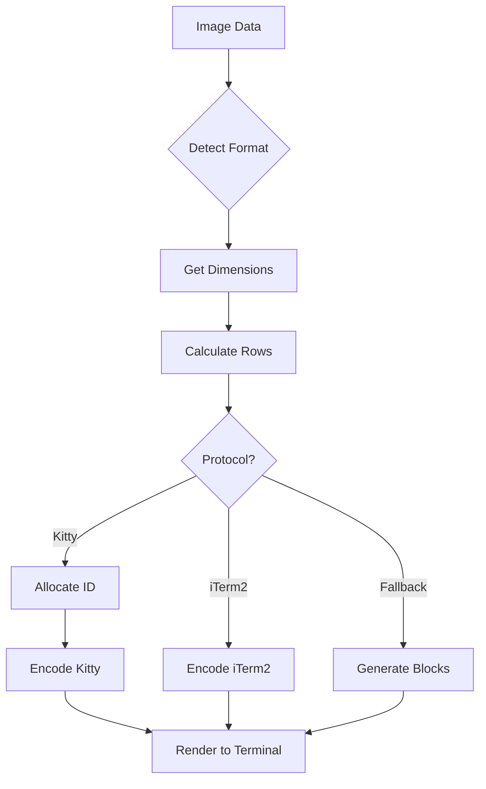

# TUI Package: Rendering Engine & Component Model

## Introduction

The `@mariozechner/pi-tui` package provides a comprehensive Terminal User Interface (TUI) library with differential rendering capabilities for building efficient text-based applications. The package implements a component-based architecture with a sophisticated rendering engine that handles ANSI escape sequences, wide character support, and terminal protocol management. At its core, the TUI system manages a component tree, performs differential rendering to minimize terminal updates, and provides an extensible framework for building interactive terminal applications with support for overlays, focus management, and keyboard input handling.

Sources: [packages/tui/package.json:1-42](../../../packages/tui/package.json#L1-L42), [packages/tui/src/index.ts:1-102](../../../packages/tui/src/index.ts#L1-L102)

## Architecture Overview

The TUI framework is built around several key subsystems that work together to provide a complete terminal UI solution:



The architecture separates concerns into distinct layers: the Terminal interface abstracts platform-specific I/O, the Input System handles buffering and parsing of keyboard events, the Component Tree manages UI structure, and the Rendering Engine efficiently updates the terminal display.

Sources: [packages/tui/src/index.ts:55-102](../../../packages/tui/src/index.ts#L55-L102)

## Terminal Interface Layer

### Terminal Abstraction

The `Terminal` interface provides a minimal abstraction over terminal I/O operations, enabling the TUI to work with different terminal implementations while maintaining a consistent API.

| Method | Purpose | Return Type |
|--------|---------|-------------|
| `start(onInput, onResize)` | Initialize terminal with input/resize handlers | `void` |
| `stop()` | Restore terminal state and cleanup | `void` |
| `drainInput(maxMs?, idleMs?)` | Drain buffered input before exit | `Promise<void>` |
| `write(data)` | Write output to terminal | `void` |
| `columns` / `rows` | Get terminal dimensions | `number` |
| `kittyProtocolActive` | Check keyboard protocol status | `boolean` |
| `moveBy(lines)` | Relative cursor movement | `void` |
| `hideCursor()` / `showCursor()` | Control cursor visibility | `void` |
| `clearLine()` / `clearFromCursor()` / `clearScreen()` | Clear operations | `void` |
| `setTitle(title)` | Set window title | `void` |
| `setProgress(active)` | Control progress indicator | `void` |

Sources: [packages/tui/src/terminal.ts:12-39](../../../packages/tui/src/terminal.ts#L12-L39)

### ProcessTerminal Implementation

The `ProcessTerminal` class implements the `Terminal` interface for Node.js process stdin/stdout, handling platform-specific terminal initialization and protocol negotiation:



The initialization sequence includes several critical steps to ensure proper terminal behavior across different platforms and terminal emulators. On Windows, the implementation uses the `koffi` library to enable `ENABLE_VIRTUAL_TERMINAL_INPUT` mode, which ensures that modified keys (like Shift+Tab) are sent as VT sequences rather than being lost by libuv's console input processing.

Sources: [packages/tui/src/terminal.ts:51-235](../../../packages/tui/src/terminal.ts#L51-L235)

### Keyboard Protocol Management

The terminal implementation supports advanced keyboard protocols for better key event handling:

1. **Kitty Keyboard Protocol**: Provides disambiguated escape codes, event types (press/repeat/release), and alternate keys for non-Latin layouts. The protocol is queried with `CSI ? u` and enabled with `CSI > 7 u` (flags 1+2+4).

2. **modifyOtherKeys Mode**: Fallback for terminals like tmux that may not respond to Kitty queries but support xterm's extended key reporting. Enabled with `CSI > 4 ; 2 m`.

3. **Bracketed Paste Mode**: Wraps pasted content in `\x1b[200~` and `\x1b[201~` markers to distinguish paste operations from typed input.

Sources: [packages/tui/src/terminal.ts:107-151](../../../packages/tui/src/terminal.ts#L107-L151)

## Input System

### StdinBuffer: Sequence Buffering

The `StdinBuffer` class solves a critical problem in terminal input handling: stdin data events can arrive in partial chunks, especially for complex escape sequences. Without buffering, partial sequences could be misinterpreted as regular keypresses.



The buffer uses a sophisticated sequence detection algorithm that handles multiple escape sequence types:

- **CSI sequences**: `ESC [ ... [final byte]` where final byte is in range 0x40-0x7E
- **OSC sequences**: `ESC ] ... ST` (ST = `ESC \` or BEL)
- **DCS sequences**: `ESC P ... ESC \` (used for XTVersion responses)
- **APC sequences**: `ESC _ ... ESC \` (used for Kitty graphics responses)
- **SS3 sequences**: `ESC O [char]`
- **Old-style mouse**: `ESC [ M` + 3 bytes
- **SGR mouse**: `ESC [ < digits ; digits ; digits [Mm]`

Sources: [packages/tui/src/stdin-buffer.ts:1-315](../../../packages/tui/src/stdin-buffer.ts#L1-L315)

### Sequence Detection Algorithm

The buffer implements a multi-phase detection process:

```typescript
function isCompleteSequence(data: string): "complete" | "incomplete" | "not-escape"
```

This function analyzes accumulated input to determine if more data is needed. For CSI sequences, it specifically handles SGR mouse events which require validation of the format pattern `<digits;digits;digits[Mm]` to avoid premature completion on intermediate characters.

Sources: [packages/tui/src/stdin-buffer.ts:19-104](../../../packages/tui/src/stdin-buffer.ts#L19-L104)

### Bracketed Paste Handling

When bracketed paste mode is active, the buffer switches to a special paste accumulation mode:

1. Detects `\x1b[200~` (paste start marker)
2. Buffers all input until `\x1b[201~` (paste end marker)
3. Emits complete paste content via 'paste' event
4. Resumes normal sequence processing for any remaining input

This prevents paste content from being processed as individual key events, which is critical for performance and correctness when pasting large amounts of text.

Sources: [packages/tui/src/stdin-buffer.ts:150-209](../../../packages/tui/src/stdin-buffer.ts#L150-L209)

## Text Rendering Engine

### Width Calculation

The rendering engine implements sophisticated text width calculation that handles multiple complexity layers:

| Feature | Implementation | Purpose |
|---------|---------------|---------|
| ASCII Fast Path | Direct character count | Performance optimization |
| Grapheme Segmentation | `Intl.Segmenter` | Handle multi-codepoint clusters |
| East Asian Width | `get-east-asian-width` library | Fullwidth/halfwidth characters |
| RGI Emoji Detection | Unicode property regex | 2-column emoji rendering |
| ANSI Code Stripping | Escape sequence parser | Exclude formatting from width |
| Tab Expansion | Replace with 3 spaces | Consistent tab rendering |

The `visibleWidth()` function implements a caching strategy for non-ASCII strings, maintaining a 512-entry LRU cache to avoid repeated expensive calculations.

Sources: [packages/tui/src/utils.ts:1-167](../../../packages/tui/src/utils.ts#L1-L167)

### Grapheme Width Calculation

The `graphemeWidth()` function determines the terminal column width of a single grapheme cluster:



The function includes a pre-filter check (`couldBeEmoji()`) to avoid the expensive RGI emoji regex test for characters that cannot possibly be emoji. Regional indicator symbols (U+1F1E6..U+1F1FF) are treated as width 2 to prevent terminal auto-wrap drift artifacts during streaming output.

Sources: [packages/tui/src/utils.ts:79-127](../../../packages/tui/src/utils.ts#L79-L127)

### ANSI Code Processing

The rendering engine must handle ANSI escape sequences throughout the text processing pipeline. The `extractAnsiCode()` function recognizes three types of sequences:

1. **CSI sequences**: `ESC [ ... [mGKHJ]` for styling and cursor control
2. **OSC sequences**: `ESC ] ... (BEL | ESC \)` for hyperlinks and titles
3. **APC sequences**: `ESC _ ... (BEL | ESC \)` for cursor markers and application commands

These sequences are preserved during text operations but excluded from width calculations, ensuring that styled text renders correctly without affecting layout calculations.

Sources: [packages/tui/src/utils.ts:168-208](../../../packages/tui/src/utils.ts#L168-L208)

### Text Wrapping with Style Preservation

The `wrapTextWithAnsi()` function implements word wrapping while preserving ANSI styling across line breaks:



The wrapping algorithm uses an `AnsiCodeTracker` class to maintain the current styling state (bold, colors, underline, etc.) and automatically prepends active codes to new lines. Critically, it handles underline specially at line boundaries to prevent bleeding into padding, using `getLineEndReset()` to close underlines before padding and re-opening them on the next line.

Sources: [packages/tui/src/utils.ts:323-381](../../../packages/tui/src/utils.ts#L323-L381)

### AnsiCodeTracker State Management

The `AnsiCodeTracker` class maintains granular state for SGR attributes:

```typescript
private bold = false;
private dim = false;
private italic = false;
private underline = false;
private blink = false;
private inverse = false;
private hidden = false;
private strikethrough = false;
private fgColor: string | null = null;
private bgColor: string | null = null;
private activeHyperlink: string | null = null;
```

This granular tracking enables precise style preservation across line breaks and allows for selective resets (e.g., closing only underline at line end while preserving background color). The tracker handles complex SGR codes including 256-color (`38;5;N`) and RGB (`38;2;R;G;B`) sequences.

Sources: [packages/tui/src/utils.ts:210-321](../../../packages/tui/src/utils.ts#L210-L321)

## Text Operations

### Truncation with Ellipsis

The `truncateToWidth()` function provides intelligent text truncation with several advanced features:

- **Ellipsis placement**: Reserves space for ellipsis (default "...") and truncates content to fit
- **Optional padding**: Can pad result to exact width with spaces
- **ANSI preservation**: Maintains styling codes while calculating visible width
- **Wide character handling**: Properly handles grapheme clusters that span multiple columns
- **Performance optimization**: Fast path for pure ASCII text

The function implements a two-phase algorithm: first, it accumulates a contiguous prefix of content that fits within `targetWidth = maxWidth - ellipsisWidth`, then it continues scanning to detect overflow. If the entire text fits, no ellipsis is added.

Sources: [packages/tui/src/utils.ts:527-663](../../../packages/tui/src/utils.ts#L527-L663)

### Column-Based Slicing

The `sliceByColumn()` and `sliceWithWidth()` functions extract a specific column range from a line, handling ANSI codes and wide characters:

```typescript
sliceWithWidth(line: string, startCol: number, length: number, strict = false): 
  { text: string; width: number }
```

The `strict` parameter controls handling of wide characters at boundaries: when true, wide characters that would extend past the end column are excluded. This is critical for overlay compositing where content must not overflow the designated region.

Sources: [packages/tui/src/utils.ts:665-705](../../../packages/tui/src/utils.ts#L665-L705)

### Dual-Segment Extraction

The `extractSegments()` function is a specialized operation for overlay rendering that extracts "before" and "after" segments in a single pass:



This function uses a pooled `AnsiCodeTracker` instance to avoid allocation overhead. The tracker accumulates styling state from the beginning of the line, and when the "after" segment begins, it prepends all active styling codes to ensure the after segment inherits the correct styling context from before the overlay region.

Sources: [packages/tui/src/utils.ts:707-771](../../../packages/tui/src/utils.ts#L707-L771)

## Component Model

### Component Interface

The TUI framework defines a minimal `Component` interface that all UI elements must implement:

```typescript
interface Component {
  render(width: number, height: number): string[];
}
```

Components receive available dimensions and return an array of strings representing each line of rendered output. The framework handles layout, focus management, and event routing, while components focus solely on rendering their content.

Sources: [packages/tui/src/index.ts:55-102](../../../packages/tui/src/index.ts#L55-L102)

### Built-in Components

The package provides a comprehensive set of built-in components:

| Component | Purpose | Key Features |
|-----------|---------|--------------|
| `Box` | Container with borders | Border styles, padding, title |
| `Text` | Static text display | ANSI support, wrapping |
| `TruncatedText` | Single-line text | Ellipsis, padding |
| `Spacer` | Layout spacing | Flexible/fixed sizing |
| `Input` | Text input field | Cursor, selection, history |
| `Editor` | Multi-line editor | Syntax highlighting, autocomplete |
| `Markdown` | Markdown rendering | Themes, code blocks, lists |
| `Image` | Terminal images | Kitty/iTerm2 protocols |
| `SelectList` | Filterable list | Fuzzy search, icons, badges |
| `SettingsList` | Settings UI | Key-value pairs, validation |
| `Loader` | Progress indicator | Spinning animation |
| `CancellableLoader` | Cancellable progress | User cancellation support |

Sources: [packages/tui/src/index.ts:14-31](../../../packages/tui/src/index.ts#L14-L31)

### Container and Layout

The `Container` class manages child components and provides layout capabilities. Containers support both vertical and horizontal stacking of components, with flexible sizing through the `SizeValue` type:

- **Fixed size**: Numeric value (e.g., `10` = 10 rows/columns)
- **Percentage**: String with % (e.g., `"50%"` = half of available space)
- **Flexible**: `"*"` = consume remaining space proportionally

Sources: [packages/tui/src/index.ts:55-102](../../../packages/tui/src/index.ts#L55-L102)

### Focus Management

The framework implements a `Focusable` interface for components that can receive keyboard focus:

```typescript
interface Focusable {
  handleInput(key: string): boolean;
  isFocused(): boolean;
  setFocused(focused: boolean): void;
}
```

The `isFocusable()` type guard function checks if a component implements the `Focusable` interface, enabling the TUI to route keyboard events to the currently focused component. Components return `true` from `handleInput()` to indicate they consumed the event, or `false` to allow event propagation.

Sources: [packages/tui/src/index.ts:55-102](../../../packages/tui/src/index.ts#L55-L102)

## Overlay System

### Overlay Architecture

The TUI framework supports overlays (modal dialogs, popups, tooltips) through an overlay system that composites overlay content on top of the base component tree without disrupting the underlying layout:

```typescript
interface OverlayOptions {
  anchor: OverlayAnchor;
  margin?: OverlayMargin;
  width?: number;
  height?: number;
  focusOnShow?: boolean;
}
```

Overlays can be anchored to various positions (top-left, center, bottom-right, etc.) with optional margins. The framework handles focus management automatically, allowing overlays to capture input while preserving the focus state of the underlying UI.

Sources: [packages/tui/src/index.ts:55-102](../../../packages/tui/src/index.ts#L55-L102)

### Overlay Rendering

Overlay rendering uses the dual-segment extraction algorithm to composite overlay content with the base layer:

1. Extract "before" segment (content before overlay region)
2. Render overlay content for the current line
3. Extract "after" segment (content after overlay region)
4. Concatenate: `before + overlay + after`

This approach preserves ANSI styling from the base layer that should affect content after the overlay, while allowing the overlay to have independent styling.

Sources: [packages/tui/src/utils.ts:707-771](../../../packages/tui/src/utils.ts#L707-L771)

## Keybindings System

### Keybinding Architecture

The framework provides a flexible keybindings system that maps key sequences to action identifiers:



The `KeybindingsManager` class supports:

- **Multiple keys per action**: One action can have multiple key bindings
- **Conflict detection**: Validates that bindings don't conflict
- **Custom keybindings**: Applications can override default bindings
- **Platform-specific defaults**: Different defaults for macOS vs other platforms

Sources: [packages/tui/src/index.ts:40-50](../../../packages/tui/src/index.ts#L40-L50)

### Key Parsing

The `parseKey()` function converts raw input strings into structured `Key` objects:

```typescript
interface Key {
  id: KeyId;
  char?: string;
  shift?: boolean;
  alt?: boolean;
  ctrl?: boolean;
  meta?: boolean;
  type?: KeyEventType; // 'press' | 'repeat' | 'release'
}
```

The parser handles multiple input formats:

- **Kitty protocol**: Full event information including release events
- **xterm modifyOtherKeys**: Modified keys with CSI-u encoding
- **Legacy escape sequences**: Traditional terminal key codes
- **Printable characters**: Direct character input

Sources: [packages/tui/src/index.ts:52-62](../../../packages/tui/src/index.ts#L52-L62)

## Image Support

### Terminal Image Protocols

The TUI framework supports rendering images in terminals through multiple protocols:

| Protocol | Terminals | Features |
|----------|-----------|----------|
| Kitty | Kitty, WezTerm | Efficient, supports transparency, animations |
| iTerm2 | iTerm2, WezTerm, Konsole | Base64 inline images |
| Fallback | All | ASCII/Unicode block characters |

The `detectCapabilities()` function queries terminal capabilities and selects the best available protocol. The framework maintains a capability cache to avoid repeated detection.

Sources: [packages/tui/src/index.ts:64-94](../../../packages/tui/src/index.ts#L64-L94)

### Image Rendering Pipeline



The rendering pipeline handles multiple image formats (PNG, JPEG, GIF, WebP) and calculates the appropriate number of terminal rows based on cell dimensions and image aspect ratio. The Kitty protocol uses image IDs for efficient management and cleanup.

Sources: [packages/tui/src/index.ts:64-94](../../../packages/tui/src/index.ts#L64-L94)

## Autocomplete System

### Autocomplete Architecture

The framework provides an extensible autocomplete system for editor components:

```typescript
interface AutocompleteProvider {
  getSuggestions(
    query: string,
    cursorPosition: number,
    context: any
  ): AutocompleteSuggestions | Promise<AutocompleteSuggestions>;
}
```

The `CombinedAutocompleteProvider` class allows composition of multiple providers, with special support for slash commands that can override the default provider when triggered.

Sources: [packages/tui/src/index.ts:7-12](../../../packages/tui/src/index.ts#L7-L12)

### Slash Commands

Slash commands provide a special autocomplete mode triggered by "/" at the start of input:

```typescript
interface SlashCommand {
  command: string;
  description: string;
  icon?: string;
  provider?: AutocompleteProvider;
}
```

When a slash command is active, its dedicated provider takes over autocomplete suggestions, enabling command-specific completion behavior (e.g., file paths for a `/file` command).

Sources: [packages/tui/src/index.ts:7-12](../../../packages/tui/src/index.ts#L7-L12)

## Fuzzy Matching

### Fuzzy Search Algorithm

The framework includes a fuzzy matching implementation for filtering lists:

```typescript
interface FuzzyMatch {
  item: any;
  score: number;
  matches: number[];
}
```

The `fuzzyMatch()` function implements a scoring algorithm that:

- Awards points for consecutive character matches
- Penalizes gaps between matches
- Considers match position (earlier matches score higher)
- Returns match indices for highlighting

The `fuzzyFilter()` function applies fuzzy matching to an array and returns sorted results with the best matches first.

Sources: [packages/tui/src/index.ts:34-35](../../../packages/tui/src/index.ts#L34-L35)

## Summary

The `@mariozechner/pi-tui` package provides a sophisticated terminal UI framework built around a component-based architecture with differential rendering. The rendering engine handles complex text operations including ANSI escape sequence processing, wide character support, and grapheme cluster segmentation. The input system buffers and parses terminal escape sequences, supporting advanced keyboard protocols like Kitty and modifyOtherKeys. The framework's overlay system, focus management, keybindings, and extensible component model enable building rich interactive terminal applications with features comparable to graphical UI frameworks, while maintaining the efficiency and portability of text-based interfaces.

Sources: [packages/tui/package.json:1-42](../../../packages/tui/package.json#L1-L42), [packages/tui/src/index.ts:1-102](../../../packages/tui/src/index.ts#L1-L102), [packages/tui/src/terminal.ts:1-235](../../../packages/tui/src/terminal.ts#L1-L235), [packages/tui/src/stdin-buffer.ts:1-315](../../../packages/tui/src/stdin-buffer.ts#L1-L315), [packages/tui/src/utils.ts:1-771](../../../packages/tui/src/utils.ts#L1-L771)