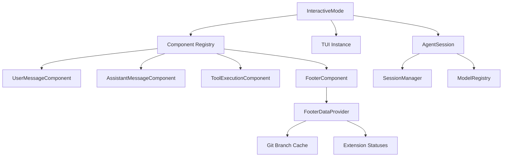
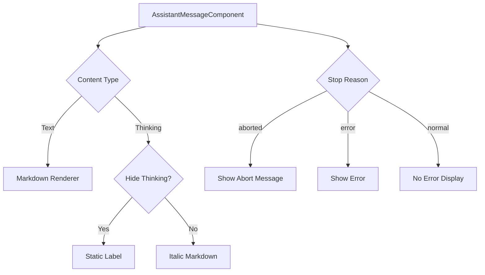
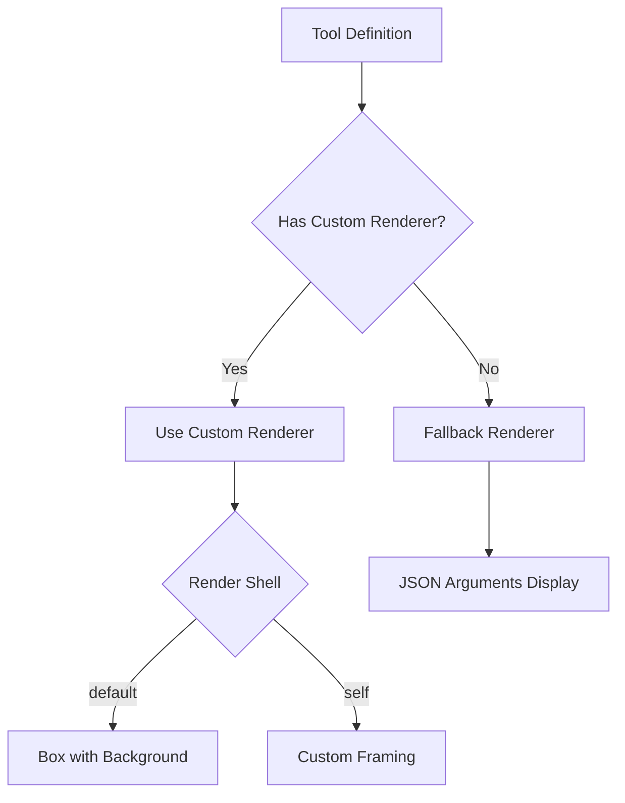
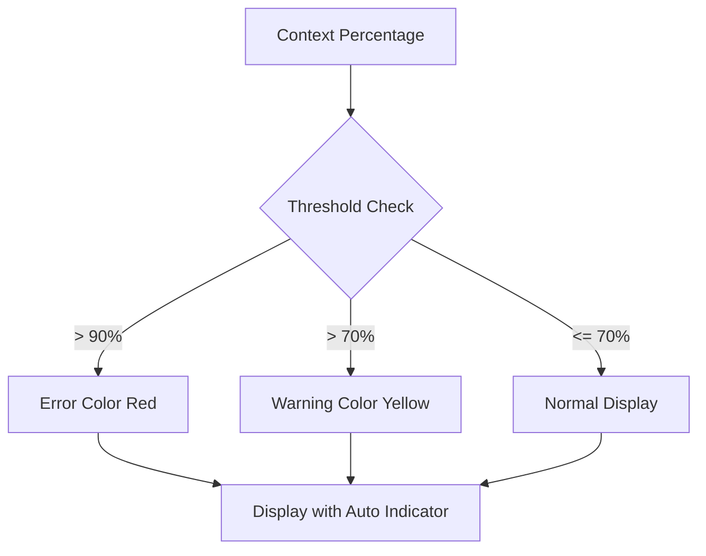
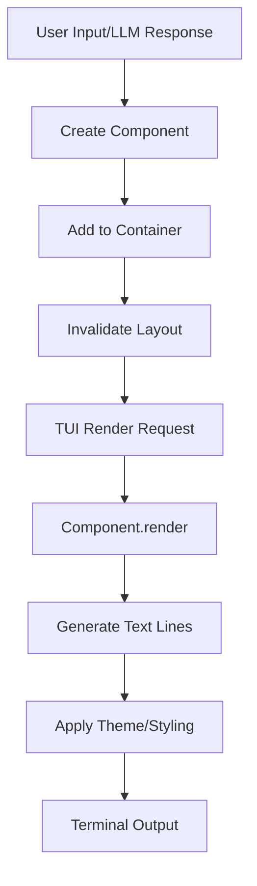
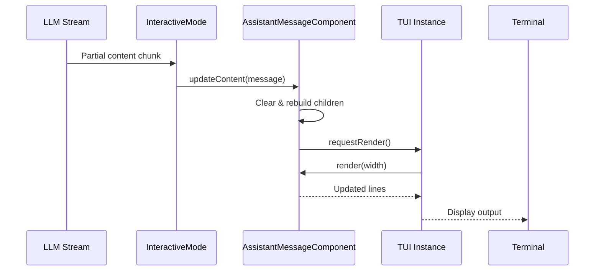

# Interactive TUI Mode

The Interactive TUI (Text User Interface) Mode provides a terminal-based interface for the pi-mono coding agent, offering real-time interaction with AI models through a rich, component-based UI. This mode enables users to engage in conversational coding sessions with visual feedback for messages, tool executions, context usage, and system status. The TUI is built on the `@mariozechner/pi-tui` package and supports advanced terminal features including image rendering, markdown display, and customizable theming.

Interactive Mode serves as one of three primary run modes for the coding agent (alongside Print Mode and RPC Mode), providing the most feature-rich interface for direct user interaction. It manages the complete lifecycle of agent sessions, handles user input, renders streaming responses, and provides visual feedback for tool executions and system state.

Sources: [packages/coding-agent/src/modes/index.ts:1-10](../../../packages/coding-agent/src/modes/index.ts#L1-L10)

## Architecture Overview

The Interactive Mode architecture is organized around a component-based rendering system where specialized UI components handle different aspects of the agent's output and interaction model.



The mode coordinates between the agent session (which manages conversation state and LLM interactions), the TUI rendering system (which handles terminal output), and various specialized components that render different message types and system information.

Sources: [packages/coding-agent/src/modes/interactive/interactive-mode.ts](../../../packages/coding-agent/src/modes/interactive/interactive-mode.ts), [packages/coding-agent/src/modes/interactive/components/index.ts:1-30](../../../packages/coding-agent/src/modes/interactive/components/index.ts#L1-L30)

## Core Components

### Message Components

The Interactive Mode provides specialized components for rendering different message types in the conversation flow.

| Component | Purpose | Key Features |
|-----------|---------|--------------|
| `UserMessageComponent` | Renders user input messages | Markdown support, custom background, OSC 133 shell integration |
| `AssistantMessageComponent` | Renders AI model responses | Thinking blocks, markdown content, error handling, streaming updates |
| `ToolExecutionComponent` | Displays tool call execution | Custom renderers, image support, expandable output, status indicators |
| `CustomMessageComponent` | Extension-provided messages | Flexible rendering for custom content types |

Sources: [packages/coding-agent/src/modes/interactive/components/index.ts:1-30](../../../packages/coding-agent/src/modes/interactive/components/index.ts#L1-L30)

#### User Message Rendering

User messages are rendered with markdown formatting and shell integration markers. The component wraps content in OSC 133 escape sequences to enable terminal features like command navigation.

```typescript
const OSC133_ZONE_START = "\x1b]133;A\x07";
const OSC133_ZONE_END = "\x1b]133;B\x07";
const OSC133_ZONE_FINAL = "\x1b]133;C\x07";
```

The render method wraps the first line with `OSC133_ZONE_START` and the last line with both `OSC133_ZONE_END` and `OSC133_ZONE_FINAL`, enabling shell integration features in compatible terminals.

Sources: [packages/coding-agent/src/modes/interactive/components/user-message.ts:5-7](../../../packages/coding-agent/src/modes/interactive/components/user-message.ts#L5-L7), [packages/coding-agent/src/modes/interactive/components/user-message.ts:23-29](../../../packages/coding-agent/src/modes/interactive/components/user-message.ts#L23-L29)

#### Assistant Message Rendering

Assistant messages handle multiple content types including text and thinking blocks. The component supports dynamic visibility of thinking content and properly handles partial streaming updates.



The component tracks whether tool calls are present to avoid duplicate error rendering, as tool execution components handle their own error display.

Sources: [packages/coding-agent/src/modes/interactive/components/assistant-message.ts:8-12](../../../packages/coding-agent/src/modes/interactive/components/assistant-message.ts#L8-L12), [packages/coding-agent/src/modes/interactive/components/assistant-message.ts:51-95](../../../packages/coding-agent/src/modes/interactive/components/assistant-message.ts#L51-L95)

### Tool Execution Component

The `ToolExecutionComponent` provides sophisticated rendering for tool invocations, supporting both built-in and extension-defined tools with custom rendering logic.

#### Renderer System

Tools can define custom renderers for both the call (arguments) and result phases:



The component supports two render contexts through the `ToolRenderContext` interface, providing tools with access to execution state, invalidation callbacks, and display preferences.

Sources: [packages/coding-agent/src/modes/interactive/components/tool-execution.ts:14-24](../../../packages/coding-agent/src/modes/interactive/components/tool-execution.ts#L14-L24), [packages/coding-agent/src/modes/interactive/components/tool-execution.ts:76-92](../../../packages/coding-agent/src/modes/interactive/components/tool-execution.ts#L76-L92)

#### Image Rendering

Tool results can include images, which are automatically converted and displayed based on terminal capabilities:

```typescript
private maybeConvertImagesForKitty(): void {
    const caps = getCapabilities();
    if (caps.images !== "kitty") return;
    if (!this.result) return;

    const imageBlocks = this.result.content.filter((c) => c.type === "image");
    for (let i = 0; i < imageBlocks.length; i++) {
        const img = imageBlocks[i];
        if (!img.data || !img.mimeType) continue;
        if (img.mimeType === "image/png") continue;
        if (this.convertedImages.has(i)) continue;

        const index = i;
        convertToPng(img.data, img.mimeType).then((converted) => {
            if (converted) {
                this.convertedImages.set(index, converted);
                this.updateDisplay();
                this.ui.requestRender();
            }
        });
    }
}
```

Images are asynchronously converted to PNG format for Kitty protocol terminals, with the component caching conversions to avoid redundant processing.

Sources: [packages/coding-agent/src/modes/interactive/components/tool-execution.ts:136-157](../../../packages/coding-agent/src/modes/interactive/components/tool-execution.ts#L136-L157)

### Footer Component

The footer provides comprehensive session status information including working directory, git branch, token usage statistics, and context window utilization.

#### Status Information Display

The footer aggregates multiple data sources to present a complete status view:

| Information Type | Source | Format |
|-----------------|--------|--------|
| Working Directory | SessionManager | Path with `~` substitution |
| Git Branch | FooterDataProvider | Appended in parentheses |
| Session Name | SessionManager | Appended after bullet separator |
| Token Statistics | Session entries | Formatted with K/M suffixes |
| Context Usage | Session calculation | Percentage with color coding |
| Model Name | Session state | Right-aligned with provider |

Sources: [packages/coding-agent/src/modes/interactive/components/footer.ts:47-73](../../../packages/coding-agent/src/modes/interactive/components/footer.ts#L47-L73)

#### Token Formatting

Token counts are formatted for readability using a hierarchical approach:

```typescript
function formatTokens(count: number): string {
    if (count < 1000) return count.toString();
    if (count < 10000) return `${(count / 1000).toFixed(1)}k`;
    if (count < 1000000) return `${Math.round(count / 1000)}k`;
    if (count < 10000000) return `${(count / 1000000).toFixed(1)}M`;
    return `${Math.round(count / 1000000)}M`;
}
```

This provides progressively coarser granularity as counts increase, keeping the display compact while maintaining useful precision.

Sources: [packages/coding-agent/src/modes/interactive/components/footer.ts:21-27](../../../packages/coding-agent/src/modes/interactive/components/footer.ts#L21-L27)

#### Context Usage Visualization

Context usage is color-coded to provide visual warnings as the context window fills:



The footer also indicates whether auto-compaction is enabled, helping users understand context management behavior.

Sources: [packages/coding-agent/src/modes/interactive/components/footer.ts:94-106](../../../packages/coding-agent/src/modes/interactive/components/footer.ts#L94-L106)

#### Extension Status Integration

Extension-provided status messages are displayed on a separate line, sorted alphabetically and sanitized for single-line display:

```typescript
function sanitizeStatusText(text: string): string {
    return text
        .replace(/[\r\n\t]/g, " ")
        .replace(/ +/g, " ")
        .trim();
}
```

This ensures extension statuses integrate cleanly with the footer's compact layout while preventing formatting issues from multi-line or control-character content.

Sources: [packages/coding-agent/src/modes/interactive/components/footer.ts:10-17](../../../packages/coding-agent/src/modes/interactive/components/footer.ts#L10-L17), [packages/coding-agent/src/modes/interactive/components/footer.ts:136-145](../../../packages/coding-agent/src/modes/interactive/components/footer.ts#L136-L145)

## Rendering Flow

### Component Lifecycle

The Interactive Mode manages component lifecycles through a structured rendering pipeline:



Components implement the `Component` interface from `@mariozechner/pi-tui`, providing a `render(width: number): string[]` method that generates terminal output lines.

Sources: [packages/coding-agent/src/modes/interactive/components/user-message.ts:11-30](../../../packages/coding-agent/src/modes/interactive/components/user-message.ts#L11-L30)

### Streaming Updates

Assistant messages and tool executions support streaming updates, with components updating their display as partial data arrives:



The component invalidation system ensures efficient re-rendering, with only affected components rebuilding their display when data changes.

Sources: [packages/coding-agent/src/modes/interactive/components/assistant-message.ts:36-49](../../../packages/coding-agent/src/modes/interactive/components/assistant-message.ts#L36-L49), [packages/coding-agent/src/modes/interactive/components/tool-execution.ts:124-135](../../../packages/coding-agent/src/modes/interactive/components/tool-execution.ts#L124-L135)

## Theme System

The Interactive Mode uses a centralized theme system that provides consistent styling across all components. The theme supports customization and provides semantic color names for different UI elements.

### Theme Application

Components apply theme colors through wrapper functions that handle both foreground and background styling:

```typescript
this.contentBox = new Box(1, 1, (content: string) => theme.bg("userMessageBg", content));
this.contentBox.addChild(
    new Markdown(text, 0, 0, markdownTheme, {
        color: (content: string) => theme.fg("userMessageText", content),
    }),
);
```

The theme system separates concerns between structural styling (backgrounds, borders) and content styling (text colors, emphasis), enabling consistent visual hierarchy.

Sources: [packages/coding-agent/src/modes/interactive/components/user-message.ts:15-21](../../../packages/coding-agent/src/modes/interactive/components/user-message.ts#L15-L21)

### Semantic Color Names

The theme provides semantic names for different UI contexts:

| Semantic Name | Usage Context |
|---------------|---------------|
| `userMessageBg` | User message background |
| `userMessageText` | User message text color |
| `thinkingText` | AI thinking/reasoning content |
| `toolPendingBg` | Tool execution in progress |
| `toolSuccessBg` | Completed tool execution |
| `toolErrorBg` | Failed tool execution |
| `toolTitle` | Tool name display |
| `toolOutput` | Tool result text |
| `error` | Error messages |
| `warning` | Warning messages |
| `dim` | Secondary/status information |

Sources: [packages/coding-agent/src/modes/interactive/components/assistant-message.ts:27-31](../../../packages/coding-agent/src/modes/interactive/components/assistant-message.ts#L27-L31), [packages/coding-agent/src/modes/interactive/components/tool-execution.ts:159-167](../../../packages/coding-agent/src/modes/interactive/components/tool-execution.ts#L159-L167)

## Shell Integration

The Interactive Mode implements OSC 133 escape sequences to enable advanced shell integration features in compatible terminals (such as iTerm2, WezTerm, and modern versions of GNOME Terminal).

### Zone Markers

Messages are wrapped with zone markers that define semantic regions:

- **Zone A** (`\x1b]133;A\x07`): Marks the start of a command/prompt zone
- **Zone B** (`\x1b]133;B\x07`): Marks the end of input
- **Zone C** (`\x1b]133;C\x07`): Marks the finalization of the zone

These markers enable terminals to provide features like:
- Navigation between commands/responses
- Selective copying of input or output
- Visual indicators for command boundaries
- Scroll-to-command functionality

Sources: [packages/coding-agent/src/modes/interactive/components/user-message.ts:5-7](../../../packages/coding-agent/src/modes/interactive/components/user-message.ts#L5-L7), [packages/coding-agent/src/modes/interactive/components/assistant-message.ts:8-10](../../../packages/coding-agent/src/modes/interactive/components/assistant-message.ts#L8-L10)

## Summary

The Interactive TUI Mode provides a sophisticated terminal-based interface for the pi-mono coding agent, leveraging a component-based architecture to render conversational AI interactions with rich visual feedback. Through specialized components for messages, tool executions, and status information, combined with streaming updates, custom rendering support, and terminal capability detection, the mode delivers a responsive and feature-rich user experience. The system's modular design enables extensions to integrate custom UI components while maintaining consistent theming and layout behavior across the entire interface.