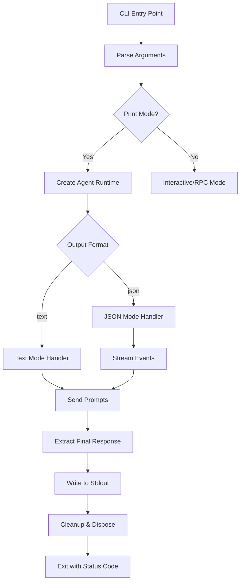
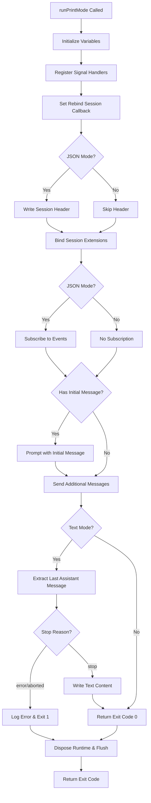
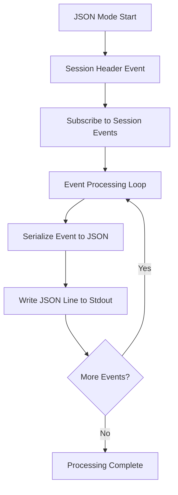
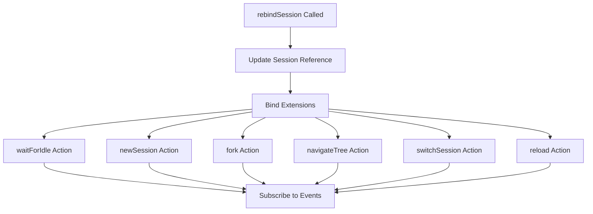
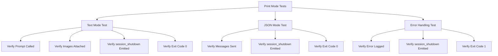

# Print Mode & JSON Output

Print mode is a non-interactive, single-shot execution mode for the pi coding agent that processes prompts and immediately exits after outputting results. It supports two output formats: plain text mode (default) for human-readable responses, and JSON mode for structured event streaming suitable for programmatic consumption. This mode is designed for scripting, CI/CD pipelines, and integration with other tools that need deterministic, non-interactive AI agent execution.

Print mode is activated via the `--print` or `-p` CLI flag, or by setting `--mode json` for structured output. Unlike interactive mode, print mode does not present a TUI, instead writing directly to stdout and exiting with an appropriate status code upon completion.

Sources: [packages/coding-agent/src/modes/print-mode.ts:1-8](../../../packages/coding-agent/src/modes/print-mode.ts#L1-L8), [packages/coding-agent/src/cli/args.ts:129-130](../../../packages/coding-agent/src/cli/args.ts#L129-L130)

## Architecture Overview

Print mode is implemented as one of three primary run modes in the coding agent (alongside interactive and RPC modes). It operates through the `runPrintMode` function which orchestrates the agent session runtime, handles signal management, and controls output formatting based on the selected mode.



The print mode function accepts a runtime host and configuration options, then coordinates the full lifecycle from session initialization through prompt processing to graceful shutdown and exit.

Sources: [packages/coding-agent/src/modes/print-mode.ts:26-45](../../../packages/coding-agent/src/modes/print-mode.ts#L26-L45), [packages/coding-agent/src/modes/index.ts:1-11](../../../packages/coding-agent/src/modes/index.ts#L1-L11)

## Configuration Options

The `PrintModeOptions` interface defines the configuration surface for print mode execution:

| Option | Type | Description |
|--------|------|-------------|
| `mode` | `"text" \| "json"` | Output format: "text" for final response only, "json" for all events |
| `messages` | `string[]` | Array of additional prompts to send after initialMessage (optional) |
| `initialMessage` | `string` | First message to send, may contain @file content references (optional) |
| `initialImages` | `ImageContent[]` | Images to attach to the initial message (optional) |

Sources: [packages/coding-agent/src/modes/print-mode.ts:13-24](../../../packages/coding-agent/src/modes/print-mode.ts#L13-L24)

## CLI Argument Parsing

Print mode can be activated through multiple CLI argument patterns:

```typescript
// Text mode (default output)
pi -p "prompt"
pi --print "prompt"

// JSON event stream mode
pi --mode json "prompt"

// With file attachments
pi -p @file1.txt @image.png "Analyze these files"
```

The argument parser handles the `--print`/`-p` flag and `--mode` option to determine print mode activation. When `--print` is specified without an explicit `--mode`, text mode is used by default.

Sources: [packages/coding-agent/src/cli/args.ts:129-130](../../../packages/coding-agent/src/cli/args.ts#L129-L130), [packages/coding-agent/src/cli/args.ts:254-262](../../../packages/coding-agent/src/cli/args.ts#L254-L262)

## Execution Flow

The print mode execution follows a structured lifecycle with proper resource management and signal handling:



Sources: [packages/coding-agent/src/modes/print-mode.ts:47-161](../../../packages/coding-agent/src/modes/print-mode.ts#L47-L161)

## Text Mode Output

In text mode (`mode: "text"`), print mode extracts only the final assistant response and writes it to stdout. The implementation inspects the last message in the session state and handles different completion scenarios:

### Success Path
When the assistant completes successfully (stopReason: "stop"), all text content blocks from the assistant message are written to stdout:

```typescript
for (const content of assistantMsg.content) {
    if (content.type === "text") {
        writeRawStdout(`${content.text}\n`);
    }
}
```

### Error Handling
If the assistant message indicates an error or abortion (stopReason: "error" or "aborted"), the error message is logged to stderr and the function returns exit code 1:

```typescript
if (assistantMsg.stopReason === "error" || assistantMsg.stopReason === "aborted") {
    console.error(assistantMsg.errorMessage || `Request ${assistantMsg.stopReason}`);
    exitCode = 1;
}
```

Sources: [packages/coding-agent/src/modes/print-mode.ts:127-148](../../../packages/coding-agent/src/modes/print-mode.ts#L127-L148)

## JSON Mode Output

JSON mode (`mode: "json"`) provides a complete event stream of all session activity, enabling programmatic consumption of agent behavior. Each event is serialized as a single-line JSON object followed by a newline character.

### Event Stream Structure



The session header is emitted first (if available), followed by all session events as they occur:

```typescript
if (mode === "json") {
    const header = session.sessionManager.getHeader();
    if (header) {
        writeRawStdout(`${JSON.stringify(header)}\n`);
    }
}

// ...

unsubscribe = session.subscribe((event) => {
    if (mode === "json") {
        writeRawStdout(`${JSON.stringify(event)}\n`);
    }
});
```

Sources: [packages/coding-agent/src/modes/print-mode.ts:107-113](../../../packages/coding-agent/src/modes/print-mode.ts#L107-L113), [packages/coding-agent/src/modes/print-mode.ts:115-119](../../../packages/coding-agent/src/modes/print-mode.ts#L115-L119)

## Output Guard System

Print mode uses a specialized output guard mechanism to prevent interference between agent output and stdout. The `output-guard.ts` module provides stdout takeover functionality that redirects normal console output to stderr while preserving a raw stdout channel for clean output.

### Stdout Takeover Mechanism

| Function | Purpose |
|----------|---------|
| `takeOverStdout()` | Redirects process.stdout.write to stderr, preserves raw stdout handle |
| `restoreStdout()` | Restores original stdout behavior |
| `writeRawStdout(text)` | Writes directly to raw stdout, bypassing takeover |
| `flushRawStdout()` | Ensures all raw stdout data is flushed before exit |
| `isStdoutTakenOver()` | Checks if stdout is currently taken over |

This design ensures that debug logs, console.log statements, and other incidental output don't corrupt the structured output in print mode, while still allowing the mode to write clean results to stdout.

Sources: [packages/coding-agent/src/core/output-guard.ts:1-67](../../../packages/coding-agent/src/core/output-guard.ts#L1-L67)

## Session Extension Binding

Print mode fully supports extensions through the session binding mechanism. During initialization, the runtime rebinds the session with extension context actions that enable extensions to interact with the agent:



The command context actions provide extensions with capabilities to:
- Wait for agent idle state
- Create new sessions
- Fork sessions at specific entry points
- Navigate the session tree
- Switch between sessions
- Reload the current session

Sources: [packages/coding-agent/src/modes/print-mode.ts:73-103](../../../packages/coding-agent/src/modes/print-mode.ts#L73-L103)

## Signal Handling and Cleanup

Print mode implements robust signal handling to ensure graceful shutdown even when interrupted:

### Registered Signals

| Signal | Platform | Exit Code | Description |
|--------|----------|-----------|-------------|
| SIGTERM | All | 143 | Termination signal |
| SIGHUP | Non-Windows | 129 | Hangup detected on controlling terminal |

On signal reception, the handler:
1. Kills tracked detached child processes
2. Disposes the runtime (triggering session_shutdown event)
3. Exits with the appropriate exit code

```typescript
const signals: NodeJS.Signals[] = ["SIGTERM"];
if (process.platform !== "win32") {
    signals.push("SIGHUP");
}

for (const signal of signals) {
    const handler = () => {
        killTrackedDetachedChildren();
        void disposeRuntime().finally(() => {
            process.exit(signal === "SIGHUP" ? 129 : 143);
        });
    };
    process.on(signal, handler);
    signalCleanupHandlers.push(() => process.off(signal, handler));
}
```

All signal handlers are properly cleaned up in the finally block to prevent memory leaks.

Sources: [packages/coding-agent/src/modes/print-mode.ts:55-71](../../../packages/coding-agent/src/modes/print-mode.ts#L55-L71), [packages/coding-agent/src/modes/print-mode.ts:153-156](../../../packages/coding-agent/src/modes/print-mode.ts#L153-L156)

## Exit Codes

Print mode returns appropriate exit codes to indicate execution status:

| Exit Code | Condition | Description |
|-----------|-----------|-------------|
| 0 | Success | Prompt processed successfully |
| 1 | Error | Assistant returned error/aborted, or exception thrown |
| 129 | SIGHUP | Hangup signal received (non-Windows) |
| 143 | SIGTERM | Termination signal received |

The exit code is determined by examining the assistant message's stopReason in text mode, or set to 1 if an exception occurs during execution.

Sources: [packages/coding-agent/src/modes/print-mode.ts:47](../../../packages/coding-agent/src/modes/print-mode.ts#L47), [packages/coding-agent/src/modes/print-mode.ts:138-142](../../../packages/coding-agent/src/modes/print-mode.ts#L138-L142), [packages/coding-agent/src/modes/print-mode.ts:150-152](../../../packages/coding-agent/src/modes/print-mode.ts#L150-L152)

## Testing

The print mode implementation includes comprehensive test coverage validating both text and JSON modes, error handling, and extension lifecycle:

### Test Scenarios



The test suite uses Vitest with mocked runtime hosts to validate:
- Proper prompt sending with images in text mode
- Message sending in JSON mode
- Error handling with non-zero exit codes
- session_shutdown event emission in all scenarios

Sources: [packages/coding-agent/test/print-mode.test.ts:1-122](../../../packages/coding-agent/test/print-mode.test.ts#L1-L122)

## Usage Examples

### Basic Text Output
```bash
# Simple prompt with text output
pi -p "List all TypeScript files in src/"

# With file attachments
pi -p @README.md "Summarize this file"
```

### JSON Event Stream
```bash
# Get structured event stream
pi --mode json "Analyze the codebase" > events.jsonl

# Process events programmatically
pi --mode json "Fix the bug" | jq -r 'select(.type=="tool_use")'
```

### Multiple Messages
```bash
# Send multiple prompts in sequence
pi -p "Read package.json" "List all dependencies" "Find security vulnerabilities"
```

### With Images
```bash
# Attach images to initial prompt
pi -p @screenshot.png @diagram.jpg "Explain what these images show"
```

Sources: [packages/coding-agent/src/cli/args.ts:254-262](../../../packages/coding-agent/src/cli/args.ts#L254-L262)

## Summary

Print mode provides a powerful non-interactive execution model for the pi coding agent, supporting both human-readable text output and machine-parseable JSON event streams. Its robust architecture handles signal interruption, extension integration, and proper resource cleanup while maintaining clean output separation through the output guard system. The dual output modes enable print mode to serve both human users in scripts and automated systems requiring structured data, making it a versatile integration point for the coding agent.