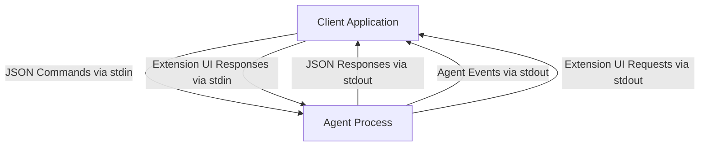
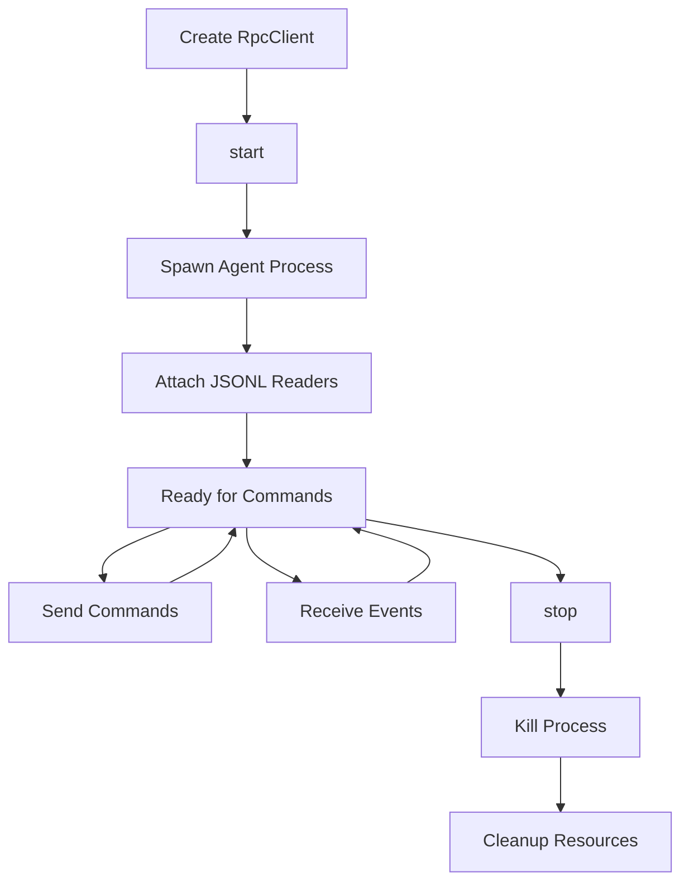
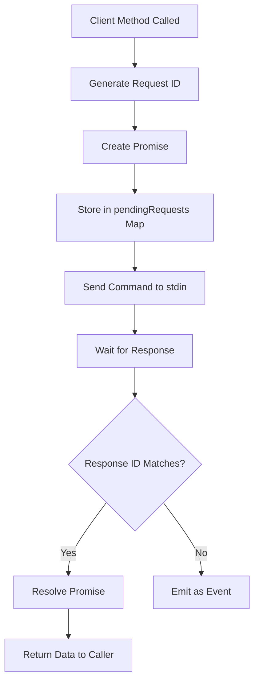
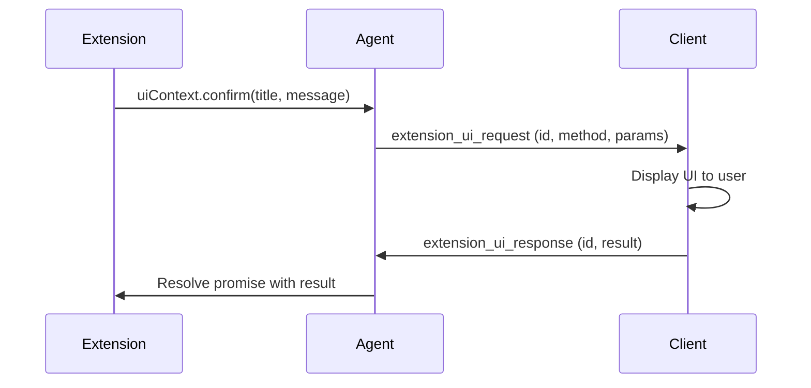
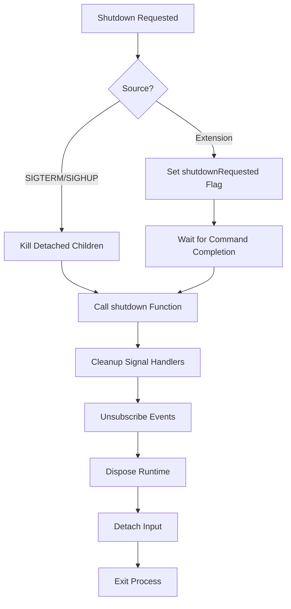

# RPC Mode & Client Integration

RPC (Remote Procedure Call) mode provides a headless, programmatic interface to the pi-mono coding agent, enabling it to be embedded within other applications. Instead of using the interactive TUI or web interface, RPC mode communicates via a JSON-based stdin/stdout protocol, making it suitable for automation, testing, and integration scenarios. The mode supports a comprehensive set of commands for controlling the agent, managing sessions, executing bash commands, and handling extension UI interactions. A TypeScript RPC client library (`RpcClient`) is provided to simplify integration, offering a fully typed API that handles protocol details, event streaming, and request-response correlation.

Sources: [packages/coding-agent/src/modes/rpc/rpc-mode.ts:1-13](../../../packages/coding-agent/src/modes/rpc/rpc-mode.ts#L1-L13), [packages/coding-agent/src/modes/rpc/rpc-client.ts:1-6](../../../packages/coding-agent/src/modes/rpc/rpc-client.ts#L1-L6)

## Protocol Overview

### Communication Model

The RPC protocol uses a line-delimited JSON (JSONL) format over stdin/stdout. Commands are sent as JSON objects on stdin, and the agent responds with JSON objects on stdout. Each message is terminated by a single line feed (`\n`) character, following strict JSONL framing that preserves Unicode separators (U+2028, U+2029) within JSON payloads.



Sources: [packages/coding-agent/src/modes/rpc/rpc-mode.ts:1-13](../../../packages/coding-agent/src/modes/rpc/rpc-mode.ts#L1-L13), [packages/coding-agent/src/modes/rpc/jsonl.ts:5-11](../../../packages/coding-agent/src/modes/rpc/jsonl.ts#L5-L11)

### Message Types

The protocol defines four primary message categories:

| Message Type | Direction | Description |
|-------------|-----------|-------------|
| Commands | stdin | Client requests to control the agent (e.g., `prompt`, `set_model`) |
| Responses | stdout | Acknowledgments of command success/failure with optional data |
| Events | stdout | Real-time agent session events (e.g., `message_start`, `tool_use`) |
| Extension UI | bidirectional | Extension UI requests (stdout) and responses (stdin) |

All commands support an optional `id` field for request-response correlation. Responses include the original command type, success status, and either a `data` object or `error` message.

Sources: [packages/coding-agent/src/modes/rpc/rpc-mode.ts:8-13](../../../packages/coding-agent/src/modes/rpc/rpc-mode.ts#L8-L13), [packages/coding-agent/src/modes/rpc/rpc-types.ts:1-10](../../../packages/coding-agent/src/modes/rpc/rpc-types.ts#L1-L10)

## JSONL Framing Implementation

### Strict LF-Only Parsing

The JSONL implementation uses LF-only (`\n`) framing to avoid issues with Unicode line separators embedded in JSON payloads. Unlike Node.js's `readline` module, which splits on multiple Unicode separators, the custom `attachJsonlLineReader` function only splits on `\n`, ensuring that U+2028 (Line Separator) and U+2029 (Paragraph Separator) characters within JSON strings are preserved.

```typescript
export function attachJsonlLineReader(stream: Readable, onLine: (line: string) => void): () => void {
	const decoder = new StringDecoder("utf8");
	let buffer = "";

	const onData = (chunk: string | Buffer) => {
		buffer += typeof chunk === "string" ? chunk : decoder.write(chunk);

		while (true) {
			const newlineIndex = buffer.indexOf("\n");
			if (newlineIndex === -1) {
				return;
			}

			emitLine(buffer.slice(0, newlineIndex));
			buffer = buffer.slice(newlineIndex + 1);
		}
	};
	// ...
}
```

The implementation also handles CRLF line endings by stripping trailing `\r` characters, and emits any remaining buffered content when the stream ends.

Sources: [packages/coding-agent/src/modes/rpc/jsonl.ts:13-48](../../../packages/coding-agent/src/modes/rpc/jsonl.ts#L13-L48), [packages/coding-agent/test/rpc-jsonl.test.ts:7-42](../../../packages/coding-agent/test/rpc-jsonl.test.ts#L7-L42)

### Serialization

The `serializeJsonLine` function produces strict JSONL records with LF-only termination:

```typescript
export function serializeJsonLine(value: unknown): string {
	return `${JSON.stringify(value)}\n`;
}
```

This ensures that payload strings containing Unicode separators are correctly transmitted without being split into multiple records.

Sources: [packages/coding-agent/src/modes/rpc/jsonl.ts:5-11](../../../packages/coding-agent/src/modes/rpc/jsonl.ts#L5-L11)

## Command Categories

### Prompting Commands

Commands for sending messages to the agent and controlling execution flow:

| Command | Parameters | Description |
|---------|-----------|-------------|
| `prompt` | `message`, `images?`, `streamingBehavior?` | Send a user prompt to the agent |
| `steer` | `message`, `images?` | Queue a steering message to interrupt mid-run |
| `follow_up` | `message`, `images?` | Queue a follow-up message for after completion |
| `abort` | - | Abort the current operation |
| `new_session` | `parentSession?` | Create a new session with optional parent tracking |

The `prompt` command responds immediately after preflight validation, before streaming begins. Actual execution progress is tracked via agent events.

Sources: [packages/coding-agent/src/modes/rpc/rpc-types.ts:16-20](../../../packages/coding-agent/src/modes/rpc/rpc-types.ts#L16-L20), [packages/coding-agent/src/modes/rpc/rpc-mode.ts:187-204](../../../packages/coding-agent/src/modes/rpc/rpc-mode.ts#L187-L204)

### State Management

Commands for querying and managing session state:

| Command | Response Data | Description |
|---------|--------------|-------------|
| `get_state` | `RpcSessionState` | Get current session configuration and status |
| `get_messages` | `{ messages: AgentMessage[] }` | Retrieve all messages in the session |
| `get_session_stats` | `SessionStats` | Get token usage and message counts |
| `get_commands` | `{ commands: RpcSlashCommand[] }` | List available extension commands, prompts, and skills |

The `RpcSessionState` object includes model information, thinking level, streaming status, queue modes, and message counts.

Sources: [packages/coding-agent/src/modes/rpc/rpc-types.ts:22-23](../../../packages/coding-agent/src/modes/rpc/rpc-types.ts#L22-L23), [packages/coding-agent/src/modes/rpc/rpc-types.ts:62-72](../../../packages/coding-agent/src/modes/rpc/rpc-types.ts#L62-L72)

### Model and Thinking Configuration

Commands for adjusting model selection and reasoning behavior:

| Command | Parameters | Description |
|---------|-----------|-------------|
| `set_model` | `provider`, `modelId` | Switch to a specific model |
| `cycle_model` | - | Rotate to the next available model |
| `get_available_models` | - | List all configured models |
| `set_thinking_level` | `level` | Set thinking depth (`low`, `medium`, `high`) |
| `cycle_thinking_level` | - | Rotate through thinking levels |

Sources: [packages/coding-agent/src/modes/rpc/rpc-types.ts:25-27](../../../packages/coding-agent/src/modes/rpc/rpc-types.ts#L25-L27), [packages/coding-agent/src/modes/rpc/rpc-types.ts:29-30](../../../packages/coding-agent/src/modes/rpc/rpc-types.ts#L29-L30)

### Session Operations

Commands for managing session lifecycle and branching:

| Command | Parameters | Description |
|---------|-----------|-------------|
| `switch_session` | `sessionPath` | Switch to a different session file |
| `fork` | `entryId` | Create a new session branching from a specific message |
| `clone` | - | Clone the current active branch into a new session |
| `export_html` | `outputPath?` | Export session to HTML format |
| `set_session_name` | `name` | Set the display name for the session |

Forking and cloning operations support extensions that may cancel the operation, indicated by a `cancelled: true` flag in the response data.

Sources: [packages/coding-agent/src/modes/rpc/rpc-types.ts:43-48](../../../packages/coding-agent/src/modes/rpc/rpc-types.ts#L43-L48), [packages/coding-agent/src/modes/rpc/rpc-mode.ts:324-354](../../../packages/coding-agent/src/modes/rpc/rpc-mode.ts#L324-L354)

### Compaction and Retry

Commands for context management and error recovery:

| Command | Parameters | Description |
|---------|-----------|-------------|
| `compact` | `customInstructions?` | Manually compact session context |
| `set_auto_compaction` | `enabled` | Enable/disable automatic compaction |
| `set_auto_retry` | `enabled` | Enable/disable automatic retry on errors |
| `abort_retry` | - | Cancel an in-progress retry attempt |

Sources: [packages/coding-agent/src/modes/rpc/rpc-types.ts:32-33](../../../packages/coding-agent/src/modes/rpc/rpc-types.ts#L32-L33), [packages/coding-agent/src/modes/rpc/rpc-types.ts:35-36](../../../packages/coding-agent/src/modes/rpc/rpc-types.ts#L35-L36)

### Bash Execution

Commands for running shell commands within the agent's context:

| Command | Parameters | Description |
|---------|-----------|-------------|
| `bash` | `command` | Execute a bash command and add output to context |
| `abort_bash` | - | Terminate the running bash command |

The `bash` command returns a `BashResult` object containing the command output, exit code, and cancellation status. The output is automatically added to the session context as a `bashExecution` role message.

Sources: [packages/coding-agent/src/modes/rpc/rpc-types.ts:38-39](../../../packages/coding-agent/src/modes/rpc/rpc-types.ts#L38-L39), [packages/coding-agent/test/rpc.test.ts:167-198](../../../packages/coding-agent/test/rpc.test.ts#L167-L198)

## RPC Client Library

### Client Initialization and Lifecycle

The `RpcClient` class provides a high-level TypeScript API for interacting with the agent in RPC mode. It spawns the agent process, manages the JSONL protocol, and provides typed methods for all commands.



Sources: [packages/coding-agent/src/modes/rpc/rpc-client.ts:55-89](../../../packages/coding-agent/src/modes/rpc/rpc-client.ts#L55-L89), [packages/coding-agent/src/modes/rpc/rpc-client.ts:91-111](../../../packages/coding-agent/src/modes/rpc/rpc-client.ts#L91-L111)

### Configuration Options

The client accepts configuration options for customizing the agent environment:

```typescript
export interface RpcClientOptions {
	/** Path to the CLI entry point (default: searches for dist/cli.js) */
	cliPath?: string;
	/** Working directory for the agent */
	cwd?: string;
	/** Environment variables */
	env?: Record<string, string>;
	/** Provider to use */
	provider?: string;
	/** Model ID to use */
	model?: string;
	/** Additional CLI arguments */
	args?: string[];
}
```

Sources: [packages/coding-agent/src/modes/rpc/rpc-client.ts:30-41](../../../packages/coding-agent/src/modes/rpc/rpc-client.ts#L30-L41)

### Event Subscription

The client provides an event subscription mechanism for receiving real-time agent events:

```typescript
const unsubscribe = client.onEvent((event: AgentEvent) => {
	if (event.type === "message_start") {
		console.log("Message started:", event.message.role);
	}
});

// Later: unsubscribe()
```

Events are typed according to the `AgentEvent` union type from `@mariozechner/pi-agent-core`, providing full TypeScript type safety for event handlers.

Sources: [packages/coding-agent/src/modes/rpc/rpc-client.ts:113-122](../../../packages/coding-agent/src/modes/rpc/rpc-client.ts#L113-L122)

### Request-Response Correlation

The client automatically generates unique request IDs and correlates responses using a pending request map:



Responses are matched by ID and removed from the pending map, while unmatched messages are dispatched to event listeners.

Sources: [packages/coding-agent/src/modes/rpc/rpc-client.ts:296-328](../../../packages/coding-agent/src/modes/rpc/rpc-client.ts#L296-L328)

### Helper Methods

The client provides convenience methods for common patterns:

| Method | Description |
|--------|-------------|
| `waitForIdle(timeout?)` | Wait for the agent to finish processing (until `agent_end` event) |
| `collectEvents(timeout?)` | Collect all events until the agent becomes idle |
| `promptAndWait(message, images?, timeout?)` | Send a prompt and wait for completion, returning all events |

These methods simplify testing and synchronous workflows by handling event collection and timeout logic.

Sources: [packages/coding-agent/src/modes/rpc/rpc-client.ts:266-294](../../../packages/coding-agent/src/modes/rpc/rpc-client.ts#L266-L294)

## Extension UI Integration

### UI Request Protocol

Extensions can request user input through the RPC protocol. When an extension calls a UI method (e.g., `uiContext.confirm()`), the agent emits an `extension_ui_request` message with a unique ID:



Sources: [packages/coding-agent/src/modes/rpc/rpc-mode.ts:8-13](../../../packages/coding-agent/src/modes/rpc/rpc-mode.ts#L8-L13), [packages/coding-agent/src/modes/rpc/rpc-mode.ts:88-104](../../../packages/coding-agent/src/modes/rpc/rpc-mode.ts#L88-L104)

### Supported UI Methods

The RPC mode supports a subset of extension UI methods suitable for headless operation:

| Method | Request Type | Response Type | Description |
|--------|-------------|---------------|-------------|
| `select` | `{ method: "select", title, options, timeout? }` | `{ value: string }` or `{ cancelled: true }` | Display a selection menu |
| `confirm` | `{ method: "confirm", title, message, timeout? }` | `{ confirmed: boolean }` or `{ cancelled: true }` | Ask for confirmation |
| `input` | `{ method: "input", title, placeholder?, timeout? }` | `{ value: string }` or `{ cancelled: true }` | Request text input |
| `editor` | `{ method: "editor", title, prefill? }` | `{ value: string }` or `{ cancelled: true }` | Open an editor for multi-line input |
| `notify` | `{ method: "notify", message, notifyType? }` | (fire-and-forget) | Display a notification |
| `setStatus` | `{ method: "setStatus", statusKey, statusText }` | (fire-and-forget) | Update a status indicator |
| `setWidget` | `{ method: "setWidget", widgetKey, widgetLines, widgetPlacement? }` | (fire-and-forget) | Display a widget with text lines |
| `setTitle` | `{ method: "setTitle", title }` | (fire-and-forget) | Set the terminal/window title |
| `set_editor_text` | `{ method: "set_editor_text", text }` | (fire-and-forget) | Set editor content |

TUI-specific methods (e.g., `setWorkingMessage`, `setTheme`, `setFooter`) are not supported and silently no-op.

Sources: [packages/coding-agent/src/modes/rpc/rpc-types.ts:104-130](../../../packages/coding-agent/src/modes/rpc/rpc-types.ts#L104-L130), [packages/coding-agent/src/modes/rpc/rpc-mode.ts:106-151](../../../packages/coding-agent/src/modes/rpc/rpc-mode.ts#L106-L151)

### Timeout and Cancellation

UI requests support optional timeout and AbortSignal-based cancellation:

```typescript
const createDialogPromise = <T>(
	opts: ExtensionUIDialogOptions | undefined,
	defaultValue: T,
	request: Record<string, unknown>,
	parseResponse: (response: RpcExtensionUIResponse) => T,
): Promise<T> => {
	if (opts?.signal?.aborted) return Promise.resolve(defaultValue);

	// Set up timeout
	if (opts?.timeout) {
		timeoutId = setTimeout(() => {
			cleanup();
			resolve(defaultValue);
		}, opts.timeout);
	}

	// Listen for abort signal
	opts?.signal?.addEventListener("abort", onAbort, { once: true });
	// ...
}
```

When a timeout occurs or the signal is aborted, the promise resolves with the default value (e.g., `undefined` for `select`, `false` for `confirm`).

Sources: [packages/coding-agent/src/modes/rpc/rpc-mode.ts:88-104](../../../packages/coding-agent/src/modes/rpc/rpc-mode.ts#L88-L104)

## Session Persistence

### File Format

Session data is persisted to JSONL files in the `sessions/` directory. Each session file contains a sequence of entries representing the session state over time:

```jsonl
{"type":"session","sessionId":"...","model":{...},"timestamp":"..."}
{"type":"message","entryId":"...","message":{"role":"user","content":[...]}}
{"type":"message","entryId":"...","message":{"role":"assistant","content":[...]}}
{"type":"compaction","summary":"...","tokensBefore":1234,"tokensAfter":567}
{"type":"session_info","name":"my-test-session"}
```

The first entry is always a session header with metadata. Subsequent entries record messages, compactions, and session info updates.

Sources: [packages/coding-agent/test/rpc.test.ts:52-89](../../../packages/coding-agent/test/rpc.test.ts#L52-L89), [packages/coding-agent/test/rpc.test.ts:235-253](../../../packages/coding-agent/test/rpc.test.ts#L235-L253)

### Bash Execution Context

When a bash command is executed via the `bash` command, the output is added to the session context as a message with role `bashExecution`. This allows the LLM to reference command outputs in subsequent prompts:

```typescript
// Execute bash command
await client.bash(`echo ${uniqueValue}`);

// Ask the LLM about the output
await client.promptAndWait(
	"What was the exact output of the echo command I just ran?"
);
```

The bash message entry in the session file includes the command, output, exit code, and execution metadata.

Sources: [packages/coding-agent/test/rpc.test.ts:177-198](../../../packages/coding-agent/test/rpc.test.ts#L177-L198), [packages/coding-agent/test/rpc.test.ts:200-224](../../../packages/coding-agent/test/rpc.test.ts#L200-L224)

## Error Handling and Shutdown

### Command Error Responses

When a command fails, the agent returns an error response with the command type and error message:

```typescript
const error = (id: string | undefined, command: string, message: string): RpcResponse => {
	return { id, type: "response", command, success: false, error: message };
};
```

The client's `getData` method throws an error when receiving a failure response, allowing callers to handle errors with standard try-catch:

```typescript
private getData<T>(response: RpcResponse): T {
	if (!response.success) {
		const errorResponse = response as Extract<RpcResponse, { success: false }>;
		throw new Error(errorResponse.error);
	}
	return successResponse.data as T;
}
```

Sources: [packages/coding-agent/src/modes/rpc/rpc-mode.ts:64-67](../../../packages/coding-agent/src/modes/rpc/rpc-mode.ts#L64-L67), [packages/coding-agent/src/modes/rpc/rpc-client.ts:330-337](../../../packages/coding-agent/src/modes/rpc/rpc-client.ts#L330-L337)

### Graceful Shutdown

The agent supports graceful shutdown via extension handlers and signal handling:



The shutdown process ensures that tracked child processes are terminated and resources are properly disposed before exiting.

Sources: [packages/coding-agent/src/modes/rpc/rpc-mode.ts:440-457](../../../packages/coding-agent/src/modes/rpc/rpc-mode.ts#L440-L457), [packages/coding-agent/src/modes/rpc/rpc-mode.ts:419-437](../../../packages/coding-agent/src/modes/rpc/rpc-mode.ts#L419-L437)

## Testing Infrastructure

### Test Suite Structure

The RPC mode includes comprehensive integration tests that verify protocol correctness, command execution, and session persistence:

```typescript
describe("RPC mode", () => {
	let client: RpcClient;
	let sessionDir: string;

	beforeEach(() => {
		sessionDir = join(tmpdir(), `pi-rpc-test-${Date.now()}`);
		client = new RpcClient({
			cliPath: join(__dirname, "..", "dist", "cli.js"),
			cwd: join(__dirname, ".."),
			env: { PI_CODING_AGENT_DIR: sessionDir },
			provider: "anthropic",
			model: "claude-sonnet-4-5",
		});
	});

	afterEach(async () => {
		await client.stop();
		if (sessionDir && existsSync(sessionDir)) {
			rmSync(sessionDir, { recursive: true });
		}
	});
	// ...
});
```

Tests use temporary session directories and clean up after each test to ensure isolation.

Sources: [packages/coding-agent/test/rpc.test.ts:11-33](../../../packages/coding-agent/test/rpc.test.ts#L11-L33)

### Test Coverage

The test suite covers key scenarios including:

- Basic state queries and model configuration
- Session persistence and file format verification
- Compaction with custom instructions
- Bash execution and context integration
- Thinking level management
- Session operations (new, fork, clone, export)
- Session naming and metadata
- JSONL framing edge cases (Unicode separators, CRLF, incomplete lines)

Sources: [packages/coding-agent/test/rpc.test.ts:35-253](../../../packages/coding-agent/test/rpc.test.ts#L35-L253), [packages/coding-agent/test/rpc-jsonl.test.ts:5-51](../../../packages/coding-agent/test/rpc-jsonl.test.ts#L5-L51)

## Summary

RPC mode provides a robust, protocol-based interface for embedding the pi-mono coding agent in external applications. The JSONL-based protocol ensures reliable message framing, while the typed TypeScript client library simplifies integration by handling protocol details and providing a clean async API. The mode supports the full range of agent capabilities including prompting, model configuration, session management, bash execution, and extension UI interactions. Comprehensive test coverage and session persistence ensure reliability for production use cases requiring programmatic agent control.