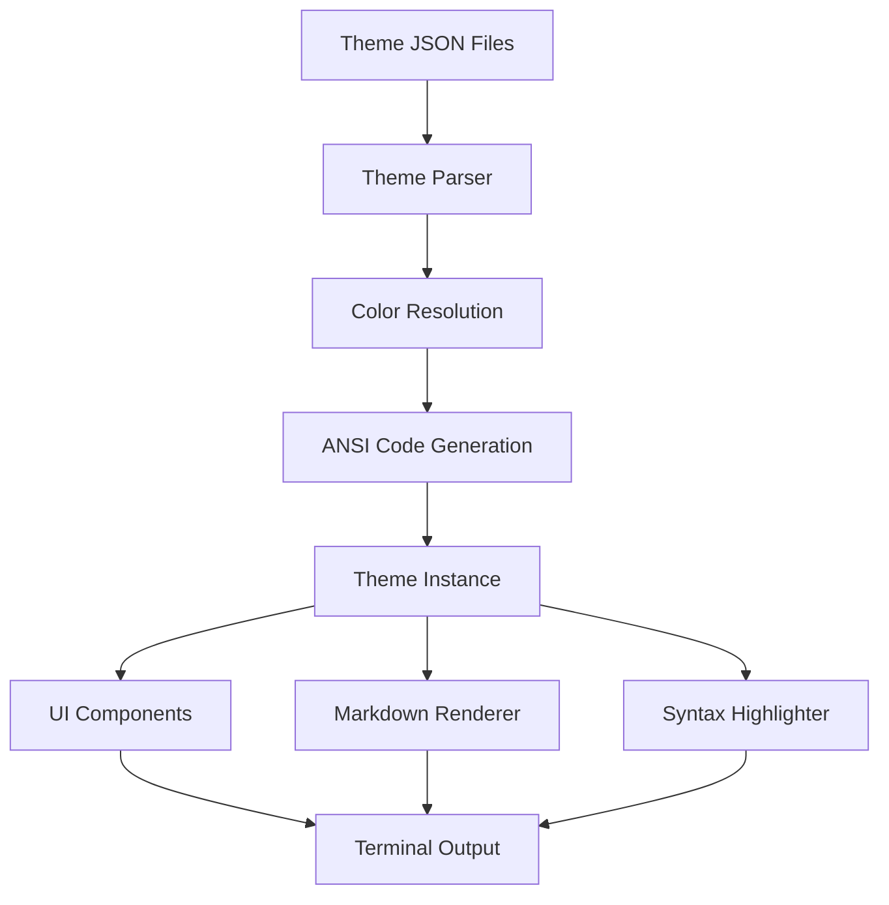
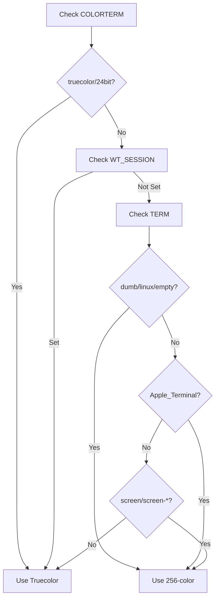
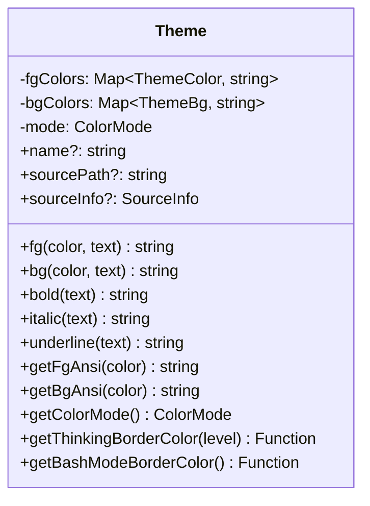
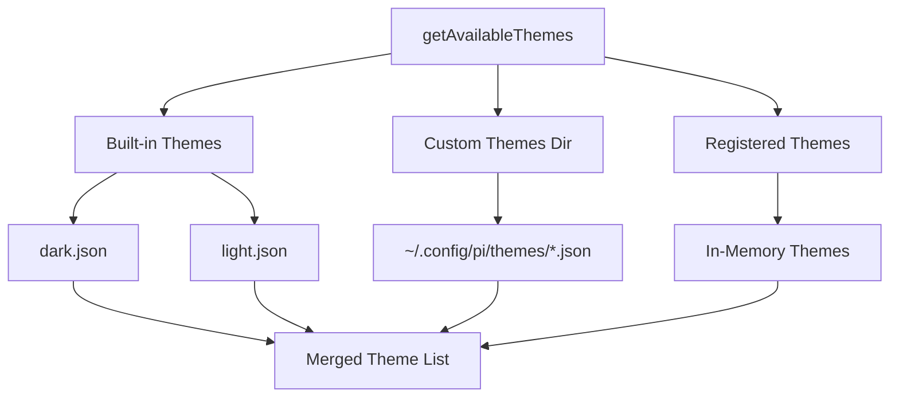
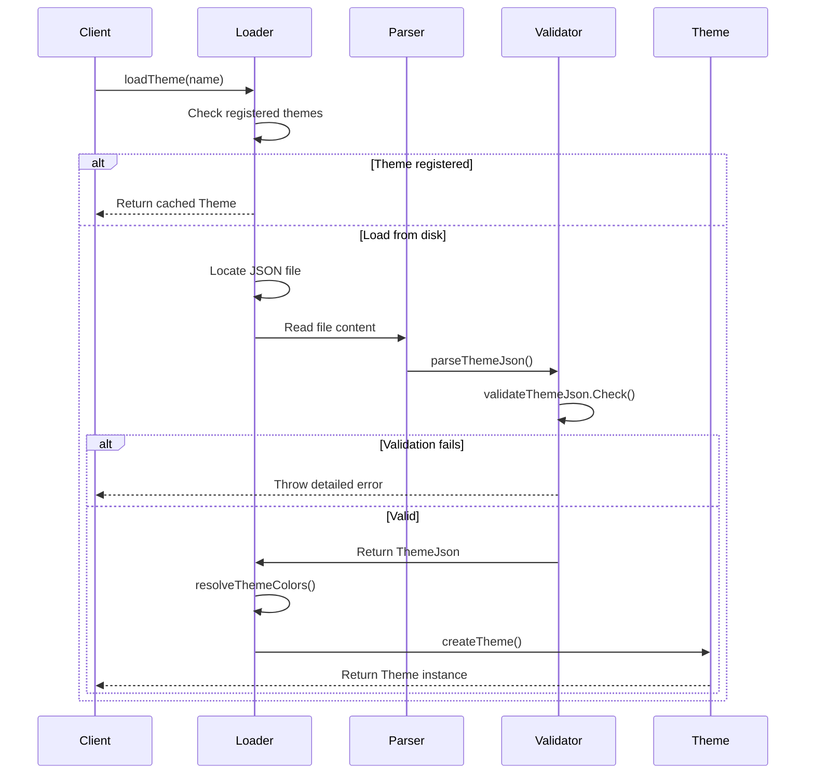
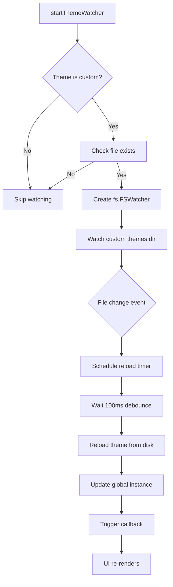

# Theme System & Customization

The pi-mono coding agent features a comprehensive theme system that enables customization of the terminal user interface appearance. The system supports both built-in themes (dark and light) and custom user-defined themes, with automatic color mode detection (truecolor vs 256-color), hot-reloading capabilities, and export functionality for HTML rendering. Themes define over 50 distinct color tokens covering UI elements, markdown rendering, syntax highlighting, and state-specific backgrounds.

The theme system is designed around a JSON schema that enforces consistency across all theme definitions, supports variable references for color reuse, and provides fallback mechanisms for terminals with limited color support. It integrates deeply with the TUI components, markdown rendering, and code syntax highlighting systems.

Sources: [theme.ts:1-1000](../../../packages/coding-agent/src/modes/interactive/theme/theme.ts#L1-L1000)

## Architecture Overview

The theme system consists of three primary layers:



The architecture flows from JSON theme definitions through validation and color resolution, then generates ANSI escape codes appropriate for the detected terminal color mode. The resulting Theme instance provides a unified API for all UI components, markdown rendering, and syntax highlighting.

Sources: [theme.ts:1-50](../../../packages/coding-agent/src/modes/interactive/theme/theme.ts#L1-L50), [theme.ts:400-500](../../../packages/coding-agent/src/modes/interactive/theme/theme.ts#L400-L500)

## Theme Schema and Color Tokens

### JSON Schema Structure

Themes are defined using a strict JSON schema that validates all color definitions and ensures completeness:

| Property | Type | Required | Description |
|----------|------|----------|-------------|
| `name` | string | Yes | Theme identifier |
| `vars` | object | No | Reusable color variables |
| `colors` | object | Yes | All 50 required color tokens |
| `export` | object | No | HTML export-specific colors |

Sources: [theme.ts:17-118](../../../packages/coding-agent/src/modes/interactive/theme/theme.ts#L17-L118), [theme-schema.json:1-350](../../../packages/coding-agent/src/modes/interactive/theme/theme-schema.json#L1-L350)

### Color Value Types

The system supports three color value formats:

| Format | Example | Description |
|--------|---------|-------------|
| Hex color | `"#ff0000"` | RGB hex notation (truecolor) |
| 256-color index | `42` | Integer 0-255 for 256-color palette |
| Variable reference | `"primary"` | Reference to a var definition |
| Terminal default | `""` | Empty string uses terminal default |

Sources: [theme.ts:17-23](../../../packages/coding-agent/src/modes/interactive/theme/theme.ts#L17-L23)

### Core Color Categories

The 50+ color tokens are organized into functional categories:

**Core UI Colors (11 tokens):**
- `accent`, `border`, `borderAccent`, `borderMuted`
- `success`, `error`, `warning`
- `muted`, `dim`, `text`, `thinkingText`

**Background Colors (6 tokens):**
- `selectedBg`, `userMessageBg`, `customMessageBg`
- `toolPendingBg`, `toolSuccessBg`, `toolErrorBg`

**Markdown Rendering (10 tokens):**
- `mdHeading`, `mdLink`, `mdLinkUrl`, `mdCode`
- `mdCodeBlock`, `mdCodeBlockBorder`, `mdQuote`, `mdQuoteBorder`
- `mdHr`, `mdListBullet`

**Syntax Highlighting (9 tokens):**
- `syntaxComment`, `syntaxKeyword`, `syntaxFunction`, `syntaxVariable`
- `syntaxString`, `syntaxNumber`, `syntaxType`, `syntaxOperator`, `syntaxPunctuation`

**Thinking Level Borders (6 tokens):**
- `thinkingOff`, `thinkingMinimal`, `thinkingLow`
- `thinkingMedium`, `thinkingHigh`, `thinkingXhigh`

**Special Modes (1 token):**
- `bashMode`

Sources: [theme.ts:25-116](../../../packages/coding-agent/src/modes/interactive/theme/theme.ts#L25-L116), [theme-schema.json:30-270](../../../packages/coding-agent/src/modes/interactive/theme/theme-schema.json#L30-L270)

## Color Mode Detection and Conversion

### Terminal Color Mode Detection

The system automatically detects terminal color capabilities using environment variables:



The detection prioritizes modern terminal features (truecolor) but falls back to 256-color mode for terminals like GNU screen, Apple Terminal, or explicitly limited environments.

Sources: [theme.ts:131-162](../../../packages/coding-agent/src/modes/interactive/theme/theme.ts#L131-L162)

### RGB to 256-Color Conversion

For terminals that don't support truecolor, the system converts hex colors to the nearest 256-color palette index:

```typescript
function rgbTo256(r: number, g: number, b: number): number {
	// Find closest color in the 6x6x6 cube
	const rIdx = findClosestCubeIndex(r);
	const gIdx = findClosestCubeIndex(g);
	const bIdx = findClosestCubeIndex(b);
	// Calculate cube index and distance
	const cubeIndex = 16 + 36 * rIdx + 6 * gIdx + bIdx;
	
	// Find closest grayscale
	const gray = Math.round(0.299 * r + 0.587 * g + 0.114 * b);
	const grayIdx = findClosestGrayIndex(gray);
	const grayIndex = 232 + grayIdx;
	
	// Prefer cube for saturated colors, grayscale for neutrals
	const maxC = Math.max(r, g, b);
	const minC = Math.min(r, g, b);
	const spread = maxC - minC;
	
	if (spread < 10 && grayDist < cubeDist) {
		return grayIndex;
	}
	return cubeIndex;
}
```

The algorithm uses weighted Euclidean distance (accounting for human eye sensitivity to green) and intelligently chooses between the 6×6×6 color cube (indices 16-231) and the 24-step grayscale ramp (indices 232-255).

Sources: [theme.ts:164-245](../../../packages/coding-agent/src/modes/interactive/theme/theme.ts#L164-L245)

### ANSI Escape Code Generation

The system generates appropriate ANSI codes based on color mode:

| Mode | Foreground Format | Background Format |
|------|-------------------|-------------------|
| Truecolor | `\x1b[38;2;R;G;Bm` | `\x1b[48;2;R;G;Bm` |
| 256-color | `\x1b[38;5;Nm` | `\x1b[48;5;Nm` |
| Default | `\x1b[39m` | `\x1b[49m` |

Sources: [theme.ts:247-270](../../../packages/coding-agent/src/modes/interactive/theme/theme.ts#L247-L270)

## Theme Class and API

### Theme Instance Structure

The `Theme` class encapsulates all color operations and provides a type-safe API:



The Theme class pre-computes all ANSI escape codes during construction, storing them in maps for efficient runtime access. This avoids repeated color conversions during rendering.

Sources: [theme.ts:287-375](../../../packages/coding-agent/src/modes/interactive/theme/theme.ts#L287-L375)

### Core Methods

**Text Styling Methods:**
```typescript
fg(color: ThemeColor, text: string): string
bg(color: ThemeBg, text: string): string
bold(text: string): string
italic(text: string): string
underline(text: string): string
inverse(text: string): string
strikethrough(text: string): string
```

**ANSI Code Access:**
```typescript
getFgAnsi(color: ThemeColor): string
getBgAnsi(color: ThemeBg): string
```

**Special Color Functions:**
```typescript
getThinkingBorderColor(level: "off" | "minimal" | "low" | "medium" | "high" | "xhigh"): (str: string) => string
getBashModeBorderColor(): (str: string) => string
```

Sources: [theme.ts:302-375](../../../packages/coding-agent/src/modes/interactive/theme/theme.ts#L302-L375)

## Theme Loading and Management

### Theme Discovery

The system discovers themes from three sources in priority order:



Sources: [theme.ts:438-468](../../../packages/coding-agent/src/modes/interactive/theme/theme.ts#L438-L468)

### Theme Loading Process



Sources: [theme.ts:513-570](../../../packages/coding-agent/src/modes/interactive/theme/theme.ts#L513-L570)

### Variable Reference Resolution

Theme variables allow color reuse and are resolved recursively with cycle detection:

```typescript
function resolveVarRefs(
	value: ColorValue,
	vars: Record<string, ColorValue>,
	visited = new Set<string>(),
): string | number {
	if (typeof value === "number" || value === "" || value.startsWith("#")) {
		return value;
	}
	if (visited.has(value)) {
		throw new Error(`Circular variable reference detected: ${value}`);
	}
	if (!(value in vars)) {
		throw new Error(`Variable reference not found: ${value}`);
	}
	visited.add(value);
	return resolveVarRefs(vars[value], vars, visited);
}
```

This allows themes to define reusable color palettes in the `vars` section and reference them throughout the `colors` section.

Sources: [theme.ts:272-285](../../../packages/coding-agent/src/modes/interactive/theme/theme.ts#L272-L285)

## Built-in Themes

### Dark Theme

The default dark theme uses a muted color palette suitable for extended coding sessions:

| Category | Example Tokens | Color Values |
|----------|----------------|--------------|
| Accent | `accent` | `#8abeb7` (teal) |
| Borders | `border`, `borderAccent` | `#5f87ff` (blue), `#00d7ff` (cyan) |
| Status | `success`, `error`, `warning` | `#b5bd68` (green), `#cc6666` (red), `#ffff00` (yellow) |
| Backgrounds | `userMessageBg`, `toolSuccessBg` | `#343541`, `#283228` |
| Syntax | `syntaxKeyword`, `syntaxString` | `#569CD6` (VS Code blue), `#CE9178` (orange) |

Sources: [dark.json:1-90](../../../packages/coding-agent/src/modes/interactive/theme/dark.json#L1-L90)

### Light Theme

The light theme provides high contrast for bright environments:

| Category | Example Tokens | Color Values |
|----------|----------------|--------------|
| Accent | `accent` | `#5a8080` (dark teal) |
| Borders | `border`, `borderAccent` | `#547da7` (blue), `#5a8080` (teal) |
| Status | `success`, `error`, `warning` | `#588458` (green), `#aa5555` (red), `#9a7326` (yellow) |
| Backgrounds | `userMessageBg`, `toolSuccessBg` | `#e8e8e8`, `#e8f0e8` |
| Syntax | `syntaxKeyword`, `syntaxString` | `#0000FF` (blue), `#A31515` (red) |

Sources: [light.json:1-90](../../../packages/coding-agent/src/modes/interactive/theme/light.json#L1-L90)

## Hot-Reloading and Watch System

### File Watching Mechanism

The theme system can watch custom theme files for changes and automatically reload:



The system uses a 100ms debounce timer to avoid excessive reloads during file editing and gracefully handles invalid theme states by keeping the last valid theme active.

Sources: [theme.ts:680-742](../../../packages/coding-agent/src/modes/interactive/theme/theme.ts#L680-L742)

### Theme Change Notifications

Components can register callbacks to respond to theme changes:

```typescript
export function onThemeChange(callback: () => void): void {
	onThemeChangeCallback = callback;
}
```

This enables UI components to invalidate their cached content and re-render with the new theme.

Sources: [theme.ts:676-678](../../../packages/coding-agent/src/modes/interactive/theme/theme.ts#L676-L678)

## Integration with UI Components

### TUI Component Themes

The theme system provides specialized theme objects for TUI components:

**Markdown Theme:**
```typescript
export function getMarkdownTheme(): MarkdownTheme {
	return {
		heading: (text: string) => theme.fg("mdHeading", text),
		link: (text: string) => theme.fg("mdLink", text),
		code: (text: string) => theme.fg("mdCode", text),
		bold: (text: string) => theme.bold(text),
		highlightCode: (code: string, lang?: string): string[] => { /* ... */ }
	};
}
```

**Select List Theme:**
```typescript
export function getSelectListTheme(): SelectListTheme {
	return {
		selectedPrefix: (text: string) => theme.fg("accent", text),
		selectedText: (text: string) => theme.fg("accent", text),
		description: (text: string) => theme.fg("muted", text),
		scrollInfo: (text: string) => theme.fg("muted", text),
		noMatch: (text: string) => theme.fg("muted", text),
	};
}
```

Sources: [theme.ts:867-920](../../../packages/coding-agent/src/modes/interactive/theme/theme.ts#L867-L920)

### Syntax Highlighting Integration

The theme system integrates with `cli-highlight` for code syntax highlighting:

```typescript
function buildCliHighlightTheme(t: Theme): CliHighlightTheme {
	return {
		keyword: (s: string) => t.fg("syntaxKeyword", s),
		built_in: (s: string) => t.fg("syntaxType", s),
		literal: (s: string) => t.fg("syntaxNumber", s),
		number: (s: string) => t.fg("syntaxNumber", s),
		string: (s: string) => t.fg("syntaxString", s),
		comment: (s: string) => t.fg("syntaxComment", s),
		function: (s: string) => t.fg("syntaxFunction", s),
		// ... additional mappings
	};
}
```

The system includes language detection from file extensions and validates language support before attempting syntax highlighting to avoid stderr spam from invalid language identifiers.

Sources: [theme.ts:771-839](../../../packages/coding-agent/src/modes/interactive/theme/theme.ts#L771-L839), [theme.ts:841-865](../../../packages/coding-agent/src/modes/interactive/theme/theme.ts#L841-L865)

### Theme Selector Component

The interactive theme selector component demonstrates theme system integration:

```typescript
export class ThemeSelectorComponent extends Container {
	private selectList: SelectList;
	private onPreview: (themeName: string) => void;

	constructor(
		currentTheme: string,
		onSelect: (themeName: string) => void,
		onCancel: () => void,
		onPreview: (themeName: string) => void,
	) {
		// Create select items from available themes
		const themes = getAvailableThemes();
		const themeItems: SelectItem[] = themes.map((name) => ({
			value: name,
			label: name,
			description: name === currentTheme ? "(current)" : undefined,
		}));
		
		// Real-time preview on selection change
		this.selectList.onSelectionChange = (item) => {
			this.onPreview(item.value);
		};
	}
}
```

Sources: [theme-selector.ts:1-60](../../../packages/coding-agent/src/modes/interactive/components/theme-selector.ts#L1-L60)

## HTML Export Support

### Color Conversion for Web

The theme system provides utilities for converting terminal colors to CSS-compatible values:

```typescript
export function getResolvedThemeColors(themeName?: string): Record<string, string> {
	const themeJson = loadThemeJson(name);
	const resolved = resolveThemeColors(themeJson.colors, themeJson.vars);
	
	const cssColors: Record<string, string> = {};
	for (const [key, value] of Object.entries(resolved)) {
		if (typeof value === "number") {
			cssColors[key] = ansi256ToHex(value);  // Convert 256-color to hex
		} else if (value === "") {
			cssColors[key] = defaultText;  // Use fallback for terminal default
		} else {
			cssColors[key] = value;  // Use hex as-is
		}
	}
	return cssColors;
}
```

The system converts 256-color palette indices to hex using lookup tables for the 6×6×6 color cube (indices 16-231) and 24-step grayscale ramp (indices 232-255).

Sources: [theme.ts:765-807](../../../packages/coding-agent/src/modes/interactive/theme/theme.ts#L765-L807)

### Export-Specific Colors

Themes can define optional export-specific colors for HTML rendering:

```json
{
	"export": {
		"pageBg": "#18181e",
		"cardBg": "#1e1e24",
		"infoBg": "#3c3728"
	}
}
```

These colors provide better control over HTML export appearance without affecting terminal rendering. If not specified, the system derives sensible defaults from the terminal theme colors.

Sources: [theme.ts:113-116](../../../packages/coding-agent/src/modes/interactive/theme/theme.ts#L113-L116), [dark.json:86-90](../../../packages/coding-agent/src/modes/interactive/theme/dark.json#L86-L90)

## Global Theme Management

### Singleton Pattern with Module Sharing

The theme system uses a symbol-based global singleton to ensure consistency across different module loaders (tsx and jiti in development mode):

```typescript
const THEME_KEY = Symbol.for("@mariozechner/pi-coding-agent:theme");

export const theme: Theme = new Proxy({} as Theme, {
	get(_target, prop) {
		const t = (globalThis as Record<symbol, Theme>)[THEME_KEY];
		if (!t) throw new Error("Theme not initialized. Call initTheme() first.");
		return (t as unknown as Record<string | symbol, unknown>)[prop];
	},
});

function setGlobalTheme(t: Theme): void {
	(globalThis as Record<symbol, Theme>)[THEME_KEY] = t;
}
```

This proxy-based approach ensures all module instances access the same theme instance, even when loaded by different module systems.

Sources: [theme.ts:577-593](../../../packages/coding-agent/src/modes/interactive/theme/theme.ts#L577-L593)

### Initialization and Switching

**Theme Initialization:**
```typescript
export function initTheme(themeName?: string, enableWatcher: boolean = false): void {
	const name = themeName ?? getDefaultTheme();
	currentThemeName = name;
	try {
		setGlobalTheme(loadTheme(name));
		if (enableWatcher) {
			startThemeWatcher();
		}
	} catch (_error) {
		// Fallback to dark theme on error
		currentThemeName = "dark";
		setGlobalTheme(loadTheme("dark"));
	}
}
```

**Runtime Theme Switching:**
```typescript
export function setTheme(name: string, enableWatcher: boolean = false): { success: boolean; error?: string } {
	currentThemeName = name;
	try {
		setGlobalTheme(loadTheme(name));
		if (enableWatcher) {
			startThemeWatcher();
		}
		if (onThemeChangeCallback) {
			onThemeChangeCallback();
		}
		return { success: true };
	} catch (error) {
		// Fallback to dark theme on error
		currentThemeName = "dark";
		setGlobalTheme(loadTheme("dark"));
		return {
			success: false,
			error: error instanceof Error ? error.message : String(error),
		};
	}
}
```

Both functions implement graceful fallback to the dark theme if the requested theme fails to load or validate.

Sources: [theme.ts:603-658](../../../packages/coding-agent/src/modes/interactive/theme/theme.ts#L603-L658)

## Error Handling and Validation

### Schema Validation Errors

The theme parser provides detailed error messages for invalid themes:

```typescript
function parseThemeJson(label: string, json: unknown): ThemeJson {
	if (!validateThemeJson.Check(json)) {
		const errors = Array.from(validateThemeJson.Errors(json));
		const missingColors = new Set<string>();
		const otherErrors: string[] = [];

		for (const error of errors) {
			if (error.keyword === "required" && error.instancePath === "/colors") {
				const requiredProperties = (error.params as { requiredProperties?: string[] }).requiredProperties;
				for (const requiredProperty of requiredProperties ?? []) {
					missingColors.add(requiredProperty);
				}
				continue;
			}
			const path = error.instancePath || "/";
			otherErrors.push(`  - ${path}: ${error.message}`);
		}

		let errorMessage = `Invalid theme "${label}":\n`;
		if (missingColors.size > 0) {
			errorMessage += "\nMissing required color tokens:\n";
			errorMessage += Array.from(missingColors)
				.sort()
				.map((color) => `  - ${color}`)
				.join("\n");
			errorMessage += '\n\nPlease add these colors to your theme\'s "colors" object.';
			errorMessage += "\nSee the built-in themes (dark.json, light.json) for reference values.";
		}
		if (otherErrors.length > 0) {
			errorMessage += `\n\nOther errors:\n${otherErrors.join("\n")}`;
		}

		throw new Error(errorMessage);
	}
	return json as ThemeJson;
}
```

This provides actionable error messages that explicitly list missing color tokens and reference the built-in themes as examples.

Sources: [theme.ts:487-530](../../../packages/coding-agent/src/modes/interactive/theme/theme.ts#L487-L530)

## Summary

The theme system provides comprehensive customization capabilities for the pi-mono coding agent's terminal interface. It supports multiple color formats (hex, 256-color, variables), automatic terminal capability detection, hot-reloading of custom themes, and export to HTML with CSS-compatible colors. The system's architecture ensures type safety, efficient rendering through pre-computed ANSI codes, and graceful fallback handling for invalid themes. With over 50 distinct color tokens organized into functional categories, themes can precisely control every aspect of the UI appearance while maintaining consistency across markdown rendering, syntax highlighting, and interactive components.