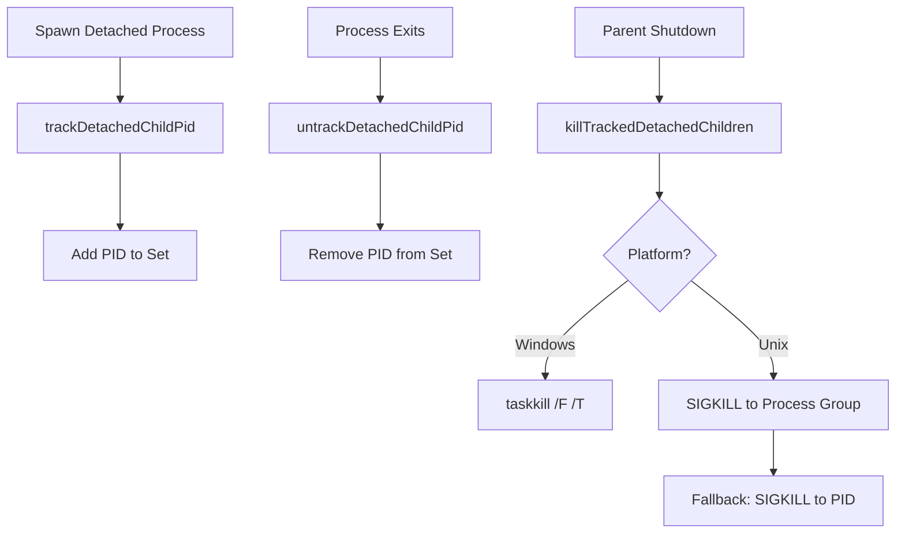
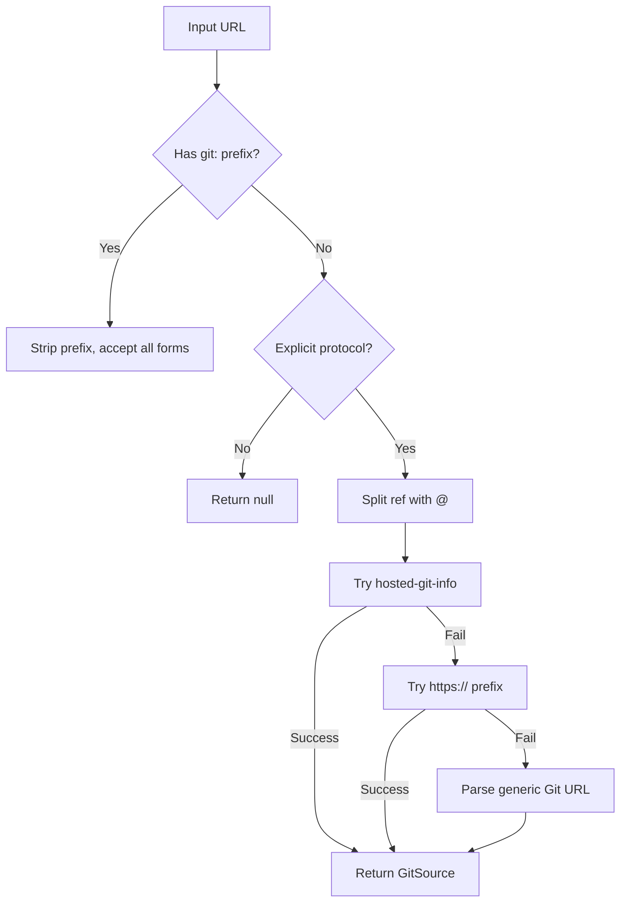
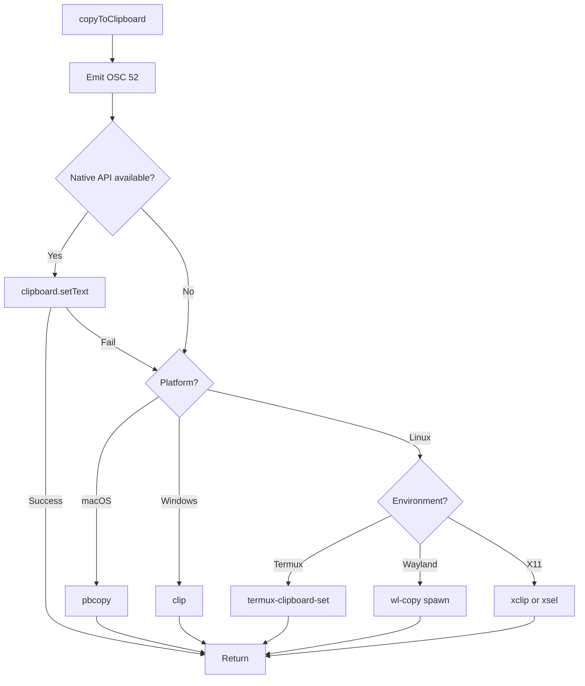
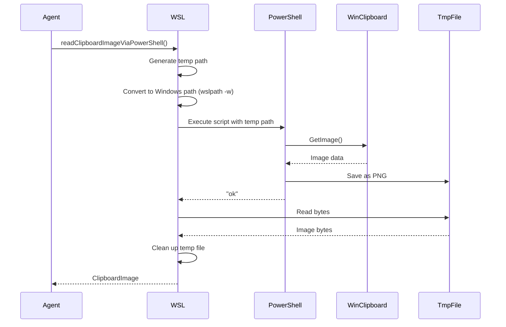
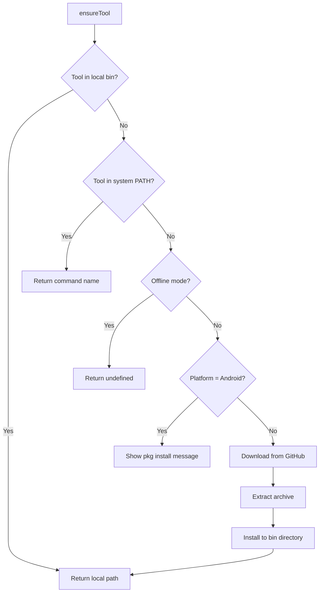

# Shell, Git, Clipboard & File System Utilities

## Introduction

The **Shell, Git, Clipboard & File System Utilities** module provides a comprehensive suite of cross-platform utilities that enable the pi-mono coding agent to interact with the underlying operating system, manage external processes, parse Git URLs, handle clipboard operations (including images), and perform file system operations. These utilities abstract away platform-specific differences between Windows, macOS, Linux, and specialized environments like Termux and WSL, ensuring consistent behavior across all supported platforms.

This module is foundational to the coding agent's ability to execute shell commands, integrate with version control systems, exchange data with the system clipboard, and manage file system resources. The utilities handle edge cases such as binary output sanitization, detached process tracking, cross-platform shell resolution, and multi-strategy clipboard access with graceful fallbacks.

Sources: [shell.ts](../../../packages/coding-agent/src/utils/shell.ts), [git.ts](../../../packages/coding-agent/src/utils/git.ts), [clipboard.ts](../../../packages/coding-agent/src/utils/clipboard.ts), [clipboard-image.ts](../../../packages/coding-agent/src/utils/clipboard-image.ts), [paths.ts](../../../packages/coding-agent/src/utils/paths.ts)

## Shell Configuration and Process Management

### Cross-Platform Shell Resolution

The shell utility provides intelligent shell resolution that adapts to different operating systems and environments. The `getShellConfig` function follows a specific resolution order to locate a suitable bash shell.

**Resolution Order:**
1. User-specified `customShellPath` (if provided and exists)
2. Windows: Git Bash in known locations, then bash on PATH
3. Unix/Linux: `/bin/bash`, then bash on PATH, then fallback to `sh`

```typescript
export interface ShellConfig {
	shell: string;
	args: string[];
}
```

The function searches for Git Bash in standard Windows installation directories (`Program Files` and `Program Files (x86)`) and validates paths using `existsSync`. On Unix systems, it prioritizes the standard `/bin/bash` location before searching PATH. The `findBashOnPath` helper uses platform-specific commands (`where` on Windows, `which` on Unix) with a 5-second timeout.

Sources: [shell.ts:14-77](../../../packages/coding-agent/src/utils/shell.ts#L14-L77)

### Shell Environment Configuration

The `getShellEnv` function augments the current process environment with the agent's binary directory, ensuring that installed tools are accessible to spawned processes:

```typescript
export function getShellEnv(): NodeJS.ProcessEnv {
	const binDir = getBinDir();
	const pathKey = Object.keys(process.env).find((key) => key.toLowerCase() === "path") ?? "PATH";
	const currentPath = process.env[pathKey] ?? "";
	const pathEntries = currentPath.split(delimiter).filter(Boolean);
	const hasBinDir = pathEntries.includes(binDir);
	const updatedPath = hasBinDir ? currentPath : [binDir, currentPath].filter(Boolean).join(delimiter);

	return {
		...process.env,
		[pathKey]: updatedPath,
	};
}
```

This implementation handles case-insensitive PATH key matching (important on Windows) and uses the platform-specific path delimiter.

Sources: [shell.ts:79-89](../../../packages/coding-agent/src/utils/shell.ts#L79-L89)

### Process Tree Management

The module tracks detached child processes to ensure proper cleanup on parent shutdown:



The `killProcessTree` function handles cross-platform process termination:
- **Windows**: Uses `taskkill /F /T /PID` to forcefully terminate the process tree
- **Unix/Linux/macOS**: Attempts to kill the process group using negative PID (`-pid`) with SIGKILL, falling back to killing just the process if the group kill fails

Sources: [shell.ts:120-167](../../../packages/coding-agent/src/utils/shell.ts#L120-L167)

### Binary Output Sanitization

The `sanitizeBinaryOutput` function removes problematic characters from binary output that can crash display libraries or cause rendering issues:

**Filtered Characters:**
- Control characters (0x00-0x1F) except tab (0x09), newline (0x0A), and carriage return (0x0D)
- Unicode format characters (0xFFF9-0xFFFB) that crash `string-width`
- Lone surrogates (handled by `Array.from` iteration)
- Characters with undefined code points

The implementation uses `Array.from` to properly iterate over Unicode code points rather than code units, ensuring correct handling of surrogate pairs.

Sources: [shell.ts:91-118](../../../packages/coding-agent/src/utils/shell.ts#L91-L118)

## Git URL Parsing

### Git Source Structure

The Git utility parses various Git URL formats into a normalized structure:

```typescript
export type GitSource = {
	type: "git";
	repo: string;        // Clone URL without ref suffix
	host: string;        // Domain (e.g., "github.com")
	path: string;        // Repository path (e.g., "user/repo")
	ref?: string;        // Git ref (branch, tag, commit)
	pinned: boolean;     // True if ref was specified
};
```

Sources: [git.ts:6-17](../../../packages/coding-agent/src/utils/git.ts#L6-L17)

### URL Parsing Strategy

The `parseGitUrl` function implements a multi-stage parsing strategy:



**Supported URL Formats:**
- SCP-like: `git@github.com:user/repo@ref`
- HTTPS: `https://github.com/user/repo@ref`
- SSH: `ssh://git@github.com/user/repo`
- Git protocol: `git://github.com/user/repo`
- Shorthand (with `git:` prefix): `github.com/user/repo@ref`

The parser uses the `hosted-git-info` library to handle known Git hosting services (GitHub, GitLab, Bitbucket) and falls back to generic URL parsing for self-hosted or custom Git servers.

Sources: [git.ts:93-151](../../../packages/coding-agent/src/utils/git.ts#L93-L151)

### Reference Extraction

The `splitRef` function extracts Git references (branches, tags, commits) from URLs using the `@` separator:

1. **SCP-like URLs**: Extracts ref from `git@host:path@ref`
2. **Protocol URLs**: Parses using URL API, extracts ref from pathname
3. **Shorthand URLs**: Splits on first `/`, then extracts ref from path component

The function validates that both repository path and ref are non-empty before returning the split result.

Sources: [git.ts:19-63](../../../packages/coding-agent/src/utils/git.ts#L19-L63)

## Clipboard Operations

### Text Clipboard with Multi-Strategy Fallback

The clipboard module implements a multi-layered approach to ensure text can be copied across diverse environments:

| Strategy | Priority | Environments | Implementation |
|----------|----------|--------------|----------------|
| OSC 52 Escape Sequence | 1 (Always) | SSH/mosh, tmux, screen | ANSI escape code `\x1b]52;c;base64\x07` |
| Native Clipboard API | 2 | All platforms | Platform-specific native module |
| Platform-Specific Tools | 3 | Local sessions | pbcopy, clip, termux-clipboard-set, wl-copy, xclip/xsel |



**OSC 52 Priority**: The function always emits the OSC 52 escape sequence first because it works transparently over SSH/mosh and is harmless in local terminals that don't support it.

**Wayland Special Handling**: On Wayland, `wl-copy` is spawned (not exec'd) to avoid hanging due to fork behavior. The process is unref'd to prevent blocking.

Sources: [clipboard.ts:15-74](../../../packages/coding-agent/src/utils/clipboard.ts#L15-L74)

### Image Clipboard with Environment Detection

The image clipboard utility provides sophisticated cross-platform image reading with special handling for WSL and Wayland:

```typescript
export type ClipboardImage = {
	bytes: Uint8Array;
	mimeType: string;
};
```

**Supported MIME Types**: `image/png`, `image/jpeg`, `image/webp`, `image/gif`

Sources: [clipboard-image.ts:9-12](../../../packages/coding-agent/src/utils/clipboard-image.ts#L9-L12), [clipboard-image.ts:14](../../../packages/coding-agent/src/utils/clipboard-image.ts#L14)

### WSL Clipboard Bridge

WSL presents a unique challenge: the Linux clipboard (Wayland/X11) does not receive image data from Windows screenshots (Win+Shift+S). The module solves this by accessing the Windows clipboard via PowerShell:



The PowerShell script uses .NET's `System.Windows.Forms.Clipboard` and `System.Drawing` APIs to extract and save the image. The temp file path is passed via environment variable to avoid shell escaping issues.

Sources: [clipboard-image.ts:144-197](../../../packages/coding-agent/src/utils/clipboard-image.ts#L144-L197)

### Image Format Conversion

Unsupported image formats (e.g., BMP from WSLg) are automatically converted to PNG using the Photon WASM library:

```typescript
async function convertToPng(bytes: Uint8Array): Promise<Uint8Array | null> {
	const photon = await loadPhoton();
	if (!photon) {
		return null;
	}

	try {
		const image = photon.PhotonImage.new_from_byteslice(bytes);
		try {
			return image.get_bytes();
		} finally {
			image.free();
		}
	} catch {
		return null;
	}
}
```

The conversion ensures memory safety by explicitly freeing the Photon image object after extracting bytes.

Sources: [clipboard-image.ts:70-85](../../../packages/coding-agent/src/utils/clipboard-image.ts#L70-L85)

### Clipboard Reading Strategy

The `readClipboardImage` function implements a platform-aware strategy:

**Linux Strategy:**
1. If Wayland or WSL: Try `wl-paste`, fallback to `xclip`
2. If WSL and no image found: Try PowerShell bridge
3. If not Wayland: Try native clipboard API

**Other Platforms (macOS, Windows):**
- Use native clipboard API directly

**Termux**: Image clipboard operations are not supported (returns null immediately)

Sources: [clipboard-image.ts:199-243](../../../packages/coding-agent/src/utils/clipboard-image.ts#L199-L243)

### MIME Type Selection

The `selectPreferredImageMimeType` function prioritizes MIME types based on support and quality:

1. Check if any advertised type matches preferred types (PNG → JPEG → WebP → GIF)
2. If no match, accept any `image/*` type
3. Return null if no image types available

This ensures the best quality format is selected when multiple formats are available in the clipboard.

Sources: [clipboard-image.ts:47-60](../../../packages/coding-agent/src/utils/clipboard-image.ts#L47-L60)

## File System and Path Utilities

### Local Path Detection

The `isLocalPath` function determines whether a string represents a local file path or a remote package source:

```typescript
export function isLocalPath(value: string): boolean {
	const trimmed = value.trim();
	if (
		trimmed.startsWith("npm:") ||
		trimmed.startsWith("git:") ||
		trimmed.startsWith("github:") ||
		trimmed.startsWith("http:") ||
		trimmed.startsWith("https:") ||
		trimmed.startsWith("ssh:")
	) {
		return false;
	}
	return true;
}
```

**Design Decision**: Bare names (e.g., `lodash`) and relative paths without `./` prefix (e.g., `utils/helper`) are considered local. This differs from some package managers but aligns with the agent's use case where local extensions are common.

Sources: [paths.ts:1-19](../../../packages/coding-agent/src/utils/paths.ts#L1-L19)

### File System Watching

The `fs-watch` utility provides error-resilient file system watching:

```typescript
export function watchWithErrorHandler(
	path: string,
	listener: WatchListener<string>,
	onError: () => void,
): FSWatcher | null {
	try {
		const watcher = watch(path, listener);
		watcher.on("error", onError);
		return watcher;
	} catch {
		onError();
		return null;
	}
}
```

**Error Handling**: Both synchronous errors (during `watch()` call) and asynchronous errors (via `error` event) invoke the `onError` callback. The retry delay constant is set to 5 seconds.

Sources: [fs-watch.ts:3-20](../../../packages/coding-agent/src/utils/fs-watch.ts#L3-L20)

### MIME Type Detection

The `mime` utility detects supported image MIME types from files by reading the first 4100 bytes and using the `file-type` library:

```typescript
export async function detectSupportedImageMimeTypeFromFile(filePath: string): Promise<string | null> {
	const fileHandle = await open(filePath, "r");
	try {
		const buffer = Buffer.alloc(FILE_TYPE_SNIFF_BYTES);
		const { bytesRead } = await fileHandle.read(buffer, 0, FILE_TYPE_SNIFF_BYTES, 0);
		if (bytesRead === 0) {
			return null;
		}

		const fileType = await fileTypeFromBuffer(buffer.subarray(0, bytesRead));
		if (!fileType) {
			return null;
		}

		if (!IMAGE_MIME_TYPES.has(fileType.mime)) {
			return null;
		}

		return fileType.mime;
	} finally {
		await fileHandle.close();
	}
}
```

The function only returns MIME types for supported image formats (JPEG, PNG, GIF, WebP), returning null for unsupported or non-image files.

Sources: [mime.ts:1-30](../../../packages/coding-agent/src/utils/mime.ts#L1-L30)

## Image Processing Utilities

### Image Resizing with Progressive Compression

The `resizeImage` function implements a sophisticated strategy to fit images within size constraints while maintaining quality:

**Resizing Strategy:**
1. If already within limits (dimensions AND encoded size), return original
2. Resize to `maxWidth`/`maxHeight` (default: 2000x2000)
3. Try both PNG and JPEG, select smaller format
4. If still too large, try JPEG with decreasing quality (85, 70, 55, 40)
5. If still too large, progressively reduce dimensions by 25% until 1x1

```typescript
export interface ImageResizeOptions {
	maxWidth?: number;      // Default: 2000
	maxHeight?: number;     // Default: 2000
	maxBytes?: number;      // Default: 4.5MB of base64 payload
	jpegQuality?: number;   // Default: 80
}
```

The default `maxBytes` of 4.5MB provides headroom below Anthropic's 5MB limit, accounting for base64 encoding overhead.

Sources: [image-resize.ts:8-17](../../../packages/coding-agent/src/utils/image-resize.ts#L8-L17), [image-resize.ts:24-26](../../../packages/coding-agent/src/utils/image-resize.ts#L24-L26)

### EXIF Orientation Handling

The resizing process applies EXIF orientation data to ensure images display correctly:

```typescript
const rawImage = photon.PhotonImage.new_from_byteslice(inputBytes);
image = applyExifOrientation(photon, rawImage, inputBytes);
if (image !== rawImage) rawImage.free();
```

This corrects rotation/mirroring applied by cameras, ensuring the displayed image matches the intended orientation.

Sources: [image-resize.ts:66-68](../../../packages/coding-agent/src/utils/image-resize.ts#L66-L68)

### Dimension Notes for AI Models

The `formatDimensionNote` function generates coordinate mapping information for resized images:

```typescript
export function formatDimensionNote(result: ResizedImage): string | undefined {
	if (!result.wasResized) {
		return undefined;
	}

	const scale = result.originalWidth / result.width;
	return `[Image: original ${result.originalWidth}x${result.originalHeight}, displayed at ${result.width}x${result.height}. Multiply coordinates by ${scale.toFixed(2)} to map to original image.]`;
}
```

This helps AI models understand the coordinate system when analyzing resized images, enabling accurate spatial reasoning.

Sources: [image-resize.ts:144-153](../../../packages/coding-agent/src/utils/image-resize.ts#L144-L153)

## External Tools Management

### Tool Configuration

The `tools-manager` module handles automatic download and installation of external tools (fd, ripgrep):

| Tool | Binary | Repository | Tag Prefix | Supported Platforms |
|------|--------|------------|------------|---------------------|
| fd | fd / fd.exe | sharkdp/fd | v | macOS (x64/arm64), Linux (x64/arm64), Windows (x64/arm64) |
| ripgrep | rg / rg.exe | BurntSushi/ripgrep | (none) | macOS (x64/arm64), Linux (x64/arm64/musl), Windows (x64/arm64) |

Sources: [tools-manager.ts:25-66](../../../packages/coding-agent/src/utils/tools-manager.ts#L25-L66)

### Tool Resolution Strategy



**Android/Termux Handling**: Linux binaries are incompatible with Termux due to Bionic libc differences. The module instructs users to install via `pkg install fd` or `pkg install ripgrep` instead of attempting downloads.

Sources: [tools-manager.ts:82-125](../../../packages/coding-agent/src/utils/tools-manager.ts#L82-L125)

### Download and Installation Process

The `downloadTool` function:
1. Fetches the latest release version from GitHub API
2. Constructs the platform-specific asset name
3. Downloads the archive with a 120-second timeout
4. Extracts to a unique temporary directory (avoiding race conditions)
5. Recursively searches for the binary in extracted files
6. Moves binary to tools directory and sets executable permissions (Unix)
7. Cleans up archive and temporary directory

**Concurrent Download Safety**: The extraction directory includes process PID, timestamp, and random string to prevent conflicts when fd and ripgrep downloads run concurrently during startup.

Sources: [tools-manager.ts:127-211](../../../packages/coding-agent/src/utils/tools-manager.ts#L127-L211)

### Offline Mode Support

The module respects the `PI_OFFLINE` environment variable:

```typescript
function isOfflineModeEnabled(): boolean {
	const value = process.env.PI_OFFLINE;
	if (!value) return false;
	return value === "1" || value.toLowerCase() === "true" || value.toLowerCase() === "yes";
}
```

When offline mode is enabled, the module skips downloads and returns undefined, allowing the agent to continue operating without external tools.

Sources: [tools-manager.ts:12-17](../../../packages/coding-agent/src/utils/tools-manager.ts#L12-L17)

## Frontmatter Parsing

### YAML Frontmatter Extraction

The `frontmatter` utility extracts and parses YAML frontmatter from Markdown-like documents:

```typescript
type ParsedFrontmatter<T extends Record<string, unknown>> = {
	frontmatter: T;
	body: string;
};
```

**Format**: Frontmatter must be delimited by `---` at the start of the document and closed with `---` on a separate line. The parser normalizes line endings (CRLF → LF, CR → LF) before extraction.

**Usage:**
- `parseFrontmatter<T>(content)`: Returns frontmatter object and body text
- `stripFrontmatter(content)`: Returns only the body text, discarding frontmatter

If no valid frontmatter is found, the entire content is returned as the body with an empty frontmatter object.

Sources: [frontmatter.ts:1-33](../../../packages/coding-agent/src/utils/frontmatter.ts#L1-L33)

## Summary

The Shell, Git, Clipboard & File System Utilities module provides a robust foundation for the pi-mono coding agent's system interactions. By abstracting platform differences and providing intelligent fallback strategies, these utilities ensure reliable operation across Windows, macOS, Linux, WSL, Wayland, X11, and Termux environments. The module's emphasis on error handling, timeout management, and graceful degradation enables the agent to function effectively even in constrained or unusual environments, while features like automatic tool installation and offline mode support enhance usability for developers in diverse scenarios.