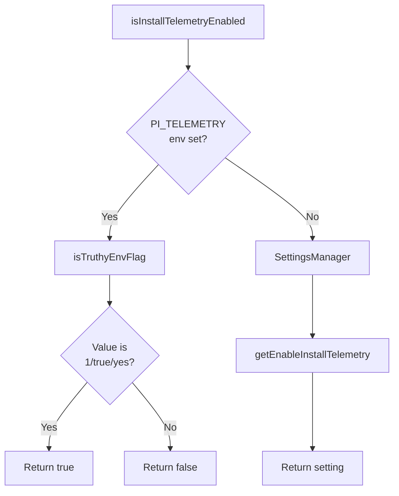
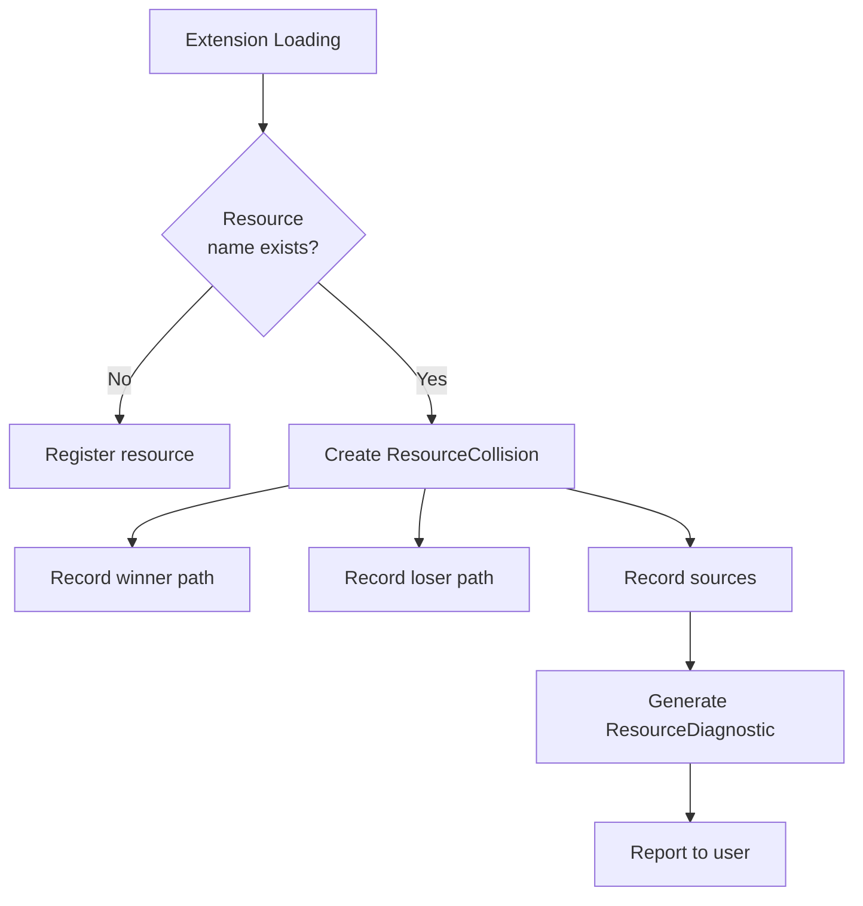
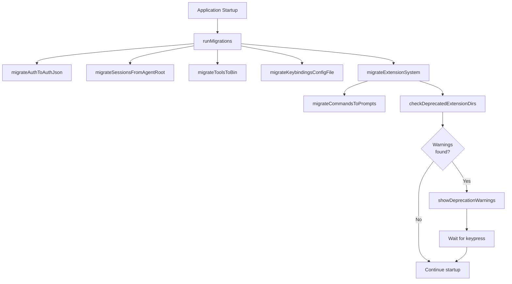
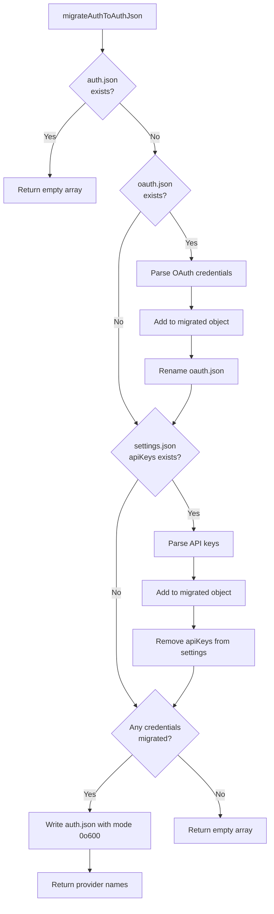
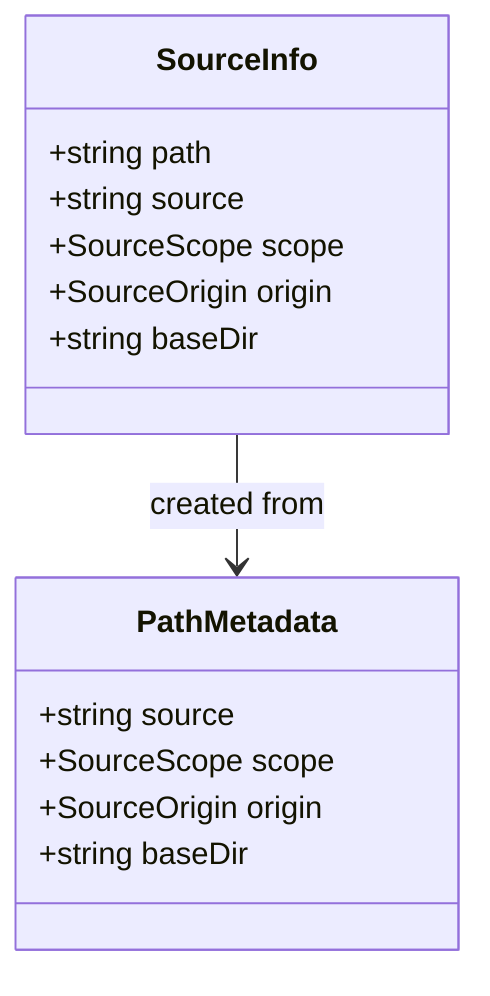

# Telemetry, Diagnostics & Migrations

The `pi-mono` coding agent includes a suite of utilities for observability, debugging, and automated data migration. These cross-cutting concerns ensure the system can be monitored for performance, diagnose resource conflicts, and seamlessly upgrade user data across versions. The telemetry system provides opt-in usage tracking, the diagnostics framework detects and reports extension resource collisions, the timing instrumentation profiles startup performance, and the migration system handles one-time data structure upgrades during application startup.

This page covers the telemetry configuration system, diagnostic types for resource conflicts, startup timing profiling, automatic migrations for authentication credentials and session files, and source metadata tracking for extensions.

---

## Telemetry System

The telemetry system provides opt-in installation and usage tracking, controlled by both environment variables and persistent settings. This allows the project maintainers to collect anonymous usage statistics while respecting user privacy preferences.

### Configuration

Telemetry can be enabled through two mechanisms:
1. **Environment Variable**: `PI_TELEMETRY` set to `1`, `true`, or `yes` (case-insensitive)
2. **Settings Manager**: Persistent configuration stored via `SettingsManager.getEnableInstallTelemetry()`

The environment variable takes precedence over the settings manager value, allowing users to override their persistent settings on a per-invocation basis.



### Implementation

| Function | Purpose | Return Type |
|----------|---------|-------------|
| `isTruthyEnvFlag` | Parses environment variable as boolean | `boolean` |
| `isInstallTelemetryEnabled` | Determines if telemetry is enabled | `boolean` |

The `isTruthyEnvFlag` helper accepts `"1"`, `"true"`, or `"yes"` (case-insensitive) as truthy values, returning `false` for all other inputs including undefined.

Sources: [telemetry.ts:1-16](../../../packages/coding-agent/src/core/telemetry.ts#L1-L16)

---

## Diagnostics Framework

The diagnostics system identifies and reports resource conflicts that occur when multiple extensions provide resources with the same name. This is critical for the extension system where skills, prompts, themes, and extensions themselves may collide across different sources (npm packages, git repositories, local directories).

### Resource Collision Detection



### Data Structures

**ResourceCollision Interface:**

| Field | Type | Description |
|-------|------|-------------|
| `resourceType` | `"extension" \| "skill" \| "prompt" \| "theme"` | Type of resource that collided |
| `name` | `string` | Name of the conflicting resource |
| `winnerPath` | `string` | File path of the resource that was loaded |
| `loserPath` | `string` | File path of the resource that was ignored |
| `winnerSource` | `string` (optional) | Source identifier (e.g., "npm:foo", "git:...") |
| `loserSource` | `string` (optional) | Source identifier of the ignored resource |

**ResourceDiagnostic Interface:**

| Field | Type | Description |
|-------|------|-------------|
| `type` | `"warning" \| "error" \| "collision"` | Severity level of the diagnostic |
| `message` | `string` | Human-readable diagnostic message |
| `path` | `string` (optional) | File path related to the diagnostic |
| `collision` | `ResourceCollision` (optional) | Detailed collision information |

Sources: [diagnostics.ts:1-17](../../../packages/coding-agent/src/core/diagnostics.ts#L1-L17)

---

## Startup Timing Instrumentation

The timing system provides performance profiling for application startup, helping developers identify bottlenecks in initialization sequences. It is enabled via the `PI_TIMING=1` environment variable and outputs detailed timing breakdowns to stderr.

### Usage Pattern

```typescript
// At application start
resetTimings();

// After each major initialization step
time("Load configuration");
time("Initialize extensions");
time("Connect to LLM");

// Before entering main loop
printTimings();
```

### API Reference

| Function | Purpose | Behavior when disabled |
|----------|---------|------------------------|
| `resetTimings()` | Clear timing data and reset baseline | No-op |
| `time(label: string)` | Record time since last checkpoint | No-op |
| `printTimings()` | Output timing report to stderr | No-op |

### Output Format

When enabled, `printTimings()` outputs a report showing the duration of each labeled segment plus a total:

```
--- Startup Timings ---
  Load configuration: 45ms
  Initialize extensions: 123ms
  Connect to LLM: 67ms
  TOTAL: 235ms
------------------------
```

Sources: [timings.ts:1-34](../../../packages/coding-agent/src/core/timings.ts#L1-L34)

---

## Migration System

The migration system performs one-time data structure upgrades on application startup, ensuring backward compatibility as the codebase evolves. Migrations are idempotent and safe to run multiple times.

### Migration Orchestration



### Authentication Migration

The `migrateAuthToAuthJson` function consolidates authentication credentials from two legacy locations into a unified `auth.json` file:

1. **OAuth credentials** from `oauth.json` (renamed to `oauth.json.migrated`)
2. **API keys** from `settings.json` `apiKeys` field (removed from settings)

**Migration Logic:**



The migration preserves credential types by wrapping OAuth credentials with `{ type: "oauth", ...cred }` and API keys with `{ type: "api_key", key }`. The resulting `auth.json` file is created with restrictive permissions (`0o600`) for security.

Sources: [migrations.ts:18-67](../../../packages/coding-agent/src/migrations.ts#L18-L67)

### Session File Migration

The `migrateSessionsFromAgentRoot` function fixes a bug from v0.30.0 where session files were incorrectly saved to `~/.pi/agent/*.jsonl` instead of the proper session directory structure `~/.pi/agent/sessions/<encoded-cwd>/`.

**Algorithm:**

1. Scan `~/.pi/agent/` for `.jsonl` files (excluding subdirectories)
2. For each file, read the first line to extract the session header
3. Parse the `cwd` field from the JSON header
4. Encode the `cwd` path: remove leading slash, replace path separators with dashes, wrap with `--`
5. Move the file to `~/.pi/agent/sessions/<encoded-cwd>/<filename>`

**Path Encoding Example:**
- Original cwd: `/home/user/projects/myapp`
- Encoded: `--home-user-projects-myapp--`

Sources: [migrations.ts:69-112](../../../packages/coding-agent/src/migrations.ts#L69-L112), [migrate-sessions.sh:1-93](../../../packages/coding-agent/scripts/migrate-sessions.sh#L1-L93)

### Binary Migration

The `migrateToolsToBin` function moves managed binaries (`fd`, `rg`, and their Windows equivalents) from the legacy `tools/` directory to the new `bin/` directory. This supports the architectural change where managed binaries are stored separately from user-provided tools.

Sources: [migrations.ts:134-167](../../../packages/coding-agent/src/migrations.ts#L134-L167)

### Extension System Migration

The extension system migration handles the renaming of `commands/` to `prompts/` and detects deprecated `hooks/` and `tools/` directories. This migration runs for both global (`~/.pi/agent/`) and project-local (`.pi/`) configurations.

**Deprecated Directory Detection:**

| Directory | Deprecation Reason |
|-----------|-------------------|
| `hooks/` | Renamed to `extensions/` |
| `tools/` | Custom tools merged into `extensions/` (managed binaries excluded) |

The migration automatically renames `commands/` directories but only warns about `hooks/` and `tools/`, requiring manual user intervention. When deprecated directories are found, the system displays warnings with migration guide links and waits for user acknowledgment.

Sources: [migrations.ts:114-132](../../../packages/coding-agent/src/migrations.ts#L114-L132), [migrations.ts:169-195](../../../packages/coding-agent/src/migrations.ts#L169-L195), [migrations.ts:197-224](../../../packages/coding-agent/src/migrations.ts#L197-L224)

### Keybindings Migration

The `migrateKeybindingsConfigFile` function updates the keybindings configuration format by delegating to `migrateKeybindingsConfig`. If the configuration is successfully migrated, it is written back to disk with proper formatting.

Sources: [migrations.ts:197-210](../../../packages/coding-agent/src/migrations.ts#L197-L210)

### Migration Entry Point

The `runMigrations` function serves as the main entry point, executing all migrations in sequence and collecting results:

```typescript
interface MigrationResults {
  migratedAuthProviders: string[];  // List of auth providers migrated
  deprecationWarnings: string[];    // Warnings about deprecated directories
}
```

This function is called once during application startup, typically before initializing the main application components.

Sources: [migrations.ts:226-242](../../../packages/coding-agent/src/migrations.ts#L226-L242)

---

## Source Metadata Tracking

The source information system tracks the origin and scope of loaded extensions, providing context for diagnostics and collision resolution. This metadata helps users understand where resources came from and why certain resources were chosen over others during conflicts.

### Data Model



**SourceScope Type:**
- `"user"`: Global user configuration (`~/.pi/agent/`)
- `"project"`: Project-local configuration (`.pi/`)
- `"temporary"`: Ephemeral or runtime-created resources

**SourceOrigin Type:**
- `"package"`: Loaded from an npm package, git repository, or archive
- `"top-level"`: Loaded from a top-level directory

### Factory Functions

| Function | Purpose |
|----------|---------|
| `createSourceInfo` | Create source info from path and package metadata |
| `createSyntheticSourceInfo` | Create source info for non-package resources with defaults |

The `createSyntheticSourceInfo` function provides default values (`scope: "temporary"`, `origin: "top-level"`) for resources that don't come from the package manager, such as built-in resources or dynamically generated content.

Sources: [source-info.ts:1-34](../../../packages/coding-agent/src/core/source-info.ts#L1-L34)

---

## Summary

The utilities covered in this page provide essential infrastructure for observability and data management in the pi-mono coding agent. The telemetry system enables opt-in usage tracking, diagnostics help identify resource conflicts in the extension system, timing instrumentation profiles startup performance, and the migration framework ensures smooth upgrades across versions. Together, these systems maintain data integrity, provide visibility into system behavior, and support long-term maintainability of the codebase.