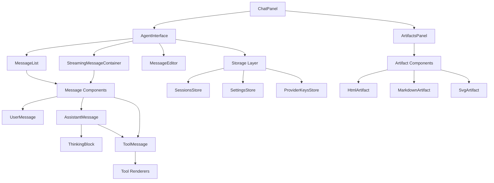
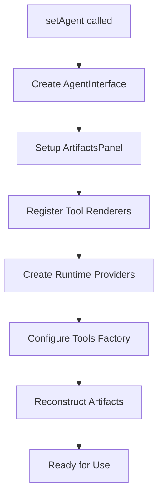
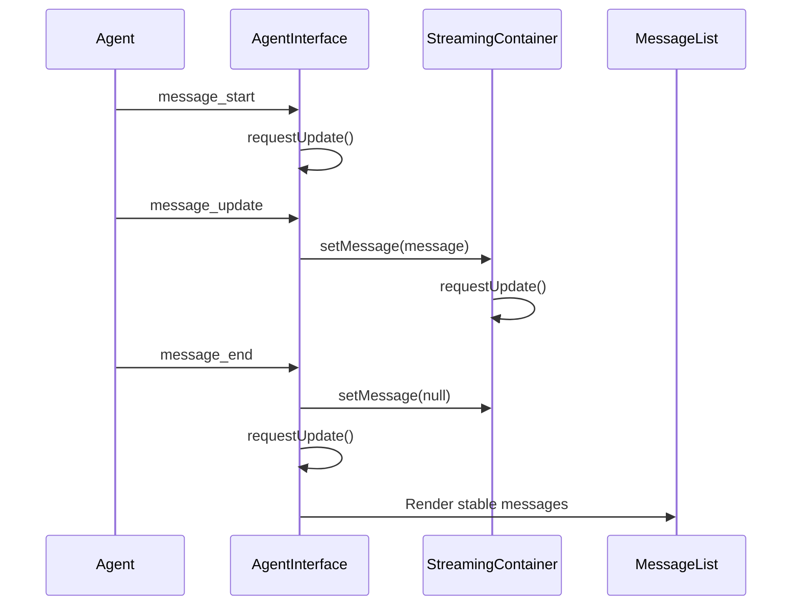
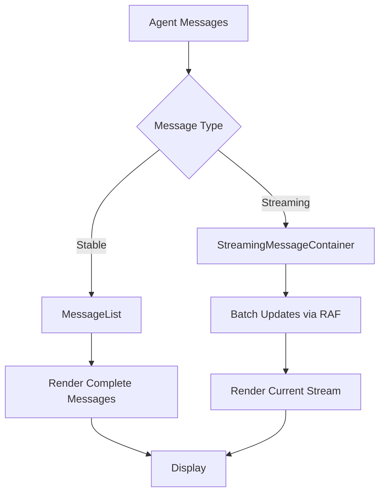
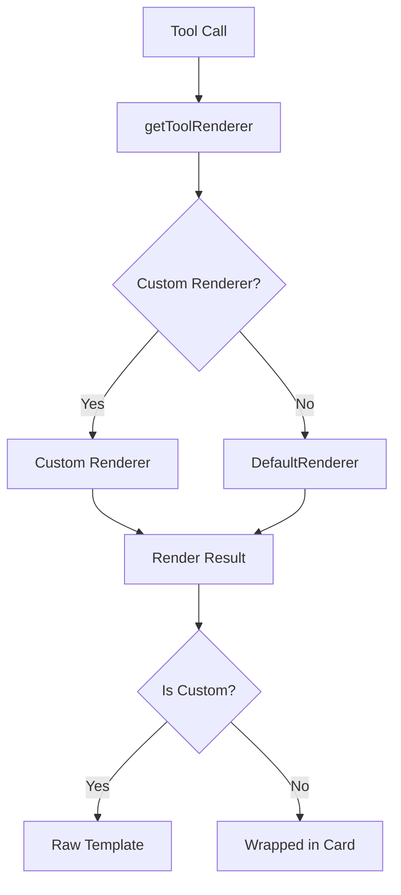
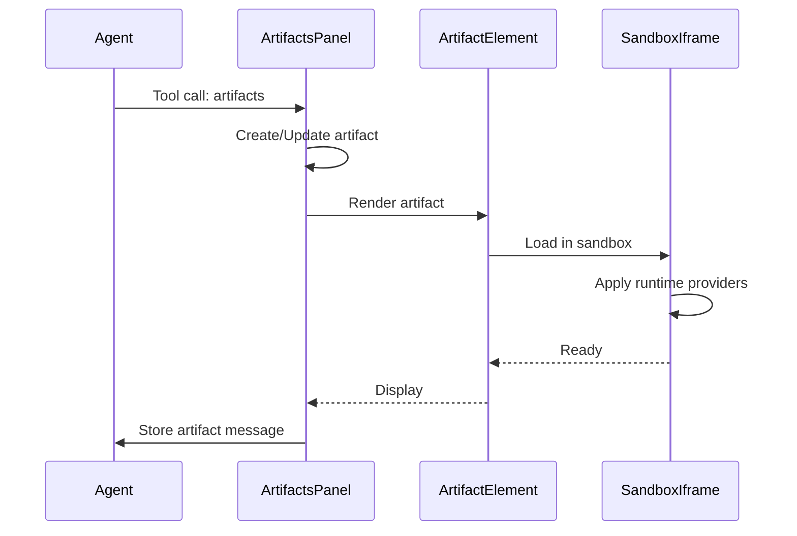
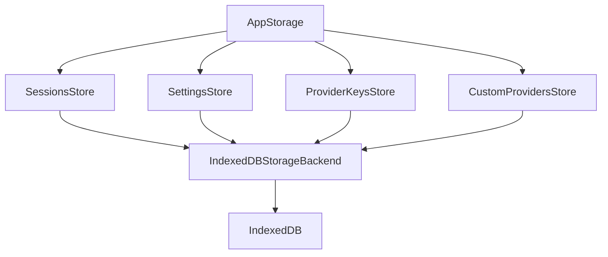
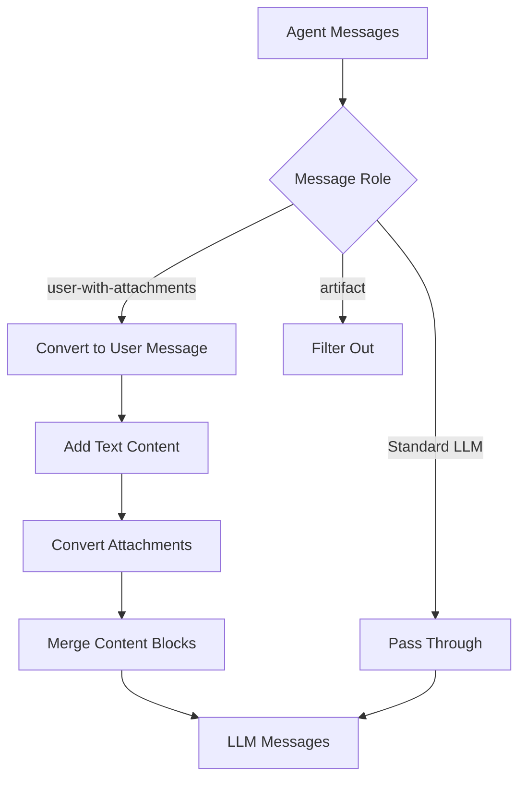

# Web UI Overview & Component Architecture

The `@mariozechner/pi-web-ui` package provides a comprehensive set of reusable web components for building AI chat interfaces powered by the `@mariozechner/pi-ai` library. Built on Lit and mini-lit, this package offers a modular, extensible architecture that supports multi-provider LLM interactions, file attachments, code execution sandboxes, and artifact management. The Web UI serves as both a standalone interface and a library of components that can be integrated into larger applications, providing features like session management, persistent storage, customizable message rendering, and tool execution visualization.

Sources: [packages/web-ui/package.json:1-46](../../../packages/web-ui/package.json#L1-L46), [packages/web-ui/src/index.ts:1-3](../../../packages/web-ui/src/index.ts#L1-L3)

## Architecture Overview

The Web UI follows a layered component architecture with clear separation of concerns:



The architecture is composed of three primary layers:

1. **Top-level containers**: `ChatPanel` orchestrates the overall chat experience
2. **Core interface components**: `AgentInterface`, `MessageList`, `MessageEditor` handle chat interactions
3. **Specialized components**: Message renderers, tool visualizers, and artifact viewers

Sources: [packages/web-ui/src/ChatPanel.ts:1-170](../../../packages/web-ui/src/ChatPanel.ts#L1-L170), [packages/web-ui/src/components/AgentInterface.ts:1-238](../../../packages/web-ui/src/components/AgentInterface.ts#L1-L238)

## Core Components

### ChatPanel

The `ChatPanel` is the highest-level component that combines the chat interface with the artifacts panel in a responsive layout. It manages the relationship between the agent, the UI, and artifact visualization.

| Property | Type | Description |
|----------|------|-------------|
| `agent` | `Agent` | The AI agent instance managing conversation state |
| `agentInterface` | `AgentInterface` | The main chat interface component |
| `artifactsPanel` | `ArtifactsPanel` | Panel for displaying generated artifacts |
| `hasArtifacts` | `boolean` | Whether artifacts exist in the session |
| `showArtifactsPanel` | `boolean` | Controls panel visibility |
| `windowWidth` | `number` | Current window width for responsive layout |

The ChatPanel implements a responsive breakpoint system at 800px, switching between side-by-side and overlay modes:

```typescript
const BREAKPOINT = 800; // px - switch between overlay and side-by-side
```

Sources: [packages/web-ui/src/ChatPanel.ts:14-20](../../../packages/web-ui/src/ChatPanel.ts#L14-L20), [packages/web-ui/src/ChatPanel.ts:22](../../../packages/web-ui/src/ChatPanel.ts#L22)

#### ChatPanel Configuration

The `setAgent` method configures the ChatPanel with extensive customization options:



Configuration options include:

- `onApiKeyRequired`: Callback for handling missing API keys
- `onBeforeSend`: Hook executed before sending messages
- `onCostClick`: Handler for cost display interactions
- `onModelSelect`: Custom model selection behavior
- `sandboxUrlProvider`: Custom sandbox URL provider for artifacts
- `toolsFactory`: Factory function for creating custom agent tools

Sources: [packages/web-ui/src/ChatPanel.ts:43-109](../../../packages/web-ui/src/ChatPanel.ts#L43-L109)

### AgentInterface

The `AgentInterface` is the primary chat component that manages message display, user input, and agent interactions. It provides a complete chat experience with streaming support, attachment handling, and model selection.

| Feature | Property | Default | Description |
|---------|----------|---------|-------------|
| Attachments | `enableAttachments` | `true` | Enable file attachment support |
| Model Selection | `enableModelSelector` | `true` | Show model selector button |
| Thinking Display | `enableThinkingSelector` | `true` | Enable thinking level controls |
| Theme Toggle | `showThemeToggle` | `false` | Display theme switcher |

The component implements an intelligent auto-scroll system that detects user scrolling behavior:

```typescript
private _handleScroll = (_ev: any) => {
    const currentScrollTop = this._scrollContainer.scrollTop;
    const scrollHeight = this._scrollContainer.scrollHeight;
    const clientHeight = this._scrollContainer.clientHeight;
    const distanceFromBottom = scrollHeight - currentScrollTop - clientHeight;

    // Only disable auto-scroll if user scrolled UP or is far from bottom
    if (currentScrollTop !== 0 && currentScrollTop < this._lastScrollTop && distanceFromBottom > 50) {
        this._autoScroll = false;
    } else if (distanceFromBottom < 10) {
        this._autoScroll = true;
    }
};
```

Sources: [packages/web-ui/src/components/AgentInterface.ts:17-25](../../../packages/web-ui/src/components/AgentInterface.ts#L17-L25), [packages/web-ui/src/components/AgentInterface.ts:72-89](../../../packages/web-ui/src/components/AgentInterface.ts#L72-L89)

#### Agent Event Handling

The AgentInterface subscribes to agent events for reactive updates:



Sources: [packages/web-ui/src/components/AgentInterface.ts:108-145](../../../packages/web-ui/src/components/AgentInterface.ts#L108-L145)

### Message Components

The Web UI provides specialized components for rendering different message types:

#### Message Component Hierarchy

| Component | Role | Purpose |
|-----------|------|---------|
| `UserMessage` | `user`, `user-with-attachments` | Displays user messages with optional attachments |
| `AssistantMessage` | `assistant` | Renders AI responses with thinking, text, and tool calls |
| `ToolMessage` | Tool execution | Visualizes tool calls and results |
| `AbortedMessage` | Aborted requests | Shows cancellation status |

Sources: [packages/web-ui/src/components/Messages.ts:32-49](../../../packages/web-ui/src/components/Messages.ts#L32-L49)

#### UserMessage Component

The `UserMessage` component handles both simple text messages and messages with attachments:

```typescript
export type UserMessageWithAttachments = {
    role: "user-with-attachments";
    content: string | (TextContent | ImageContent)[];
    timestamp: number;
    attachments?: Attachment[];
};
```

Sources: [packages/web-ui/src/components/Messages.ts:20-26](../../../packages/web-ui/src/components/Messages.ts#L20-L26)

#### AssistantMessage Component

The `AssistantMessage` component renders content in the order it appears, supporting multiple content types:

- Text blocks (rendered as markdown)
- Thinking blocks (collapsible reasoning display)
- Tool calls (with inline results)

```typescript
for (const chunk of this.message.content) {
    if (chunk.type === "text" && chunk.text.trim() !== "") {
        orderedParts.push(html`<markdown-block .content=${chunk.text}></markdown-block>`);
    } else if (chunk.type === "thinking" && chunk.thinking.trim() !== "") {
        orderedParts.push(html`<thinking-block .content=${chunk.thinking} .isStreaming=${this.isStreaming}></thinking-block>`);
    } else if (chunk.type === "toolCall") {
        // Render tool call with result
    }
}
```

Sources: [packages/web-ui/src/components/Messages.ts:96-130](../../../packages/web-ui/src/components/Messages.ts#L96-L130)

### MessageList and Streaming

The message rendering system uses two complementary components to optimize performance:



#### MessageList

The `MessageList` component renders stable, completed messages using Lit's `repeat` directive for efficient updates:

```typescript
private buildRenderItems() {
    const resultByCallId = new Map<string, ToolResultMessageType>();
    for (const message of this.messages) {
        if (message.role === "toolResult") {
            resultByCallId.set(message.toolCallId, message);
        }
    }
    // Build render items, pairing tool calls with results
}
```

Sources: [packages/web-ui/src/components/MessageList.ts:25-66](../../../packages/web-ui/src/components/MessageList.ts#L25-L66)

#### StreamingMessageContainer

The `StreamingMessageContainer` optimizes performance during streaming by batching updates using `requestAnimationFrame`:

```typescript
public setMessage(message: AgentMessage | null, immediate = false) {
    this._pendingMessage = message;

    if (immediate || message === null) {
        this._immediateUpdate = true;
        this._message = message;
        this.requestUpdate();
        return;
    }

    if (!this._updateScheduled) {
        this._updateScheduled = true;
        requestAnimationFrame(async () => {
            if (!this._immediateUpdate && this._pendingMessage !== null) {
                // Deep clone to ensure Lit detects nested changes
                this._message = JSON.parse(JSON.stringify(this._pendingMessage));
                this.requestUpdate();
            }
            this._pendingMessage = null;
            this._updateScheduled = false;
            this._immediateUpdate = false;
        });
    }
}
```

Sources: [packages/web-ui/src/components/StreamingMessageContainer.ts:28-54](../../../packages/web-ui/src/components/StreamingMessageContainer.ts#L28-L54)

## Tool System

The Web UI provides an extensible tool rendering system that allows custom visualization of tool executions:

### Tool Renderer Registry



The registry allows registration of custom tool renderers:

```typescript
export { getToolRenderer, registerToolRenderer, renderTool, setShowJsonMode } from "./tools/index.js";
```

Built-in renderers include:

- `BashRenderer`: For shell command execution
- `CalculateRenderer`: For mathematical calculations
- `GetCurrentTimeRenderer`: For time queries
- `ArtifactsToolRenderer`: For artifact creation/updates
- `DefaultRenderer`: Fallback for unregistered tools

Sources: [packages/web-ui/src/index.ts:84-88](../../../packages/web-ui/src/index.ts#L84-L88)

### Tool Message Rendering

The `ToolMessage` component delegates rendering to the tool renderer registry:

```typescript
override render() {
    const toolName = this.tool?.name || this.toolCall.name;
    
    const result: ToolResultMessageType<any> | undefined = this.aborted
        ? {
            role: "toolResult",
            isError: true,
            content: [],
            toolCallId: this.toolCall.id,
            toolName: this.toolCall.name,
            timestamp: Date.now(),
        }
        : this.result;
    
    const renderResult = renderTool(toolName, this.toolCall.arguments, result, 
        !this.aborted && (this.isStreaming || this.pending));

    if (renderResult.isCustom) {
        return renderResult.content;
    }

    return html`<div class="p-2.5 border border-border rounded-md">${renderResult.content}</div>`;
}
```

Sources: [packages/web-ui/src/components/Messages.ts:218-246](../../../packages/web-ui/src/components/Messages.ts#L218-L246)

## Artifacts System

The artifacts system enables the AI to create, update, and manage various types of content artifacts (HTML, SVG, Markdown, images, text) with sandboxed execution:

### Artifact Types

| Type | Component | Capabilities |
|------|-----------|--------------|
| HTML | `HtmlArtifact` | Interactive HTML with sandboxed JavaScript |
| SVG | `SvgArtifact` | Scalable vector graphics |
| Markdown | `MarkdownArtifact` | Rendered markdown content |
| Image | `ImageArtifact` | Base64 or URL images |
| Text | `TextArtifact` | Plain text display |

Sources: [packages/web-ui/src/index.ts:90-95](../../../packages/web-ui/src/index.ts#L90-L95)

### Artifact Lifecycle



The `ArtifactsPanel` manages the artifact lifecycle:

```typescript
this.artifactsPanel.onArtifactsChange = () => {
    const count = this.artifactsPanel?.artifacts?.size ?? 0;
    const created = count > this.artifactCount;
    this.hasArtifacts = count > 0;
    this.artifactCount = count;
    if (this.hasArtifacts && created) {
        this.showArtifactsPanel = true;
    }
    this.requestUpdate();
};
```

Sources: [packages/web-ui/src/ChatPanel.ts:85-94](../../../packages/web-ui/src/ChatPanel.ts#L85-L94)

### Sandbox Runtime Providers

The sandbox system uses runtime providers to inject functionality into sandboxed artifacts:

```typescript
const runtimeProvidersFactory = () => {
    const attachments: Attachment[] = [];
    for (const message of this.agent!.state.messages) {
        if (message.role === "user-with-attachments") {
            message.attachments?.forEach((a) => {
                attachments.push(a);
            });
        }
    }
    const providers: SandboxRuntimeProvider[] = [];

    if (attachments.length > 0) {
        providers.push(new AttachmentsRuntimeProvider(attachments));
    }

    providers.push(new ArtifactsRuntimeProvider(this.artifactsPanel!, this.agent!, true));

    return providers;
};
```

Available runtime providers:

- `ArtifactsRuntimeProvider`: Read/write access to artifacts
- `AttachmentsRuntimeProvider`: Access to session attachments
- `ConsoleRuntimeProvider`: Console output capture
- `FileDownloadRuntimeProvider`: File download capabilities

Sources: [packages/web-ui/src/ChatPanel.ts:61-82](../../../packages/web-ui/src/ChatPanel.ts#L61-L82), [packages/web-ui/src/index.ts:44-53](../../../packages/web-ui/src/index.ts#L44-L53)

## Storage Layer

The Web UI includes a comprehensive storage system built on IndexedDB for persistent data management:

### Storage Architecture



### Storage Stores

| Store | Purpose | Key Data |
|-------|---------|----------|
| `SessionsStore` | Chat session persistence | Messages, metadata, agent state |
| `SettingsStore` | Application settings | Proxy config, UI preferences |
| `ProviderKeysStore` | API key management | Provider credentials |
| `CustomProvidersStore` | Custom LLM providers | Provider configurations |

Sources: [packages/web-ui/src/index.ts:102-119](../../../packages/web-ui/src/index.ts#L102-L119)

### Session Data Structure

```typescript
export type SessionData = {
    messages: AgentMessage[];
    model?: Model;
    tools?: AgentTool[];
    thinkingLevel?: ThinkingLevel;
    // Additional session state
};

export type SessionMetadata = {
    id: string;
    title: string;
    createdAt: number;
    updatedAt: number;
    // Additional metadata
};
```

Sources: [packages/web-ui/src/storage/types.ts](../../../packages/web-ui/src/storage/types.ts)

## Message Transformation

The Web UI provides a default message transformation pipeline for converting UI-specific message types to LLM-compatible formats:

### Attachment Conversion

```typescript
export function convertAttachments(attachments: Attachment[]): (TextContent | ImageContent)[] {
    const content: (TextContent | ImageContent)[] = [];
    for (const attachment of attachments) {
        if (attachment.type === "image") {
            content.push({
                type: "image",
                data: attachment.content,
                mimeType: attachment.mimeType,
            } as ImageContent);
        } else if (attachment.type === "document" && attachment.extractedText) {
            content.push({
                type: "text",
                text: `\n\n[Document: ${attachment.fileName}]\n${attachment.extractedText}`,
            } as TextContent);
        }
    }
    return content;
}
```

Sources: [packages/web-ui/src/components/Messages.ts:268-286](../../../packages/web-ui/src/components/Messages.ts#L268-L286)

### Default Converter

The `defaultConvertToLlm` function handles the transformation pipeline:



This converter:
- Transforms `user-with-attachments` messages into standard `user` messages with content blocks
- Filters out `artifact` messages (used only for session reconstruction)
- Passes through standard LLM messages unchanged

Sources: [packages/web-ui/src/components/Messages.ts:304-336](../../../packages/web-ui/src/components/Messages.ts#L304-L336)

## Extensibility

The Web UI is designed for extensibility through several mechanisms:

### Custom Message Renderers

Register custom renderers for specific message types:

```typescript
export {
    getMessageRenderer,
    type MessageRenderer,
    type MessageRole,
    registerMessageRenderer,
    renderMessage,
} from "./components/message-renderer-registry.js";
```

Sources: [packages/web-ui/src/index.ts:21-27](../../../packages/web-ui/src/index.ts#L21-L27)

### Custom Tool Renderers

Register custom visualizations for tool executions:

```typescript
registerToolRenderer("my-tool", new MyCustomRenderer());
```

### Dialogs and UI Components

The package exports various dialogs and UI components for integration:

- `ModelSelector`: Model selection dialog
- `SettingsDialog`: Application settings with tabs
- `SessionListDialog`: Session management
- `AttachmentOverlay`: File attachment preview
- `ApiKeyPromptDialog`: API key input

Sources: [packages/web-ui/src/index.ts:56-63](../../../packages/web-ui/src/index.ts#L56-L63)

## Summary

The `@mariozechner/pi-web-ui` package provides a comprehensive, modular architecture for building AI chat interfaces. Its component-based design separates concerns between message rendering, streaming optimization, tool visualization, and artifact management. The storage layer ensures persistence across sessions, while the extensibility mechanisms allow customization of message rendering, tool visualization, and UI behavior. The package's integration with the `@mariozechner/pi-ai` library and support for multiple LLM providers makes it a flexible foundation for AI-powered web applications.

Sources: [packages/web-ui/package.json:1-46](../../../packages/web-ui/package.json#L1-L46), [packages/web-ui/src/index.ts:1-124](../../../packages/web-ui/src/index.ts#L1-L124)