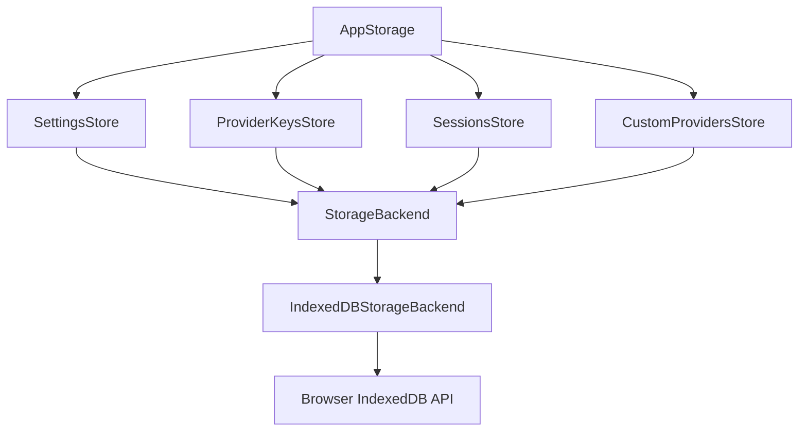
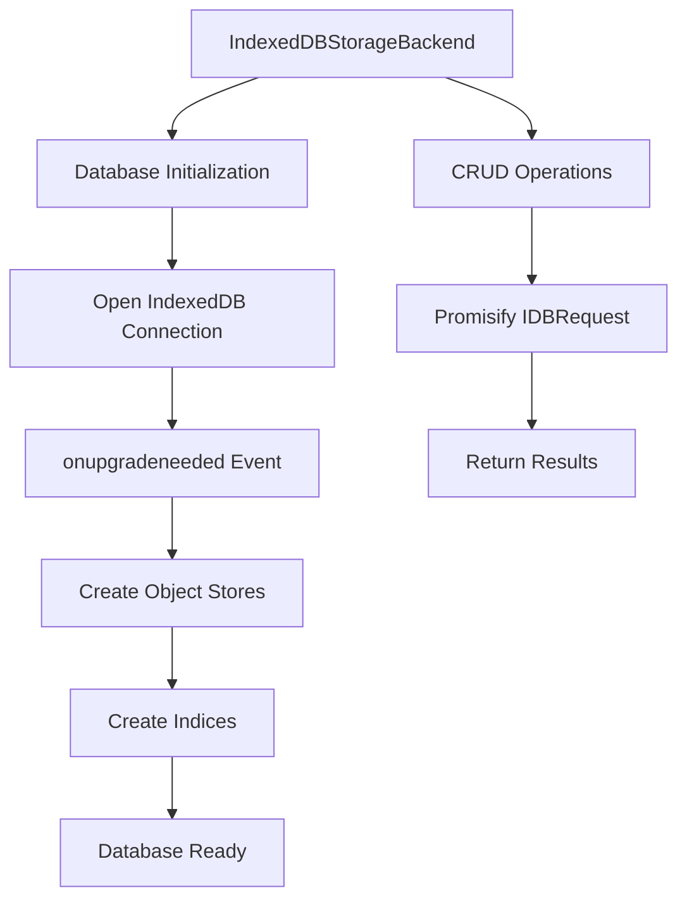
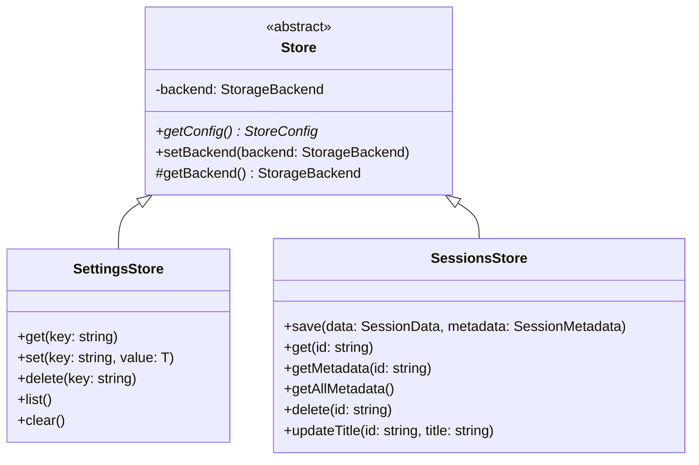
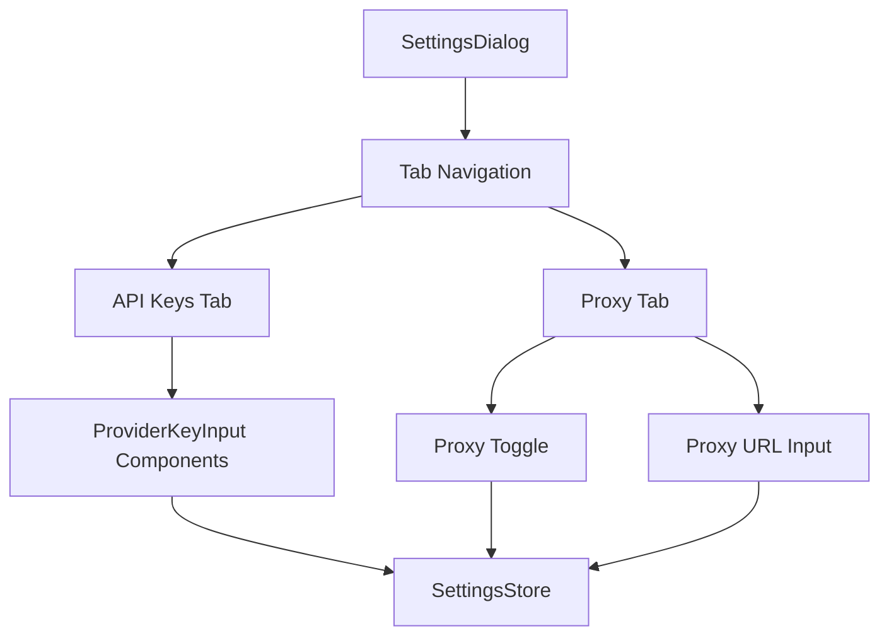
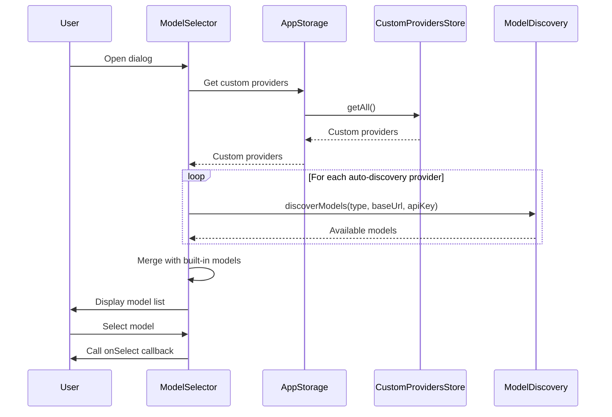

# Web UI Storage, Settings & Dialogs

The Web UI Storage, Settings & Dialogs subsystem provides a comprehensive client-side data persistence layer, user settings management, and configuration dialogs for the pi-mono web application. This system implements a multi-store IndexedDB architecture with a clean abstraction layer, allowing the web UI to store sessions, provider API keys, custom provider configurations, and application settings entirely in the browser. The architecture supports atomic transactions, quota management, and persistence requests, while providing dialog components for configuring API keys, proxy settings, and model selection. The storage layer is designed to be extensible, with a backend abstraction that could support alternative storage implementations beyond IndexedDB.

Sources: [packages/web-ui/src/storage/app-storage.ts:1-55](../../../packages/web-ui/src/storage/app-storage.ts#L1-L55), [packages/web-ui/src/storage/types.ts:1-100](../../../packages/web-ui/src/storage/types.ts#L1-L100)

## Architecture Overview

The storage architecture follows a layered design pattern with clear separation of concerns:



**AppStorage** serves as the high-level API entry point, providing access to all domain-specific stores. Each store (SettingsStore, ProviderKeysStore, SessionsStore, CustomProvidersStore) extends the base **Store** class and defines its own IndexedDB schema configuration. The **StorageBackend** interface abstracts the underlying storage mechanism, with **IndexedDBStorageBackend** providing the concrete IndexedDB implementation. This architecture enables potential future support for alternative backends such as remote APIs or different browser storage mechanisms.

Sources: [packages/web-ui/src/storage/app-storage.ts:8-30](../../../packages/web-ui/src/storage/app-storage.ts#L8-L30), [packages/web-ui/src/storage/store.ts:1-35](../../../packages/web-ui/src/storage/store.ts#L1-L35)

### Storage Backend Interface

The `StorageBackend` interface defines a multi-store key-value storage abstraction with the following core capabilities:

| Method | Description | Parameters |
|--------|-------------|------------|
| `get<T>` | Retrieve a value by key from a specific store | `storeName: string, key: string` |
| `set<T>` | Store a value for a key in a specific store | `storeName: string, key: string, value: T` |
| `delete` | Remove a key from a specific store | `storeName: string, key: string` |
| `keys` | List all keys from a store, optionally filtered by prefix | `storeName: string, prefix?: string` |
| `getAllFromIndex<T>` | Retrieve all values ordered by an index | `storeName: string, indexName: string, direction?: "asc" \| "desc"` |
| `clear` | Remove all data from a specific store | `storeName: string` |
| `has` | Check if a key exists in a store | `storeName: string, key: string` |
| `transaction<T>` | Execute atomic operations across multiple stores | `storeNames: string[], mode: "readonly" \| "readwrite", operation: (tx: StorageTransaction) => Promise<T>` |
| `getQuotaInfo` | Get storage quota information | None |
| `requestPersistence` | Request persistent storage to prevent eviction | None |

Sources: [packages/web-ui/src/storage/types.ts:22-74](../../../packages/web-ui/src/storage/types.ts#L22-L74)

## IndexedDB Implementation

The `IndexedDBStorageBackend` class implements the `StorageBackend` interface using the browser's IndexedDB API. It handles database initialization, schema creation, and all CRUD operations.



The backend initializes the database on first access, creating object stores and indices based on the provided configuration. Each store can have an optional `keyPath` for in-line keys (where the key is extracted from the stored object) or use out-of-line keys (where keys are provided separately). Indices enable efficient querying and sorting, such as retrieving sessions ordered by last modification time.

Sources: [packages/web-ui/src/storage/backends/indexeddb-storage-backend.ts:1-150](../../../packages/web-ui/src/storage/backends/indexeddb-storage-backend.ts#L1-L150)

### Transaction Support

The backend provides atomic transaction support across multiple stores, ensuring data consistency during complex operations:

```typescript
async transaction<T>(
    storeNames: string[],
    mode: "readonly" | "readwrite",
    operation: (tx: StorageTransaction) => Promise<T>
): Promise<T>
```

The transaction method creates an IndexedDB transaction spanning the specified stores and provides a `StorageTransaction` interface with `get`, `set`, and `delete` methods. This enables operations like saving a session and its metadata atomically, preventing partial writes if an error occurs.

Sources: [packages/web-ui/src/storage/backends/indexeddb-storage-backend.ts:100-130](../../../packages/web-ui/src/storage/backends/indexeddb-storage-backend.ts#L100-L130), [packages/web-ui/src/storage/types.ts:5-20](../../../packages/web-ui/src/storage/types.ts#L5-L20)

### Quota Management

The backend exposes storage quota information and persistence request capabilities:

```typescript
async getQuotaInfo(): Promise<{ usage: number; quota: number; percent: number }> {
    if (navigator.storage?.estimate) {
        const estimate = await navigator.storage.estimate();
        return {
            usage: estimate.usage || 0,
            quota: estimate.quota || 0,
            percent: estimate.quota ? ((estimate.usage || 0) / estimate.quota) * 100 : 0,
        };
    }
    return { usage: 0, quota: 0, percent: 0 };
}

async requestPersistence(): Promise<boolean> {
    if (navigator.storage?.persist) {
        return await navigator.storage.persist();
    }
    return false;
}
```

These methods allow the UI to warn users when approaching storage limits and request persistent storage to prevent browser eviction of data during storage pressure.

Sources: [packages/web-ui/src/storage/backends/indexeddb-storage-backend.ts:132-150](../../../packages/web-ui/src/storage/backends/indexeddb-storage-backend.ts#L132-L150)

## Domain-Specific Stores

Each store extends the base `Store` class and provides domain-specific methods for its data type. Stores define their IndexedDB schema through the `getConfig()` method.

### Base Store Class



The base `Store` class manages the backend reference and enforces that subclasses define their schema configuration. Concrete stores use `getBackend()` to access the storage backend for their operations.

Sources: [packages/web-ui/src/storage/store.ts:1-35](../../../packages/web-ui/src/storage/store.ts#L1-L35)

### SettingsStore

The `SettingsStore` provides simple key-value storage for application settings such as theme preferences and proxy configuration. It uses out-of-line keys (no keyPath), allowing arbitrary string keys:

```typescript
getConfig(): StoreConfig {
    return {
        name: "settings",
        // No keyPath - uses out-of-line keys
    };
}
```

The store provides basic CRUD operations: `get<T>(key)`, `set<T>(key, value)`, `delete(key)`, `list()` (returns all keys), and `clear()` (removes all settings).

Sources: [packages/web-ui/src/storage/stores/settings-store.ts:1-30](../../../packages/web-ui/src/storage/stores/settings-store.ts#L1-L30)

### SessionsStore

The `SessionsStore` manages chat sessions using a dual-store approach for performance optimization:

1. **sessions** store: Contains full `SessionData` with complete message history
2. **sessions-metadata** store: Contains lightweight `SessionMetadata` for listing and searching

Both stores use `id` as the keyPath (in-line key) and have a `lastModified` index for chronological sorting:

```typescript
getConfig(): StoreConfig {
    return {
        name: "sessions",
        keyPath: "id",
        indices: [{ name: "lastModified", keyPath: "lastModified" }],
    };
}

static getMetadataConfig(): StoreConfig {
    return {
        name: "sessions-metadata",
        keyPath: "id",
        indices: [{ name: "lastModified", keyPath: "lastModified" }],
    };
}
```

This separation allows the UI to quickly load and display a list of sessions without fetching full message histories. The full session data is only loaded when a user opens a specific session.

Sources: [packages/web-ui/src/storage/stores/sessions-store.ts:1-120](../../../packages/web-ui/src/storage/stores/sessions-store.ts#L1-L120)

#### Session Data Models

The `SessionMetadata` type contains lightweight information for listing:

| Field | Type | Description |
|-------|------|-------------|
| `id` | `string` | Unique session identifier (UUID v4) |
| `title` | `string` | User-defined title or auto-generated from first message |
| `createdAt` | `string` | ISO 8601 UTC timestamp of creation |
| `lastModified` | `string` | ISO 8601 UTC timestamp of last modification |
| `messageCount` | `number` | Total number of messages (user + assistant + tool results) |
| `usage` | `object` | Cumulative token usage and cost statistics |
| `thinkingLevel` | `ThinkingLevel` | Last used thinking level |
| `preview` | `string` | First 2KB of conversation text for search and display |

The `SessionData` type contains the complete session:

| Field | Type | Description |
|-------|------|-------------|
| `id` | `string` | Unique session identifier (UUID v4) |
| `title` | `string` | User-defined title or auto-generated |
| `model` | `Model<any>` | Last selected model |
| `thinkingLevel` | `ThinkingLevel` | Last selected thinking level |
| `messages` | `AgentMessage[]` | Full conversation history with attachments inline |
| `createdAt` | `string` | ISO 8601 UTC timestamp of creation |
| `lastModified` | `string` | ISO 8601 UTC timestamp of last modification |

Sources: [packages/web-ui/src/storage/types.ts:76-130](../../../packages/web-ui/src/storage/types.ts#L76-L130)

#### Session Operations

The `SessionsStore` provides atomic save operations using transactions:

```typescript
async save(data: SessionData, metadata: SessionMetadata): Promise<void> {
    await this.getBackend().transaction(["sessions", "sessions-metadata"], "readwrite", async (tx) => {
        await tx.set("sessions", data.id, data);
        await tx.set("sessions-metadata", metadata.id, metadata);
    });
}
```

This ensures that both the full session data and metadata are saved together, maintaining consistency. The store also provides methods for retrieving all metadata sorted by last modification (most recent first) using the `lastModified` index.

Sources: [packages/web-ui/src/storage/stores/sessions-store.ts:30-40](../../../packages/web-ui/src/storage/stores/sessions-store.ts#L30-L40), [packages/web-ui/src/storage/stores/sessions-store.ts:50-60](../../../packages/web-ui/src/storage/stores/sessions-store.ts#L50-L60)

## Global Storage Instance

The `AppStorage` class provides a global singleton pattern for accessing storage throughout the application:

```typescript
let globalAppStorage: AppStorage | null = null;

export function getAppStorage(): AppStorage {
    if (!globalAppStorage) {
        throw new Error("AppStorage not initialized. Call setAppStorage() first.");
    }
    return globalAppStorage;
}

export function setAppStorage(storage: AppStorage): void {
    globalAppStorage = storage;
}
```

This pattern ensures a single storage instance is initialized at application startup and accessible from any component without prop drilling. Components call `getAppStorage()` to access stores, and the initialization code calls `setAppStorage()` during bootstrap.

Sources: [packages/web-ui/src/storage/app-storage.ts:35-55](../../../packages/web-ui/src/storage/app-storage.ts#L35-L55)

## Settings Dialog

The `SettingsDialog` component provides a tabbed interface for configuring application settings. It uses a flexible tab system where each tab extends the `SettingsTab` base class:



The dialog supports both desktop (sidebar) and mobile (horizontal tabs) layouts, automatically adapting based on screen size using Tailwind CSS responsive classes.

Sources: [packages/web-ui/src/dialogs/SettingsDialog.ts:1-150](../../../packages/web-ui/src/dialogs/SettingsDialog.ts#L1-L150)

### API Keys Tab

The `ApiKeysTab` renders a `ProviderKeyInput` component for each registered LLM provider:

```typescript
render(): TemplateResult {
    const providers = getProviders();

    return html`
        <div class="flex flex-col gap-6">
            <p class="text-sm text-muted-foreground">
                ${i18n("Configure API keys for LLM providers. Keys are stored locally in your browser.")}
            </p>
            ${providers.map((provider) => html`<provider-key-input .provider=${provider}></provider-key-input>`)}
        </div>
    `;
}
```

Each `ProviderKeyInput` component handles loading, saving, and validating API keys for its provider, storing them in the `ProviderKeysStore`.

Sources: [packages/web-ui/src/dialogs/SettingsDialog.ts:20-35](../../../packages/web-ui/src/dialogs/SettingsDialog.ts#L20-L35)

### Proxy Tab

The `ProxyTab` manages CORS proxy configuration, which is required for certain providers (Z-AI, Anthropic OAuth, OpenAI Codex) that don't support CORS in browser environments:

```typescript
@state() private proxyEnabled = false;
@state() private proxyUrl = "http://localhost:3001";

override async connectedCallback() {
    super.connectedCallback();
    const storage = getAppStorage();
    const enabled = await storage.settings.get<boolean>("proxy.enabled");
    const url = await storage.settings.get<string>("proxy.url");

    if (enabled !== null) this.proxyEnabled = enabled;
    if (url !== null) this.proxyUrl = url;
}

private async saveProxySettings() {
    const storage = getAppStorage();
    await storage.settings.set("proxy.enabled", this.proxyEnabled);
    await storage.settings.set("proxy.url", this.proxyUrl);
}
```

The tab loads settings on mount and saves them automatically when the user toggles the proxy or changes the URL. The proxy URL format is `<proxy-url>/?url=<target-url>`, allowing a simple proxy server to forward requests and add CORS headers.

Sources: [packages/web-ui/src/dialogs/SettingsDialog.ts:40-90](../../../packages/web-ui/src/dialogs/SettingsDialog.ts#L40-L90)

## Model Selector Dialog

The `ModelSelector` component provides a searchable, filterable dialog for selecting LLM models. It aggregates models from both built-in providers and custom providers configured by the user:



The dialog supports keyboard navigation (arrow keys, Enter), mouse navigation, and filters for thinking-capable and vision-capable models. Search uses subsequence matching, where query characters must appear in order but not necessarily consecutively.

Sources: [packages/web-ui/src/dialogs/ModelSelector.ts:1-300](../../../packages/web-ui/src/dialogs/ModelSelector.ts#L1-L300)

### Model Filtering and Search

The `getFilteredModels()` method implements the model filtering logic:

1. Collect models from all built-in providers
2. Add models from custom providers (loaded via auto-discovery or manual configuration)
3. Filter by allowed providers if specified
4. Apply search filter using subsequence scoring
5. Apply capability filters (thinking, vision)
6. Sort results (current model first, then by provider or search score)

The subsequence scoring algorithm assigns higher scores to tighter matches:

```typescript
function subsequenceScore(query: string, text: string): number {
    let qi = 0;
    let ti = 0;
    let gaps = 0;
    let lastMatchIndex = -1;

    while (qi < query.length && ti < text.length) {
        if (query[qi] === text[ti]) {
            if (lastMatchIndex >= 0) {
                gaps += ti - lastMatchIndex - 1;
            }
            lastMatchIndex = ti;
            qi++;
        }
        ti++;
    }

    // All query chars must match
    if (qi < query.length) return 0;

    // Score: longer query match = better, fewer gaps = better
    return query.length / (query.length + gaps);
}
```

This allows fuzzy matching like "gpt4" matching "gpt-4-turbo" while prioritizing exact or near-exact matches.

Sources: [packages/web-ui/src/dialogs/ModelSelector.ts:20-50](../../../packages/web-ui/src/dialogs/ModelSelector.ts#L20-L50), [packages/web-ui/src/dialogs/ModelSelector.ts:120-180](../../../packages/web-ui/src/dialogs/ModelSelector.ts#L120-L180)

### Keyboard Navigation

The dialog implements intelligent keyboard navigation that distinguishes between mouse and keyboard modes:

```typescript
this.addEventListener("keydown", (e: KeyboardEvent) => {
    // Ignore key events during IME composition (e.g. CJK input)
    if (e.isComposing || e.key === "Process") return;

    const filteredModels = this.getFilteredModels();

    if (e.key === "ArrowDown") {
        e.preventDefault();
        this.navigationMode = "keyboard";
        this.selectedIndex = Math.min(this.selectedIndex + 1, filteredModels.length - 1);
        this.scrollToSelected();
    } else if (e.key === "ArrowUp") {
        e.preventDefault();
        this.navigationMode = "keyboard";
        this.selectedIndex = Math.max(this.selectedIndex - 1, 0);
        this.scrollToSelected();
    } else if (e.key === "Enter") {
        e.preventDefault();
        if (filteredModels[this.selectedIndex]) {
            this.handleSelect(filteredModels[this.selectedIndex].model);
        }
    }
});
```

The navigation mode prevents hover effects from interfering with keyboard navigation. When the user presses arrow keys, the mode switches to "keyboard" and hover effects are disabled. When the mouse moves, the mode switches back to "mouse" and the selection follows the cursor.

Sources: [packages/web-ui/src/dialogs/ModelSelector.ts:60-100](../../../packages/web-ui/src/dialogs/ModelSelector.ts#L60-L100)

## Proxy Utilities

The `proxy-utils.ts` module provides centralized logic for determining when to use a CORS proxy and applying it to model configurations. This is critical for browser-based applications that need to call LLM APIs with CORS restrictions.

### Provider-Specific Proxy Rules

The `shouldUseProxyForProvider()` function encapsulates the proxy decision logic:

| Provider | Proxy Required | Condition |
|----------|----------------|-----------|
| `zai` | Always | Z-AI has no CORS support |
| `anthropic` | Conditional | Only for OAuth tokens (`sk-ant-oat-*`) or JSON tokens |
| `openai-codex` | Always | Uses chatgpt.com/backend-api with no CORS |
| `openai`, `google`, `groq`, etc. | Never | These providers support CORS |

```typescript
export function shouldUseProxyForProvider(provider: string, apiKey: string): boolean {
    switch (provider.toLowerCase()) {
        case "zai":
            return true;

        case "anthropic":
            // Anthropic OAuth tokens (sk-ant-oat-*) require proxy
            // Regular API keys (sk-ant-api-*) do NOT require proxy
            return apiKey.startsWith("sk-ant-oat") || apiKey.startsWith("{");

        case "openai-codex":
            return true;

        // These providers work without proxy
        case "openai":
        case "google":
        // ... etc
            return false;

        // Unknown providers - assume no proxy needed
        default:
            return false;
    }
}
```

This centralized logic ensures consistent proxy behavior across the application and makes it easy to add support for new providers.

Sources: [packages/web-ui/src/utils/proxy-utils.ts:15-50](../../../packages/web-ui/src/utils/proxy-utils.ts#L15-L50)

### Applying Proxy to Models

The `applyProxyIfNeeded()` function modifies a model's `baseUrl` to route through the proxy:

```typescript
export function applyProxyIfNeeded<T extends Api>(model: Model<T>, apiKey: string, proxyUrl?: string): Model<T> {
    // If no proxy URL configured, return original model
    if (!proxyUrl) {
        return model;
    }

    // If model has no baseUrl, can't proxy it
    if (!model.baseUrl) {
        return model;
    }

    // Check if this provider/key needs proxy
    if (!shouldUseProxyForProvider(model.provider, apiKey)) {
        return model;
    }

    // Apply proxy to baseUrl
    return {
        ...model,
        baseUrl: `${proxyUrl}/?url=${encodeURIComponent(model.baseUrl)}`,
    };
}
```

The function returns a new model object with the modified baseUrl, leaving the original model unchanged. This is used by the Agent's stream function to transparently proxy requests when needed.

Sources: [packages/web-ui/src/utils/proxy-utils.ts:52-80](../../../packages/web-ui/src/utils/proxy-utils.ts#L52-L80)

### Stream Function Factory

The `createStreamFn()` function creates a stream function that automatically applies proxy settings:

```typescript
export function createStreamFn(getProxyUrl: () => Promise<string | undefined>) {
    return async (model: Model<any>, context: Context, options?: SimpleStreamOptions) => {
        const apiKey = options?.apiKey;
        const proxyUrl = await getProxyUrl();

        if (!apiKey || !proxyUrl) {
            return streamSimple(model, context, options);
        }

        const proxiedModel = applyProxyIfNeeded(model, apiKey, proxyUrl);
        return streamSimple(proxiedModel, context, options);
    };
}
```

This factory is used during Agent initialization, reading proxy settings from storage on each request. This ensures that proxy configuration changes take effect immediately without requiring application reload.

Sources: [packages/web-ui/src/utils/proxy-utils.ts:100-115](../../../packages/web-ui/src/utils/proxy-utils.ts#L100-L115)

## Summary

The Web UI Storage, Settings & Dialogs subsystem provides a robust foundation for client-side data persistence and user configuration in the pi-mono web application. The layered architecture with abstract storage backends enables future extensibility, while the IndexedDB implementation provides reliable, performant storage with transaction support and quota management. Domain-specific stores encapsulate data models and operations for sessions, settings, provider keys, and custom providers. The settings and model selector dialogs provide intuitive interfaces for configuration, with features like keyboard navigation, search filtering, and responsive layouts. The proxy utilities system enables seamless CORS workarounds for providers that don't support browser-based access, with centralized logic that makes provider support easy to maintain and extend.

Sources: [packages/web-ui/src/storage/app-storage.ts](../../../packages/web-ui/src/storage/app-storage.ts), [packages/web-ui/src/storage/types.ts](../../../packages/web-ui/src/storage/types.ts), [packages/web-ui/src/dialogs/SettingsDialog.ts](../../../packages/web-ui/src/dialogs/SettingsDialog.ts), [packages/web-ui/src/dialogs/ModelSelector.ts](../../../packages/web-ui/src/dialogs/ModelSelector.ts), [packages/web-ui/src/utils/proxy-utils.ts](../../../packages/web-ui/src/utils/proxy-utils.ts)