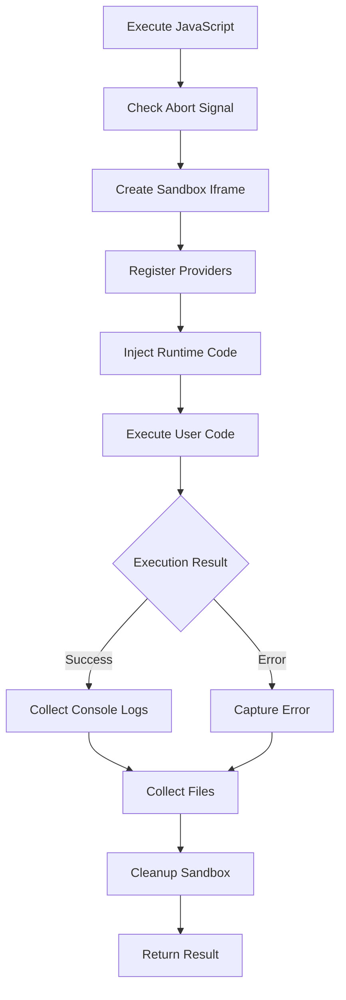
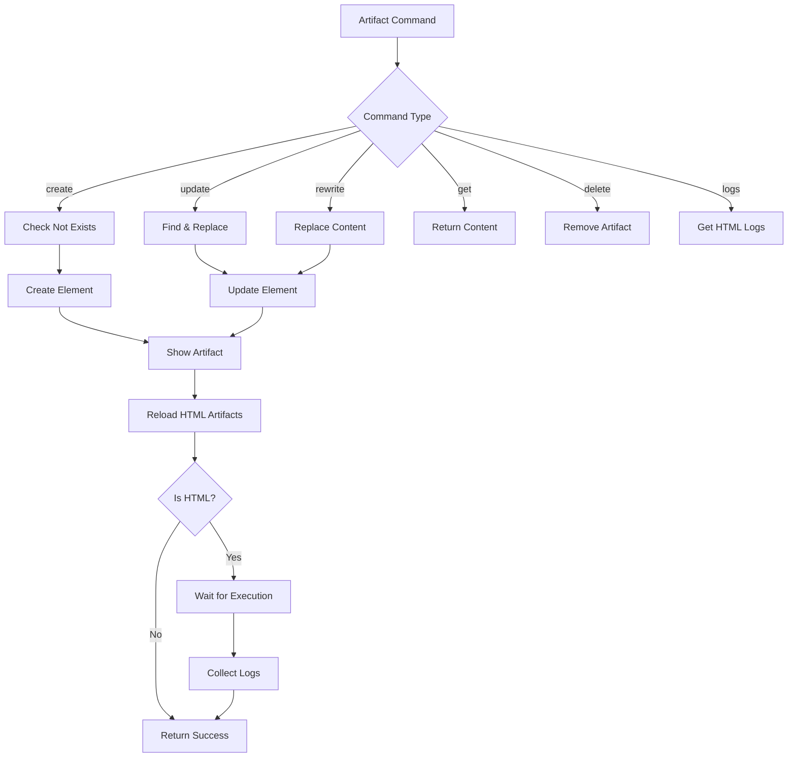
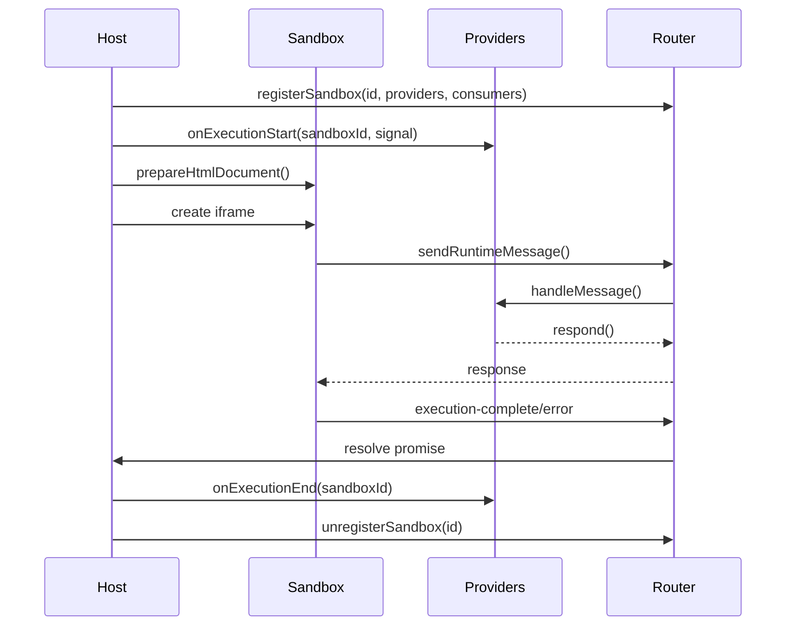
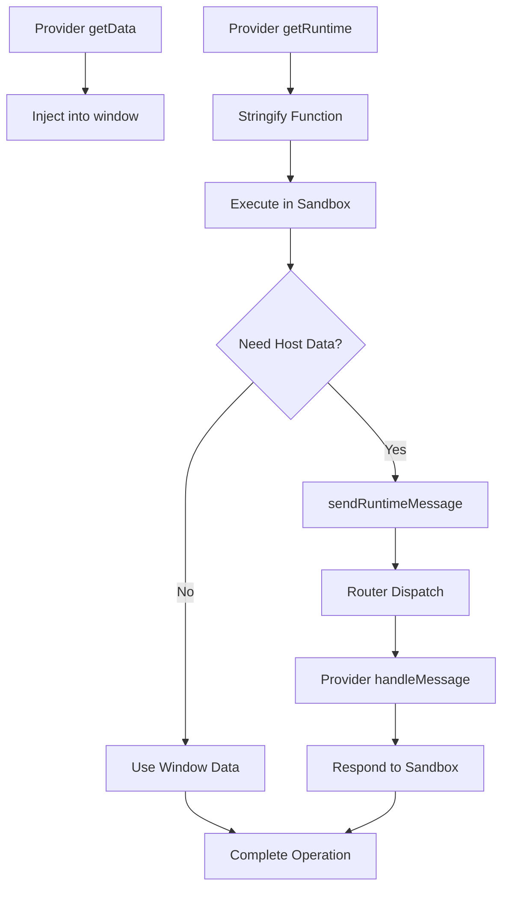

# Web UI Tools, Artifacts & Sandbox Runtime

The Web UI Tools, Artifacts & Sandbox Runtime subsystem provides a secure, extensible framework for executing user code and managing dynamic artifacts within the pi-mono project's web interface. This system enables the AI agent to execute JavaScript code, create and manipulate HTML/SVG/document artifacts, and provide a sandboxed runtime environment that safely isolates untrusted code execution from the main application context. The architecture supports both browser extension and standard web contexts, with comprehensive runtime providers that inject capabilities like file system access, console logging, and artifact management into sandboxed iframes.

The system is built around three core concepts: **Tool Renderers** (visual representation of tool execution), **Artifacts Panel** (management of generated files/documents), and **Sandbox Runtime** (secure code execution environment with pluggable runtime providers).

Sources: [packages/web-ui/src/tools/index.ts](../../../packages/web-ui/src/tools/index.ts), [packages/web-ui/src/tools/artifacts/artifacts.ts](../../../packages/web-ui/src/tools/artifacts/artifacts.ts), [packages/web-ui/src/components/SandboxedIframe.ts](../../../packages/web-ui/src/components/SandboxedIframe.ts)

## Tool Rendering System

The tool rendering system provides a pluggable architecture for customizing how tool executions are displayed in the UI. Each tool can register a custom renderer that controls the visual presentation of tool parameters, execution state, and results.

### Renderer Registry

The renderer registry maintains a global map of tool names to their corresponding renderer implementations. Tools can be rendered with custom UI or fall back to a default JSON renderer.

```typescript
// Registry of tool renderers
export const toolRenderers = new Map<string, ToolRenderer>();

export function registerToolRenderer(toolName: string, renderer: ToolRenderer): void {
	toolRenderers.set(toolName, renderer);
}

export function getToolRenderer(toolName: string): ToolRenderer | undefined {
	return toolRenderers.get(toolName);
}
```

Sources: [packages/web-ui/src/tools/renderer-registry.ts:7-18](../../../packages/web-ui/src/tools/renderer-registry.ts#L7-L18)

The main `renderTool` function supports a global "show JSON mode" that forces all tools to use the default JSON renderer, useful for debugging:

```typescript
export function renderTool(
	toolName: string,
	params: any | undefined,
	result: ToolResultMessage | undefined,
	isStreaming?: boolean,
): ToolRenderResult {
	if (showJsonMode) {
		return defaultRenderer.render(params, result, isStreaming);
	}
	const renderer = getToolRenderer(toolName);
	if (renderer) {
		return renderer.render(params, result, isStreaming);
	}
	return defaultRenderer.render(params, result, isStreaming);
}
```

Sources: [packages/web-ui/src/tools/index.ts:24-40](../../../packages/web-ui/src/tools/index.ts#L24-L40)

### Renderer UI Helpers

The system provides helper functions for consistent tool UI rendering across different states:

| Function | Purpose | States Supported |
|----------|---------|------------------|
| `renderHeader` | Simple header with icon and status | `inprogress`, `complete`, `error` |
| `renderCollapsibleHeader` | Expandable header with chevron toggle | `inprogress`, `complete`, `error` |

Both helpers show appropriate icons (spinner for in-progress, colored icon for complete/error) and support consistent styling:

```typescript
export function renderHeader(
	state: "inprogress" | "complete" | "error",
	toolIcon: any,
	text: string | TemplateResult,
): TemplateResult {
	switch (state) {
		case "inprogress":
			return html`<div class="flex items-center justify-between gap-2">
				${statusIcon(toolIcon, "text-foreground")}
				${text}
				${statusIcon(Loader, "text-foreground animate-spin")}
			</div>`;
		// ... complete and error cases
	}
}
```

Sources: [packages/web-ui/src/tools/renderer-registry.ts:26-56](../../../packages/web-ui/src/tools/renderer-registry.ts#L26-L56)

## JavaScript REPL Tool

The JavaScript REPL tool enables execution of arbitrary JavaScript code within a sandboxed iframe, with support for async operations, file generation, and runtime provider injection.

### Tool Definition

The REPL tool is defined with a schema that requires both a title and code:

```typescript
const javascriptReplSchema = Type.Object({
	title: Type.String({
		description: "Brief title describing what the code snippet tries to achieve in active form"
	}),
	code: Type.String({ description: "JavaScript code to execute" }),
});
```

Sources: [packages/web-ui/src/tools/javascript-repl.ts:55-61](../../../packages/web-ui/src/tools/javascript-repl.ts#L55-L61)

The tool supports dynamic runtime provider injection through a factory pattern:

```typescript
export function createJavaScriptReplTool(): AgentTool<typeof javascriptReplSchema, JavaScriptReplToolResult> & {
	runtimeProvidersFactory?: () => SandboxRuntimeProvider[];
	sandboxUrlProvider?: () => string;
} {
	return {
		label: "JavaScript REPL",
		name: "javascript_repl",
		runtimeProvidersFactory: () => [], // default to empty array
		sandboxUrlProvider: undefined, // optional, for browser extensions
		get description() {
			const runtimeProviderDescriptions = 
				this.runtimeProvidersFactory?.()
					.map((d) => d.getDescription())
					.filter((d) => d.trim().length > 0) || [];
			return JAVASCRIPT_REPL_TOOL_DESCRIPTION(runtimeProviderDescriptions);
		},
		// ...
	};
}
```

Sources: [packages/web-ui/src/tools/javascript-repl.ts:73-91](../../../packages/web-ui/src/tools/javascript-repl.ts#L73-L91)

### Code Execution Flow



The execution process wraps user code in an async function to capture return values and handles file generation through the `returnFile` API:

```typescript
export async function executeJavaScript(
	code: string,
	runtimeProviders: SandboxRuntimeProvider[],
	signal?: AbortSignal,
	sandboxUrlProvider?: () => string,
): Promise<{ output: string; files?: SandboxFile[] }> {
	const sandbox = new SandboxIframe();
	if (sandboxUrlProvider) {
		sandbox.sandboxUrlProvider = sandboxUrlProvider;
	}
	sandbox.style.display = "none";
	document.body.appendChild(sandbox);

	try {
		const sandboxId = `repl-${Date.now()}-${Math.random().toString(36).substring(7)}`;
		const result: SandboxResult = await sandbox.execute(sandboxId, code, runtimeProviders, [], signal);
		sandbox.remove();
		
		// Build plain text response with console output, errors, and file notifications
		let output = "";
		if (result.console && result.console.length > 0) {
			for (const entry of result.console) {
				output += `${entry.text}\n`;
			}
		}
		// ... error and return value handling
		return { output: output.trim() || "Code executed successfully (no output)", files: result.files };
	} catch (error: unknown) {
		sandbox.remove();
		throw new Error((error as Error).message || "Execution failed");
	}
}
```

Sources: [packages/web-ui/src/tools/javascript-repl.ts:16-52](../../../packages/web-ui/src/tools/javascript-repl.ts#L16-L52)

### REPL Renderer

The REPL renderer provides collapsible code blocks with console output and file attachments:

```typescript
export const javascriptReplRenderer: ToolRenderer<JavaScriptReplParams, JavaScriptReplResult> = {
	render(params, result, isStreaming) {
		const state = result ? (result.isError ? "error" : "complete") : isStreaming ? "inprogress" : "complete";
		
		if (result && params) {
			const files = result.details?.files || [];
			const attachments: Attachment[] = files.map((f, i) => {
				// Decode base64 for text files
				let extractedText: string | undefined;
				if (isTextBased && f.contentBase64) {
					try {
						extractedText = atob(f.contentBase64);
					} catch (_e) { /* ... */ }
				}
				return { /* attachment object */ };
			});
			
			return {
				content: html`
					<div>
						${renderCollapsibleHeader(state, Code, params.title, codeContentRef, codeChevronRef, false)}
						<div ${ref(codeContentRef)} class="max-h-0 overflow-hidden transition-all">
							<code-block .code=${params.code} language="javascript"></code-block>
							${output ? html`<console-block .content=${output}></console-block>` : ""}
						</div>
						${attachments.length ? html`<div class="flex flex-wrap gap-2 mt-3">...</div>` : ""}
					</div>
				`,
				isCustom: false,
			};
		}
		// ... other states
	},
};
```

Sources: [packages/web-ui/src/tools/javascript-repl.ts:108-171](../../../packages/web-ui/src/tools/javascript-repl.ts#L108-L171)

## Artifacts System

The artifacts system manages dynamic file generation and manipulation, supporting multiple file types with specialized renderers for HTML, SVG, Markdown, images, PDFs, Excel, and DOCX files.

### Artifact Data Model

```typescript
export interface Artifact {
	filename: string;
	content: string;
	createdAt: Date;
	updatedAt: Date;
}
```

Sources: [packages/web-ui/src/tools/artifacts/artifacts.ts:34-39](../../../packages/web-ui/src/tools/artifacts/artifacts.ts#L34-L39)

### Artifacts Tool Schema

The artifacts tool supports CRUD operations through a command-based interface:

```typescript
const artifactsParamsSchema = Type.Object({
	command: StringEnum(["create", "update", "rewrite", "get", "delete", "logs"], {
		description: "The operation to perform",
	}),
	filename: Type.String({ description: "Filename including extension" }),
	content: Type.Optional(Type.String({ description: "File content" })),
	old_str: Type.Optional(Type.String({ description: "String to replace (for update)" })),
	new_str: Type.Optional(Type.String({ description: "Replacement string (for update)" })),
});
```

Sources: [packages/web-ui/src/tools/artifacts/artifacts.ts:42-50](../../../packages/web-ui/src/tools/artifacts/artifacts.ts#L42-L50)

### Artifacts Panel Component

The `ArtifactsPanel` is a LitElement component that manages artifact lifecycle and rendering:

| Property | Type | Purpose |
|----------|------|---------|
| `agent` | `Agent` | Reference to agent for attachment access |
| `sandboxUrlProvider` | `() => string` | Optional URL provider for browser extensions |
| `collapsed` | `boolean` | Hide panel content but show reopen pill |
| `overlay` | `boolean` | Full-screen overlay mode (mobile) |
| `onArtifactsChange` | `() => void` | Callback when artifacts are modified |
| `onClose/onOpen` | `() => void` | Callbacks for panel visibility |

Sources: [packages/web-ui/src/tools/artifacts/artifacts.ts:57-72](../../../packages/web-ui/src/tools/artifacts/artifacts.ts#L57-L72)

### Artifact Type Detection and Rendering

The panel automatically detects file types by extension and instantiates appropriate renderer elements:

```typescript
private getFileType(filename: string): 
	"html" | "svg" | "markdown" | "image" | "pdf" | "excel" | "docx" | "text" | "generic" {
	const ext = filename.split(".").pop()?.toLowerCase();
	if (ext === "html") return "html";
	if (ext === "svg") return "svg";
	if (ext === "md" || ext === "markdown") return "markdown";
	if (ext === "pdf") return "pdf";
	if (ext === "xlsx" || ext === "xls") return "excel";
	if (ext === "docx") return "docx";
	if (ext === "png" || ext === "jpg" || /* ... */) return "image";
	if (ext === "txt" || ext === "json" || /* ... */) return "text";
	return "generic";
}
```

Sources: [packages/web-ui/src/tools/artifacts/artifacts.ts:122-146](../../../packages/web-ui/src/tools/artifacts/artifacts.ts#L122-L146)

Each artifact type is rendered by a specialized element that extends `ArtifactElement`:

```typescript
private getOrCreateArtifactElement(filename: string, content: string): ArtifactElement {
	let element = this.artifactElements.get(filename);
	
	if (!element) {
		const type = this.getFileType(filename);
		if (type === "html") {
			element = new HtmlArtifact();
			(element as HtmlArtifact).runtimeProviders = this.getHtmlArtifactRuntimeProviders();
			if (this.sandboxUrlProvider) {
				(element as HtmlArtifact).sandboxUrlProvider = this.sandboxUrlProvider;
			}
		} else if (type === "svg") {
			element = new SvgArtifact();
		} else if (type === "markdown") {
			element = new MarkdownArtifact();
		}
		// ... other types
		
		element.filename = filename;
		element.content = content;
		this.artifactElements.set(filename, element);
	}
	return element;
}
```

Sources: [packages/web-ui/src/tools/artifacts/artifacts.ts:149-193](../../../packages/web-ui/src/tools/artifacts/artifacts.ts#L149-L193)

### Artifact Operations Flow



Sources: [packages/web-ui/src/tools/artifacts/artifacts.ts:327-424](../../../packages/web-ui/src/tools/artifacts/artifacts.ts#L327-L424)

### HTML Artifact Execution

HTML artifacts are executed in sandboxed iframes with runtime provider support. The execution includes automatic log collection and completion signaling:

```typescript
public executeContent(html: string) {
	const sandbox = this.sandboxIframeRef.value;
	if (!sandbox) return;
	
	const sandboxId = `artifact-${this.filename}`;
	
	// Create consumer for console messages
	const consumer: MessageConsumer = {
		handleMessage: async (message: any): Promise<void> => {
			if (message.type === "console") {
				this.logs = [...this.logs, {
					type: message.method === "error" ? "error" : "log",
					text: message.text,
				}];
				this.requestUpdate();
			}
		},
	};
	
	// Inject window.complete() call at end of HTML
	let modifiedHtml = html;
	if (modifiedHtml.includes("</html>")) {
		modifiedHtml = modifiedHtml.replace(
			"</html>",
			"<script>if (window.complete) window.complete();</script></html>",
		);
	}
	
	sandbox.loadContent(sandboxId, modifiedHtml, this.runtimeProviders, [consumer]);
}
```

Sources: [packages/web-ui/src/tools/artifacts/HtmlArtifact.ts:99-140](../../../packages/web-ui/src/tools/artifacts/HtmlArtifact.ts#L99-L140)

HTML artifacts support preview/code toggle and provide download functionality with standalone HTML generation:

```typescript
public getHeaderButtons() {
	const toggle = new PreviewCodeToggle();
	toggle.mode = this.viewMode;
	
	const sandbox = this.sandboxIframeRef.value;
	const sandboxId = `artifact-${this.filename}`;
	const downloadContent = sandbox?.prepareHtmlDocument(
		sandboxId, 
		this._content, 
		this.runtimeProviders || [], 
		{
			isHtmlArtifact: true,
			isStandalone: true, // Skip runtime bridge for standalone downloads
		}
	) || this._content;
	
	return html`
		<div class="flex items-center gap-2">
			${toggle}
			${Button({ /* reload button */ })}
			${CopyButton({ text: this._content })}
			${DownloadButton({ content: downloadContent, filename: this.filename })}
		</div>
	`;
}
```

Sources: [packages/web-ui/src/tools/artifacts/HtmlArtifact.ts:45-82](../../../packages/web-ui/src/tools/artifacts/HtmlArtifact.ts#L45-L82)

### Artifact Reconstruction

The panel supports reconstructing artifact state from message history, enabling session restoration:

```typescript
public async reconstructFromMessages(
	messages: Array<AgentMessage | { role: "aborted" } | { role: "artifact" }>,
): Promise<void> {
	const toolCalls = new Map<string, ToolCall>();
	
	// 1) Collect tool calls from assistant messages
	for (const message of messages) {
		if (message.role === "assistant") {
			for (const block of message.content) {
				if (block.type === "toolCall" && block.name === artifactToolName) {
					toolCalls.set(block.id, block);
				}
			}
		}
	}
	
	// 2) Build ordered list of successful operations
	const operations: Array<ArtifactsParams> = [];
	for (const m of messages) {
		if ((m as any).role === "artifact") {
			const artifactMsg = m as ArtifactMessage;
			switch (artifactMsg.action) {
				case "create":
					operations.push({ command: "create", filename: artifactMsg.filename, content: artifactMsg.content });
					break;
				// ... other actions
			}
		}
		// ... handle tool result messages
	}
	
	// 3) Compute final state per filename
	const finalArtifacts = new Map<string, string>();
	for (const op of operations) {
		// ... simulate operations
	}
	
	// 4-6) Reset UI, create artifacts, show first
	this._artifacts.clear();
	this.artifactElements.forEach((el) => el.remove());
	this.artifactElements.clear();
	
	for (const [filename, content] of finalArtifacts.entries()) {
		await this.createArtifact({ command: "create", filename, content }, 
			{ skipWait: true, silent: true });
	}
}
```

Sources: [packages/web-ui/src/tools/artifacts/artifacts.ts:238-324](../../../packages/web-ui/src/tools/artifacts/artifacts.ts#L238-L324)

## Sandbox Runtime Architecture

The sandbox runtime provides a secure, isolated execution environment for untrusted code with bidirectional communication between the host and sandboxed context.

### Sandboxed Iframe Component

The `SandboxIframe` component manages iframe lifecycle and supports two loading modes:

1. **Web Mode**: Uses `srcdoc` attribute to inject HTML directly
2. **Extension Mode**: Uses `src` with `chrome.runtime.getURL()` for CSP compliance

```typescript
@customElement("sandbox-iframe")
export class SandboxIframe extends LitElement {
	@property({ attribute: false }) sandboxUrlProvider?: SandboxUrlProvider;
	
	private iframe?: HTMLIFrameElement;
	
	public loadContent(
		sandboxId: string,
		htmlContent: string,
		providers: SandboxRuntimeProvider[] = [],
		consumers: MessageConsumer[] = [],
	): void {
		// Register sandbox with router
		RUNTIME_MESSAGE_ROUTER.registerSandbox(sandboxId, providers, consumers);
		
		// Prepare HTML with runtime injection
		const completeHtml = this.prepareHtmlDocument(sandboxId, htmlContent, providers, {
			isHtmlArtifact: true,
			isStandalone: false,
		});
		
		// Create iframe (web or extension mode)
		if (this.sandboxUrlProvider) {
			this.loadViaSandboxUrl(sandboxId, completeHtml);
		} else {
			this.loadViaSrcdoc(sandboxId, completeHtml);
		}
	}
}
```

Sources: [packages/web-ui/src/components/SandboxedIframe.ts:40-107](../../../packages/web-ui/src/components/SandboxedIframe.ts#L40-L107)

### Runtime Injection and HTML Preparation

The sandbox prepares complete HTML documents by injecting runtime code before user content:

```typescript
public prepareHtmlDocument(
	sandboxId: string,
	userCode: string,
	providers: SandboxRuntimeProvider[] = [],
	options?: PrepareHtmlOptions,
): string {
	const opts: PrepareHtmlOptions = {
		isHtmlArtifact: false,
		isStandalone: false,
		...options,
	};
	
	const runtime = this.getRuntimeScript(sandboxId, providers, opts.isStandalone || false);
	
	if (opts.isHtmlArtifact) {
		// HTML Artifact - inject runtime into existing HTML
		const headMatch = userCode.match(/<head[^>]*>/i);
		if (headMatch) {
			const index = headMatch.index! + headMatch[0].length;
			return userCode.slice(0, index) + runtime + userCode.slice(index);
		}
		return runtime + userCode;
	} else {
		// REPL - wrap code in HTML with runtime
		const escapedUserCode = escapeScriptContent(userCode);
		return `<!DOCTYPE html>
<html>
<head>${runtime}</head>
<body>
	<script type="module">
		(async () => {
			try {
				const userCodeFunc = async () => { ${escapedUserCode} };
				const returnValue = await userCodeFunc();
				await window.complete(null, returnValue);
			} catch (error) {
				await window.complete({
					message: error?.message || String(error),
					stack: error?.stack || new Error().stack
				});
			}
		})();
	</script>
</body>
</html>`;
	}
}
```

Sources: [packages/web-ui/src/components/SandboxedIframe.ts:280-349](../../../packages/web-ui/src/components/SandboxedIframe.ts#L280-L349)

### Runtime Script Generation

The runtime script combines data injection, bridge code, and provider runtime functions:

```typescript
private getRuntimeScript(
	sandboxId: string,
	providers: SandboxRuntimeProvider[] = [],
	isStandalone: boolean = false,
): string {
	// Collect all data from providers
	const allData: Record<string, any> = {};
	for (const provider of providers) {
		Object.assign(allData, provider.getData());
	}
	
	// Generate bridge code (skip if standalone)
	const bridgeCode = isStandalone ? "" : RuntimeMessageBridge.generateBridgeCode({
		context: "sandbox-iframe",
		sandboxId,
	});
	
	// Collect all runtime functions
	const runtimeFunctions: string[] = [];
	for (const provider of providers) {
		runtimeFunctions.push(`(${provider.getRuntime().toString()})(${JSON.stringify(sandboxId)});`);
	}
	
	// Build script with HTML escaping
	const dataInjection = Object.entries(allData)
		.map(([key, value]) => {
			const jsonStr = JSON.stringify(value).replace(/<\/script/gi, "<\\/script");
			return `window.${key} = ${jsonStr};`;
		})
		.join("\n");
	
	// Navigation interceptor (only if NOT standalone)
	const navigationInterceptor = isStandalone ? "" : `/* ... intercept links/forms ... */`;
	
	return `<style>html, body { font-size: initial; }</style>
<script>
window.sandboxId = ${JSON.stringify(sandboxId)};
${dataInjection}
${bridgeCode}
${runtimeFunctions.join("\n")}
${navigationInterceptor}
</script>`;
}
```

Sources: [packages/web-ui/src/components/SandboxedIframe.ts:356-431](../../../packages/web-ui/src/components/SandboxedIframe.ts#L356-L431)

### Execution Flow with Lifecycle Callbacks



The execute method coordinates the full lifecycle:

```typescript
public async execute(
	sandboxId: string,
	code: string,
	providers: SandboxRuntimeProvider[] = [],
	consumers: MessageConsumer[] = [],
	signal?: AbortSignal,
): Promise<SandboxResult> {
	const consoleProvider = new ConsoleRuntimeProvider();
	providers = [consoleProvider, ...providers];
	RUNTIME_MESSAGE_ROUTER.registerSandbox(sandboxId, providers, consumers);
	
	// Notify providers that execution is starting
	for (const provider of providers) {
		provider.onExecutionStart?.(sandboxId, signal);
	}
	
	const files: SandboxFile[] = [];
	let completed = false;
	
	return new Promise((resolve, reject) => {
		const executionConsumer: MessageConsumer = {
			async handleMessage(message: any): Promise<void> {
				if (message.type === "file-returned") {
					files.push({ /* ... */ });
				} else if (message.type === "execution-complete") {
					completed = true;
					cleanup();
					resolve({ success: true, console: consoleProvider.getLogs(), files, returnValue: message.returnValue });
				} else if (message.type === "execution-error") {
					completed = true;
					cleanup();
					resolve({ success: false, console: consoleProvider.getLogs(), error: message.error, files });
				}
			},
		};
		
		const cleanup = () => {
			// Notify providers that execution has ended
			for (const provider of providers) {
				provider.onExecutionEnd?.(sandboxId);
			}
			RUNTIME_MESSAGE_ROUTER.unregisterSandbox(sandboxId);
			signal?.removeEventListener("abort", abortHandler);
			clearTimeout(timeoutId);
			this.iframe?.remove();
		};
		
		// Setup abort handler and timeout (120s)
		// ... create iframe and load content
	});
}
```

Sources: [packages/web-ui/src/components/SandboxedIframe.ts:136-244](../../../packages/web-ui/src/components/SandboxedIframe.ts#L136-L244)

## Runtime Provider System

Runtime providers are pluggable modules that inject capabilities into the sandboxed environment. Each provider implements the `SandboxRuntimeProvider` interface.

### Provider Interface

```typescript
export interface SandboxRuntimeProvider {
	// Returns data to inject into window scope
	getData(): Record<string, any>;
	
	// Returns runtime function (will be stringified and executed in sandbox)
	getRuntime(): (sandboxId: string) => void;
	
	// Optional message handler for bidirectional communication
	handleMessage?(message: any, respond: (response: any) => void): Promise<void>;
	
	// Optional documentation for LLM tool descriptions
	getDescription(): string;
	
	// Optional lifecycle callbacks
	onExecutionStart?(sandboxId: string, signal?: AbortSignal): void;
	onExecutionEnd?(sandboxId: string): void;
}
```

Sources: [packages/web-ui/src/components/sandbox/SandboxRuntimeProvider.ts:4-38](../../../packages/web-ui/src/components/sandbox/SandboxRuntimeProvider.ts#L4-L38)

### Artifacts Runtime Provider

The Artifacts Runtime Provider enables sandboxed code to interact with session artifacts programmatically:

```typescript
export class ArtifactsRuntimeProvider implements SandboxRuntimeProvider {
	constructor(
		private artifactsPanel: ArtifactsPanelLike,
		private agent?: AgentLike,
		private readWrite: boolean = true,
	) {}
	
	getData(): Record<string, any> {
		// Inject artifact snapshot for offline mode
		const snapshot: Record<string, string> = {};
		this.artifactsPanel.artifacts.forEach((artifact, filename) => {
			snapshot[filename] = artifact.content;
		});
		return { artifacts: snapshot };
	}
	
	getRuntime(): (sandboxId: string) => void {
		return (_sandboxId: string) => {
			// Auto-parse/stringify for .json files
			const isJsonFile = (filename: string) => filename.endsWith(".json");
			
			(window as any).listArtifacts = async (): Promise<string[]> => {
				if ((window as any).sendRuntimeMessage) {
					const response = await (window as any).sendRuntimeMessage({
						type: "artifact-operation",
						action: "list",
					});
					if (!response.success) throw new Error(response.error);
					return response.result;
				} else {
					return Object.keys((window as any).artifacts || {});
				}
			};
			
			(window as any).getArtifact = async (filename: string): Promise<any> => {
				// ... online/offline handling with auto-parse for JSON
			};
			
			(window as any).createOrUpdateArtifact = async (filename: string, content: any, mimeType?: string): Promise<void> => {
				// ... auto-stringify for JSON, throw error in offline mode
			};
			
			(window as any).deleteArtifact = async (filename: string): Promise<void> => {
				// ... throw error in offline mode
			};
		};
	}
	
	async handleMessage(message: any, respond: (response: any) => void): Promise<void> {
		if (message.type !== "artifact-operation") return;
		
		const { action, filename, content } = message;
		
		switch (action) {
			case "list":
				respond({ success: true, result: Array.from(this.artifactsPanel.artifacts.keys()) });
				break;
			case "get":
				const artifact = this.artifactsPanel.artifacts.get(filename);
				respond(artifact ? { success: true, result: artifact.content } : { success: false, error: "Artifact not found" });
				break;
			case "createOrUpdate":
				const exists = this.artifactsPanel.artifacts.has(filename);
				await this.artifactsPanel.tool.execute("", {
					command: exists ? "rewrite" : "create",
					filename,
					content,
				});
				this.agent?.state.messages.push({ /* artifact message */ });
				respond({ success: true });
				break;
			// ... delete case
		}
	}
}
```

Sources: [packages/web-ui/src/components/sandbox/ArtifactsRuntimeProvider.ts:25-131](../../../packages/web-ui/src/components/sandbox/ArtifactsRuntimeProvider.ts#L25-L131)

The provider supports both **online mode** (with `sendRuntimeMessage` for bidirectional communication) and **offline mode** (using injected snapshot data for read-only access in downloaded HTML files).

### Provider Data Flow



Sources: [packages/web-ui/src/components/SandboxedIframe.ts:356-431](../../../packages/web-ui/src/components/SandboxedIframe.ts#L356-L431), [packages/web-ui/src/components/sandbox/ArtifactsRuntimeProvider.ts:25-131](../../../packages/web-ui/src/components/sandbox/ArtifactsRuntimeProvider.ts#L25-L131)

## Security Considerations

The sandbox runtime implements multiple security layers to safely execute untrusted code:

### Iframe Sandbox Permissions

All sandboxed iframes use restrictive sandbox attributes:

```typescript
this.iframe.sandbox.add("allow-scripts");
this.iframe.sandbox.add("allow-modals");
```

Sources: [packages/web-ui/src/components/SandboxedIframe.ts:127](../../../packages/web-ui/src/components/SandboxedIframe.ts#L127), [packages/web-ui/src/components/SandboxedIframe.ts:170](../../../packages/web-ui/src/components/SandboxedIframe.ts#L170)

This restricts capabilities to only script execution and modal dialogs, preventing form submission, top-level navigation, and other potentially dangerous operations.

### Navigation Interception

The system intercepts all navigation attempts and opens external URLs in new tabs:

```typescript
// Navigation interceptor: prevent all navigation and open externally
(function() {
	// Intercept link clicks
	document.addEventListener('click', function(e) {
		const link = e.target.closest('a');
		if (link && link.href && (link.href.startsWith('http://') || link.href.startsWith('https://'))) {
			e.preventDefault();
			e.stopPropagation();
			window.parent.postMessage({ type: 'open-external-url', url: link.href }, '*');
		}
	}, true);
	
	// Intercept form submissions
	// Prevent window.location changes
})();
```

Sources: [packages/web-ui/src/components/SandboxedIframe.ts:399-428](../../../packages/web-ui/src/components/SandboxedIframe.ts#L399-L428)

### Script Content Escaping

User code is escaped to prevent premature script tag closure:

```typescript
function escapeScriptContent(code: string): string {
	return code.replace(/<\/script/gi, "<\\/script");
}
```

Sources: [packages/web-ui/src/components/SandboxedIframe.ts:32-37](../../../packages/web-ui/src/components/SandboxedIframe.ts#L32-L37)

### HTML Validation

All HTML is validated using DOMParser before injection:

```typescript
private validateHtml(html: string): string | null {
	try {
		const parser = new DOMParser();
		const doc = parser.parseFromString(html, "text/html");
		
		const parserError = doc.querySelector("parsererror");
		if (parserError) {
			return parserError.textContent || "Unknown parse error";
		}
		return null;
	} catch (error: any) {
		return error.message || "Unknown validation error";
	}
}
```

Sources: [packages/web-ui/src/components/SandboxedIframe.ts:266-277](../../../packages/web-ui/src/components/SandboxedIframe.ts#L266-L277)

### Execution Timeouts

All executions have a 120-second timeout to prevent infinite loops:

```typescript
const timeoutId = setTimeout(() => {
	if (!completed) {
		completed = true;
		cleanup();
		resolve({
			success: false,
			console: consoleProvider.getLogs(),
			error: { message: "Execution timeout (120s)", stack: "" },
			files,
		});
	}
}, 120000);
```

Sources: [packages/web-ui/src/components/SandboxedIframe.ts:218-228](../../../packages/web-ui/src/components/SandboxedIframe.ts#L218-L228)

## Summary

The Web UI Tools, Artifacts & Sandbox Runtime system provides a comprehensive framework for secure code execution and dynamic artifact management. The architecture separates concerns through pluggable tool renderers, specialized artifact elements, and runtime providers that extend sandbox capabilities. The dual-mode sandbox (web/extension) enables deployment across different contexts while maintaining security through iframe sandboxing, navigation interception, and content validation. The system supports both synchronous and asynchronous operations, file generation, console logging, and bidirectional communication between host and sandboxed contexts, making it a robust foundation for AI-assisted code generation and interactive document creation.