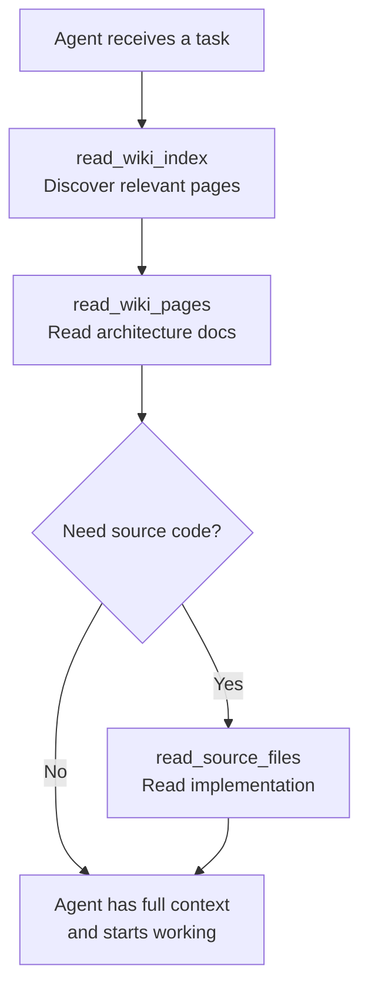

# @repositories-wiki/mcp

MCP server that exposes generated repository wikis to AI coding tools — giving your agent architectural context through `read_wiki_index`, `read_wiki_pages`, and `read_source_files` tools.

[](https://www.npmjs.com/package/@repositories-wiki/mcp)
[](https://opensource.org/licenses/MIT)

## Prerequisites

Before using this MCP server, you need to generate a wiki for your repository using [`@repositories-wiki/repository-wiki`](https://www.npmjs.com/package/@repositories-wiki/repository-wiki):

```bash
npm install -g @repositories-wiki/repository-wiki

repository-wiki \
    --provider-id anthropic \
    --planer-model claude-opus-4-6 \
    --exploration-model claude-haiku-4-5 \
    --builder-model claude-sonnet-4-6 \
    --local-repo-path /path/to/your-project
```

This creates a `repository-wiki/` directory in the target repository with an `INDEX.md` and wiki pages organized by section.

## Installation

```bash
npm install -g @repositories-wiki/mcp
```

## Configuration

The server is configured through the `REPOS_WIKI_MCP_CONFIG` environment variable, which accepts a JSON object with an array of repositories:

```json
{
  "repos": [
    { "path": "/path/to/local-project" },
    { "url": "https://github.com/owner/repo", "token": "ghp_...", "branch": "main" }
  ]
}
```

### Config Schema

Each entry in `repos` accepts:

| Field | Type | Required | Description |
|-------|------|----------|-------------|
| `path` | string | One of `path` or `url` | Absolute path to a local repository |
| `url` | string | One of `path` or `url` | GitHub repository URL to clone |
| `token` | string | No | GitHub token (needed for private repos when using `url`) |
| `branch` | string | No | Branch to checkout (when using `url`) |

Rules:
- Each repo must have either `path` or `url`, not both
- At least one repository must be configured
- Each repository must have a `repository-wiki/` directory with an `INDEX.md` (generated by `@repositories-wiki/repository-wiki`)

### Repository Identifiers

The MCP server assigns each repository an ID that you use when calling tools:

- **URL repos** — `owner/repo` (e.g. `eliavamar/repositories-wiki`)
- **Local repos** — the folder name (e.g. `my-project`)

## Integration

### Claude Desktop

Add to `claude_desktop_config.json`:

```json
{
  "mcpServers": {
    "repositories-wiki": {
      "command": "repositories-wiki-mcp",
      "env": {
        "REPOS_WIKI_MCP_CONFIG": "{\"repos\": [{\"path\": \"/path/to/your-project\"}]}"
      }
    }
  }
}
```

### Cursor

Add to your MCP settings (`.cursor/mcp.json`):

```json
{
  "mcpServers": {
    "repositories-wiki": {
      "command": "repositories-wiki-mcp",
      "env": {
        "REPOS_WIKI_MCP_CONFIG": "{\"repos\": [{\"path\": \"/path/to/your-project\"}]}"
      }
    }
  }
}
```

### OpenCode

Add to your OpenCode MCP config:

```json
{
  "mcpServers": {
    "repositories-wiki": {
      "command": "repositories-wiki-mcp",
      "env": {
        "REPOS_WIKI_MCP_CONFIG": "{\"repos\": [{\"path\": \"/path/to/your-project\"}]}"
      }
    }
  }
}
```

### Multiple Repositories

Serve wikis for several projects through a single MCP server:

```json
{
  "mcpServers": {
    "repositories-wiki": {
      "command": "repositories-wiki-mcp",
      "env": {
        "REPOS_WIKI_MCP_CONFIG": "{\"repos\": [{\"path\": \"/path/to/project-a\"}, {\"path\": \"/path/to/project-b\"}, {\"url\": \"https://github.com/owner/project-c\", \"token\": \"ghp_...\"}]}"
      }
    }
  }
}
```

## Available Tools

The MCP server exposes three tools over the stdio transport:

### `read_wiki_index`

Read the wiki `INDEX.md` for a repository. Returns the full index with sections, pages, importance levels, and relevant source files. Use this first to discover what wiki pages are available and find the right pages for a task.

| Parameter | Type | Description |
|-----------|------|-------------|
| `repository` | string | Repository identifier (e.g. `owner/repo` or folder name) |

### `read_wiki_pages`

Read the full content of one or more wiki pages by their file paths. Use this after `read_wiki_index` to get the complete content of pages relevant to a task. Pages contain architecture docs, diagrams, source citations, and implementation details.

| Parameter | Type | Description |
|-----------|------|-------------|
| `repository` | string | Repository identifier |
| `pages` | string[] | Array of wiki page relative file paths from INDEX.md (e.g. `["sections/architecture/pipeline.md"]`) |

### `read_source_files`

Read the actual source code of one or more files from a repository. Use this when you need to see the real implementation code referenced in wiki pages.

| Parameter | Type | Description |
|-----------|------|-------------|
| `repository` | string | Repository identifier |
| `file_paths` | string[] | Array of relative file paths within the repository (e.g. `["src/main.ts", "src/utils.ts"]`) |

### Typical Agent Workflow



## Related

- [**@repositories-wiki/repository-wiki**](https://www.npmjs.com/package/@repositories-wiki/repository-wiki) — CLI & library to generate wikis from source code using LLMs
- [**Repositories Wiki**](https://github.com/eliavamar/repositories-wiki) — Monorepo with examples, the `update-wiki` agent skill, and full documentation

## License

[MIT](https://opensource.org/licenses/MIT)
