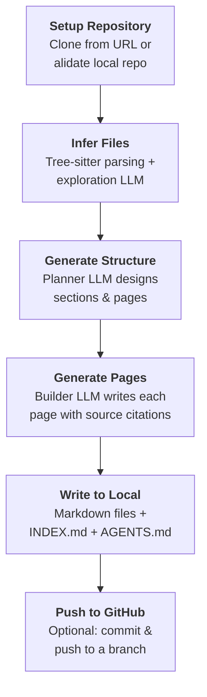

# @repositories-wiki/repository-wiki

Generate comprehensive, structured wiki documentation from any source code repository using LLMs.

[](https://www.npmjs.com/package/@repositories-wiki/repository-wiki)
[](https://opensource.org/licenses/MIT)

This package provides a CLI and programmatic API that reads a repository's source code, parses it with Tree-sitter, uses LLMs to plan a wiki structure, and generates detailed markdown documentation with architecture diagrams, source citations, and cross-references.

## What It Produces

Running the tool on a repository generates:

- **`repository-wiki/`** — A directory of structured markdown pages organized by sections, with an `INDEX.md` listing all pages, their importance levels, and relevant source files
- **`AGENTS.md`** — Instructions added to the repo root that tell AI coding agents how to consult the wiki and when to update it

## Installation

```bash
npm install -g @repositories-wiki/repository-wiki
```

## CLI Usage

```bash
repository-wiki [options]
```

### Required Options

| Flag | Description |
|------|-------------|
| `--provider-id <id>` | LLM provider ID (`openai`, `anthropic`, `azure_openai`, `google-genai`, `bedrock`, `sap-ai-core`) |
| `--planer-model <id>` | Model for the planning LLM (recommended: Opus-class) |
| `--exploration-model <id>` | Model for the exploration LLM (recommended: Haiku-class) |
| `--builder-model <id>` | Model for the builder LLM (recommended: Sonnet-class) |

You must also provide one of:

| Flag | Description |
|------|-------------|
| `--repo-url <url>` | GitHub repository URL to clone (requires `--github-token`) |
| `--local-repo-path <path>` | Path to a local git repository |

### Optional Flags

| Flag | Description | Default |
|------|-------------|---------|
| `--github-token <token>` | GitHub token (required with `--repo-url` or `--push-to-github`) | — |
| `--commit-id <id>` | Specific commit ID to generate wiki from | HEAD |
| `--output-dir <path>` | Output directory for generated wiki files | `repository-wiki` |
| `--push-to-github` | Push generated wiki to a GitHub branch | `false` |
| `--wiki-branch <branch>` | Branch name for the wiki push | `repository-wiki-<timestamp>` |

### Examples

**Generate wiki from a local repository using Anthropic:**

```bash
export ANTHROPIC_API_KEY=sk-...

repository-wiki \
    --provider-id anthropic \
    --planer-model claude-opus-4-6 \
    --exploration-model claude-haiku-4-5 \
    --builder-model claude-sonnet-4-6 \
    --local-repo-path /path/to/my-project
```

**Generate wiki from a GitHub repository URL:**

```bash
export ANTHROPIC_API_KEY=sk-...

repository-wiki \
    --provider-id anthropic \
    --planer-model claude-opus-4-6 \
    --exploration-model claude-haiku-4-5 \
    --builder-model claude-sonnet-4-6 \
    --repo-url https://github.com/owner/repo \
    --github-token ghp_xxxxxxxxxxxx
```

## Programmatic API

The package also exports a programmatic API for use in your own tools:

```typescript
import { WikiGeneratorPipeline } from "@repositories-wiki/repository-wiki";

const pipeline = WikiGeneratorPipeline.create();
const result = await pipeline.execute({
  localRepoPath: "/path/to/my-project",
  providerConfig: { providerID: "anthropic" },
  llmPlaner: { modelID: "claude-opus-4-6" },
  llmExploration: { modelID: "claude-haiku-4-5" },
  llmBuilder: { modelID: "claude-sonnet-4-6" },
});

console.log(result.wikiStructure.title);
console.log(result.wikiStructure.sections);
console.log(result.commitId);
```

### Exports

| Export | Description |
|--------|-------------|
| `WikiGeneratorPipeline` | The main pipeline class — call `.create()` for the default pipeline, or build a custom one with `.addStep()` |

## How the Pipeline Works



| Step | What It Does |
|------|--------------|
| **Setup Repository** | Clones from a URL (with optional token/commit) or validates a local git repo |
| **Infer Files** | Walks the repo file tree, reads the README, uses Tree-sitter to extract code signatures, and asks the exploration LLM to identify the most important files |
| **Generate Structure** | Sends the file tree and enriched file data to the planner LLM, which designs the full wiki structure — sections, pages, importance levels, and relevant source files |
| **Generate Pages** | Generates all wiki pages concurrently (up to 100 in parallel) using the builder LLM, with pre-loaded source files injected into each prompt for accurate citations |
| **Write to Local** | Writes markdown files organized by section, generates `INDEX.md`, and creates/updates `AGENTS.md` at the repo root |
| **Push to GitHub** | If enabled, creates a new branch, commits the wiki and `AGENTS.md`, and pushes to the remote |

## Supported LLM Providers

Before running, export the environment variables required by your LLM provider:

| Provider | Env Variable | Setup Guide |
|----------|-------------|-------------|
| `anthropic` | `ANTHROPIC_API_KEY` | [LangChain docs](https://docs.langchain.com/oss/javascript/integrations/chat) |
| `openai` | `OPENAI_API_KEY` | [LangChain docs](https://docs.langchain.com/oss/javascript/integrations/chat) |
| `azure_openai` | `AZURE_OPENAI_API_KEY` | [LangChain docs](https://docs.langchain.com/oss/javascript/integrations/chat) |
| `google-genai` | `GOOGLE_API_KEY` | [LangChain docs](https://docs.langchain.com/oss/javascript/integrations/chat) |
| `bedrock` | AWS credentials | [LangChain docs](https://docs.langchain.com/oss/javascript/integrations/chat) |
| `sap-ai-core` | SAP AI Core config | [SAP AI SDK docs](https://sap.github.io/ai-sdk/docs/js/overview-cloud-sdk-for-ai-js) |

## Tree-sitter Language Support

The exploration step uses [Tree-sitter](https://tree-sitter.github.io/tree-sitter/) to extract code signatures (functions, classes, interfaces) for richer context. Currently supported languages:

| Language | Extensions |
|----------|-----------|
| TypeScript | `.ts` |
| TSX | `.tsx` |
| JavaScript | `.js`, `.jsx`, `.mjs`, `.cjs` |
| Python | `.py`, `.pyw` |
| Java | `.java` |
| Go | `.go` |

Files in other languages are still included in the wiki — they're just processed as plain text without signature extraction.

**Want better results for your language?** You can add your own Tree-sitter grammar by implementing a language query in [`src/tree-sitter/language-queries/`](./src/tree-sitter/language-queries/) and placing the corresponding `.wasm` grammar file in [`assets/grammars/`](./assets/grammars/). See the existing language queries for reference.

## Keeping the Wiki Updated

The wiki generation is a one-time step. To keep it current as your code evolves, install the **`update-wiki` agent skill** included in the [monorepo](https://github.com/eliavamar/repositories-wiki). The generated `AGENTS.md` tells your agent *when* to update the wiki; the skill teaches it *how*.

**Claude Code:**
```bash
cp -r skills/update-wiki ~/.claude/skills/update-wiki
```

**OpenCode:**
```bash
cp -r skills/update-wiki ~/.config/opencode/skills/update-wiki
```

**Cursor:**
```bash
cp -r skills/update-wiki ~/.cursor/skills/update-wiki
```

Once installed, your AI agent will automatically update affected wiki pages whenever it modifies code that's referenced in the wiki — no manual re-generation needed.

## Related

- [**@repositories-wiki/mcp**](https://www.npmjs.com/package/@repositories-wiki/mcp) — MCP server that serves generated wikis to AI coding tools
- [**Repositories Wiki**](https://github.com/eliavamar/repositories-wiki) — Monorepo with examples, the `update-wiki` agent skill, and full documentation

## License

[MIT](https://opensource.org/licenses/MIT)
