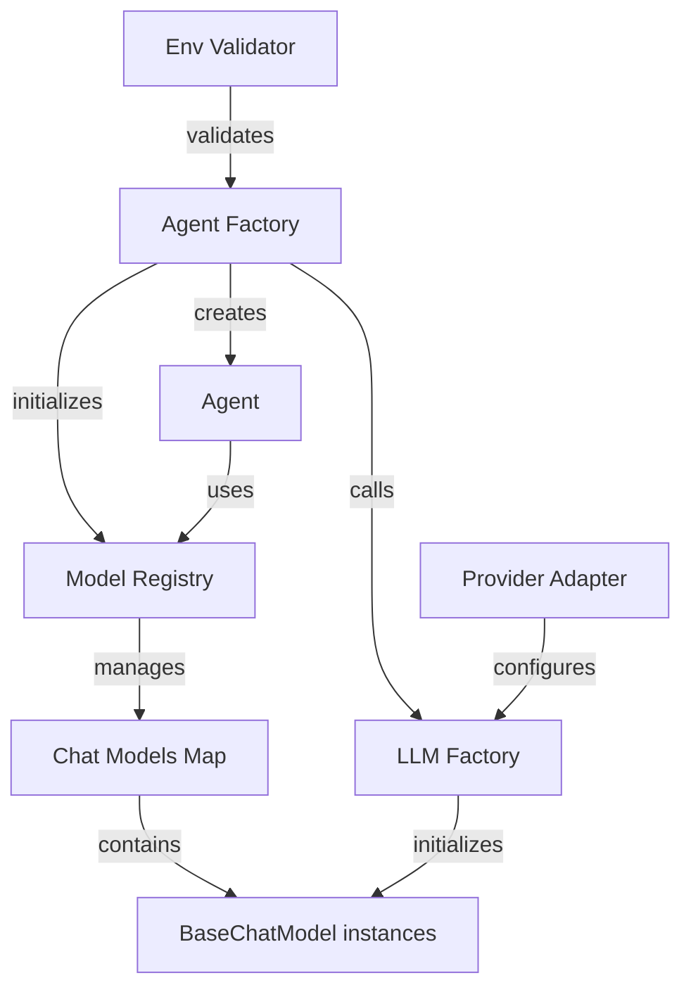
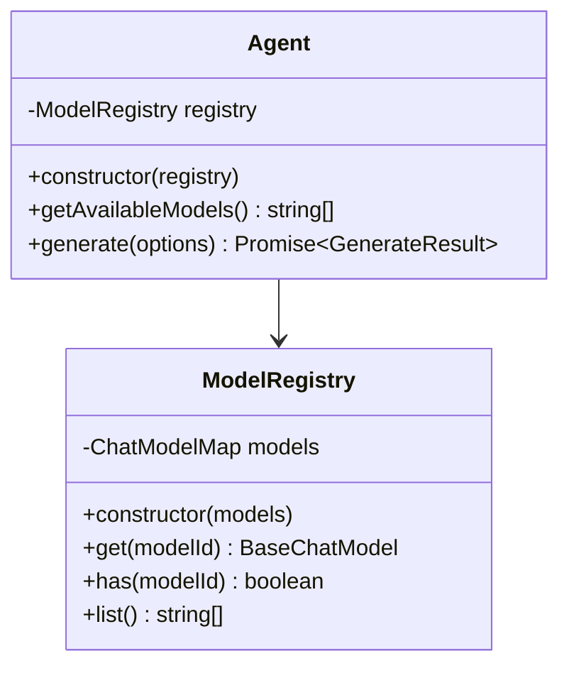
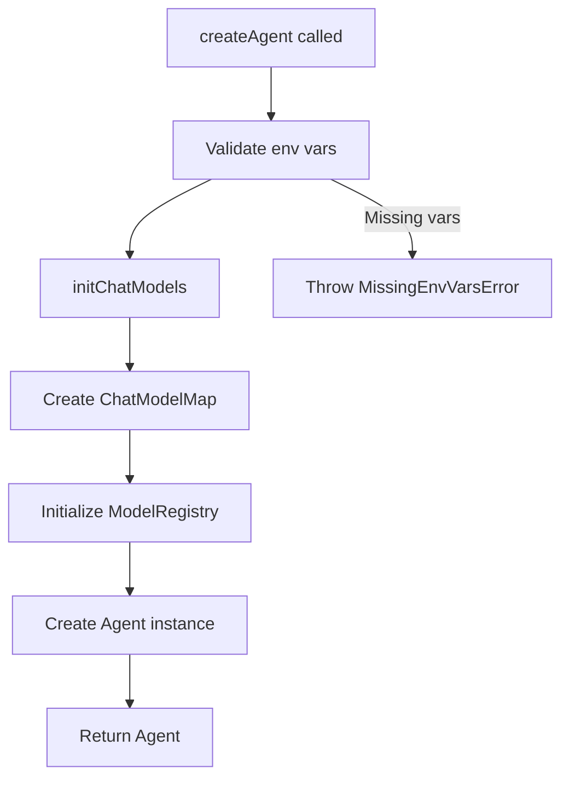
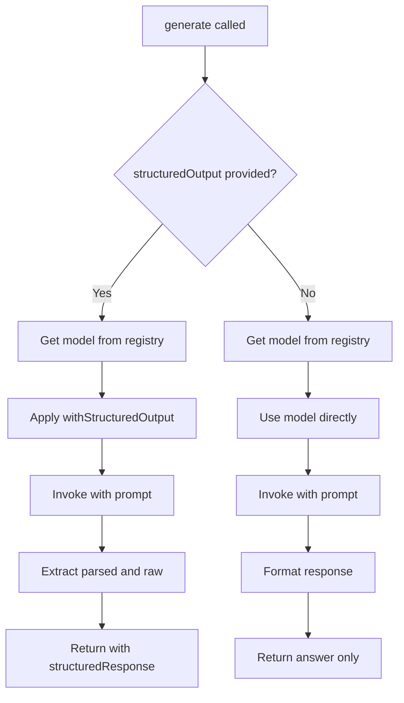
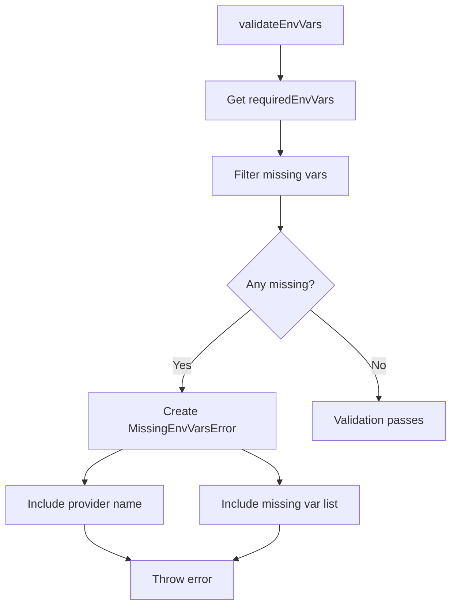

# Agent System & Model Registry

The Agent System provides a flexible abstraction layer for interacting with multiple Large Language Model (LLM) providers within the repositories-wiki project. At its core, the system consists of the `Agent` class, which orchestrates model interactions, and the `ModelRegistry`, which manages initialized chat models. This architecture enables seamless switching between different LLM providers (OpenAI, Anthropic, Google GenAI, Azure OpenAI, Bedrock, and SAP AI Core) while maintaining a consistent interface for generating text and structured outputs. The agent factory pattern (`createAgent`) simplifies the initialization process by handling provider-specific configurations and model setup.

Sources: [packages/repository-wiki/src/coding-agent/index.ts](../../../packages/repository-wiki/src/coding-agent/index.ts), [packages/repository-wiki/src/coding-agent/types.ts:1-53](../../../packages/repository-wiki/src/coding-agent/types.ts#L1-L53)

## Architecture Overview

The Agent System follows a layered architecture with clear separation of concerns:



The factory pattern centralizes the creation logic, while the registry pattern provides efficient model lookup and management. This design allows the system to support multiple models simultaneously and switch between them dynamically during runtime.

Sources: [packages/repository-wiki/src/coding-agent/agent/agent-factory.ts:1-17](../../../packages/repository-wiki/src/coding-agent/agent/agent-factory.ts#L1-L17), [packages/repository-wiki/src/coding-agent/agent/model-registry.ts:1-27](../../../packages/repository-wiki/src/coding-agent/agent/model-registry.ts#L1-L27)

## Core Components

### Agent Class

The `Agent` class serves as the primary interface for generating LLM responses. It delegates model management to the `ModelRegistry` and provides two main capabilities: listing available models and generating responses (both unstructured and structured).



The `generate` method supports optional structured output using Zod schemas. When a schema is provided, the agent configures the model to return parsed structured data alongside the raw response.

Sources: [packages/repository-wiki/src/coding-agent/agent/agent.ts:1-31](../../../packages/repository-wiki/src/coding-agent/agent/agent.ts#L1-L31)

### Model Registry

The `ModelRegistry` class manages a map of initialized chat models, providing type-safe access with error handling. It ensures that only registered models can be accessed and provides clear error messages when attempting to use uninitialized models.

Key methods:

| Method | Return Type | Description |
|--------|-------------|-------------|
| `get(modelId)` | `BaseChatModel` | Retrieves a model by ID, throws error if not found |
| `has(modelId)` | `boolean` | Checks if a model is registered |
| `list()` | `string[]` | Returns all registered model IDs |

The registry pattern prevents runtime errors by validating model availability before invocation and provides helpful debugging information by listing all available models in error messages.

Sources: [packages/repository-wiki/src/coding-agent/agent/model-registry.ts:5-27](../../../packages/repository-wiki/src/coding-agent/agent/model-registry.ts#L5-L27)

## Agent Creation Flow

The agent creation process involves multiple steps, from validation to initialization:



The `createAgent` factory function accepts models, provider type, optional parameters, and a logger. It coordinates the initialization of chat models through the LLM factory and constructs the registry before instantiating the agent.

Sources: [packages/repository-wiki/src/coding-agent/agent/agent-factory.ts:8-17](../../../packages/repository-wiki/src/coding-agent/agent/agent-factory.ts#L8-L17)

## Type System

### Supported Providers

The system supports six LLM providers through the `ModelProvider` type:

```typescript
type ModelProvider =
  | "openai"
  | "anthropic"
  | "azure_openai"
  | "google-genai"
  | "bedrock"
  | "sap-ai-core";
```

Each provider requires specific configuration defined by the `ProviderDefinition` interface, which includes the provider name, LangChain package, required environment variables, provider ID, and an adapter instance.

Sources: [packages/repository-wiki/src/coding-agent/types.ts:8-15](../../../packages/repository-wiki/src/coding-agent/types.ts#L8-L15), [packages/repository-wiki/src/coding-agent/types.ts:18-24](../../../packages/repository-wiki/src/coding-agent/types.ts#L18-L24)

### Configuration Options

| Interface | Properties | Description |
|-----------|------------|-------------|
| `AgentOptions` | `models: string[]`, `provider: ModelProvider`, `logger?: Logger` | Configuration for agent creation |
| `GenerateOptions` | `model: string`, `prompt: string`, `structuredOutput?: InteropZodType`, `projectPath?: string` | Options for generating responses |
| `GenerateResult<T>` | `answer: string`, `structuredResponse?: T` | Response containing text and optional structured data |
| `ModelParams` | `temperature?: number`, `maxTokens?: number`, `maxInputTokens?: number` | Model behavior parameters |

Default values are defined as constants:
- `DEFAULT_TEMPERATURE = 0.7`
- `DEFAULT_MAX_TOKENS = 16384`
- `DEFAULT_INPUT_MAX_TOKENS = 200000`

Sources: [packages/repository-wiki/src/coding-agent/types.ts:27-51](../../../packages/repository-wiki/src/coding-agent/types.ts#L27-L51)

## Generation Process

The generation workflow handles both standard text generation and structured output:



When structured output is requested, the agent applies the `withStructuredOutput` method to the chat model with `includeRaw: true`, enabling access to both the parsed structured data and the raw response. The raw response is formatted as a string for the `answer` field, while the parsed data is returned in the `structuredResponse` field.

Sources: [packages/repository-wiki/src/coding-agent/agent/agent.ts:13-31](../../../packages/repository-wiki/src/coding-agent/agent/agent.ts#L13-L31)

## Environment Validation

The system includes robust environment variable validation to prevent runtime errors due to missing credentials:



The `MissingEnvVarsError` class extends the standard Error with additional properties for programmatic access to the missing variables and provider name. This allows calling code to handle missing environment variables gracefully and provide detailed error messages to users.

Sources: [packages/repository-wiki/src/coding-agent/utils/env-validator.ts:1-36](../../../packages/repository-wiki/src/coding-agent/utils/env-validator.ts#L1-L36)

### Error Handling

The `MissingEnvVarsError` provides structured error information:

| Property | Type | Description |
|----------|------|-------------|
| `missingVars` | `string[]` | List of environment variable names that are missing or empty |
| `providerName` | `string` | Name of the provider requiring the variables |
| `message` | `string` | Detailed error message with instructions |

The error message format includes the provider name, the list of missing variables, and guidance to set them in `process.env` before agent creation.

Sources: [packages/repository-wiki/src/coding-agent/utils/env-validator.ts:6-19](../../../packages/repository-wiki/src/coding-agent/utils/env-validator.ts#L6-L19)

## Usage Patterns

### Basic Agent Creation

```typescript
const agent = await createAgent(
  ["gpt-4", "gpt-3.5-turbo"],
  "openai",
  { temperature: 0.7, maxTokens: 16384 },
  logger
);
```

### Generating Responses

```typescript
// Standard text generation
const result = await agent.generate({
  model: "gpt-4",
  prompt: "Explain the Agent System architecture"
});
console.log(result.answer);

// Structured output generation
const structuredResult = await agent.generate({
  model: "gpt-4",
  prompt: "Extract key components",
  structuredOutput: myZodSchema
});
console.log(structuredResult.structuredResponse);
```

Sources: [packages/repository-wiki/src/coding-agent/agent/agent.ts:13-31](../../../packages/repository-wiki/src/coding-agent/agent/agent.ts#L13-L31), [packages/repository-wiki/src/coding-agent/agent/agent-factory.ts:8-17](../../../packages/repository-wiki/src/coding-agent/agent/agent-factory.ts#L8-L17)

## Summary

The Agent System and Model Registry provide a robust, extensible foundation for LLM interactions within the repositories-wiki project. The architecture separates concerns between agent orchestration, model management, and provider-specific configurations, enabling support for multiple providers and models simultaneously. Key features include type-safe model access, structured output generation with Zod schemas, comprehensive environment validation, and flexible configuration options. This design ensures maintainability and scalability as new providers and models are added to the system.

Sources: [packages/repository-wiki/src/coding-agent/index.ts](../../../packages/repository-wiki/src/coding-agent/index.ts), [packages/repository-wiki/src/coding-agent/agent/agent.ts](../../../packages/repository-wiki/src/coding-agent/agent/agent.ts), [packages/repository-wiki/src/coding-agent/agent/model-registry.ts](../../../packages/repository-wiki/src/coding-agent/agent/model-registry.ts)