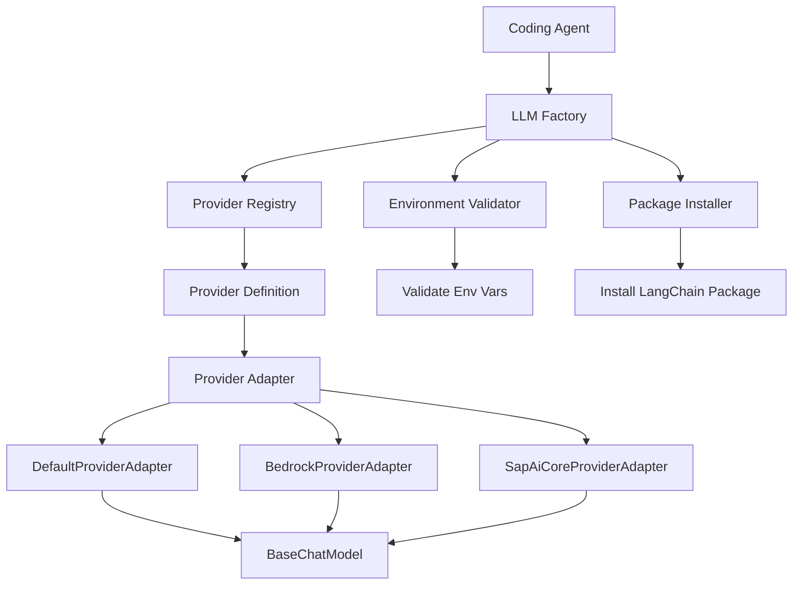
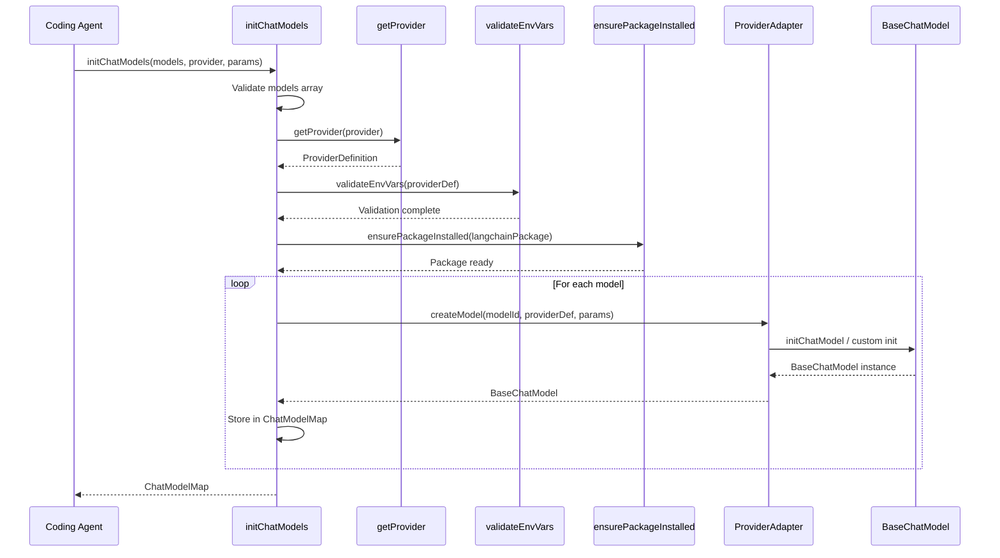

# LLM Provider Adapters & Configuration

## Introduction

The LLM Provider Adapters & Configuration system provides a flexible, extensible architecture for integrating multiple Large Language Model (LLM) providers into the repositories-wiki project. This system abstracts provider-specific implementation details behind a common interface, enabling seamless switching between different LLM services such as OpenAI, Anthropic, AWS Bedrock, Google GenAI, Azure OpenAI, and SAP AI Core. The architecture employs the Adapter pattern to handle provider-specific initialization logic, credential management, and model configuration, while maintaining a consistent API for the rest of the application.

The system consists of three core components: provider adapters that handle model instantiation, a provider registry that defines supported providers and their requirements, and a factory system that orchestrates model initialization with automatic package installation and environment validation. This design allows the coding agent to work with any supported LLM provider through a unified interface while accommodating provider-specific requirements.

Sources: [provider-adapter.ts](../../../packages/repository-wiki/src/coding-agent/llms/provider-adapter.ts), [provider-config.ts](../../../packages/repository-wiki/src/coding-agent/llms/provider-config.ts), [llm-factory.ts](../../../packages/repository-wiki/src/coding-agent/llms/llm-factory.ts)

## Architecture Overview



The architecture follows a factory pattern with adapter-based provider implementations. The LLM Factory serves as the central orchestrator, coordinating provider lookup, environment validation, package installation, and model instantiation. Each provider is defined with metadata including required environment variables, LangChain package dependencies, and a specific adapter implementation that handles provider-specific initialization logic.

Sources: [llm-factory.ts:1-47](../../../packages/repository-wiki/src/coding-agent/llms/llm-factory.ts#L1-L47), [provider-config.ts:1-60](../../../packages/repository-wiki/src/coding-agent/llms/provider-config.ts#L1-L60)

## Provider Adapter Interface

### ProviderAdapter Contract

The `ProviderAdapter` interface defines a single method that all provider adapters must implement:

```typescript
export interface ProviderAdapter {
  createModel(
    modelId: string,
    provider: ProviderDefinition,
    params?: ModelParams,
  ): Promise<BaseChatModel>;
}
```

This interface ensures that all adapters can create a LangChain `BaseChatModel` instance given a model identifier, provider definition, and optional configuration parameters. The abstraction allows the factory to treat all providers uniformly while delegating provider-specific logic to the adapter implementations.

Sources: [provider-adapter.ts:9-15](../../../packages/repository-wiki/src/coding-agent/llms/provider-adapter.ts#L9-L15)

### Adapter Implementations

The system provides three adapter implementations to handle different provider requirements:

| Adapter Class | Purpose | Providers Using It |
|--------------|---------|-------------------|
| `DefaultProviderAdapter` | Standard LangChain initialization via `initChatModel` | OpenAI, Anthropic, Azure OpenAI, Google GenAI |
| `BedrockProviderAdapter` | AWS Bedrock with custom credential handling | AWS Bedrock |
| `SapAiCoreProviderAdapter` | SAP-specific SDK integration via OrchestrationClient | SAP AI Core |

Sources: [provider-adapter.ts:18-76](../../../packages/repository-wiki/src/coding-agent/llms/provider-adapter.ts#L18-L76), [provider-config.ts:8-10](../../../packages/repository-wiki/src/coding-agent/llms/provider-config.ts#L8-L10)

### DefaultProviderAdapter

The `DefaultProviderAdapter` handles the majority of providers using LangChain's universal `initChatModel` function:

```typescript
export class DefaultProviderAdapter implements ProviderAdapter {
  async createModel(
    modelId: string,
    provider: ProviderDefinition,
    params?: ModelParams,
  ): Promise<BaseChatModel> {
    const temperature = params?.temperature ?? DEFAULT_TEMPERATURE;
    const maxTokens = params?.maxTokens ?? DEFAULT_MAX_TOKENS;
    const maxInputTokens = params?.maxInputTokens ?? DEFAULT_INPUT_MAX_TOKENS;
    const modelString = buildModelString(modelId, provider);

    return await initChatModel(modelString, {
      temperature,
      maxTokens,
      maxInputTokens
    });
  }
}
```

This adapter applies default parameter values (temperature: 0.7, maxTokens: 16384, maxInputTokens: 200000) and constructs a provider-prefixed model string (e.g., "openai:gpt-4") for LangChain initialization.

Sources: [provider-adapter.ts:18-34](../../../packages/repository-wiki/src/coding-agent/llms/provider-adapter.ts#L18-L34), [types.ts:48-50](../../../packages/repository-wiki/src/coding-agent/types.ts#L48-L50)

### BedrockProviderAdapter

The `BedrockProviderAdapter` extends the default behavior to inject AWS credentials from environment variables:

```typescript
export class BedrockProviderAdapter implements ProviderAdapter {
  async createModel(
    modelId: string,
    provider: ProviderDefinition,
    params?: ModelParams,
  ): Promise<BaseChatModel> {
    const temperature = params?.temperature ?? DEFAULT_TEMPERATURE;
    const maxTokens = params?.maxTokens ?? DEFAULT_MAX_TOKENS;
    const maxInputTokens = params?.maxInputTokens ?? DEFAULT_INPUT_MAX_TOKENS;
    const modelString = buildModelString(modelId, provider);

    return await initChatModel(modelString, {
      region: process.env.AWS_REGION,
      credentials: {
        accessKeyId: process.env.AWS_ACCESS_KEY_ID!,
        secretAccessKey: process.env.AWS_SECRET_ACCESS_KEY!,
      },
      temperature,
      maxTokens,
      maxInputTokens
    });
  }
}
```

This adapter explicitly passes AWS region and credentials to handle Bedrock's authentication requirements, which differ from API-key-based providers.

Sources: [provider-adapter.ts:36-59](../../../packages/repository-wiki/src/coding-agent/llms/provider-adapter.ts#L36-L59)

### SapAiCoreProviderAdapter

The `SapAiCoreProviderAdapter` uses SAP's proprietary SDK instead of standard LangChain initialization:

```typescript
export class SapAiCoreProviderAdapter implements ProviderAdapter {
  async createModel(
    modelId: string,
    _provider: ProviderDefinition,
    params?: ModelParams,
  ): Promise<BaseChatModel> {
    const temperature = params?.temperature ?? DEFAULT_TEMPERATURE;
    const maxTokens = params?.maxTokens ?? DEFAULT_MAX_TOKENS;
    const maxInputTokens = params?.maxInputTokens ?? DEFAULT_INPUT_MAX_TOKENS;

    const pkg = "@sap-ai-sdk/langchain";
    const sapLangchain = await import(pkg);
    const client = new sapLangchain.OrchestrationClient({
      promptTemplating: {
        model: {
          name: modelId,
          params: {
            temperature,
            maxTokens,
            maxInputTokens
          },
        },
      },
    }) as BaseChatModel;

    return client ;
  }
}
```

This adapter dynamically imports the SAP AI SDK and instantiates an `OrchestrationClient` with provider-specific configuration structure, demonstrating the flexibility of the adapter pattern to accommodate non-standard initialization patterns.

Sources: [provider-adapter.ts:62-89](../../../packages/repository-wiki/src/coding-agent/llms/provider-adapter.ts#L62-L89)

## Provider Registry

### Provider Definitions

The provider registry (`PROVIDERS`) maps provider identifiers to their complete definitions:

```typescript
export const PROVIDERS: Record<ModelProvider, ProviderDefinition> = {
  openai: {
    name: "OpenAI",
    langchainPackage: "@langchain/openai",
    requiredEnvVars: ["OPENAI_API_KEY"],
    providerID: "openai",
    adapter: defaultAdapter,
  },
  anthropic: {
    name: "Anthropic",
    langchainPackage: "@langchain/anthropic",
    requiredEnvVars: ["ANTHROPIC_API_KEY"],
    providerID: "anthropic",
    adapter: defaultAdapter,
  },
  // ... additional providers
};
```

Each `ProviderDefinition` contains:

| Field | Type | Description |
|-------|------|-------------|
| `name` | `string` | Human-readable provider name |
| `langchainPackage` | `string` | NPM package name for LangChain integration |
| `requiredEnvVars` | `string[]` | Environment variables that must be set |
| `providerID` | `string` | Identifier used in model string construction |
| `adapter` | `ProviderAdapter` | Adapter instance for model creation |

Sources: [provider-config.ts:12-60](../../../packages/repository-wiki/src/coding-agent/llms/provider-config.ts#L12-L60), [types.ts:15-21](../../../packages/repository-wiki/src/coding-agent/types.ts#L15-L21)

### Supported Providers

The system currently supports six LLM providers:

| Provider Key | Provider Name | LangChain Package | Required Environment Variables |
|-------------|---------------|-------------------|-------------------------------|
| `openai` | OpenAI | `@langchain/openai` | `OPENAI_API_KEY` |
| `anthropic` | Anthropic | `@langchain/anthropic` | `ANTHROPIC_API_KEY` |
| `azure_openai` | Azure OpenAI | `@langchain/azure` | `AZURE_OPENAI_API_KEY`, `AZURE_OPENAI_ENDPOINT`, `OPENAI_API_VERSION` |
| `google-genai` | Google GenAI | `@langchain/google-genai` | `GOOGLE_API_KEY` |
| `bedrock` | AWS Bedrock | `@langchain/aws` | `AWS_ACCESS_KEY_ID`, `AWS_SECRET_ACCESS_KEY`, `AWS_REGION` |
| `sap-ai-core` | SAP AI Core | `@sap-ai-sdk/langchain` | `AICORE_SERVICE_KEY` |

The `SUPPORTED_PROVIDERS` constant provides a list of all valid provider keys for validation purposes.

Sources: [provider-config.ts:12-60](../../../packages/repository-wiki/src/coding-agent/llms/provider-config.ts#L12-L60), [types.ts:8-14](../../../packages/repository-wiki/src/coding-agent/types.ts#L8-L14)

## Model Initialization Flow

### Initialization Sequence



The initialization flow orchestrates multiple validation and setup steps before creating model instances. This ensures all prerequisites are met before attempting model instantiation.

Sources: [llm-factory.ts:18-47](../../../packages/repository-wiki/src/coding-agent/llms/llm-factory.ts#L18-L47)

### initChatModels Function

The `initChatModels` function serves as the main entry point for initializing one or more chat models:

```typescript
export async function initChatModels(
  models: string[],
  provider: ModelProvider,
  params?: ModelParams,
  logger: Logger = defaultLogger
): Promise<ChatModelMap> {
  if (!models.length) {
    throw new Error("At least one model must be provided.");
  }

  const providerDef = getProvider(provider);

  validateEnvVars(providerDef);

  await ensurePackageInstalled(providerDef.langchainPackage, logger);

  const chatModels: ChatModelMap = new Map();

  for (const modelId of models) {
    logger.info(`Initializing model "${modelId}" for provider "${provider}"...`);

    const chatModel = await createChatModel(modelId, providerDef, params);
    chatModels.set(modelId, chatModel);

    logger.info(`Model "${modelId}" initialized successfully.`);
  }

  return chatModels;
}
```

The function validates inputs, retrieves the provider definition, validates environment variables, ensures the required LangChain package is installed, and then iterates through the requested models to create and store each instance in a `ChatModelMap` (a `Map<string, BaseChatModel>`).

Sources: [llm-factory.ts:18-47](../../../packages/repository-wiki/src/coding-agent/llms/llm-factory.ts#L18-L47), [types.ts:53](../../../packages/repository-wiki/src/coding-agent/types.ts#L53)

## Provider Utilities

### Provider Lookup and Validation

The `getProvider` function retrieves provider definitions with validation:

```typescript
export function getProvider(provider: ModelProvider): ProviderDefinition {
  const definition = PROVIDERS[provider];

  if (!definition) {
    throw new UnsupportedProviderError(provider);
  }

  return definition;
}
```

If an unsupported provider is requested, it throws an `UnsupportedProviderError` with details about the invalid provider and a list of supported alternatives:

```typescript
export class UnsupportedProviderError extends Error {
  public readonly provider: string;
  public readonly supportedProviders: string[];

  constructor(provider: string) {
    const supported = SUPPORTED_PROVIDERS.join(", ");
    super(
      `Unsupported provider: "${provider}". ` +
        `Supported providers are: ${supported}`
    );
    this.name = "UnsupportedProviderError";
    this.provider = provider;
    this.supportedProviders = [...SUPPORTED_PROVIDERS];
  }
}
```

Sources: [utils.ts:31-40](../../../packages/repository-wiki/src/coding-agent/llms/utils.ts#L31-L40), [utils.ts:11-26](../../../packages/repository-wiki/src/coding-agent/llms/utils.ts#L11-L26)

### Model String Construction

The `buildModelString` function constructs provider-prefixed model identifiers:

```typescript
export function buildModelString(
  modelId: string,
  provider: ProviderDefinition
): string {
  return `${provider.providerID}:${modelId}`;
}
```

This creates strings like "openai:gpt-4" or "anthropic:claude-3-opus-20240229" that LangChain's universal model initialization can parse to determine the appropriate provider.

Sources: [utils.ts:43-48](../../../packages/repository-wiki/src/coding-agent/llms/utils.ts#L43-L48)

## Package Installation System

### Automatic Dependency Installation

The package installer ensures required LangChain packages are available at runtime:

```typescript
export async function ensurePackageInstalled(
  packageName: string,
  logger: Logger = defaultLogger,
): Promise<void> {
  if (!SAFE_PACKAGE_NAME.test(packageName)) {
    throw new UnsafePackageNameError(packageName);
  }

  // Fast path: package is already installed
  if (await isPackageInstalled(packageName)) {
    return;
  }

  logger.info(
    `Package "${packageName}" not found. Installing... (one-time setup)`
  );

  try {
    execSync(`npm install --prefix "${CLI_ROOT}" ${packageName}`, {
      stdio: "pipe",
      timeout: 120_000, // 2 minute timeout
    });
  } catch (error) {
    throw new PackageInstallError(packageName, error);
  }

  // Verify the install succeeded
  if (!(await isPackageInstalled(packageName))) {
    throw new PackageInstallError(packageName);
  }

  logger.info(`Package "${packageName}" installed successfully.`);
}
```

The function implements several safety measures:

1. **Package Name Validation**: Uses a regex pattern to validate package names and prevent command injection
2. **Fast Path Check**: Attempts to import the package first to avoid unnecessary installations
3. **Timeout Protection**: Limits installation time to 2 minutes
4. **Post-Install Verification**: Confirms the package is importable after installation

Sources: [package-installer.ts:48-81](../../../packages/repository-wiki/src/coding-agent/utils/package-installer.ts#L48-L81)

### Security Validation

The system validates package names against a strict pattern to prevent injection attacks:

```typescript
const SAFE_PACKAGE_NAME = /^(@[a-z0-9][\w.-]*\/)?[a-z0-9][\w.-]*$/i;
```

This regex matches valid npm package names (both scoped like `@langchain/openai` and unscoped like `lodash`) while rejecting potentially malicious inputs like `; rm -rf /` or `foo && bar`.

Sources: [package-installer.ts:19-24](../../../packages/repository-wiki/src/coding-agent/utils/package-installer.ts#L19-L24)

### Error Handling

The package installer defines custom error types for specific failure scenarios:

| Error Class | Thrown When | Properties |
|-------------|-------------|------------|
| `UnsafePackageNameError` | Package name fails regex validation | `packageName: string` |
| `PackageInstallError` | Installation fails or post-verification fails | `packageName: string`, `cause?: unknown` |

These typed errors allow calling code to distinguish between security violations and installation failures.

Sources: [package-installer.ts:27-46](../../../packages/repository-wiki/src/coding-agent/utils/package-installer.ts#L27-L46)

## Configuration and Parameters

### Model Parameters

The system supports three configurable parameters for model behavior:

```typescript
export interface ModelParams {
  temperature?: number;
  maxTokens?: number;
  maxInputTokens?: number;
}

export const DEFAULT_TEMPERATURE = 0.7;
export const DEFAULT_MAX_TOKENS = 16384;
export const DEFAULT_INPUT_MAX_TOKENS = 200000;
```

| Parameter | Type | Default | Description |
|-----------|------|---------|-------------|
| `temperature` | `number` | 0.7 | Controls randomness in model outputs (0.0-1.0) |
| `maxTokens` | `number` | 16384 | Maximum tokens in model response |
| `maxInputTokens` | `number` | 200000 | Maximum tokens in input context |

These parameters are applied consistently across all adapters, though provider-specific limitations may override these values.

Sources: [types.ts:41-50](../../../packages/repository-wiki/src/coding-agent/types.ts#L41-L50), [provider-adapter.ts:5-6](../../../packages/repository-wiki/src/coding-agent/llms/provider-adapter.ts#L5-L6)

### Agent Options

The coding agent accepts configuration through the `AgentOptions` interface:

```typescript
export interface AgentOptions {
  models: string[];
  provider: ModelProvider;
  logger?: Logger;
}
```

This interface defines the minimum required configuration to initialize the agent with one or more models from a specific provider, with optional custom logging.

Sources: [types.ts:24-28](../../../packages/repository-wiki/src/coding-agent/types.ts#L24-L28)

## Type Definitions

### Core Types

The system defines several key types for type safety and code organization:

```typescript
export type ModelProvider =
  | "openai"
  | "anthropic"
  | "azure_openai"
  | "google-genai"
  | "bedrock"
  | "sap-ai-core";

export type ChatModelMap = Map<string, BaseChatModel>;
```

The `ModelProvider` union type restricts provider values to supported options, enabling compile-time validation. The `ChatModelMap` type alias provides semantic meaning to the Map structure used for storing initialized models.

Sources: [types.ts:8-14](../../../packages/repository-wiki/src/coding-agent/types.ts#L8-L14), [types.ts:53](../../../packages/repository-wiki/src/coding-agent/types.ts#L53)

## Summary

The LLM Provider Adapters & Configuration system provides a robust, extensible framework for integrating multiple LLM providers into the repositories-wiki project. Through the Adapter pattern, it abstracts provider-specific initialization logic while maintaining a consistent interface for the coding agent. The system handles environment validation, automatic package installation, and provider-specific authentication requirements transparently.

Key strengths of this architecture include:

- **Extensibility**: New providers can be added by implementing a `ProviderAdapter` and registering a `ProviderDefinition`
- **Safety**: Package name validation and environment variable checks prevent security issues and runtime errors
- **Flexibility**: Support for both standard LangChain providers and custom SDKs (like SAP AI Core)
- **Developer Experience**: Automatic package installation eliminates manual setup steps
- **Type Safety**: Comprehensive TypeScript types prevent configuration errors at compile time

This design enables the repositories-wiki project to leverage the best models from multiple providers while maintaining clean, maintainable code that can easily adapt to new LLM services as they emerge.

Sources: [llm-factory.ts](../../../packages/repository-wiki/src/coding-agent/llms/llm-factory.ts), [provider-adapter.ts](../../../packages/repository-wiki/src/coding-agent/llms/provider-adapter.ts), [provider-config.ts](../../../packages/repository-wiki/src/coding-agent/llms/provider-config.ts), [utils.ts](../../../packages/repository-wiki/src/coding-agent/llms/utils.ts), [package-installer.ts](../../../packages/repository-wiki/src/coding-agent/utils/package-installer.ts), [types.ts](../../../packages/repository-wiki/src/coding-agent/types.ts)