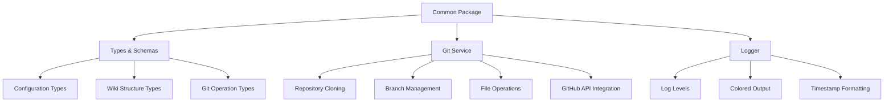
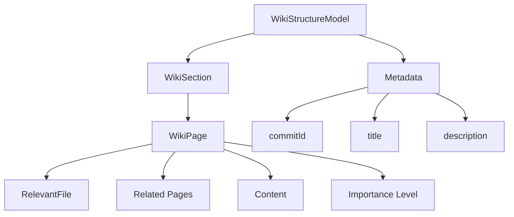
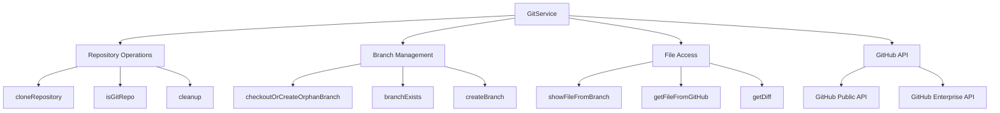
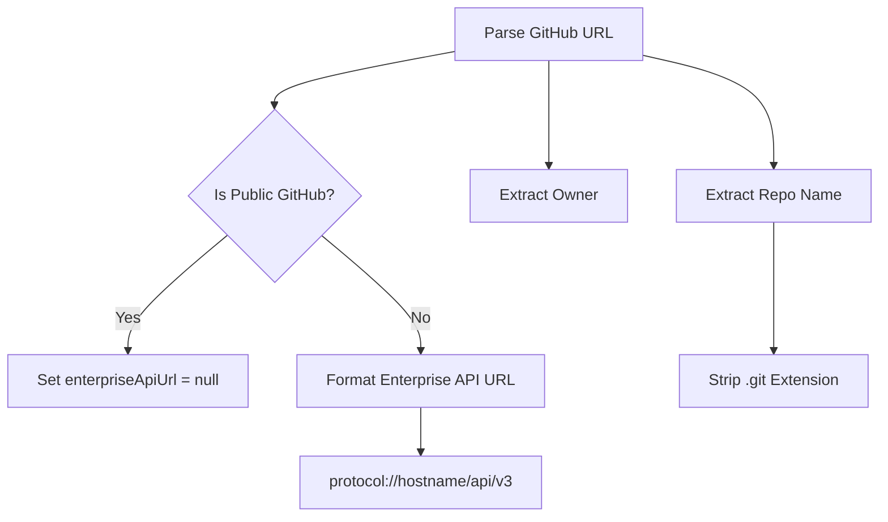
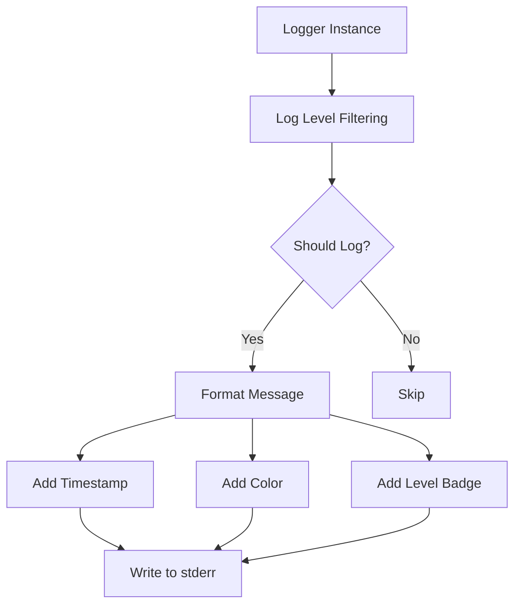

# Shared Types, Git Service & Utilities

## Introduction

The `@repositories-wiki/common` package serves as the foundational layer for the repositories-wiki monorepo, providing shared types, utilities, and services used across all other packages. This package centralizes core functionality including Git operations, logging infrastructure, and comprehensive type definitions using Zod schemas for runtime validation. By consolidating these common components, the package ensures consistency, type safety, and reusability throughout the wiki generation pipeline.

The package exports two primary utilities—`GitService` for repository operations and `Logger` for structured logging—alongside a comprehensive set of TypeScript types and Zod schemas that define the data structures for wiki generation configuration, wiki structure models, and Git operations.

Sources: [packages/common/src/index.ts:1-8](../../../packages/common/src/index.ts#L1-L8), [packages/common/package.json:1-31](../../../packages/common/package.json#L1-L31)

## Architecture Overview



The common package follows a modular architecture where types are defined using Zod schemas for runtime validation, and utilities are implemented as singleton services. The `GitService` class encapsulates all Git-related operations, while the `Logger` class provides a configurable logging interface.

Sources: [packages/common/src/index.ts](../../../packages/common/src/index.ts), [packages/common/src/types.ts](../../../packages/common/src/types.ts)

## Type Definitions and Schemas

### Configuration Types

The package defines comprehensive configuration schemas for the wiki generation process:

| Schema | Purpose | Key Fields |
|--------|---------|------------|
| `WikiGeneratorConfigSchema` | Main configuration for wiki generation | `repositoryUrl`, `localRepoPath`, `githubToken`, `providerConfig`, `llmPlaner`, `llmExploration`, `llmBuilder` |
| `ProviderConfigSchema` | LLM provider configuration | `providerID` |
| `LlmConfigSchema` | Individual LLM model configuration | `modelID` |

The `WikiGeneratorConfigSchema` includes sophisticated validation logic with refinements:

- Ensures either `repositoryUrl` or `localRepoPath` is provided (but not both)
- Requires `githubToken` when using `repositoryUrl` or when `pushToGithub` is enabled
- Supports optional parameters like `wikiBranch`, `commitId`, and `outputDirPath`

Sources: [packages/common/src/types.ts:14-32](../../../packages/common/src/types.ts#L14-L32)

### Wiki Structure Types

The wiki structure is defined through a hierarchical schema system:



The schema hierarchy supports:

- **WikiStructureModel**: Top-level structure containing sections, title, description, and commit ID
- **WikiSection**: Organizational units grouping related pages
- **WikiPage**: Individual documentation pages with content, relevant files, and relationships
- **RelevantFile**: Links to source files with optional importance ratings

Sources: [packages/common/src/types.ts:34-56](../../../packages/common/src/types.ts#L34-L56)

### Git Operation Types

Git-related operations are supported by specialized interfaces:

| Type | Description | Fields |
|------|-------------|--------|
| `CloneOptions` | Options for repository cloning | `token`, `commitId`, `targetDir`, `branch` |
| `CloneResult` | Result of clone operation | `repoPath`, `commitId`, `repoName` |
| `ParsedGithubUrl` | Parsed GitHub URL components | `owner`, `repo`, `enterpriseApiUrl` |

These types enable flexible Git operations including authentication, specific commit checkout, and custom target directories.

Sources: [packages/common/src/types.ts:3-12](../../../packages/common/src/types.ts#L3-L12), [packages/common/src/types.ts:80-84](../../../packages/common/src/types.ts#L80-L84)

### Output Schemas

The package distinguishes between internal models and output schemas. The `WikiStructureOutputSchema` is a variant of `WikiStructureModelSchema` where:

- `WikiPage` content is optional (omitted during structure generation)
- `relevantFiles` is simplified to an array of file path strings
- This separation optimizes the structure generation phase before content population

Sources: [packages/common/src/types.ts:58-68](../../../packages/common/src/types.ts#L58-L68)

## Git Service

### Core Functionality

The `GitService` class provides a comprehensive interface for Git operations, implemented as a singleton instance. It wraps the `simple-git` library with additional functionality specific to the wiki generation workflow.



Sources: [packages/common/src/utils/git.ts:8-218](../../../packages/common/src/utils/git.ts#L8-L218)

### Repository Cloning

The `cloneRepository` method supports flexible cloning with authentication and checkout options:

```typescript
async cloneRepository(
  url: string,
  options: CloneOptions = {}
): Promise<CloneResult>
```

**Key Features:**

1. **Token Authentication**: Injects GitHub tokens into clone URLs by modifying the URL to include credentials
2. **Target Directory**: Uses provided `targetDir` or creates a temporary directory
3. **Branch Checkout**: Optionally checks out a specific branch after cloning
4. **Commit Checkout**: Optionally checks out a specific commit ID
5. **Commit ID Resolution**: Returns the current HEAD commit using `revparse`

The method handles both standard GitHub URLs and GitHub Enterprise URLs, automatically formatting authentication credentials.

Sources: [packages/common/src/utils/git.ts:67-117](../../../packages/common/src/utils/git.ts#L67-L117)

### GitHub URL Parsing

The service includes robust GitHub URL parsing supporting both public GitHub and GitHub Enterprise:



The `parseGithubUrl` method:

- Extracts owner and repository name from URL paths
- Strips `.git` extensions if present
- Detects GitHub Enterprise instances by hostname
- Formats Enterprise API URLs with the standard `/api/v3` path

Sources: [packages/common/src/utils/git.ts:14-50](../../../packages/common/src/utils/git.ts#L14-L50)

### Branch Management

The service provides sophisticated branch management capabilities:

**Orphan Branch Creation:**

```typescript
async checkoutOrCreateOrphanBranch(
  repoPath: string,
  branch: string
): Promise<void>
```

This method creates orphan branches (branches with no history) for wiki storage, checking if the branch exists remotely or locally before creating it. Orphan branches are useful for storing generated documentation separately from source code history.

**Branch Operations:**

- `branchExists`: Checks for branch existence in local or remote repositories
- `createBranch`: Creates and checks out a new branch from the current commit
- `push`: Pushes branches with optional force flag and upstream tracking

Sources: [packages/common/src/utils/git.ts:119-149](../../../packages/common/src/utils/git.ts#L119-L149), [packages/common/src/utils/git.ts:181-184](../../../packages/common/src/utils/git.ts#L181-L184), [packages/common/src/utils/git.ts:195-199](../../../packages/common/src/utils/git.ts#L195-L199)

### File Access Methods

The service provides multiple methods for accessing file contents:

**Local Branch File Access:**

```typescript
async showFileFromBranch(
  repoPath: string,
  branch: string,
  filePath: string
): Promise<string | null>
```

Uses `git show` to read file contents from a specific branch without checking it out. Attempts remote branch first, then falls back to local branch.

**GitHub API File Access:**

```typescript
async getFileFromGitHub(
  repositoryUrl: string,
  filePath: string,
  ref: string,
  token?: string
): Promise<string | null>
```

Fetches file contents directly from GitHub's REST API without cloning:

- Supports both public GitHub and GitHub Enterprise
- Handles authentication via Bearer tokens
- Decodes Base64-encoded content from the API response
- Returns `null` for non-existent files or directories

The method includes comprehensive error handling and logging for debugging purposes.

Sources: [packages/common/src/utils/git.ts:201-223](../../../packages/common/src/utils/git.ts#L201-L223), [packages/common/src/utils/git.ts:225-276](../../../packages/common/src/utils/git.ts#L225-L276)

### Commit Operations

The service supports standard Git commit workflows:

| Method | Purpose | Parameters |
|--------|---------|------------|
| `addAll` | Stage all changes | `repoPath` |
| `addPath` | Stage specific path | `repoPath`, `targetPath` |
| `commit` | Create commit | `repoPath`, `message` |
| `getDiff` | Get diff between commits | `repoPath`, `fromCommit`, `toCommit` |

These methods enable the wiki generation process to commit and track changes to generated documentation.

Sources: [packages/common/src/utils/git.ts:186-193](../../../packages/common/src/utils/git.ts#L186-L193), [packages/common/src/utils/git.ts:151-154](../../../packages/common/src/utils/git.ts#L151-L154)

## Logger Utility

### Logger Architecture

The `Logger` class provides a configurable, colored logging system with timestamp support:



**Log Levels:**

The logger supports four hierarchical log levels with numeric priorities:

| Level | Priority | Color | Usage |
|-------|----------|-------|-------|
| `debug` | 0 | Cyan | Detailed debugging information |
| `info` | 1 | Green | General informational messages |
| `warn` | 2 | Yellow | Warning messages |
| `error` | 3 | Red | Error messages |

Messages are only logged if their level meets or exceeds the configured threshold.

Sources: [packages/common/src/utils/logger.ts:1-19](../../../packages/common/src/utils/logger.ts#L1-L19)

### Message Formatting

The logger formats messages with:

1. **ISO 8601 Timestamp**: Gray-colored timestamp for each log entry
2. **Colored Level Badge**: Bold, colored level indicator (e.g., `[INFO]`, `[ERROR]`)
3. **Message Content**: The primary log message
4. **Additional Arguments**: JSON-stringified extra arguments

All output is written to `stderr` to keep it separate from standard program output.

Sources: [packages/common/src/utils/logger.ts:28-38](../../../packages/common/src/utils/logger.ts#L28-L38)

### Usage Pattern

The logger is exported as a singleton instance:

```typescript
export const logger = new Logger();
```

The log level can be configured at runtime:

```typescript
logger.setLevel("debug"); // Show all messages
logger.setLevel("error"); // Show only errors
```

This singleton pattern ensures consistent logging configuration across the entire application.

Sources: [packages/common/src/utils/logger.ts:21-57](../../../packages/common/src/utils/logger.ts#L21-L57), [packages/common/src/index.ts:6-7](../../../packages/common/src/index.ts#L6-L7)

## Testing

### Git Service Tests

The package includes comprehensive unit tests for the `GitService` class, utilizing Vitest and mocking strategies:

**Test Coverage Areas:**

1. **Clone Operations**: Tests for default temp directory creation, custom target directories, and token injection
2. **Authentication**: Validates token injection into both public GitHub and Enterprise URLs
3. **Checkout Operations**: Tests branch and commit checkout, including order of operations
4. **Error Handling**: Validates propagation of clone failures and authentication errors

**Mock Strategy:**

The tests mock `simple-git` to avoid actual Git operations:

```typescript
const mockClone = vi.fn().mockResolvedValue(undefined);
const mockCheckout = vi.fn().mockResolvedValue(undefined);
const mockRevparse = vi.fn().mockResolvedValue("abc123def456");
```

This approach enables fast, deterministic tests without requiring actual repositories or network access.

Sources: [packages/common/__tests__/utils/git.test.ts:1-161](../../../packages/common/__tests__/utils/git.test.ts#L1-L161)

### Test Scenarios

Key test scenarios include:

**Token Injection Validation:**

```typescript
it("injects token into clone URL", async () => {
  await service.cloneRepository("https://github.com/owner/my-repo", {
    token: "ghp_secret123",
  });
  
  const clonedUrl = String(mockClone.mock.calls[0]![0]);
  const parsed = new URL(clonedUrl);
  expect(parsed.username).toBe("ghp_secret123");
  expect(parsed.password).toBe("x-oauth-basic");
});
```

This test validates that authentication tokens are correctly embedded in clone URLs for secure repository access.

**Branch and Commit Checkout Order:**

The tests verify that when both branch and commit ID are provided, the branch is checked out first, followed by the specific commit. This ensures the correct Git history state.

Sources: [packages/common/__tests__/utils/git.test.ts:54-64](../../../packages/common/__tests__/utils/git.test.ts#L54-L64), [packages/common/__tests__/utils/git.test.ts:106-120](../../../packages/common/__tests__/utils/git.test.ts#L106-L120)

## Package Configuration

The package is configured as an ES module with TypeScript compilation:

**Key Configuration:**

- **Type**: ES Module (`"type": "module"`)
- **Entry Point**: `dist/index.js` with TypeScript definitions at `dist/index.d.ts`
- **Dependencies**: `simple-git` for Git operations, `zod` for schema validation
- **Build**: TypeScript compilation via `tsc`
- **Test**: Vitest test runner

The package is marked as private and intended for internal monorepo use only.

Sources: [packages/common/package.json:1-31](../../../packages/common/package.json#L1-L31)

## Summary

The `@repositories-wiki/common` package provides essential shared infrastructure for the repositories-wiki project. Its comprehensive type system, powered by Zod schemas, ensures type safety and runtime validation throughout the wiki generation pipeline. The `GitService` offers robust Git operations with support for both public GitHub and GitHub Enterprise, including advanced features like orphan branch management and direct GitHub API file access. The `Logger` utility provides consistent, colored logging with configurable levels. Together, these components form a solid foundation that other packages in the monorepo depend upon for core functionality.