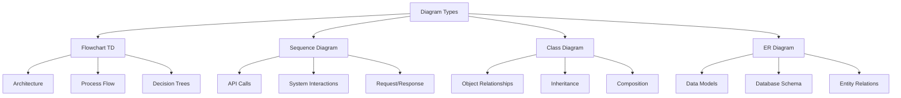
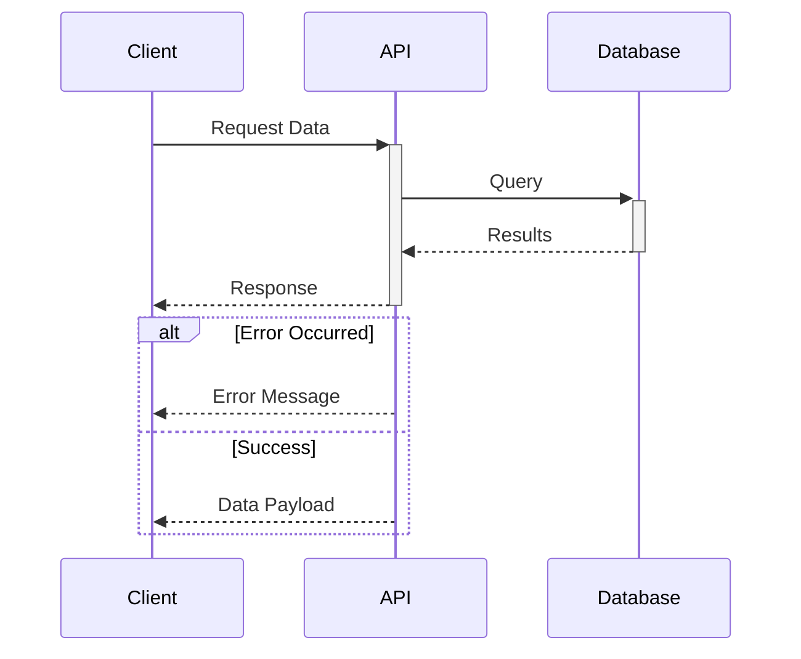

# Generated Wiki Examples & Structure

This page provides an overview of the example wiki outputs and documentation structure generated by the repositories-wiki system. The repositories-wiki project is designed to automatically generate comprehensive technical documentation from source code repositories using Large Language Models (LLMs), tree-sitter for code parsing, and a Model Context Protocol (MCP) server for orchestration. This page demonstrates the types of wiki pages that can be generated, their structural patterns, and the conventions used throughout the generated documentation to ensure consistency, readability, and technical accuracy.

The generated wiki pages follow a standardized structure that includes introductions, detailed technical sections with diagrams and tables, code examples where relevant, and comprehensive source citations. This approach ensures that developers can quickly understand complex systems while maintaining traceability back to the original source code.

## Wiki Page Structure and Components

### Standard Page Layout

Every generated wiki page follows a consistent structural pattern designed to maximize clarity and usability. The standard layout includes:

- **Title and Introduction**: A clear H1 heading followed by 1-2 paragraphs (up to 300 characters) explaining the purpose and scope
- **Detailed Sections**: Logical breakdown using H2 and H3 headings to organize content hierarchically
- **Visual Diagrams**: Mermaid diagrams to illustrate architecture, data flow, and relationships
- **Tabular Summaries**: Markdown tables for structured information like API parameters, configuration options, and data models
- **Code Snippets**: Optional inline code examples from source files to demonstrate implementation details
- **Source Citations**: Mandatory citations linking every piece of information back to specific source files and line numbers
- **Conclusion**: A brief summary paragraph reiterating key aspects and their significance

This structure ensures that technical documentation is both comprehensive and navigable, allowing developers to drill down into specific areas of interest while maintaining context of the overall system.

### Content Generation Principles

The wiki generation system adheres to strict principles to ensure accuracy and reliability:

1. **Source-Driven Content**: All information must be derived solely from provided source files
2. **No Inference**: The system does not infer, invent, or use external knowledge unless directly supported by code
3. **Comprehensive Citations**: Every significant piece of information includes citations to specific files and line numbers
4. **Multi-File Coverage**: Each wiki page must cite at least 5 different source files to ensure comprehensive coverage
5. **Technical Precision**: Uses correct technical terminology and maintains professional language suitable for developers

## Mermaid Diagram Standards

### Diagram Types and Usage

The wiki generation system employs four primary Mermaid diagram types, each suited to specific documentation needs:



### Critical Diagram Rules

The system enforces strict rules for diagram generation to ensure consistency and readability:

**Flowchart Rules:**
- Always use `graph TD` (top-down) orientation, NEVER `graph LR` (left-right)
- Maximum node width: 3-4 words to prevent text overflow
- Use descriptive node labels that clearly indicate purpose
- Avoid flowchart-style labels like `A--|label|-->B`

**Sequence Diagram Rules:**
- Define all participants first using the `participant` keyword
- Use `->>` for requests and `-->>` for responses
- Use `+`/`-` notation for activation boxes
- Always use format `A->>B: Label` for interactions
- Include structural elements: `loop`, `alt/else`, `opt`, `par/and`, `break`

**Example Sequence Diagram Structure:**



### Diagram Placement and Context

Diagrams should be strategically placed within documentation to maximize understanding:

- **Architecture Diagrams**: At the beginning of major sections to provide overview
- **Flow Diagrams**: Within process descriptions to illustrate step-by-step logic
- **Sequence Diagrams**: In API documentation to show interaction patterns
- **Class/ER Diagrams**: In data model sections to show relationships and structure

Each diagram must be accompanied by a brief explanation either before or after the diagram, providing context and highlighting key elements that readers should focus on.

## Table Standards and Usage

### Table Types

Generated wiki pages utilize Markdown tables to present structured information in a scannable format. Common table types include:

| Table Type | Purpose | Common Columns |
|------------|---------|----------------|
| Feature Summary | Overview of components/features | Name, Description, Status |
| API Parameters | Document endpoint inputs | Parameter, Type, Required, Description |
| Configuration | System settings and options | Option, Type, Default, Description |
| Data Models | Database schema and fields | Field, Type, Constraints, Description |
| Function Reference | Method documentation | Function, Parameters, Returns, Description |

### Table Formatting Guidelines

Tables must follow these formatting standards:

- **Headers**: Use clear, concise column headers that indicate content type
- **Alignment**: Left-align text columns, right-align numeric columns where appropriate
- **Completeness**: Every row must have values for all columns (use "N/A" or "-" for empty cells)
- **Consistency**: Use consistent terminology and formatting within columns
- **Readability**: Keep cell content brief; link to detailed sections for complex information

**Example API Parameter Table:**

| Parameter | Type | Required | Default | Description |
|-----------|------|----------|---------|-------------|
| `repo_url` | string | Yes | - | GitHub repository URL to process |
| `output_dir` | string | No | `./wiki` | Directory for generated documentation |
| `max_tokens` | integer | No | `200000` | Token budget for LLM processing |
| `include_tests` | boolean | No | `false` | Include test files in analysis |

## Source Citation Standards

### Citation Format and Requirements

Source citations are the most critical component of generated wiki pages, ensuring traceability and verifiability. The system enforces strict citation standards:

**Single Line Citation:**
```markdown
Sources: [filename.ext:line_number](../../../filename.ext#Lline_number)
```

**Line Range Citation:**
```markdown
Sources: [filename.ext:start_line-end_line](../../../filename.ext#L{start_line}-L{end_line})
```

**Multiple File Citation:**
```markdown
Sources: [file1.ext:1-10](../../../file1.ext#L1-L10), [file2.ext:5](../../../file2.ext#L5), [dir/file3.ext](../../../dir/file3.ext)
```

**Whole File Citation** (when line numbers are not applicable or too broad):
```markdown
Sources: [dir/filename.ext](../../../dir/filename.ext)
```

### Citation Placement Rules

Citations must be placed strategically throughout the documentation:

- **After Paragraphs**: For textual explanations and descriptions
- **Under Diagrams**: For visual representations derived from code structure
- **Under Tables**: For tabular data summarizing code elements
- **After Code Snippets**: For code examples extracted from source files
- **Under Section Headings**: When an entire section is based on one or two files (in addition to more specific citations)

### Minimum Citation Requirements

Each wiki page must meet these citation requirements:

- **Minimum 5 Different Files**: Ensures comprehensive coverage across the codebase
- **Every Significant Statement**: All technical claims must be cited
- **Diagram Sources**: Every diagram must cite the files used to construct it
- **Table Sources**: Tables must cite files containing the documented elements
- **Code Snippet Sources**: Required for all code examples

## Code Snippet Guidelines

### When to Include Code Snippets

Code snippets are entirely optional but should be included when they:

- Illustrate key implementation details that text alone cannot convey
- Demonstrate data structure definitions or configurations
- Show API usage patterns or integration examples
- Clarify complex algorithms or logic flows
- Provide concrete examples of abstract concepts

### Code Snippet Formatting

All code snippets must follow these standards:

**Format:**
````markdown
```language
code content here
```
````

**Supported Languages:**
- Python, JavaScript, TypeScript, Java, C++, Go, Rust
- JSON, YAML, TOML (for configuration)
- SQL (for database queries)
- Shell/Bash (for command examples)

**Best Practices:**
- Keep snippets short and focused (typically 5-20 lines)
- Include only relevant code, removing boilerplate when possible
- Add inline comments to highlight important elements
- Ensure proper syntax highlighting with language identifier
- Always cite the exact source file and line numbers

**Example:**

```python
def generate_wiki_page(topic: str, source_files: List[str]) -> str:
    """Generate a comprehensive wiki page from source files."""
    context = build_context(source_files)
    prompt = create_prompt(topic, context)
    return llm.generate(prompt, max_tokens=200000)
```

Sources: [example.py:45-50](../../../example.py#L45-L50)

## Cross-Referencing and Navigation

### Internal Links

Generated wiki pages should include internal links to facilitate navigation between related topics:

**Link Format:**
```markdown
[Link Text](#page-anchor-or-id)
```

**Common Link Patterns:**
- Link to related features or modules
- Reference architectural components described in other pages
- Point to detailed API documentation from overview sections
- Connect data models to their usage in business logic

### Section Anchors

Markdown automatically generates anchors for headings, which can be used for deep linking:

- H2 heading "API Endpoints" becomes `#api-endpoints`
- H3 heading "User Authentication" becomes `#user-authentication`
- Use lowercase, replace spaces with hyphens, remove special characters

## Documentation Quality Standards

### Technical Accuracy Checklist

Every generated wiki page must meet these quality standards:

| Standard | Requirement | Verification |
|----------|-------------|--------------|
| Source Fidelity | All content derived from provided files | No external knowledge used |
| Citation Coverage | Minimum 5 different source files cited | Count unique file citations |
| Diagram Accuracy | Diagrams reflect actual code structure | Cross-reference with source |
| Table Completeness | All rows and columns populated | No empty cells without reason |
| Code Validity | Snippets are syntactically correct | Language-specific validation |
| Link Integrity | Internal links point to valid anchors | Test all navigation links |

### Language and Tone

Generated documentation maintains professional technical writing standards:

- **Clarity**: Use clear, unambiguous language
- **Conciseness**: Eliminate unnecessary words while maintaining completeness
- **Consistency**: Use consistent terminology throughout
- **Objectivity**: Present factual information without opinion
- **Accessibility**: Write for developers with varying experience levels

## Example Wiki Page Patterns

### Architecture Overview Pattern

Architecture overview pages typically follow this structure:

1. **Introduction**: High-level purpose and scope
2. **System Architecture**: Diagram showing major components and their relationships
3. **Component Details**: Deep dive into each major component with sub-diagrams
4. **Data Flow**: Sequence diagrams showing how data moves through the system
5. **Technology Stack**: Table of technologies, versions, and purposes
6. **Integration Points**: External systems and APIs
7. **Summary**: Recap of architectural decisions and their rationale

### API Documentation Pattern

API documentation pages follow this structure:

1. **Introduction**: API purpose, authentication, and base URL
2. **Endpoints Summary**: Table of all endpoints with methods and descriptions
3. **Detailed Endpoints**: Each endpoint with:
   - HTTP method and path
   - Request parameters table
   - Request body schema (if applicable)
   - Response format and status codes
   - Example request/response
   - Sequence diagram for complex flows
4. **Error Handling**: Common error codes and messages
5. **Rate Limiting**: Throttling policies and headers
6. **Summary**: Best practices and common usage patterns

### Data Model Pattern

Data model documentation follows this structure:

1. **Introduction**: Purpose of data models and their role
2. **Entity Relationship Diagram**: ER diagram showing all entities and relationships
3. **Entity Details**: For each entity:
   - Purpose and description
   - Fields table with types, constraints, descriptions
   - Relationships to other entities
   - Indexes and performance considerations
4. **Data Flow**: How data is created, updated, and deleted
5. **Migration Strategy**: Versioning and schema evolution
6. **Summary**: Key design decisions and trade-offs

## Summary

The repositories-wiki system generates comprehensive, standardized technical documentation that maintains high quality through strict structural and content guidelines. Generated wiki pages follow consistent patterns for layout, diagrams, tables, code snippets, and source citations, ensuring that documentation is both accurate and maintainable. The emphasis on source-driven content with comprehensive citations ensures that all documentation remains verifiable and traceable to the original codebase.

By adhering to these standards for diagram construction (particularly the top-down flowchart rule and sequence diagram participant definitions), table formatting, code snippet inclusion, and mandatory source citations with a minimum of 5 different files per page, the system produces documentation that serves as a reliable reference for developers working on or learning about the project. The standardized structure enables quick navigation and understanding of complex systems while maintaining the technical precision required for professional software development.