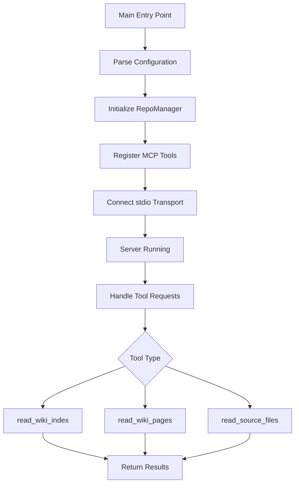
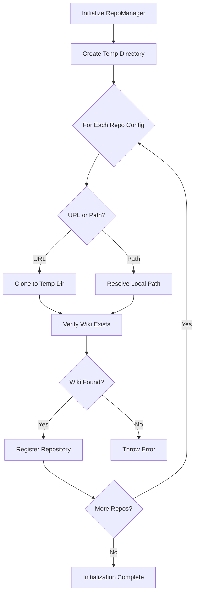
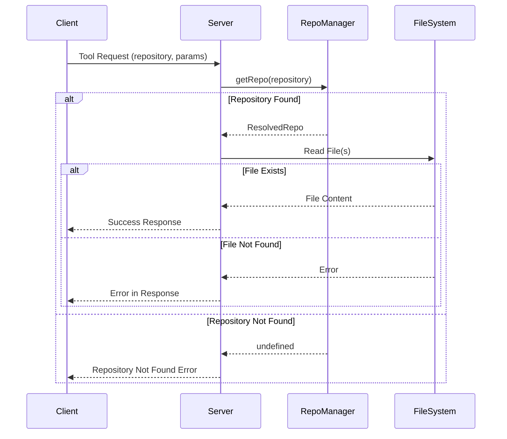
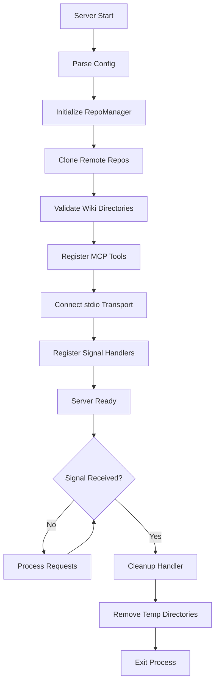

# MCP Server: Wiki & Source Browsing Tools

The MCP (Model Context Protocol) Server is a critical component of the repositories-wiki project that provides a standardized interface for LLMs and AI assistants to browse generated wiki documentation and source code. Built on the `@modelcontextprotocol/sdk`, this server exposes three primary tools that enable intelligent navigation of repository documentation and source files. The server supports both local repositories and remote GitHub repositories, automatically managing cloning and cleanup of temporary files. It operates over stdio transport, making it compatible with various MCP clients and AI development environments.

Sources: [packages/mcp/src/index.ts:1-110](../../../packages/mcp/src/index.ts#L1-L110), [packages/mcp/package.json:1-38](../../../packages/mcp/package.json#L1-L38)

## Architecture Overview

The MCP server follows a modular architecture with clear separation of concerns between configuration parsing, repository management, and tool handlers. The main server initialization flow coordinates these components to provide a robust browsing interface.



The server coordinates three main subsystems: configuration management for parsing repository inputs, repository management for handling local and remote repositories, and tool handlers for executing specific browsing operations. Each tool handler interacts with the RepoManager to locate and read the appropriate files.

Sources: [packages/mcp/src/index.ts:12-109](../../../packages/mcp/src/index.ts#L12-L109)

## Configuration System

The configuration system validates and parses repository inputs from environment variables, supporting both local paths and remote GitHub URLs with optional authentication tokens and branch specifications.

### Configuration Schema

The configuration uses Zod schemas for runtime validation, ensuring that all repository inputs are properly structured before initialization.

| Field | Type | Required | Description |
|-------|------|----------|-------------|
| `url` | string (URL) | Conditional | GitHub repository URL (mutually exclusive with `path`) |
| `path` | string | Conditional | Local filesystem path to repository (mutually exclusive with `url`) |
| `token` | string | Optional | GitHub personal access token for private repositories |
| `branch` | string | Optional | Specific branch to clone (defaults to repository default branch) |

Sources: [packages/mcp/src/config.ts:7-19](../../../packages/mcp/src/config.ts#L7-L19)

### Environment Variable Format

The server reads configuration from the `REPOS_WIKI_MCP_CONFIG` environment variable, which must contain a JSON object with a `repos` array. Each repository must specify either a `url` or `path`, but not both.

```json
{
  "repos": [
    { "path": "/local/repo" },
    { "url": "https://github.com/owner/repo", "token": "ghp_xxx", "branch": "main" }
  ]
}
```

The parser validates that at least one repository is configured and that each repository entry has exactly one input source (URL or path). Invalid configurations result in detailed error messages indicating the validation failure.

Sources: [packages/mcp/src/config.ts:35-56](../../../packages/mcp/src/config.ts#L35-L56)

## Repository Manager

The `RepoManager` class handles the lifecycle of repository access, including cloning remote repositories to temporary directories, validating wiki existence, and providing unified access to both local and cloned repositories.

### Repository Resolution Flow



The manager maintains a map of repository identifiers to resolved repository metadata, including absolute paths to both the repository root and the wiki directory. For URL-based repositories, the identifier is extracted as "owner/repo" from the GitHub URL, while local repositories use the directory basename as the identifier.

Sources: [packages/mcp/src/repo-manager.ts:45-82](../../../packages/mcp/src/repo-manager.ts#L45-L82)

### Resolved Repository Structure

Each repository is resolved into a standardized structure that provides consistent access regardless of the input source:

```typescript
interface ResolvedRepo {
  id: string;           // "owner/repo" or local directory name
  repoPath: string;     // Absolute path to repository root
  wikiPath: string;     // Absolute path to repository-wiki directory
  isCloned: boolean;    // True if cloned from URL, false if local
}
```

The `wikiPath` always points to a `repository-wiki` subdirectory within the repository, which is the standard location where wiki documentation is generated by the repositories-wiki system.

Sources: [packages/mcp/src/repo-manager.ts:6-14](../../../packages/mcp/src/repo-manager.ts#L6-L14), [packages/mcp/src/config.ts:28-29](../../../packages/mcp/src/config.ts#L28-L29)

### Temporary Directory Management

Remote repositories are cloned into a dedicated temporary directory structure to prevent conflicts and enable clean shutdown. The manager uses a consistent naming scheme and provides automatic cleanup on server termination.

| Component | Value | Purpose |
|-----------|-------|---------|
| Base Directory | `os.tmpdir()/repositories-wiki-mcp` | Root for all cloned repositories |
| Clone Directory | `{base}/{owner--repo}` | Individual repository storage |
| Cleanup Triggers | SIGINT, SIGTERM, initialization | Automatic cleanup of temp files |

The cleanup process removes the entire temporary directory tree recursively, ensuring no orphaned clones remain after server shutdown or restart.

Sources: [packages/mcp/src/repo-manager.ts:17-24](../../../packages/mcp/src/repo-manager.ts#L17-L24), [packages/mcp/src/repo-manager.ts:119-126](../../../packages/mcp/src/repo-manager.ts#L119-L126), [packages/mcp/src/index.ts:97-105](../../../packages/mcp/src/index.ts#L97-L105)

## MCP Tools

The server exposes three tools through the MCP protocol, each designed for a specific browsing operation. All tools accept a repository identifier and validate it against the configured repositories before processing requests.

### Tool: read_wiki_index

This tool reads the INDEX.md file from a repository's wiki, providing a comprehensive overview of all available documentation pages, their organization into sections, importance levels, and references to relevant source files.

**Input Parameters:**

| Parameter | Type | Description |
|-----------|------|-------------|
| `repository` | string | Repository identifier (e.g., 'owner/repo' or folder name) |

**Output:** Returns the full content of INDEX.md as plain text, which includes structured information about all wiki pages organized by sections with metadata about importance and source file references.

**Usage Pattern:** This tool should be called first when exploring a repository to discover what documentation is available and identify the most relevant pages for a specific task or question.

Sources: [packages/mcp/src/index.ts:27-43](../../../packages/mcp/src/index.ts#L27-L43), [packages/mcp/src/tools/read-wiki-index.ts:9-35](../../../packages/mcp/src/tools/read-wiki-index.ts#L9-L35)

### Tool: read_wiki_pages

This tool retrieves the complete content of one or more wiki pages by their relative file paths, enabling deep exploration of specific documentation topics including architecture diagrams, implementation details, and source code citations.

**Input Parameters:**

| Parameter | Type | Description |
|-----------|------|-------------|
| `repository` | string | Repository identifier (e.g., 'owner/repo' or folder name) |
| `pages` | string[] | Array of relative wiki page paths from INDEX.md |

**Output:** Returns a JSON object containing the requested page contents and any errors encountered:

```typescript
{
  repository: string;
  pages: Array<{ page: string; content: string }>;
  errors?: Array<{ page: string; error: string }>;
}
```

**Security:** The handler implements path traversal protection by resolving all paths and verifying they remain within the wiki directory boundary. Requests attempting to access files outside the wiki directory are rejected with an error.

Sources: [packages/mcp/src/index.ts:46-66](../../../packages/mcp/src/index.ts#L46-L66), [packages/mcp/src/tools/read-wiki-pages.ts:9-66](../../../packages/mcp/src/tools/read-wiki-pages.ts#L9-L66)

### Tool: read_source_files

This tool provides direct access to source code files within the repository, allowing verification of implementation details referenced in wiki documentation or exploration of actual code structure.

**Input Parameters:**

| Parameter | Type | Description |
|-----------|------|-------------|
| `repository` | string | Repository identifier (e.g., 'owner/repo' or folder name) |
| `file_paths` | string[] | Array of relative file paths within the repository |

**Output:** Returns a JSON object with file contents and any access errors:

```typescript
{
  repository: string;
  files: Array<{ file_path: string; content: string }>;
  errors?: Array<{ file_path: string; error: string }>;
}
```

**Validation:** The handler performs multiple validation checks including path traversal prevention, file existence verification, and file type validation (rejecting directories). Each validation failure is reported in the errors array without blocking other file reads.

Sources: [packages/mcp/src/index.ts:69-89](../../../packages/mcp/src/index.ts#L69-L89), [packages/mcp/src/tools/read-source-file.ts:9-71](../../../packages/mcp/src/tools/read-source-file.ts#L9-L71)

## Request Processing Flow

The server processes tool requests through a standardized flow that ensures consistent error handling and response formatting across all tools.



Each tool handler first validates the repository identifier against the RepoManager's registry. If the repository is not found, the handler returns a JSON error message listing all available repositories. For valid repositories, the handler proceeds with file system operations, implementing appropriate security checks and error handling.

Sources: [packages/mcp/src/tools/read-wiki-index.ts:18-35](../../../packages/mcp/src/tools/read-wiki-index.ts#L18-L35), [packages/mcp/src/tools/read-wiki-pages.ts:28-66](../../../packages/mcp/src/tools/read-wiki-pages.ts#L28-L66)

## Error Handling and Validation

The MCP server implements comprehensive error handling at multiple levels to provide clear feedback and prevent security vulnerabilities.

### Configuration Validation Errors

Configuration errors are caught during startup and result in immediate server termination with detailed error messages:

- Missing `REPOS_WIKI_MCP_CONFIG` environment variable
- Invalid JSON syntax in configuration
- Schema validation failures (missing required fields, invalid types)
- Mutually exclusive field violations (both `url` and `path` specified)
- Duplicate repository identifiers

Sources: [packages/mcp/src/config.ts:35-56](../../../packages/mcp/src/config.ts#L35-L56)

### Repository Initialization Errors

The RepoManager validates repository structure during initialization:

- Missing wiki directory (`repository-wiki` not found)
- Missing INDEX.md file in wiki directory
- Duplicate repository identifiers across multiple inputs
- Local path not found on filesystem
- Git clone failures for remote repositories

Sources: [packages/mcp/src/repo-manager.ts:50-70](../../../packages/mcp/src/repo-manager.ts#L50-L70)

### Runtime Request Errors

Tool handlers implement graceful error handling that allows partial success for batch operations:

| Error Type | Handling Strategy | Response Format |
|------------|------------------|-----------------|
| Repository Not Found | Return error with available repositories | JSON error object |
| Path Traversal Attempt | Reject individual file, continue batch | Error in errors array |
| File Not Found | Report error, continue batch | Error in errors array |
| Directory Instead of File | Report error, continue batch | Error in errors array |

This error handling design ensures that one invalid file path in a batch request doesn't prevent successful retrieval of other valid files.

Sources: [packages/mcp/src/tools/read-wiki-pages.ts:37-61](../../../packages/mcp/src/tools/read-wiki-pages.ts#L37-L61), [packages/mcp/src/tools/read-source-file.ts:37-67](../../../packages/mcp/src/tools/read-source-file.ts#L37-L67)

## Server Lifecycle Management

The MCP server implements a complete lifecycle with proper initialization, operation, and cleanup phases.



The server registers handlers for SIGINT and SIGTERM signals to ensure graceful shutdown. The cleanup handler removes all temporary directories containing cloned repositories and exits the process cleanly. Any fatal errors during startup result in logging and immediate process termination with exit code 1.

Sources: [packages/mcp/src/index.ts:12-109](../../../packages/mcp/src/index.ts#L12-L109), [packages/mcp/src/repo-manager.ts:103-108](../../../packages/mcp/src/repo-manager.ts#L103-L108)

## Summary

The MCP Server provides a robust, secure interface for browsing wiki documentation and source code within the repositories-wiki project. Through its three core tools—`read_wiki_index`, `read_wiki_pages`, and `read_source_files`—it enables AI assistants and LLMs to intelligently navigate repository documentation. The server's architecture emphasizes security through path traversal prevention, comprehensive error handling with partial success support, and automatic lifecycle management including temporary file cleanup. By supporting both local and remote repositories with flexible configuration, the MCP server serves as a critical bridge between generated documentation and AI-powered code exploration tools.