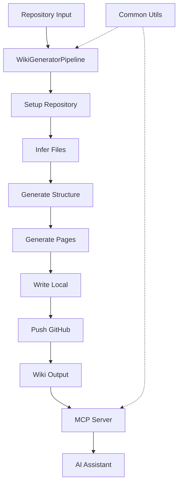
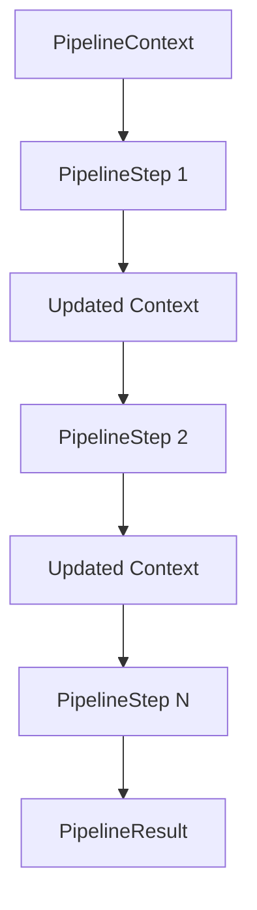
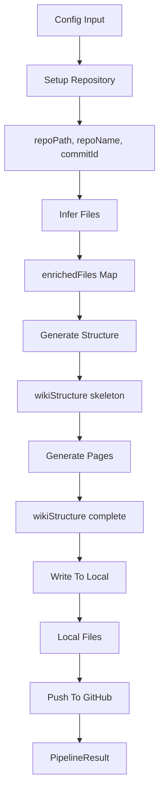
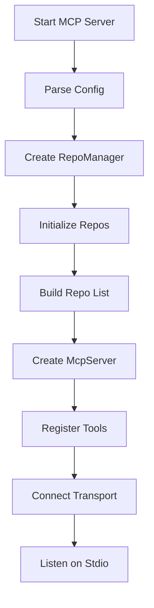

# Architecture Overview & Data Flow

The `repositories-wiki` project is a monorepo designed to automatically generate comprehensive wiki documentation from source code repositories using Large Language Models (LLMs), tree-sitter parsing, and a Model Context Protocol (MCP) server. The system follows a pipeline architecture where a repository is cloned, analyzed, and transformed into structured wiki content, which is then made accessible through an MCP server for AI assistants. The architecture consists of three main packages: `repository-wiki` (core generation pipeline), `common` (shared utilities), and `mcp` (MCP server for wiki access).

Sources: [packages/repository-wiki/src/index.ts](../../../packages/repository-wiki/src/index.ts), [packages/mcp/src/index.ts:1-100](../../../packages/mcp/src/index.ts#L1-L100)

## System Architecture

The system is organized as a monorepo with three primary packages that work together to generate and serve wiki documentation:



The architecture follows a clear separation of concerns where the `repository-wiki` package handles wiki generation through a multi-step pipeline, the `common` package provides shared utilities (Git operations, logging), and the `mcp` package exposes the generated wikis through a standardized MCP interface.

Sources: [packages/repository-wiki/src/pipeline/pipeline.ts:1-72](../../../packages/repository-wiki/src/pipeline/pipeline.ts#L1-L72), [packages/mcp/src/index.ts:1-15](../../../packages/mcp/src/index.ts#L1-L15)

## Core Pipeline Architecture

### Pipeline Design Pattern

The `WikiGeneratorPipeline` implements a chain-of-responsibility pattern where each step receives a shared context, performs its operation, and returns an updated context for the next step. This design allows for flexible, testable, and maintainable processing stages.



The pipeline is created using a fluent builder pattern that chains steps together:

```typescript
static create(): WikiGeneratorPipeline {
  return new WikiGeneratorPipeline()
    .addStep(new SetupRepositoryStep())
    .addStep(new InferFilesStep())
    .addStep(new GenerateStructureStep())
    .addStep(new GeneratePagesStep())
    .addStep(new WriteToLocalStep())
    .addStep(new PushToGitHubStep());
}
```

Sources: [packages/repository-wiki/src/pipeline/pipeline.ts:15-23](../../../packages/repository-wiki/src/pipeline/pipeline.ts#L15-L23)

### Pipeline Context

The `PipelineContext` serves as a shared data structure that flows through all pipeline steps, accumulating information at each stage:

| Context Field | Type | Set By Step | Description |
|--------------|------|-------------|-------------|
| `config` | `WikiGeneratorConfig` | Initial Input | Configuration for wiki generation including LLM settings |
| `agent` | `Agent` | Pipeline Init | AI agent for content generation |
| `repoPath` | `string` | SetupRepositoryStep | Local filesystem path to cloned repository |
| `repoName` | `string` | SetupRepositoryStep | Repository name extracted from URL or path |
| `commitId` | `string` | SetupRepositoryStep | Git commit hash of the analyzed repository |
| `enrichedFiles` | `Map<string, string>` | InferFilesStep | Map of file paths to their analyzed content |
| `wikiStructure` | `WikiStructureModel` | GenerateStructureStep & GeneratePagesStep | Complete wiki structure with all pages |

Sources: [packages/repository-wiki/src/pipeline/types.ts:5-28](../../../packages/repository-wiki/src/pipeline/types.ts#L5-L28)

## Data Flow Through Pipeline

### Sequential Processing Flow

The pipeline executes six distinct steps in sequence, with each step contributing specific data to the shared context:



Each step is executed with timing and logging information:

```typescript
for (const step of this.steps) {
  logger.info(`━━━ Executing step: ${step.name} ━━━`);
  const startTime = Date.now();
  
  context = await step.execute(context);
  
  const duration = Date.now() - startTime;
  logger.info(`✓ Step "${step.name}" completed in ${duration}ms`);
}
```

Sources: [packages/repository-wiki/src/pipeline/pipeline.ts:36-46](../../../packages/repository-wiki/src/pipeline/pipeline.ts#L36-L46)

### Agent Initialization

Before pipeline execution, the system initializes an AI agent with multiple LLM models based on the configuration:

```typescript
const models = [...new Set([config.llmPlaner.modelID, config.llmExploration.modelID, config.llmBuilder.modelID])];
const provider = (config.providerConfig.providerID) as ModelProvider;

logger.info(`Initializing agent with provider "${provider}" and models: ${models.join(", ")}`);
const agent = await createAgent(models, provider);
let context: PipelineContext = { config, agent };
```

The system supports multiple models for different tasks (planning, exploration, building) and deduplicates model IDs to avoid loading the same model multiple times.

Sources: [packages/repository-wiki/src/pipeline/pipeline.ts:28-34](../../../packages/repository-wiki/src/pipeline/pipeline.ts#L28-L34)

## Pipeline Steps

### Step Interface Contract

Each pipeline step implements the `PipelineStep` interface, ensuring a consistent contract:

```typescript
export interface PipelineStep {
  /** Human-readable name for logging */
  readonly name: string;

  /**
   * Execute the step.
   * @param context - The current pipeline context
   * @returns Updated context with any new data added by this step
   */
  execute(context: PipelineContext): Promise<PipelineContext>;
}
```

Sources: [packages/repository-wiki/src/pipeline/types.ts:30-42](../../../packages/repository-wiki/src/pipeline/types.ts#L30-L42)

### Step Execution Sequence

The six pipeline steps execute in the following order:

1. **SetupRepositoryStep**: Clones or validates the repository, extracts repository name and commit ID
2. **InferFilesStep**: Analyzes repository structure and identifies important files using tree-sitter
3. **GenerateStructureStep**: Creates the wiki structure outline with sections and page placeholders
4. **GeneratePagesStep**: Generates actual content for each wiki page using the AI agent
5. **WriteToLocalStep**: Writes generated wiki pages to the local filesystem
6. **PushToGitHubStep**: Commits and pushes the wiki to a GitHub wiki repository

Sources: [packages/repository-wiki/src/pipeline/pipeline.ts:15-23](../../../packages/repository-wiki/src/pipeline/pipeline.ts#L15-L23)

## MCP Server Architecture

### Server Initialization Flow

The MCP server initializes by parsing configuration, setting up repository managers, and registering tools:



The server runs as a standalone process that communicates via standard input/output:

```typescript
const transport = new StdioServerTransport();
await server.connect(transport);

logger.info("MCP server started successfully on stdio transport.");
```

Sources: [packages/mcp/src/index.ts:10-95](../../../packages/mcp/src/index.ts#L10-L95)

### MCP Tool Registration

The MCP server exposes three primary tools for accessing wiki and source code content:

| Tool Name | Purpose | Input Parameters | Output |
|-----------|---------|------------------|--------|
| `read_wiki_index` | Read INDEX.md to discover available wiki pages | `repository: string` | Full index with sections, pages, importance levels |
| `read_wiki_pages` | Read full content of specific wiki pages | `repository: string`, `pages: string[]` | Complete wiki page content with citations |
| `read_source_files` | Read actual source code files | `repository: string`, `file_paths: string[]` | Source code content from repository |

Each tool is registered with a schema definition and handler function:

```typescript
server.registerTool(
  "read_wiki_index",
  {
    description:
      `Read the wiki INDEX.md for a repository. ` +
      `Returns the full index with sections, pages, importance levels, and relevant source files. ` +
      `Use this first to discover what wiki pages are available and find the right pages for your task.` +
      repoListDesc,
    inputSchema: {
      repository: z
        .string()
        .describe("Repository identifier (e.g., 'owner/repo' for GitHub URLs or folder name for local paths)"),
    },
  },
  async (params) => {
    const result = handleReadWikiIndex(
      { repository: params.repository },
      repoManager,
    );
    return {
      content: [{ type: "text" as const, text: result }],
    };
  },
);
```

Sources: [packages/mcp/src/index.ts:23-45](../../../packages/mcp/src/index.ts#L23-L45), [packages/mcp/src/index.ts:48-70](../../../packages/mcp/src/index.ts#L48-L70), [packages/mcp/src/index.ts:73-93](../../../packages/mcp/src/index.ts#L73-L93)

### Repository Manager

The `RepoManager` handles multiple repositories and provides access to their wiki content:

```typescript
const repoManager = new RepoManager();
await repoManager.initialize(config);

const repoListDesc = repoManager.buildRepoListDescription();
logger.info(`Initialized ${repoManager.getRepoIds().length} repository(ies).`);
```

The manager builds a description of available repositories that is appended to tool descriptions, helping AI assistants understand which repositories are accessible.

Sources: [packages/mcp/src/index.ts:16-21](../../../packages/mcp/src/index.ts#L16-L21)

## Error Handling and Cleanup

### Pipeline Validation

After all steps complete, the pipeline validates that required data is present:

```typescript
if (!context.wikiStructure) {
  throw new Error("Pipeline completed but wikiStructure is missing");
}
if (!context.commitId) {
  throw new Error("Pipeline completed but commitId is missing");
}
```

Sources: [packages/repository-wiki/src/pipeline/pipeline.ts:48-54](../../../packages/repository-wiki/src/pipeline/pipeline.ts#L48-L54)

### Resource Cleanup

The pipeline ensures cleanup of temporary files using a finally block:

```typescript
private async cleanup(context: PipelineContext): Promise<void> {
  if (context.repoPath) {
    logger.info("Cleaning up temporary files...");
    await gitService.cleanup(context.repoPath);
  }
}
```

This cleanup is always executed regardless of whether the pipeline succeeds or fails, preventing resource leaks.

Sources: [packages/repository-wiki/src/pipeline/pipeline.ts:62-68](../../../packages/repository-wiki/src/pipeline/pipeline.ts#L62-L68)

### MCP Server Graceful Shutdown

The MCP server registers signal handlers for graceful shutdown:

```typescript
const cleanup = async () => {
  logger.info("Shutting down MCP server...");
  repoManager.cleanup();
  process.exit(0);
};

process.on("SIGINT", cleanup);
process.on("SIGTERM", cleanup);
```

This ensures that repository resources are properly cleaned up when the server is terminated.

Sources: [packages/mcp/src/index.ts:97-106](../../../packages/mcp/src/index.ts#L97-L106)

## Shared Utilities

The `common` package provides essential utilities used throughout the system:

| Utility | Purpose | Used By |
|---------|---------|---------|
| `GitService` | Git operations (clone, commit, push, cleanup) | Pipeline steps, MCP server |
| `Logger` | Structured logging with levels | All packages |
| Type definitions | Shared interfaces and schemas | All packages |

These utilities are exported from a central index file for easy consumption:

```typescript
export { GitService, gitService } from "./utils/git.js";
export { logger, Logger } from "./utils/logger.js";
export type { LogLevel } from "./utils/logger.js";
```

Sources: [packages/common/src/index.ts:1-8](../../../packages/common/src/index.ts#L1-L8)

## Summary

The `repositories-wiki` architecture follows a clean, modular design with clear separation between wiki generation (pipeline), shared utilities (common), and wiki access (MCP server). The pipeline architecture uses a chain-of-responsibility pattern with a shared context that accumulates data through six sequential steps, from repository setup to GitHub publishing. The MCP server provides a standardized interface for AI assistants to access generated wiki content through three specialized tools. This architecture enables automated, scalable wiki generation while maintaining code quality through strong typing, proper error handling, and resource cleanup.