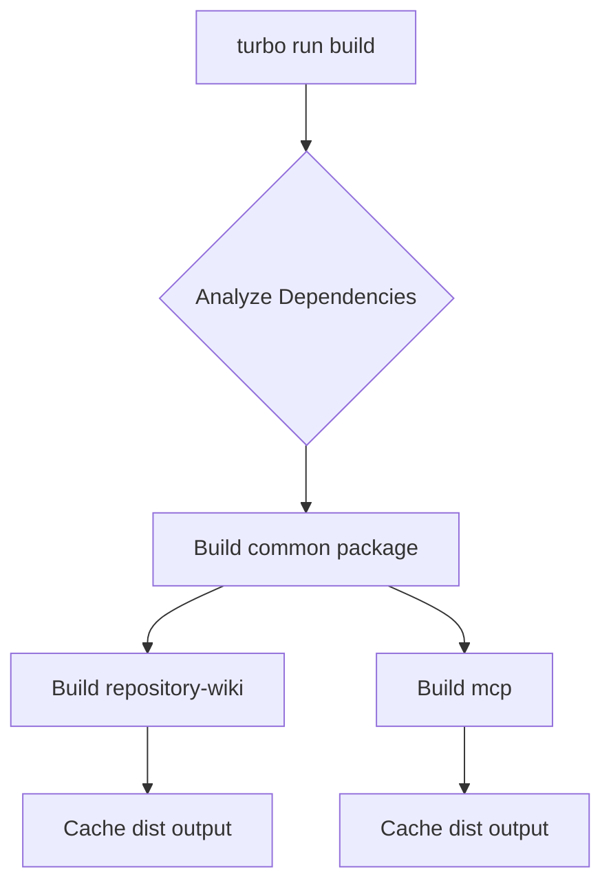
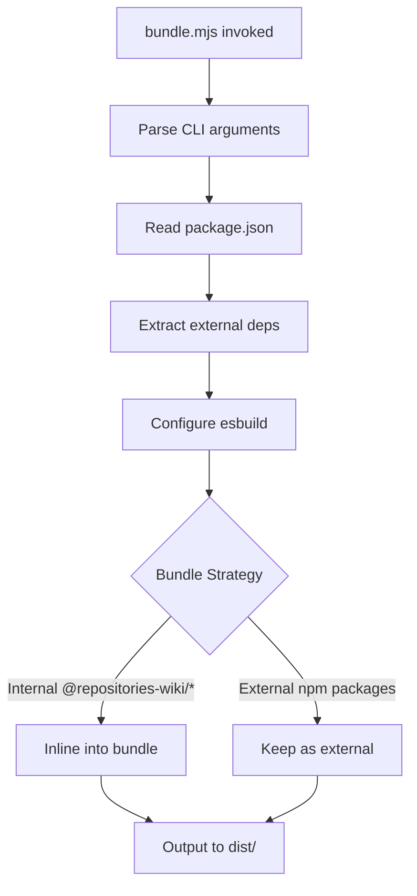
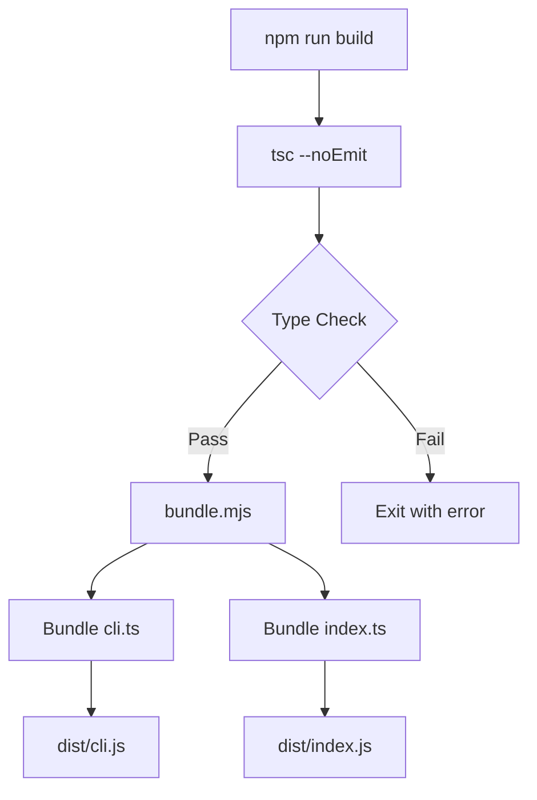
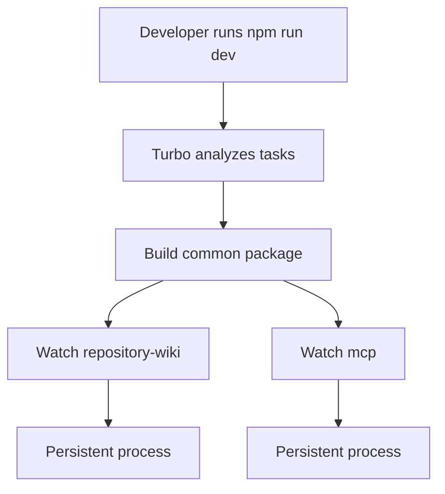

# Monorepo Structure & Build System

The `repositories-wiki` project is organized as a monorepo that leverages modern JavaScript tooling to manage multiple interconnected packages. The architecture enables efficient development, building, and publishing of three core packages: a shared common library, a repository wiki generator, and an MCP (Model Context Protocol) server. This structure facilitates code reuse, consistent tooling, and streamlined dependency management across the entire project while maintaining clear package boundaries.

The build system is orchestrated using Turborepo for task execution and caching, npm workspaces for dependency management, and a custom esbuild-based bundling strategy that inlines internal dependencies while keeping external ones separate. This approach optimizes both development experience and production bundle size.

## Monorepo Configuration

### Workspace Structure

The project uses npm workspaces to organize packages under a unified dependency tree. The root `package.json` defines the workspace pattern that includes all packages under the `packages/*` directory:

```json
{
  "name": "root",
  "private": true,
  "type": "module",
  "workspaces": [
    "packages/*"
  ],
  "packageManager": "npm@11.5.1"
}
```

Sources: [package.json:1-8](../../../package.json#L1-L8)

The monorepo contains three packages:
- `@repositories-wiki/common` - Shared types, utilities, and constants
- `@repositories-wiki/repository-wiki` - Wiki generation CLI and library
- `@repositories-wiki/mcp` - MCP server for wiki browsing

Sources: [packages/common/package.json:2](../../../packages/common/package.json#L2), [packages/repository-wiki/package.json:2](../../../packages/repository-wiki/package.json#L2), [packages/mcp/package.json:2](../../../packages/mcp/package.json#L2)

### Package Manager

The project explicitly pins npm version 11.5.1 using the `packageManager` field, ensuring consistent behavior across all development environments and CI/CD pipelines.

Sources: [package.json:8](../../../package.json#L8)

## Build System Architecture

### Turborepo Task Orchestration

Turborepo manages build tasks across all packages with dependency-aware execution and intelligent caching. The task pipeline is defined in `turbo.json`:



The build configuration ensures proper task ordering through the `dependsOn` field:

| Task | Dependencies | Outputs | Caching |
|------|-------------|---------|---------|
| build | `^build` (upstream packages) | `dist/**` | Enabled |
| clean | None | None | Disabled |
| test | `build` | None | Enabled |
| dev | `^build` | None | Disabled (persistent) |

Sources: [turbo.json:3-18](../../../turbo.json#L3-L18)

The `^build` syntax in `dependsOn` indicates that a package's build task must wait for all upstream dependencies' build tasks to complete first, ensuring proper build order in the dependency graph.

Sources: [turbo.json:5](../../../turbo.json#L5)

### Root-Level Scripts

The root package provides convenient scripts that delegate to Turborepo for parallel execution across workspaces:

```json
{
  "scripts": {
    "build": "turbo run build",
    "clean": "turbo run clean",
    "test": "turbo run test",
    "dev": "turbo run dev",
    "changeset": "changeset",
    "version-packages": "changeset version",
    "release": "turbo run build && changeset publish"
  }
}
```

Sources: [package.json:9-17](../../../package.json#L9-L17)

The `release` script implements a two-step publish workflow: first building all packages, then using Changesets to publish versioned packages to npm.

Sources: [package.json:15](../../../package.json#L15)

## TypeScript Configuration

### Shared Base Configuration

The root `tsconfig.json` establishes strict TypeScript settings shared across all packages:

```json
{
  "compilerOptions": {
    "types": ["node"],
    "declaration": true,
    "declarationMap": true,
    "esModuleInterop": true,
    "incremental": true,
    "isolatedModules": true,
    "lib": ["es2022", "DOM", "DOM.Iterable"],
    "module": "ESNext",
    "moduleDetection": "force",
    "moduleResolution": "Bundler",
    "noUncheckedIndexedAccess": true,
    "resolveJsonModule": true,
    "skipLibCheck": true,
    "strict": true,
    "target": "ES2022"
  }
}
```

Sources: [tsconfig.json:2-18](../../../tsconfig.json#L2-L18)

Key configuration choices:

| Option | Value | Purpose |
|--------|-------|---------|
| `module` | `ESNext` | Native ES modules support |
| `moduleResolution` | `Bundler` | Modern bundler-aware resolution |
| `target` | `ES2022` | Modern JavaScript features |
| `strict` | `true` | Maximum type safety |
| `noUncheckedIndexedAccess` | `true` | Array/object access safety |
| `isolatedModules` | `true` | Compatibility with esbuild |

Sources: [tsconfig.json:9-16](../../../tsconfig.json#L9-L16)

The `declaration` and `declarationMap` options ensure TypeScript generates `.d.ts` files and sourcemaps for all packages, enabling proper type checking for consumers.

Sources: [tsconfig.json:4-5](../../../tsconfig.json#L4-L5)

## Custom Bundling Strategy

### esbuild Bundle Script

The project uses a custom esbuild-based bundler (`scripts/bundle.mjs`) that implements a unique dependency inlining strategy:



The script accepts a package name and one or more entry files:

```javascript
const args = process.argv.slice(2);
const packageName = args[0];
const entryFiles = args.slice(1);

if (!packageName || entryFiles.length === 0) {
  console.error("Usage: node scripts/bundle.mjs <package-name> <entry1.ts> [entry2.ts ...]");
  process.exit(1);
}
```

Sources: [scripts/bundle.mjs:12-19](../../../scripts/bundle.mjs#L12-L19)

### Dependency Externalization

The bundler reads each package's `package.json` to determine which dependencies should remain external (not bundled):

```javascript
const packageJson = JSON.parse(readFileSync(join(packageDir, "package.json"), "utf-8"));
const externalDeps = Object.keys(packageJson.dependencies || {});
```

Sources: [scripts/bundle.mjs:25-26](../../../scripts/bundle.mjs#L25-L26)

This approach ensures that published npm packages (like `langchain`, `simple-git`, `@modelcontextprotocol/sdk`) remain as peer dependencies, while internal `@repositories-wiki/*` packages are inlined into the bundle.

Sources: [scripts/bundle.mjs:33](../../../scripts/bundle.mjs#L33)

### esbuild Configuration

The build configuration targets Node.js 22 with ESM output:

```javascript
await build({
  entryPoints,
  outdir: join(packageDir, "dist"),
  bundle: true,
  platform: "node",
  format: "esm",
  target: "node22",
  sourcemap: false,
  external: externalDeps,
});
```

Sources: [scripts/bundle.mjs:30-39](../../../scripts/bundle.mjs#L30-L39)

## Package-Specific Build Configurations

### Common Package Build

The `@repositories-wiki/common` package uses standard TypeScript compilation without bundling, as it serves as an internal dependency:

```json
{
  "scripts": {
    "build": "tsc",
    "clean": "rm -rf dist tsconfig.tsbuildinfo",
    "test": "vitest run"
  }
}
```

Sources: [packages/common/package.json:17-21](../../../packages/common/package.json#L17-L21)

The package exports compiled JavaScript and type definitions:

```json
{
  "main": "dist/index.js",
  "types": "dist/index.d.ts",
  "files": [
    "dist"
  ]
}
```

Sources: [packages/common/package.json:12-16](../../../packages/common/package.json#L12-L16)

### Repository-Wiki Package Build

The `@repositories-wiki/repository-wiki` package implements a two-phase build process:

```json
{
  "scripts": {
    "build": "tsc --noEmit && node ../../scripts/bundle.mjs repository-wiki src/cli.ts src/index.ts",
    "typecheck": "tsc --noEmit"
  }
}
```

Sources: [packages/repository-wiki/package.json:22-23](../../../packages/repository-wiki/package.json#L22-L23)



Phase 1 performs type checking without emitting files (`tsc --noEmit`), and Phase 2 bundles two entry points (`cli.ts` and `index.ts`) using the custom bundler. This produces both a CLI executable and a library entry point.

Sources: [packages/repository-wiki/package.json:22](../../../packages/repository-wiki/package.json#L22)

The package defines a CLI binary:

```json
{
  "bin": {
    "repository-wiki": "./dist/cli.js"
  }
}
```

Sources: [packages/repository-wiki/package.json:13-15](../../../packages/repository-wiki/package.json#L13-L15)

### MCP Package Build

The `@repositories-wiki/mcp` package follows the same two-phase pattern but with a single entry point:

```json
{
  "scripts": {
    "build": "tsc --noEmit && node ../../scripts/bundle.mjs mcp src/index.ts",
    "typecheck": "tsc --noEmit"
  }
}
```

Sources: [packages/mcp/package.json:20-21](../../../packages/mcp/package.json#L20-L21)

The package exports a single binary for the MCP server:

```json
{
  "bin": {
    "repositories-wiki-mcp": "./dist/index.js"
  }
}
```

Sources: [packages/mcp/package.json:12-14](../../../packages/mcp/package.json#L12-L14)

## Dependency Management

### Root Dependencies

The root package defines shared development tools and a common runtime dependency:

```json
{
  "dependencies": {
    "zod": "^3.24.1"
  },
  "devDependencies": {
    "@changesets/changelog-github": "^0.6.0",
    "@changesets/cli": "^2.31.0",
    "@types/node": "^22.10.7",
    "esbuild": "^0.28.0",
    "tsx": "^4.21.0",
    "turbo": "^2.9.6",
    "typescript": "^5.7.3"
  }
}
```

Sources: [package.json:18-29](../../../package.json#L18-L29)

### Package Dependency Patterns

Each package follows a consistent pattern of separating production dependencies from development-only internal references:

**repository-wiki package:**
- Production: `@langchain/core`, `langchain`, `commander`, `p-limit`, `p-retry`, `picomatch`, `simple-git`, `web-tree-sitter`, `@microsoft/tiktokenizer`
- Development: `@repositories-wiki/common`, `tsx`, `vitest`, `@types/picomatch`

Sources: [packages/repository-wiki/package.json:27-41](../../../packages/repository-wiki/package.json#L27-L41)

**mcp package:**
- Production: `@modelcontextprotocol/sdk`, `simple-git`
- Development: `@repositories-wiki/common`, `tsx`

Sources: [packages/mcp/package.json:23-29](../../../packages/mcp/package.json#L23-L29)

**common package:**
- Production: `simple-git`
- Development: `vitest`

Sources: [packages/common/package.json:22-26](../../../packages/common/package.json#L22-L26)

The `@repositories-wiki/common` package is marked as a dev dependency in consuming packages because it gets inlined during the bundle process, not shipped as a separate dependency.

Sources: [packages/repository-wiki/package.json:39](../../../packages/repository-wiki/package.json#L39), [packages/mcp/package.json:27](../../../packages/mcp/package.json#L27)

## Version Management & Release Process

### Changesets Integration

The project uses Changesets for version management and publishing:

```json
{
  "devDependencies": {
    "@changesets/changelog-github": "^0.6.0",
    "@changesets/cli": "^2.31.0"
  }
}
```

Sources: [package.json:20-21](../../../package.json#L20-L21)

The workflow supports three commands:

| Command | Purpose | Script |
|---------|---------|--------|
| `npm run changeset` | Create a new changeset | `changeset` |
| `npm run version-packages` | Bump versions based on changesets | `changeset version` |
| `npm run release` | Build and publish to npm | `turbo run build && changeset publish` |

Sources: [package.json:13-15](../../../package.json#L13-L15)

### Package Privacy

The `@repositories-wiki/common` package is marked as private to prevent accidental publishing:

```json
{
  "name": "@repositories-wiki/common",
  "private": true,
  "version": "1.0.0"
}
```

Sources: [packages/common/package.json:2-4](../../../packages/common/package.json#L2-L4)

The other two packages are public and publishable, both at version 1.0.0:

Sources: [packages/repository-wiki/package.json:2-3](../../../packages/repository-wiki/package.json#L2-L3), [packages/mcp/package.json:2-3](../../../packages/mcp/package.json#L2-L3)

## Development Workflow

### Development Scripts

Each package provides a `start` script for local development:

**repository-wiki:**
```json
{
  "scripts": {
    "start": "tsx --env-file=.env src/cli.ts"
  }
}
```

Sources: [packages/repository-wiki/package.json:25](../../../packages/repository-wiki/package.json#L25)

**mcp:**
```json
{
  "scripts": {
    "start": "tsx src/index.ts"
  }
}
```

Sources: [packages/mcp/package.json:23](../../../packages/mcp/package.json#L23)

Both use `tsx` for TypeScript execution without compilation, enabling rapid development iteration.

### Development Task Flow



The `dev` task is configured as persistent with no caching, suitable for long-running development servers:

```json
{
  "dev": {
    "dependsOn": ["^build"],
    "cache": false,
    "persistent": true
  }
}
```

Sources: [turbo.json:13-17](../../../turbo.json#L13-L17)

## Summary

The repositories-wiki monorepo implements a sophisticated build system that balances development ergonomics with production optimization. By combining npm workspaces for dependency management, Turborepo for task orchestration, and a custom esbuild bundler for intelligent dependency inlining, the architecture achieves three key goals: shared code reuse through the common package, efficient parallel builds with proper caching, and optimized production bundles that inline internal dependencies while externalizing third-party packages. The strict TypeScript configuration and Changesets integration further ensure code quality and streamlined release management across all packages.