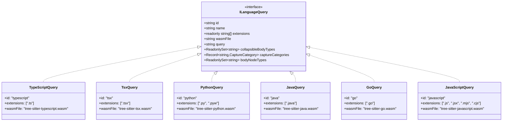

# Language Queries & Grammar Definitions

The Tree-Sitter Code Analysis system in the repositories-wiki project relies on language-specific query definitions to extract code signatures and structure from source files. Each supported programming language (TypeScript, Python, Java, Go, JavaScript) provides a standardized query definition that implements the `ILanguageQuery` interface. These queries define Tree-sitter S-expression patterns to capture language constructs (imports, classes, functions, etc.), specify grammar file locations, and configure how different code elements should be formatted and collapsed in the generated documentation.

This architecture ensures that the signature extractor remains fully language-agnostic—all language-specific logic is encapsulated in these query definitions. Adding support for a new language requires only implementing the `ILanguageQuery` interface, registering it in the SignatureExtractor, and providing the corresponding `.wasm` grammar file.

Sources: [language-query.ts:1-40](../../../packages/repository-wiki/src/tree-sitter/language-queries/language-query.ts#L1-L40)

## Architecture Overview

The language query system is built around a common interface that all language implementations must satisfy. This design pattern enables extensibility while maintaining consistency across different programming languages.



The diagram above illustrates the inheritance hierarchy where each language-specific query class implements the common `ILanguageQuery` interface. This ensures uniform behavior across all supported languages.

Sources: [language-query.ts:8-40](../../../packages/repository-wiki/src/tree-sitter/language-queries/language-query.ts#L8-L40), [typescript.ts:47-58](../../../packages/repository-wiki/src/tree-sitter/language-queries/typescript.ts#L47-L58), [python.ts:5-11](../../../packages/repository-wiki/src/tree-sitter/language-queries/python.ts#L5-L11), [java.ts:5-11](../../../packages/repository-wiki/src/tree-sitter/language-queries/java.ts#L5-L11), [go.ts:5-11](../../../packages/repository-wiki/src/tree-sitter/language-queries/go.ts#L5-L11), [javascript.ts:42-49](../../../packages/repository-wiki/src/tree-sitter/language-queries/javascript.ts#L42-L49)

## ILanguageQuery Interface

The `ILanguageQuery` interface defines the contract that every language query implementation must fulfill. This interface provides all the metadata and configuration needed by the signature extractor to parse and format code.

### Core Properties

| Property | Type | Description |
|----------|------|-------------|
| `id` | `string` | Unique identifier for the language (e.g., "typescript", "python") |
| `name` | `string` | Human-readable display name (e.g., "TypeScript", "Python") |
| `extensions` | `readonly string[]` | File extensions this language handles, including leading dot (e.g., [".ts"]) |
| `wasmFile` | `string` | Filename of the .wasm grammar file relative to assets/grammars/ |
| `query` | `string` | Tree-sitter S-expression query string for signature extraction |
| `collapsibleBodyTypes` | `ReadonlySet<string>` | Node types whose bodies should be collapsed (e.g., "function_declaration") |
| `captureCategories` | `Record<string, CaptureCategory>` | Maps capture names to formatting categories |
| `bodyNodeTypes` | `ReadonlySet<string>` | Node types representing body blocks (e.g., "statement_block", "class_body") |

Sources: [language-query.ts:17-40](../../../packages/repository-wiki/src/tree-sitter/language-queries/language-query.ts#L17-L40)

### Adding New Languages

The interface documentation provides clear instructions for extending language support:

1. Create a class implementing `ILanguageQuery` in `queries/<language>.ts`
2. Register it in the SignatureExtractor constructor
3. Drop the `.wasm` grammar file into `assets/grammars/`

Sources: [language-query.ts:11-15](../../../packages/repository-wiki/src/tree-sitter/language-queries/language-query.ts#L11-L15)

## Tree-Sitter Query Patterns

Each language defines a Tree-sitter S-expression query that captures relevant code constructs. These queries use Tree-sitter's pattern matching syntax to identify and label specific AST nodes.

### TypeScript/TSX Query Structure

TypeScript and TSX share the same query definition, capturing imports, exports, functions, classes, interfaces, enums, and type aliases:

```typescript
const QUERY = `
; ── Imports ──────────────────────────────────────────────────────
(import_statement) @import

; ── Exports (re-exports, export assignments) ─────────────────────
(export_statement
  !declaration) @export

; ── Function declarations ────────────────────────────────────────
(function_declaration) @function

; ── Exported function declarations ───────────────────────────────
(export_statement
  declaration: (function_declaration)) @function

; ── Class declarations ───────────────────────────────────────────
(class_declaration) @class

; ── Exported class declarations ──────────────────────────────────
(export_statement
  declaration: (class_declaration)) @class

; ── Interface declarations ───────────────────────────────────────
(interface_declaration) @interface

; ── Type alias declarations ──────────────────────────────────────
(type_alias_declaration) @type_alias
`;
```

The query handles both standalone and exported declarations, ensuring comprehensive coverage of TypeScript's module system. The `!declaration` predicate in the export statement captures re-exports without inline declarations.

Sources: [typescript.ts:6-43](../../../packages/repository-wiki/src/tree-sitter/language-queries/typescript.ts#L6-L43)

### Python Query Structure

Python's query captures imports, functions, classes, decorators, and Python 3.12+ type aliases:

```python
readonly query = `
; ── Imports ──────────────────────────────────────────────────────
(import_statement) @import
(import_from_statement) @import

; ── Function definitions ─────────────────────────────────────────
(function_definition) @function

; ── Class definitions ────────────────────────────────────────────
(class_definition) @class

; ── Decorated definitions (captures the decorator + the def/class) ─
(decorated_definition) @decorated

; ── Type alias statements (Python 3.12+ "type X = ...") ─────────
(type_alias_statement) @type_alias
`;
```

Python distinguishes between `import_statement` and `import_from_statement` to handle both `import x` and `from x import y` syntax. The `decorated_definition` capture handles Python's decorator pattern.

Sources: [python.ts:13-28](../../../packages/repository-wiki/src/tree-sitter/language-queries/python.ts#L13-L28)

### Java Query Structure

Java's query captures package declarations, imports, classes, interfaces, enums, annotation types, methods, and constructors:

```java
readonly query = `
; ── Package declaration ──────────────────────────────────────────
(package_declaration) @package

; ── Imports ──────────────────────────────────────────────────────
(import_declaration) @import

; ── Class declarations ───────────────────────────────────────────
(class_declaration) @class

; ── Interface declarations ───────────────────────────────────────
(interface_declaration) @interface

; ── Enum declarations ────────────────────────────────────────────
(enum_declaration) @enum

; ── Annotation type declarations ─────────────────────────────────
(annotation_type_declaration) @annotation_type

; ── Method declarations ──────────────────────────────────────────
(method_declaration) @method

; ── Constructor declarations ─────────────────────────────────────
(constructor_declaration) @constructor
`;
```

Sources: [java.ts:13-38](../../../packages/repository-wiki/src/tree-sitter/language-queries/java.ts#L13-L38)

### Go Query Structure

Go's query focuses on package clauses, imports, functions, methods, and type declarations:

```go
readonly query = `
; ── Package clause ───────────────────────────────────────────────
(package_clause) @package

; ── Imports ──────────────────────────────────────────────────────
(import_declaration) @import

; ── Function declarations ────────────────────────────────────────
(function_declaration) @function

; ── Method declarations ──────────────────────────────────────────
(method_declaration) @method

; ── Type declarations (struct, interface, type alias) ────────────
(type_declaration) @type_decl
`;
```

Sources: [go.ts:13-28](../../../packages/repository-wiki/src/tree-sitter/language-queries/go.ts#L13-L28)

### JavaScript Query Structure

JavaScript's query handles imports, exports, functions, and classes with support for various module formats:

```javascript
const JS_QUERY = `
; ── Imports ──────────────────────────────────────────────────────
(import_statement) @import

; ── Exports (re-exports, export assignments) ─────────────────────
(export_statement
  !declaration) @export

; ── Function declarations ────────────────────────────────────────
(function_declaration) @function

; ── Exported function declarations ───────────────────────────────
(export_statement
  declaration: (function_declaration)) @function

; ── Class declarations ───────────────────────────────────────────
(class_declaration) @class

; ── Exported class declarations ──────────────────────────────────
(export_statement
  declaration: (class_declaration)) @class
`;
```

Sources: [javascript.ts:4-25](../../../packages/repository-wiki/src/tree-sitter/language-queries/javascript.ts#L4-L25)

## Capture Categories

The `captureCategories` property maps each capture name from the query to a `CaptureCategory`, which determines how the captured node should be formatted in the output.

### Category Types by Language

| Language | Compact | Collapsible | Class-like | Enum | Decorated |
|----------|---------|-------------|------------|------|-----------|
| TypeScript/TSX | import, export, type_alias | function | class, interface | enum | - |
| Python | import, type_alias | function | class | - | decorated |
| Java | package, import, annotation_type | method, constructor | class, interface | enum | - |
| Go | package, import | function, method | type_decl | - | - |
| JavaScript | import, export | function | class | - | - |

Sources: [typescript.ts:51-58](../../../packages/repository-wiki/src/tree-sitter/language-queries/typescript.ts#L51-L58), [python.ts:34-40](../../../packages/repository-wiki/src/tree-sitter/language-queries/python.ts#L34-L40), [java.ts:48-58](../../../packages/repository-wiki/src/tree-sitter/language-queries/java.ts#L48-L58), [go.ts:34-40](../../../packages/repository-wiki/src/tree-sitter/language-queries/go.ts#L34-L40), [javascript.ts:31-36](../../../packages/repository-wiki/src/tree-sitter/language-queries/javascript.ts#L31-L36)

### Category Semantics

- **compact**: Rendered as-is without body expansion (imports, exports, type aliases)
- **collapsible**: Functions/methods that can have their bodies collapsed
- **class_like**: Classes, interfaces, and type declarations that contain members
- **enum**: Enumeration types with special formatting
- **decorated**: Python decorators with their associated definitions

The category mapping allows unmapped captures to fall through to default "return as-is" behavior, providing flexibility for edge cases.

Sources: [language-query.ts:27-31](../../../packages/repository-wiki/src/tree-sitter/language-queries/language-query.ts#L27-L31)

## Collapsible Body Types

The `collapsibleBodyTypes` set identifies which AST node types should have their bodies collapsed in the output. This is crucial for generating concise signatures while preserving structural information.

### Collapsible Types by Language

```mermaid
graph TD
    A[Collapsible Body Types]
    
    B[TypeScript/TSX]
    B1[function_declaration]
    B2[method_definition]
    B3[class_declaration]
    B4[interface_declaration]
    
    C[Python]
    C1[function_definition]
    C2[class_definition]
    
    D[Java]
    D1[class_declaration]
    D2[interface_declaration]
    D3[enum_declaration]
    D4[method_declaration]
    D5[constructor_declaration]
    
    E[Go]
    E1[function_declaration]
    E2[method_declaration]
    
    F[JavaScript]
    F1[function_declaration]
    F2[method_definition]
    F3[class_declaration]
    
    A --> B
    A --> C
    A --> D
    A --> E
    A --> F
    
    B --> B1
    B --> B2
    B --> B3
    B --> B4
    
    C --> C1
    C --> C2
    
    D --> D1
    D --> D2
    D --> D3
    D --> D4
    D --> D5
    
    E --> E1
    E --> E2
    
    F --> F1
    F --> F2
    F --> F3
```



Sources: [typescript.ts:45-49](../../../packages/repository-wiki/src/tree-sitter/language-queries/typescript.ts#L45-L49), [python.ts:30-33](../../../packages/repository-wiki/src/tree-sitter/language-queries/python.ts#L30-L33), [java.ts:40-46](../../../packages/repository-wiki/src/tree-sitter/language-queries/java.ts#L40-L46), [go.ts:30-33](../../../packages/repository-wiki/src/tree-sitter/language-queries/go.ts#L30-L33), [javascript.ts:27-31](../../../packages/repository-wiki/src/tree-sitter/language-queries/javascript.ts#L27-L31)

## Body Node Types

The `bodyNodeTypes` set specifies which AST node types represent body blocks in each language. This serves as a fallback mechanism when Tree-sitter's named "body" field doesn't match the expected pattern.

### Body Node Types by Language

| Language | Body Node Types |
|----------|-----------------|
| TypeScript/TSX | statement_block, class_body, interface_body, enum_body, object_type |
| Python | block |
| Java | class_body, interface_body, enum_body, constructor_body, block |
| Go | block, field_declaration_list, interface_type |
| JavaScript | statement_block, class_body |

These node types are critical for accurately identifying and collapsing code bodies during signature extraction. The variation across languages reflects fundamental differences in how each language structures its AST.

Sources: [typescript.ts:60-66](../../../packages/repository-wiki/src/tree-sitter/language-queries/typescript.ts#L60-L66), [python.ts:42-44](../../../packages/repository-wiki/src/tree-sitter/language-queries/python.ts#L42-L44), [java.ts:60-66](../../../packages/repository-wiki/src/tree-sitter/language-queries/java.ts#L60-L66), [go.ts:42-47](../../../packages/repository-wiki/src/tree-sitter/language-queries/go.ts#L42-L47), [javascript.ts:38-41](../../../packages/repository-wiki/src/tree-sitter/language-queries/javascript.ts#L38-L41)

## Language-Specific Implementations

### TypeScript and TSX

TypeScript and TSX share identical query definitions and configurations, differing only in their grammar files and file extensions. This code reuse reflects the close relationship between the two languages.

```typescript
export class TypeScriptQuery implements ILanguageQuery {
  readonly id = "typescript";
  readonly name = "TypeScript";
  readonly extensions = [".ts"] as const;
  readonly wasmFile = "tree-sitter-typescript.wasm";
  readonly query = QUERY;
  readonly collapsibleBodyTypes = COLLAPSIBLE_BODY_TYPES;
  readonly captureCategories = CAPTURE_CATEGORIES;
  readonly bodyNodeTypes = BODY_NODE_TYPES;
}

export class TsxQuery implements ILanguageQuery {
  readonly id = "tsx";
  readonly name = "TSX";
  readonly extensions = [".tsx"] as const;
  readonly wasmFile = "tree-sitter-tsx.wasm";
  readonly query = QUERY;
  readonly collapsibleBodyTypes = COLLAPSIBLE_BODY_TYPES;
  readonly captureCategories = CAPTURE_CATEGORIES;
  readonly bodyNodeTypes = BODY_NODE_TYPES;
}
```

Both implementations use separate `.wasm` files (`tree-sitter-typescript.wasm` and `tree-sitter-tsx.wasm`) to handle their respective syntaxes, particularly TSX's JSX support.

Sources: [typescript.ts:69-88](../../../packages/repository-wiki/src/tree-sitter/language-queries/typescript.ts#L69-L88)

### Python

Python's implementation includes support for multiple import styles and Python 3.12's new type alias syntax. The `decorated` category handles Python's unique decorator pattern.

```typescript
export class PythonQuery implements ILanguageQuery {
  readonly id = "python";
  readonly name = "Python";
  readonly extensions = [".py", ".pyw"] as const;
  readonly wasmFile = "tree-sitter-python.wasm";
  // ... query and configuration
}
```

Python supports both `.py` and `.pyw` extensions, with `.pyw` being Windows-specific for GUI applications.

Sources: [python.ts:5-44](../../../packages/repository-wiki/src/tree-sitter/language-queries/python.ts#L5-L44)

### Java

Java's implementation includes a workaround for TypeScript's object property naming issue with the "constructor" key:

```typescript
// Use Object.assign(Object.create(null), ...) to avoid the TS issue where
// "constructor" as an object key conflicts with the built-in Object.constructor.
readonly captureCategories: Readonly<Record<string, CaptureCategory>> =
  Object.assign(Object.create(null), {
    package:         "compact",
    import:          "compact",
    annotation_type: "compact",
    class:           "class_like",
    interface:       "class_like",
    enum:            "enum",
    method:          "collapsible",
    constructor:     "collapsible",
  });
```

This technical detail ensures that the "constructor" capture category doesn't conflict with JavaScript's built-in `Object.constructor` property.

Sources: [java.ts:48-58](../../../packages/repository-wiki/src/tree-sitter/language-queries/java.ts#L48-L58)

### Go

Go's implementation uses `type_decl` as a unified capture for structs, interfaces, and type aliases, reflecting Go's consistent type declaration syntax:

```typescript
export class GoQuery implements ILanguageQuery {
  readonly id = "go";
  readonly name = "Go";
  readonly extensions = [".go"] as const;
  readonly wasmFile = "tree-sitter-go.wasm";
  // ... captures package, import, function, method, type_decl
}
```

The `field_declaration_list` and `interface_type` body node types are specific to Go's struct and interface definitions.

Sources: [go.ts:5-47](../../../packages/repository-wiki/src/tree-sitter/language-queries/go.ts#L5-L47)

### JavaScript

JavaScript's implementation supports multiple module formats through its file extensions:

```typescript
export class JavaScriptQuery implements ILanguageQuery {
  readonly id = "javascript";
  readonly name = "JavaScript";
  readonly extensions = [".js", ".jsx", ".mjs", ".cjs"] as const;
  readonly wasmFile = "tree-sitter-javascript.wasm";
  // ... configuration
}
```

The extensions cover standard JavaScript (`.js`), JSX (`.jsx`), ES modules (`.mjs`), and CommonJS (`.cjs`), providing comprehensive support for the JavaScript ecosystem.

Sources: [javascript.ts:42-49](../../../packages/repository-wiki/src/tree-sitter/language-queries/javascript.ts#L42-L49)

## Summary

The language query system provides a clean, extensible architecture for multi-language code analysis in the repositories-wiki project. By standardizing on the `ILanguageQuery` interface, the system achieves language-agnostic signature extraction while allowing each language to define its specific parsing rules, body collapse behavior, and formatting categories. The current implementation supports six language variants (TypeScript, TSX, Python, Java, Go, JavaScript) with consistent patterns that make adding new languages straightforward. This design separates language-specific concerns from the core extraction logic, enabling maintainability and scalability as the project grows to support additional programming languages.