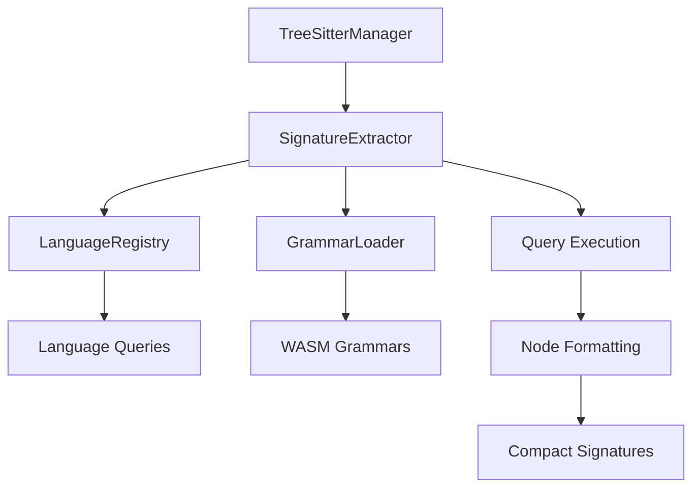
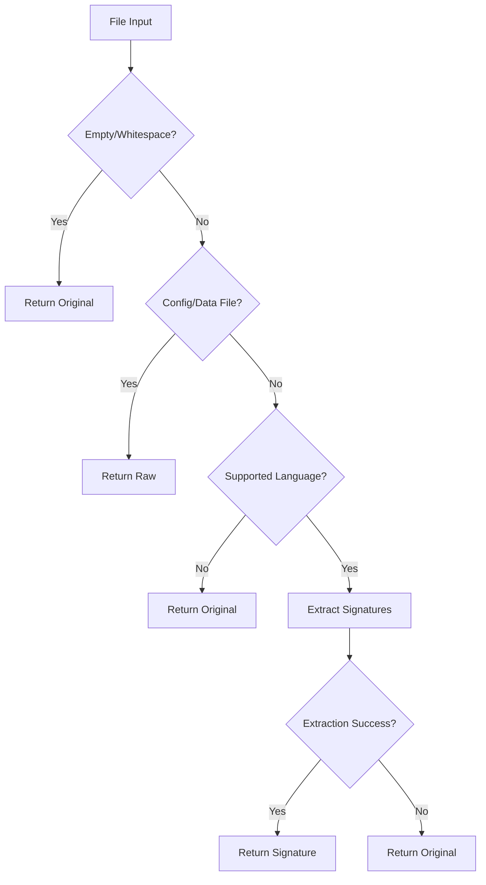
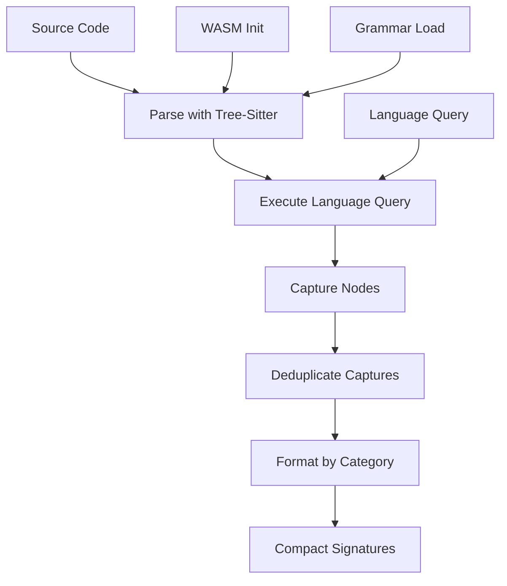
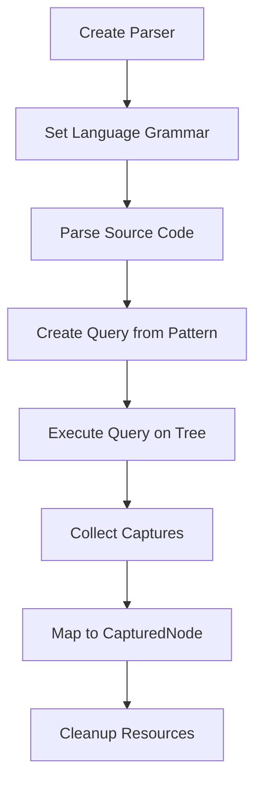
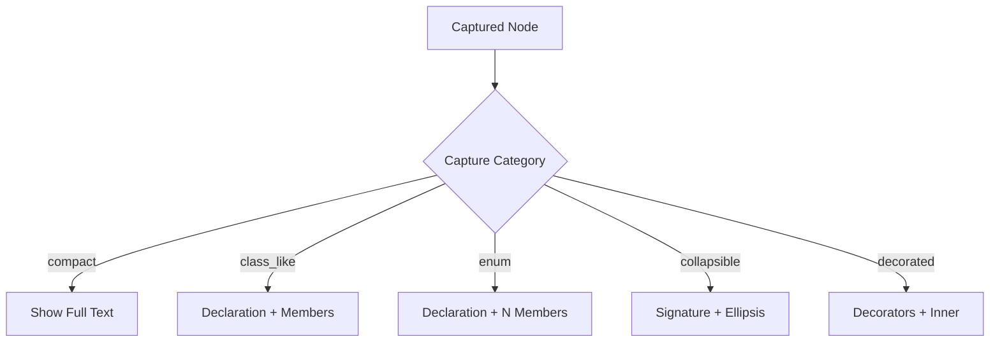
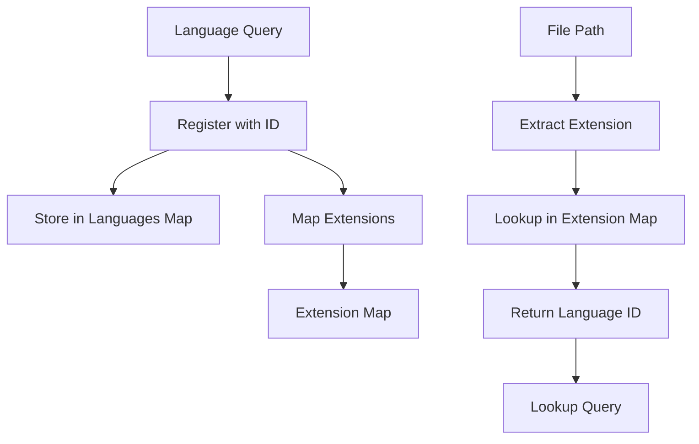
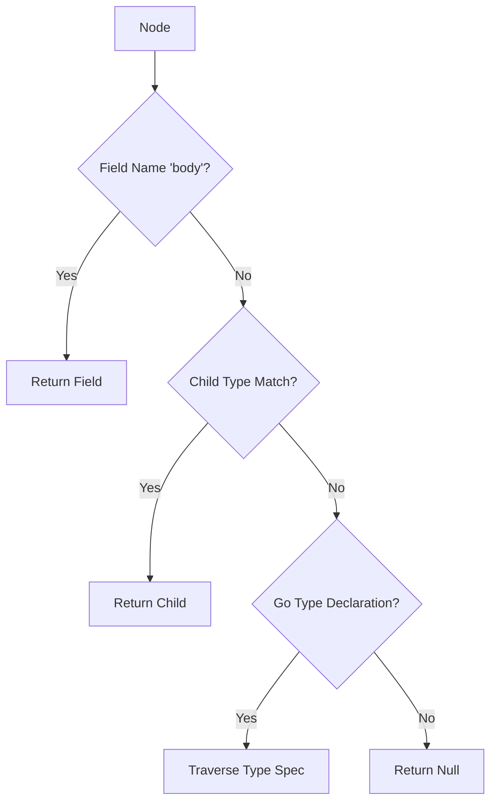
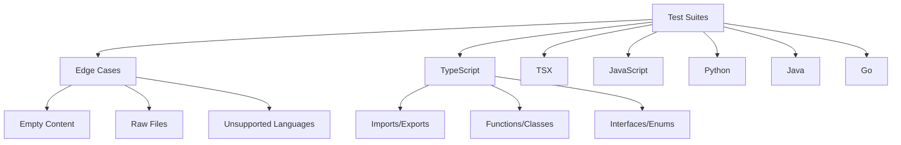
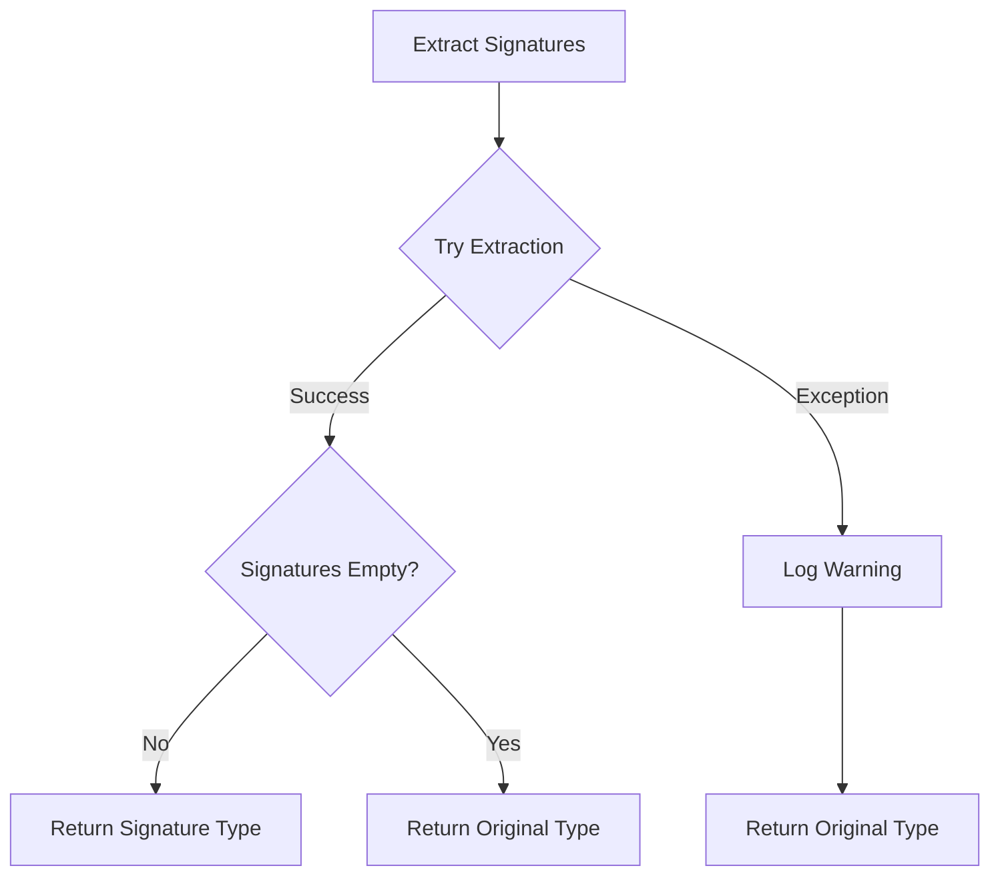

# Tree-Sitter Signature Extraction Engine

The Tree-Sitter Signature Extraction Engine is a core component of the repositories-wiki system responsible for extracting compact, human-readable "signatures" from source code files across multiple programming languages. Rather than including full source code in the generated wiki documentation, this engine parses code using tree-sitter grammars and extracts only the essential structural information—such as function signatures, class declarations, interface definitions, and import statements—while collapsing implementation details. This dramatically reduces token usage when passing code to LLMs for documentation generation while preserving all the information necessary to understand the codebase structure and API surface.

The engine supports TypeScript, TSX, JavaScript, Python, Java, and Go, with an extensible architecture that allows new languages to be added by registering language-specific query definitions. It handles the full extraction lifecycle including WASM runtime initialization, grammar loading, query execution, and intelligent formatting based on node type categories.

Sources: [tree-sitter-manager.ts:1-85](../../../packages/repository-wiki/src/tree-sitter/tree-sitter-manager.ts#L1-L85), [extractor.ts:1-50](../../../packages/repository-wiki/src/tree-sitter/extractor.ts#L1-L50)

---

## Architecture Overview

The signature extraction system is built around four primary components that work together to transform source code into compact signatures:



**Component Responsibilities:**

| Component | Purpose | Key Operations |
|-----------|---------|----------------|
| `TreeSitterManager` | Entry point; determines extraction strategy by file type | Route files to appropriate handler (raw/signature/original) |
| `SignatureExtractor` | Core extraction engine; orchestrates parsing and formatting | Initialize WASM, execute queries, format captured nodes |
| `LanguageRegistry` | Maps file extensions to language configurations | Register languages, lookup by extension or ID |
| `GrammarLoader` | Loads and caches WASM grammar files | Load grammar binaries, maintain cache |

Sources: [tree-sitter-manager.ts:12-19](../../../packages/repository-wiki/src/tree-sitter/tree-sitter-manager.ts#L12-L19), [extractor.ts:28-50](../../../packages/repository-wiki/src/tree-sitter/extractor.ts#L28-L50), [registry.ts:1-15](../../../packages/repository-wiki/src/tree-sitter/registry.ts#L1-L15), [grammar-loader.ts:31-45](../../../packages/repository-wiki/src/tree-sitter/grammar-loader.ts#L31-L45)

---

## Extraction Strategy and File Routing

The `TreeSitterManager` implements a three-tier routing strategy to determine how each file should be processed:



### File Type Categories

**Raw Content Files** (returned as-is without parsing):
- Configuration formats: `.json`, `.yaml`, `.yml`, `.toml`, `.xml`, `.ini`, `.cfg`, `.conf`, `.properties`, `.env`
- Schema/query languages: `.graphql`, `.gql`, `.proto`, `.sql`

**Supported Languages** (signature extraction attempted):
- TypeScript (`.ts`), TSX (`.tsx`), JavaScript (`.js`)
- Python (`.py`)
- Java (`.java`)
- Go (`.go`)

**Unsupported Files** (returned as original content):
- Any file extension not in the above categories
- Files where signature extraction fails

Sources: [tree-sitter-manager.ts:22-35](../../../packages/repository-wiki/src/tree-sitter/tree-sitter-manager.ts#L22-L35), [tree-sitter-manager.ts:45-72](../../../packages/repository-wiki/src/tree-sitter/tree-sitter-manager.ts#L45-L72)

### Extraction Result Types

Each extraction returns an `ExtractionResult` with a type indicator:

| Type | Description | Use Case |
|------|-------------|----------|
| `signature` | Successfully extracted compact signatures | Supported language files with parseable content |
| `raw` | Original content preserved | Config/data files that should remain intact |
| `original` | Fallback to original content | Empty files, unsupported languages, or extraction failures |

Sources: [types.ts:13-20](../../../packages/repository-wiki/src/tree-sitter/types.ts#L13-L20), [tree-sitter-manager.ts:56-69](../../../packages/repository-wiki/src/tree-sitter/tree-sitter-manager.ts#L56-L69)

---

## Signature Extraction Pipeline

The extraction process follows a multi-stage pipeline from source code to formatted signatures:



### Initialization and Grammar Loading

The extractor lazily initializes the tree-sitter WASM runtime on first use and caches loaded grammars:

**WASM Initialization:**
- One-time initialization via `Parser.init()`
- Promise-based to ensure single initialization across concurrent calls
- Debug logging confirms successful initialization

**Grammar Loading:**
- Grammars stored in `assets/grammars/` directory
- Auto-detection handles both bundled (prod) and unbundled (dev) layouts
- Each grammar loaded once and cached by filename
- Supports walking up directory tree to find grammar location

Sources: [extractor.ts:85-92](../../../packages/repository-wiki/src/tree-sitter/extractor.ts#L85-L92), [grammar-loader.ts:10-30](../../../packages/repository-wiki/src/tree-sitter/grammar-loader.ts#L10-L30), [grammar-loader.ts:47-61](../../../packages/repository-wiki/src/tree-sitter/grammar-loader.ts#L47-L61)

### Query Execution and Capture

Once the grammar is loaded, the extractor executes language-specific tree-sitter queries:



**Resource Management:**
- Parser, tree, and query objects explicitly deleted after use
- Prevents memory leaks in WASM runtime
- Try-finally blocks ensure cleanup even on errors

Sources: [extractor.ts:99-130](../../../packages/repository-wiki/src/tree-sitter/extractor.ts#L99-L130)

### Deduplication Algorithm

The deduplication step removes overlapping captures where a child node is captured both independently and as part of its parent:

**Algorithm Steps:**
1. Sort captures by start position (ascending), then by span length (descending)
2. Track the end position of the last accepted capture
3. Skip any capture that starts before the last end position
4. Accept non-overlapping captures

This ensures that when a function is captured both as a standalone declaration and as a class member, only the larger class capture is retained.

Sources: [extractor.ts:136-154](../../../packages/repository-wiki/src/tree-sitter/extractor.ts#L136-L154)

---

## Node Formatting Categories

Each captured node is formatted according to its assigned category, which determines how much detail to preserve:



### Category Definitions

| Category | Formatting Strategy | Example Constructs |
|----------|-------------------|-------------------|
| `compact` | Return node text as-is | Imports, exports, type aliases, package declarations |
| `class_like` | Show declaration line + collapsed member signatures | Classes, interfaces, structs |
| `enum` | Show declaration + up to 20 members, then truncate | Enum declarations |
| `collapsible` | Replace body with `{ ... }`, keeping only signature | Functions, methods, constructors |
| `decorated` | Show decorators followed by collapsed definition | Python decorated functions/classes |

Sources: [types.ts:1-11](../../../packages/repository-wiki/src/tree-sitter/types.ts#L1-L11), [extractor.ts:161-184](../../../packages/repository-wiki/src/tree-sitter/extractor.ts#L161-L184)

### Compact Formatting

Compact nodes are returned verbatim, preserving all details:

```typescript
// Input
import { Foo } from "./foo";

// Output (unchanged)
import { Foo } from "./foo";
```

This category is used for constructs where the entire declaration is the signature—no implementation details need to be hidden.

Sources: [extractor.ts:169-170](../../../packages/repository-wiki/src/tree-sitter/extractor.ts#L169-L170)

### Class-Like Formatting

Classes, interfaces, and structs are formatted to show their structure without implementation:

**Formatting Process:**
1. Extract declaration line (everything before the opening brace)
2. For each named child in the body:
   - Skip comments
   - Collapse methods/functions to signatures
   - Keep fields/properties as-is
3. Add closing brace

**Example Transformation:**

```typescript
// Input
class Calculator {
  private value: number;
  add(n: number): void {
    this.value += n;
  }
}

// Output
class Calculator {
  private value: number
  add(n: number): void { ... }
}
```

Sources: [extractor.ts:193-222](../../../packages/repository-wiki/src/tree-sitter/extractor.ts#L193-L222)

### Enum Formatting

Enums show up to 20 members, then truncate with a count of remaining members:

```java
// Input: enum with 25 members
enum LargeEnum {
  MEMBER_1,
  MEMBER_2,
  // ... 23 more members
}

// Output
enum LargeEnum {
  MEMBER_1,
  MEMBER_2,
  // ... (first 20 members)
  // ... 5 more members
}
```

The maximum member count is defined as `MAX_ENUM_MEMBERS = 20`.

Sources: [extractor.ts:16](../../../packages/repository-wiki/src/tree-sitter/extractor.ts#L16), [extractor.ts:228-254](../../../packages/repository-wiki/src/tree-sitter/extractor.ts#L228-L254)

### Collapsible Formatting

Functions and methods have their bodies replaced with `{ ... }`:

**Algorithm:**
1. Find the body node (block statement, statement block, etc.)
2. Extract text from node start to body start (the signature)
3. Append `{ ... }` to indicate collapsed body

**Special Case - Export Statements:**
For exported declarations, the signature start is adjusted to include the `export` keyword:

```typescript
export function add(a: number, b: number): number { ... }
```

Sources: [extractor.ts:287-301](../../../packages/repository-wiki/src/tree-sitter/extractor.ts#L287-L301)

### Decorated Formatting (Python)

Python's decorator pattern requires special handling to show decorators above the collapsed definition:

```python
# Input
@app.route("/")
@require_auth
def index():
    return "Hello"

# Output
@app.route("/")
@require_auth
def index(): { ... }
```

The formatter iterates through children, preserving decorator nodes and collapsing the inner definition.

Sources: [extractor.ts:260-281](../../../packages/repository-wiki/src/tree-sitter/extractor.ts#L260-L281)

---

## Language Registry System

The `LanguageRegistry` provides a centralized mapping from file extensions to language query definitions:



### Registration Process

Each language query implements the `ILanguageQuery` interface and is registered during extractor construction:

```typescript
constructor() {
  this.registry = new LanguageRegistry();
  this.registry.register(new TypeScriptQuery());
  this.registry.register(new TsxQuery());
  this.registry.register(new JavaScriptQuery());
  this.registry.register(new PythonQuery());
  this.registry.register(new JavaQuery());
  this.registry.register(new GoQuery());
}
```

**Registration Rules:**
- Each language ID must be unique (throws error on duplicate)
- All extensions for a language are mapped to its ID
- Extensions are normalized to lowercase for case-insensitive lookup

Sources: [extractor.ts:52-61](../../../packages/repository-wiki/src/tree-sitter/extractor.ts#L52-L61), [registry.ts:17-31](../../../packages/repository-wiki/src/tree-sitter/registry.ts#L17-L31)

### Lookup Operations

The registry supports two primary lookup operations:

| Method | Input | Output | Use Case |
|--------|-------|--------|----------|
| `getLanguageForFile(filePath)` | File path string | Language ID or null | Determine if file is supported |
| `getLanguageQuery(languageId)` | Language ID string | Query instance or null | Retrieve query for extraction |

Sources: [registry.ts:36-41](../../../packages/repository-wiki/src/tree-sitter/registry.ts#L36-L41), [registry.ts:47-51](../../../packages/repository-wiki/src/tree-sitter/registry.ts#L47-L51)

---

## Body Node Detection

A critical step in formatting is finding the "body" of a construct—the block that contains implementation details to be collapsed or processed:



### Detection Strategy

The `findBody` method uses a three-tier fallback approach:

**1. Field Name Lookup (Grammar-Universal):**
- Most tree-sitter grammars define a `body` field for block constructs
- Example: `function_declaration.body`, `class_declaration.body`

**2. Type-Based Lookup:**
- Fallback for grammars without consistent field naming
- Searches named children for language-specific body types
- Types specified in `ILanguageQuery.bodyNodeTypes`

**3. Go-Specific Traversal:**
- Go's `type_declaration` wraps types in a `type_spec` node
- Special case logic traverses: `type_declaration` → `type_spec` → `struct_type`/`interface_type`

Sources: [extractor.ts:303-336](../../../packages/repository-wiki/src/tree-sitter/extractor.ts#L303-L336)

---

## Test Coverage

The extraction engine includes comprehensive test coverage across all supported languages and edge cases:

### Test Structure



### Edge Case Coverage

| Test Case | Expected Result | Validates |
|-----------|----------------|-----------|
| Empty content | `type: "original"` | Graceful handling of empty input |
| Whitespace-only | `type: "original"` | Trimming and empty detection |
| JSON files | `type: "raw"`, content unchanged | Raw file routing |
| YAML files | `type: "raw"`, content unchanged | Config file preservation |
| Unsupported extensions (`.rs`) | `type: "original"` | Fallback for unknown languages |

Sources: [tree-sitter-manager.test.ts:14-48](../../../packages/repository-wiki/__tests__/tree-sitter/tree-sitter-manager.test.ts#L14-L48)

### Language-Specific Test Coverage

Each supported language has a dedicated test suite validating:

**TypeScript/TSX:**
- Import/export statements (compact)
- Function declarations (collapsible)
- Class declarations with methods (class_like)
- Interface declarations (class_like)
- Enum declarations with member handling
- Type aliases (compact)
- Full file extraction with multiple constructs

**JavaScript:**
- Function declarations
- Class declarations with constructors
- Import/export statements
- Re-export syntax

**Python:**
- Import and from-import statements
- Function definitions with type hints
- Class definitions with methods
- Decorated functions and classes
- Mixed imports and definitions

**Java:**
- Package and import declarations
- Class declarations with methods and constructors
- Interface declarations
- Enum declarations
- Annotation type declarations
- Full file with package, imports, and class

**Go:**
- Package clauses
- Import declarations (single and grouped)
- Function declarations
- Method declarations
- Struct type declarations
- Interface type declarations
- Full file with package, imports, types, and methods

Sources: [tree-sitter-manager.test.ts:53-550](../../../packages/repository-wiki/__tests__/tree-sitter/tree-sitter-manager.test.ts#L53-L550)

---

## Error Handling and Fallbacks

The extraction engine implements defensive error handling at multiple levels:

### Extraction Failure Handling



**Failure Scenarios:**
- Tree-sitter parsing errors
- Query execution failures
- Grammar loading issues
- WASM runtime errors

**Recovery Strategy:**
- Log warning with file path and error message
- Return original content with `type: "original"`
- Never throw exceptions to calling code

Sources: [tree-sitter-manager.ts:56-69](../../../packages/repository-wiki/src/tree-sitter/tree-sitter-manager.ts#L56-L69)

### Resource Cleanup

All tree-sitter objects are explicitly deleted to prevent memory leaks:

```typescript
const parser = new Parser();
try {
  parser.setLanguage(grammar);
  const tree = parser.parse(sourceCode);
  try {
    const query = new Query(grammar, languageQuery.query);
    try {
      // ... extraction logic
    } finally {
      query.delete();
    }
  } finally {
    tree.delete();
  }
} finally {
  parser.delete();
}
```

This nested try-finally structure ensures cleanup occurs even if errors are thrown during extraction.

Sources: [extractor.ts:99-130](../../../packages/repository-wiki/src/tree-sitter/extractor.ts#L99-L130)

---

## Summary

The Tree-Sitter Signature Extraction Engine provides a robust, language-agnostic solution for extracting compact code signatures from source files. By leveraging tree-sitter's parsing capabilities and a flexible category-based formatting system, it reduces source code to its essential structural elements while preserving all information necessary for documentation generation. The engine's extensible architecture, comprehensive error handling, and intelligent file routing make it a critical component in the repositories-wiki system's ability to efficiently process large codebases for LLM-based documentation generation.

The system currently supports six programming languages with test coverage exceeding 50 scenarios, and its registry-based architecture allows for straightforward addition of new languages by implementing language-specific query definitions.

Sources: [tree-sitter-manager.ts](../../../packages/repository-wiki/src/tree-sitter/tree-sitter-manager.ts), [extractor.ts](../../../packages/repository-wiki/src/tree-sitter/extractor.ts), [registry.ts](../../../packages/repository-wiki/src/tree-sitter/registry.ts), [grammar-loader.ts](../../../packages/repository-wiki/src/tree-sitter/grammar-loader.ts), [types.ts](../../../packages/repository-wiki/src/tree-sitter/types.ts), [tree-sitter-manager.test.ts](../../../packages/repository-wiki/__tests__/tree-sitter/tree-sitter-manager.test.ts)