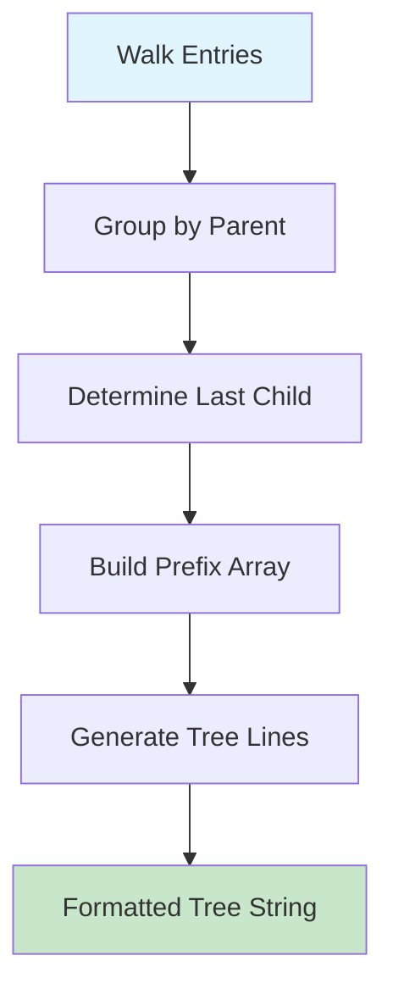
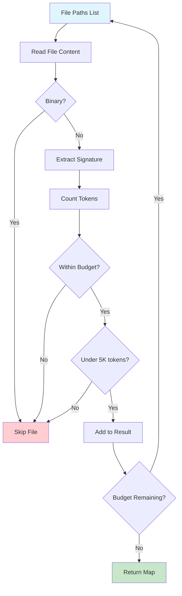
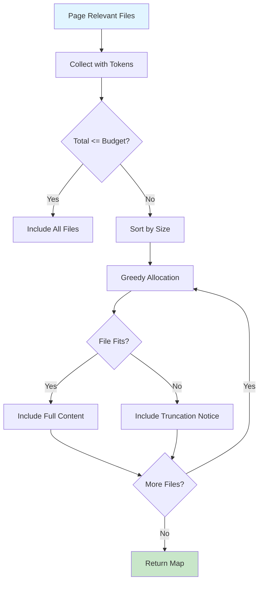
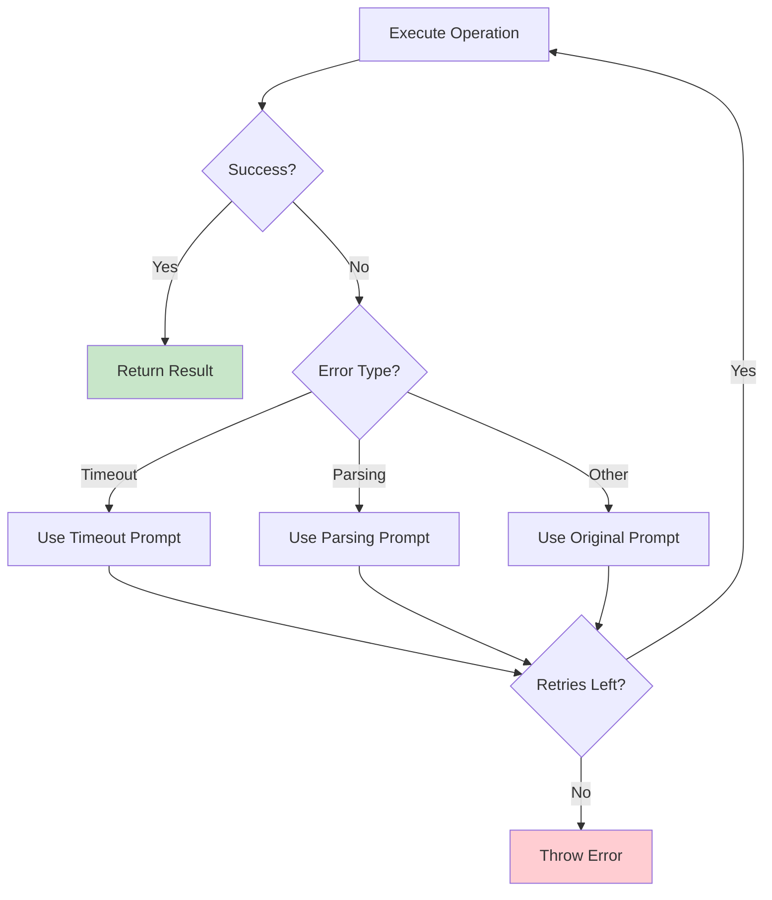
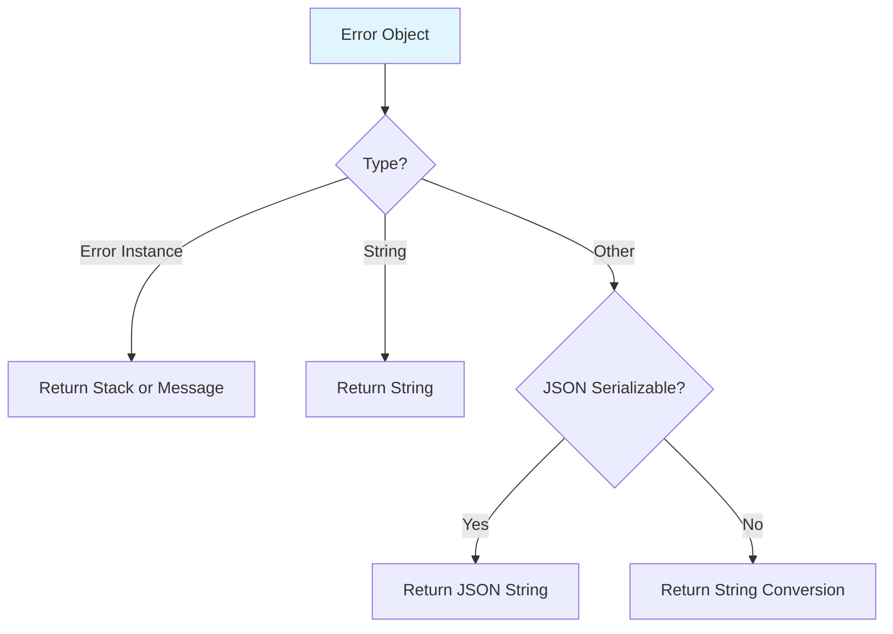

# File Walking, Tokenization & Retry Logic

This module provides essential utilities for traversing repository file structures, managing token budgets for LLM interactions, and implementing robust retry mechanisms with intelligent error recovery. These components form the foundation for the repository-wiki system's ability to efficiently process large codebases while respecting computational constraints and handling transient failures gracefully.

The file walking functionality enables selective repository traversal with configurable exclusions, while the tokenization utilities provide accurate token counting for budget management. The retry logic implements sophisticated error recovery strategies that distinguish between timeout and parsing failures, applying context-appropriate recovery prompts to maximize success rates.

## File System Operations

### Repository Walking

The `walkRepo` function performs a recursive traversal of a repository's file structure, respecting depth limits and applying exclusion rules to skip irrelevant directories and files.

**Sources:** [files.ts:40-74](../../../packages/repository-wiki/src/utils/files.ts#L40-L74)

```typescript
export function walkRepo(repoPath: string, maxDepth: number = 10): WalkEntry[]
```

**Key Features:**

| Feature | Description |
|---------|-------------|
| Depth Control | Configurable maximum depth (default: 10) to prevent excessive recursion |
| Automatic Exclusions | Skips hidden files (starting with `.`) and predefined exclusion patterns |
| Sorted Output | Directories appear before files, both sorted alphabetically |
| Documentation Filter | Excludes `.md` files as code is the source of truth |

The function returns an array of `WalkEntry` objects, each containing a relative path and a boolean indicating whether it's a directory.

**Sources:** [types.ts:8-11](../../../packages/repository-wiki/src/utils/types.ts#L8-L11)

### Walk Exclusions

The system maintains a comprehensive set of directories to exclude during repository traversal, covering build outputs, dependencies, caches, and IDE configurations:

```typescript
export const WALK_EXCLUSIONS = new Set([
  // Build/output directories
  "dist", "build", "out", "bin", "obj", "target",
  ".next", ".nuxt", ".output", ".svelte-kit",
  // Dependency/cache directories
  "node_modules", "bower_components", "vendor",
  "venv", "env", ".venv",
  ".tox", ".mypy_cache", ".pytest_cache", ".ruff_cache",
  ".yarn", ".pnp.cjs", ".pnp.loader.mjs",
  // IDE/editor directories
  ".idea", ".vscode",
  // Other generated/temporary
  "__pycache__", "coverage",
  ".terraform", ".cache", ".turbo", ".nx",
  ".parcel-cache", ".docusaurus",
  "tmp", ".tmp", "logs",
]);
```

**Sources:** [consts.ts:11-32](../../../packages/repository-wiki/src/utils/consts.ts#L11-L32)

### File Tree Formatting

The `formatFileTree` function transforms walk entries into a visually structured tree representation using ASCII box-drawing characters:



The algorithm tracks ancestor relationships to determine whether to use pipe (`│`) or blank space in the prefix for each depth level, ensuring correct visual continuation of tree branches.

**Sources:** [files.ts:80-123](../../../packages/repository-wiki/src/utils/files.ts#L80-L123)

### README Detection

The system searches for README files using a prioritized list of common filenames:

```typescript
const README_FILENAMES = [
  "README.md",
  "readme.md",
  "Readme.md",
  "README",
  "README.txt",
  "readme.txt",
];
```

The `readReadme` function attempts each filename in order, returning the content of the first non-empty file found, or `null` if none exist.

**Sources:** [files.ts:11-33](../../../packages/repository-wiki/src/utils/files.ts#L11-L33)

## Tokenization & Budget Management

### Tokenizer Initialization

The tokenizer uses Microsoft's `tiktokenizer` library configured for GPT-4o compatibility:

```typescript
export async function createTokenizer(): Promise<Tokenizer | null> {
  try {
    const tokenizer = await createByModelName(TOKENIZER_MODEL);
    return tokenizer;
  } catch (error) {
    logger.warn("Failed to initialize tokenizer, will use character-based estimation", {
      error: error instanceof Error ? error.message : String(error),
    });
    return null;
  }
}
```

If initialization fails, the system gracefully degrades to character-based estimation (4 characters per token).

**Sources:** [tokenizer.ts:6-17](../../../packages/repository-wiki/src/utils/tokenizer.ts#L6-L17), [consts.ts:6](../../../packages/repository-wiki/src/utils/consts.ts#L6)

### Token Counting

The `countTokens` function provides accurate token counting with automatic fallback:

| Mode | Method | Accuracy |
|------|--------|----------|
| Primary | TikToken encoding | Exact token count |
| Fallback | Character length ÷ 4 | Approximate estimate |

**Sources:** [tokenizer.ts:19-25](../../../packages/repository-wiki/src/utils/tokenizer.ts#L19-L25)

### Binary Content Detection

Files are screened for binary content by examining the first 1024 bytes for null characters (`\0`):

```typescript
export function isBinaryContent(content: string): boolean {
  const sample = content.slice(0, 1024);
  return sample.includes("\0");
}
```

**Sources:** [tokenizer.ts:27-30](../../../packages/repository-wiki/src/utils/tokenizer.ts#L27-L30)

### Token Budget Constants

The system defines two token budget levels for different operations:

| Budget Type | Tokens | Purpose |
|-------------|--------|---------|
| `MAX_STRUCTURE_PRELOADED_TOKENS` | 50,000 | Loading inferred important files with signatures |
| `MAX_GENERATE_FILE_PRELOADED_TOKENS` | 20,000 | Per-page file content preloading |

**Sources:** [consts.ts:3-4](../../../packages/repository-wiki/src/utils/consts.ts#L3-L4)

## File Loading & Content Management

### Inferred File Loading

The `loadInferredFiles` function implements intelligent file loading with tree-sitter signature extraction and token budget enforcement:



The function processes files sequentially, converting them to compact signatures via tree-sitter before token counting. Individual files exceeding 5,000 tokens are skipped to prevent budget exhaustion.

**Sources:** [files.ts:149-195](../../../packages/repository-wiki/src/utils/files.ts#L149-L195)

### Safe File Reading

The `readSafeFile` function implements security and safety checks:

1. **Path Normalization**: Strips leading slashes from relative paths
2. **Boundary Validation**: Ensures resolved paths remain within repository bounds
3. **Binary Detection**: Skips binary files automatically
4. **Error Handling**: Returns `null` for unreadable files

**Sources:** [files.ts:126-147](../../../packages/repository-wiki/src/utils/files.ts#L126-L147)

### Page-Specific File Loading

The `getPreloadedFilesForPage` function allocates files to wiki pages based on token budgets:



The algorithm uses a greedy approach, sorting files by size (smallest first) to maximize the number of files that fit within the budget. Files that don't fit are replaced with truncation notices.

**Sources:** [files.ts:234-266](../../../packages/repository-wiki/src/utils/files.ts#L234-L266)

## File Importance Calculation

### Mention-Based Scoring

The `calculateFileImportance` function analyzes file relevance by counting mentions in wiki content:

```typescript
export function calculateFileImportance(
  files: string[],
  content: string
): RelevantFile[]
```

**Algorithm:**

1. Count mentions of both full path and filename for each file
2. Use the maximum count across all files as the baseline
3. Calculate percentage relative to maximum
4. Assign importance levels based on thresholds

| Importance Level | Threshold | Rationale |
|------------------|-----------|-----------|
| High | ≥ 65% of max | Most relevant files |
| Medium | 30-64% of max | Supporting files |
| Low | < 30% of max | Peripheral references |

The maximum-based normalization ensures the most mentioned file always receives "high" importance, providing meaningful relative comparisons.

**Sources:** [files.ts:204-232](../../../packages/repository-wiki/src/utils/files.ts#L204-L232)

## Retry Logic with Error Recovery

### Retry Architecture

The `retryWithRecovery` function implements sophisticated retry logic with context-aware error recovery:



### Operation Modes

The retry system supports two distinct operation modes:

**Text Parsing Mode:**
```typescript
interface RetryWithTextParsingOptions<T> {
  run: (prompt: string) => Promise<AgentGenerateResult>;
  originalPrompt: string;
  timeoutRetryPrompt: string;
  parsingRetryPrompt: string;
  parse: (result: string) => T;
  label: string;
  maxRetries?: number;
}
```

**Structured Output Mode:**
```typescript
interface RetryWithStructuredOutputOptions<T> {
  run: (prompt: string) => Promise<{ structuredResponse?: T }>;
  originalPrompt: string;
  timeoutRetryPrompt: string;
  label: string;
  maxRetries?: number;
}
```

**Sources:** [retry.ts:19-47](../../../packages/repository-wiki/src/utils/retry.ts#L19-L47)

### Error Classification

The system distinguishes between error types to apply appropriate recovery strategies:

| Error Type | Detection | Recovery Strategy |
|------------|-----------|-------------------|
| Timeout | `AbortError` or message contains "aborted" | Use `timeoutRetryPrompt` |
| Parsing | Exception during `parse()` function | Use `parsingRetryPrompt` (text mode only) |
| Other | Any other exception | Use `originalPrompt` |

**Sources:** [retry.ts:60-109](../../../packages/repository-wiki/src/utils/retry.ts#L60-L109)

### Retry Configuration

Default retry behavior is configured via constants:

```typescript
export const MAX_RETRIES = 5;
export const FETCH_CODING_CLIENT_TIMEOUT = 5 * 60 * 1000; // 5 minute timeout
```

The system uses the `p-retry` library with configurable retry counts and automatic exponential backoff.

**Sources:** [consts.ts:2](../../../packages/repository-wiki/src/utils/consts.ts#L2), [consts.ts:8](../../../packages/repository-wiki/src/utils/consts.ts#L8)

### Error Formatting

The `formatError` function provides comprehensive error serialization:



This ensures detailed error information is captured in logs regardless of error object structure.

**Sources:** [retry.ts:4-16](../../../packages/repository-wiki/src/utils/retry.ts#L4-L16)

## Batch Processing Utilities

### Wiki Files to Content Map

The `wikiFilesToFileContentsMap` function aggregates all unique file paths from multiple wiki pages and loads their content in parallel:

```typescript
export async function wikiFilesToFileContentsMap(
  pages: WikiPage[],
  repoPath: string
): Promise<FileContentsMap>
```

The function:
1. Extracts unique file paths from all pages' `relevantFiles` arrays
2. Loads files concurrently using `Promise.all`
3. Returns a map of successfully loaded files

This enables efficient batch loading of all required files before wiki generation begins.

**Sources:** [files.ts:269-291](../../../packages/repository-wiki/src/utils/files.ts#L269-L291)

### Concurrency Management

The system defines a global concurrency limit for parallel operations:

```typescript
export const CONCURRENCY_LIMIT = 100;
```

This prevents resource exhaustion during large-scale parallel file processing operations.

**Sources:** [consts.ts:1](../../../packages/repository-wiki/src/utils/consts.ts#L1)

## Summary

The file walking, tokenization, and retry utilities provide a robust foundation for the repository-wiki system's core operations. The file walking mechanism efficiently traverses repositories while respecting exclusions and depth limits. Tokenization utilities enable precise budget management with graceful degradation, while the retry logic implements intelligent error recovery that adapts to different failure modes. Together, these components ensure reliable, efficient processing of large codebases within computational constraints, with comprehensive error handling and recovery mechanisms that maximize operation success rates.