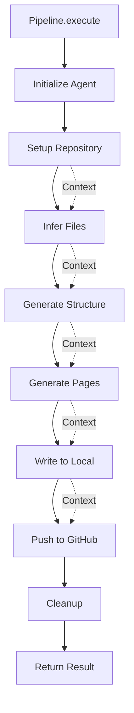

# Pipeline Architecture & Execution

The Wiki Generator Pipeline is the core orchestration system that coordinates the end-to-end process of generating comprehensive wiki documentation from source code repositories. It implements a modular, step-based architecture where each phase of wiki generation is encapsulated as an independent, composable step. The pipeline manages the complete lifecycle from repository setup and file analysis through content generation and publication, ensuring proper resource management and error handling throughout the execution flow.

The pipeline architecture follows a sequential execution model where each step receives a shared context object, performs its designated task, and returns an updated context for subsequent steps. This design enables clear separation of concerns while maintaining state continuity across the entire wiki generation process.

Sources: [packages/repository-wiki/src/pipeline/pipeline.ts:1-85](../../../packages/repository-wiki/src/pipeline/pipeline.ts#L1-L85), [packages/repository-wiki/src/pipeline/types.ts:1-48](../../../packages/repository-wiki/src/pipeline/types.ts#L1-L48)

## Pipeline Architecture

### Core Components

The pipeline system consists of three primary architectural components that work together to enable flexible, maintainable wiki generation:

| Component | Type | Description |
|-----------|------|-------------|
| `WikiGeneratorPipeline` | Class | Main orchestrator that manages step execution, context propagation, and cleanup |
| `PipelineContext` | Interface | Shared state container passed between steps containing configuration, agent, and intermediate results |
| `PipelineStep` | Interface | Contract for individual pipeline steps defining execution behavior |
| `PipelineResult` | Interface | Final output structure containing generated wiki structure and commit metadata |

Sources: [packages/repository-wiki/src/pipeline/pipeline.ts:11-85](../../../packages/repository-wiki/src/pipeline/pipeline.ts#L11-L85), [packages/repository-wiki/src/pipeline/types.ts:8-48](../../../packages/repository-wiki/src/pipeline/types.ts#L8-L48)

### Pipeline Context Structure

The `PipelineContext` serves as the data backbone of the pipeline, accumulating information as it flows through each step:

```typescript
export interface PipelineContext {
  // Input configuration
  config: WikiGeneratorConfig;

  // Repository info (set by SetupRepositoryStep)
  repoPath?: string;
  repoName?: string;
  commitId?: string;

  // File exploration (set by InferFilesStep)
  enrichedFiles?: Map<string, string>;

  // Wiki generation (set by GenerateStructureStep & GeneratePagesStep)
  wikiStructure?: WikiStructureModel;

  // Agent (managed by pipeline)
  agent: Agent;
}
```

The context follows a progressive enrichment pattern where early steps populate foundational data (repository metadata) and later steps build upon it (file analysis, wiki structure, content generation).

Sources: [packages/repository-wiki/src/pipeline/types.ts:8-28](../../../packages/repository-wiki/src/pipeline/types.ts#L8-L28)

### Step Interface Contract

Each pipeline step implements a simple but powerful interface that ensures consistency across all execution phases:

```typescript
export interface PipelineStep {
  /** Human-readable name for logging */
  readonly name: string;

  /**
   * Execute the step.
   * @param context - The current pipeline context
   * @returns Updated context with any new data added by this step
   */
  execute(context: PipelineContext): Promise<PipelineContext>;
}
```

This interface enables steps to be independently developed, tested, and composed while maintaining a consistent execution contract.

Sources: [packages/repository-wiki/src/pipeline/types.ts:30-42](../../../packages/repository-wiki/src/pipeline/types.ts#L30-L42)

## Pipeline Execution Flow

### Step Registration and Composition

The pipeline uses a fluent builder pattern for step registration, allowing flexible composition of the execution sequence:

```typescript
static create(): WikiGeneratorPipeline {
  return new WikiGeneratorPipeline()
    .addStep(new SetupRepositoryStep())
    .addStep(new InferFilesStep())
    .addStep(new GenerateStructureStep())
    .addStep(new GeneratePagesStep())
    .addStep(new WriteToLocalStep())
    .addStep(new PushToGitHubStep());
}

addStep(step: PipelineStep): this {
  this.steps.push(step);
  return this;
}
```

The factory method `create()` establishes the standard six-step pipeline sequence, but the `addStep()` method enables custom pipeline configurations if needed.

Sources: [packages/repository-wiki/src/pipeline/pipeline.ts:15-26](../../../packages/repository-wiki/src/pipeline/pipeline.ts#L15-L26)

### Execution Sequence

The pipeline executes steps sequentially, maintaining timing metrics and detailed logging for observability:



Each step receives the context from the previous step, performs its operation, and returns an enriched context. The pipeline tracks execution time for each step and logs progress at key milestones.

Sources: [packages/repository-wiki/src/pipeline/pipeline.ts:28-67](../../../packages/repository-wiki/src/pipeline/pipeline.ts#L28-L67)

### Agent Initialization

Before step execution begins, the pipeline initializes the LLM agent with models specified in the configuration:

```typescript
// Collect unique model IDs from config
const models = [...new Set([config.llmPlaner.modelID, config.llmExploration.modelID, config.llmBuilder.modelID])];
const provider = (config.providerConfig.providerID) as ModelProvider;

logger.info(`Initializing agent with provider "${provider}" and models: ${models.join(", ")}`);
const agent = await createAgent(models, provider);
let context: PipelineContext = { config, agent };
```

The pipeline deduplicates model IDs to avoid unnecessary initialization and creates a single agent instance that all steps can utilize through the shared context.

Sources: [packages/repository-wiki/src/pipeline/pipeline.ts:34-39](../../../packages/repository-wiki/src/pipeline/pipeline.ts#L34-L39)

## Standard Pipeline Steps

The default pipeline configuration includes six sequential steps, each responsible for a distinct phase of wiki generation:

| Step | Purpose | Context Inputs | Context Outputs |
|------|---------|----------------|-----------------|
| `SetupRepositoryStep` | Clone or validate repository | `config` | `repoPath`, `repoName`, `commitId` |
| `InferFilesStep` | Analyze and extract file content | `repoPath`, `agent` | `enrichedFiles` |
| `GenerateStructureStep` | Create wiki structure outline | `enrichedFiles`, `agent` | `wikiStructure` (partial) |
| `GeneratePagesStep` | Generate content for each page | `wikiStructure`, `agent` | `wikiStructure` (complete) |
| `WriteToLocalStep` | Write wiki files to local filesystem | `wikiStructure`, `config` | - |
| `PushToGitHubStep` | Push wiki to GitHub repository | `repoPath`, `config` | - |

Sources: [packages/repository-wiki/src/pipeline/steps/index.ts:1-6](../../../packages/repository-wiki/src/pipeline/steps/index.ts#L1-L6), [packages/repository-wiki/src/pipeline/pipeline.ts:17-22](../../../packages/repository-wiki/src/pipeline/pipeline.ts#L17-L22)

## Error Handling and Resource Management

### Validation and Error Propagation

The pipeline implements comprehensive validation to ensure successful completion:

```typescript
if (!context.wikiStructure) {
  throw new Error("Pipeline completed but wikiStructure is missing");
}
if (!context.commitId) {
  throw new Error("Pipeline completed but commitId is missing");
}
```

These post-execution checks verify that critical outputs were generated, preventing silent failures that could lead to incomplete or invalid results.

Sources: [packages/repository-wiki/src/pipeline/pipeline.ts:56-62](../../../packages/repository-wiki/src/pipeline/pipeline.ts#L56-L62)

### Resource Cleanup

The pipeline ensures proper cleanup of temporary resources using a `finally` block that executes regardless of success or failure:

```typescript
try {
  for (const step of this.steps) {
    // ... step execution
  }
  // ... validation and return
} finally {
  await this.cleanup(context);
}
```

The cleanup process removes temporary repository clones and other transient resources:

```typescript
private async cleanup(context: PipelineContext): Promise<void> {
  if (context.repoPath) {
    logger.info("Cleaning up temporary files...");
    await gitService.cleanup(context.repoPath);
  }
}
```

Sources: [packages/repository-wiki/src/pipeline/pipeline.ts:41-67](../../../packages/repository-wiki/src/pipeline/pipeline.ts#L41-L67), [packages/repository-wiki/src/pipeline/pipeline.ts:69-74](../../../packages/repository-wiki/src/pipeline/pipeline.ts#L69-L74)

## CLI Integration

### Command-Line Interface

The pipeline is exposed through a comprehensive CLI that accepts configuration via command-line arguments:

```typescript
const program = new Command()
  .name("repository-wiki")
  .description("Generate a wiki from a source code repository using LLMs...")
  .requiredOption("--provider-id <id>", "LLM provider ID (options: openai, anthropic, azure_openai, google-genai, bedrock, sap-ai-core)")
  .requiredOption("--planer-model <id>", "Model ID for the planning LLM (recommended: Opus family)")
  .requiredOption("--exploration-model <id>", "Model ID for the exploration LLM (recommended: Haiku family)")
  .requiredOption("--builder-model <id>", "Model ID for the builder LLM (recommended: Sonnet family)")
  .option("--repo-url <url>", "Repository URL to clone (conflicts with --local-repo-path)")
  .option("--local-repo-path <path>", "Path to a local repository (conflicts with --repo-url)")
  // ... additional options
```

The CLI validates configuration using Zod schemas before pipeline execution:

```typescript
const validatedConfig = WikiGeneratorConfigSchema.parse(config);
const pipeline = WikiGeneratorPipeline.create();
const result = await pipeline.execute(validatedConfig);
```

Sources: [packages/repository-wiki/src/cli.ts:8-95](../../../packages/repository-wiki/src/cli.ts#L8-L95), [packages/repository-wiki/src/cli.ts:115-118](../../../packages/repository-wiki/src/cli.ts#L115-L118)

### Result Reporting

Upon successful completion, the CLI provides a comprehensive summary of the generated wiki:

```typescript
logger.info("\n=== Wiki Generation Complete ===\n");
logger.info(`Title: ${result.wikiStructure.title}`);
logger.info(`Description: ${result.wikiStructure.description}`);
const allPages = result.wikiStructure.sections.flatMap((s) => s.pages);
logger.info(`Total Pages: ${allPages.length}`);
logger.info(`Commit: ${result.commitId}`);
logger.info("\nPages:");
for (const page of allPages) {
  logger.info(`  - ${page.title}`);
}
```

This output provides immediate feedback on the scope and content of the generated documentation.

Sources: [packages/repository-wiki/src/cli.ts:121-130](../../../packages/repository-wiki/src/cli.ts#L121-L130)

## Module Exports

The pipeline module provides a clean public API through its index files:

```typescript
// Main pipeline exports
export { WikiGeneratorPipeline } from "./pipeline";
export type { PipelineContext, PipelineStep, PipelineResult } from "./types";
export * from "./steps";
```

This export structure enables consumers to use the pipeline orchestrator, implement custom steps, or access individual step implementations for specialized use cases.

Sources: [packages/repository-wiki/src/pipeline/index.ts:1-3](../../../packages/repository-wiki/src/pipeline/index.ts#L1-L3), [packages/repository-wiki/src/index.ts:1-5](../../../packages/repository-wiki/src/index.ts#L1-L5)

## Summary

The Pipeline Architecture provides a robust, extensible framework for orchestrating complex multi-phase wiki generation workflows. Through its step-based design, shared context model, and comprehensive error handling, the pipeline ensures reliable execution while maintaining clear separation of concerns. The architecture's modularity enables easy testing, debugging, and extension, while the CLI integration provides a user-friendly interface for common wiki generation scenarios. The pipeline's design balances flexibility with safety, ensuring that resources are properly managed and failures are handled gracefully throughout the entire wiki generation lifecycle.