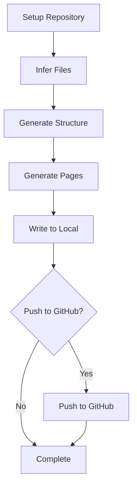
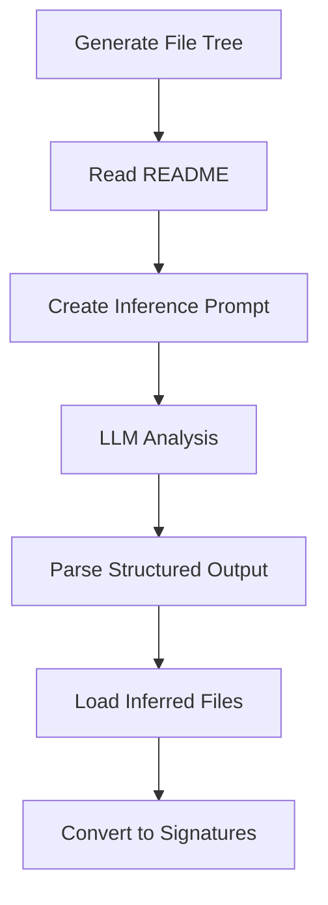
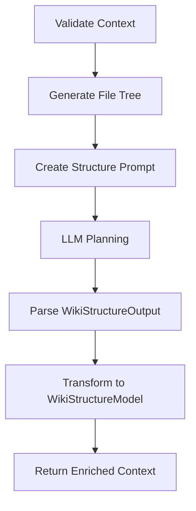
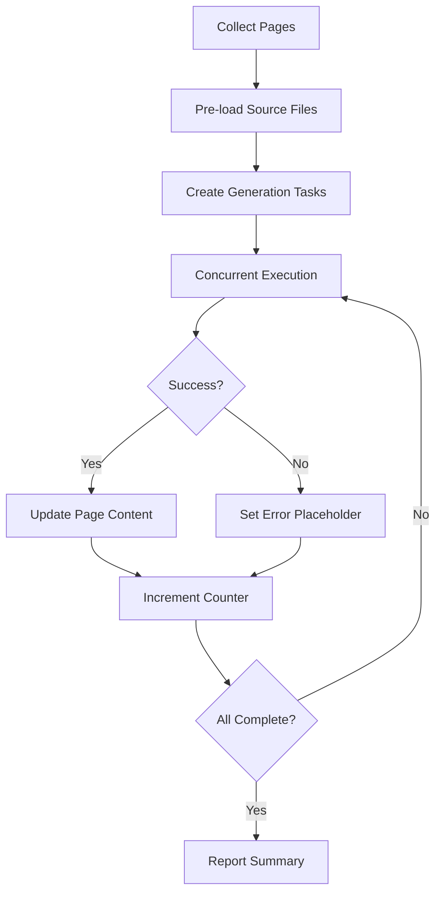

# Pipeline Steps: From Repo Setup to Output

The wiki generation pipeline orchestrates a series of sequential steps that transform a source code repository into comprehensive documentation. Each step builds upon the output of the previous one, creating a structured workflow from initial repository setup through final artifact generation. The pipeline is implemented using a modular step-based architecture where each step implements the `PipelineStep` interface with a `name` property and an `execute` method that processes and enriches a shared `PipelineContext` object.

The pipeline consists of five core steps: repository setup, file inference, structure generation, page generation, and output writing. An optional sixth step handles pushing results to GitHub. This design allows for clean separation of concerns, error handling at each stage, and the ability to retry or modify individual steps without affecting the entire pipeline.

## Pipeline Architecture

The pipeline follows a linear execution model where each step receives a `PipelineContext` object, performs its operations, and returns an enriched context for the next step. The context accumulates state throughout the pipeline, including repository metadata, file analysis results, wiki structure, and generated content.



Sources: [setup-repository.step.ts](../../../packages/repository-wiki/src/pipeline/steps/setup-repository.step.ts), [infer-files.step.ts](../../../packages/repository-wiki/src/pipeline/steps/infer-files.step.ts), [generate-structure.step.ts](../../../packages/repository-wiki/src/pipeline/steps/generate-structure.step.ts), [generate-pages.step.ts](../../../packages/repository-wiki/src/pipeline/steps/generate-pages.step.ts), [write-to-local.step.ts](../../../packages/repository-wiki/src/pipeline/steps/write-to-local.step.ts), [push-to-github.step.ts](../../../packages/repository-wiki/src/pipeline/steps/push-to-github.step.ts)

## Step 1: Setup Repository

The `SetupRepositoryStep` is the entry point of the pipeline, responsible for preparing the repository for analysis. It handles two scenarios: using an existing local repository or cloning a remote repository from a URL.

### Local Repository Mode

When a `localRepoPath` is provided in the configuration, the step validates that the path points to a valid git repository using `gitService.isGitRepo()`. It then retrieves the current commit ID using `git.revparse(["HEAD"])` and extracts the repository name from the path.

Sources: [setup-repository.step.ts:14-33](../../../packages/repository-wiki/src/pipeline/steps/setup-repository.step.ts#L14-L33)

### Remote Repository Mode

When a `repositoryUrl` is provided, the step uses `gitService.cloneRepository()` to clone the repository. This operation supports authentication via `githubToken` and can checkout a specific commit if `commitId` is provided in the configuration.

Sources: [setup-repository.step.ts:36-47](../../../packages/repository-wiki/src/pipeline/steps/setup-repository.step.ts#L36-L47)

### Output Directory Validation

Before proceeding, the step ensures that the output directory does not already exist to prevent conflicts. If the directory exists at the configured path (defaulting to `REPOSITORY_WIKI_DIR`), the step throws an error requiring manual cleanup.

```typescript
private ensureOutputDirectoryDoesNotExist(repoPath: string, outputDirPath?: string): void {
  const resolvedOutputDir = outputDirPath || REPOSITORY_WIKI_DIR;
  const outputPath = path.join(repoPath, resolvedOutputDir);
  if (fs.existsSync(outputPath)) {
    throw new Error(
      `Repository wiki folder already exists at '${outputPath}'. Please remove it before running the pipeline.`
    );
  }
}
```

Sources: [setup-repository.step.ts:49-58](../../../packages/repository-wiki/src/pipeline/steps/setup-repository.step.ts#L49-L58)

### Context Enrichment

The step enriches the pipeline context with:
- `repoPath`: Absolute path to the repository
- `repoName`: Extracted repository name
- `commitId`: Current commit SHA

Sources: [setup-repository.step.ts:25-30](../../../packages/repository-wiki/src/pipeline/steps/setup-repository.step.ts#L25-L30), [setup-repository.step.ts:42-47](../../../packages/repository-wiki/src/pipeline/steps/setup-repository.step.ts#L42-L47)

## Step 2: Infer Files

The `InferFilesStep` uses LLM analysis to identify and load the most important files in the repository. This step optimizes subsequent processing by focusing on key architectural components rather than processing every file.

### File Tree Generation

The step generates a complete file tree representation of the repository using `walkRepo()` and `formatFileTree()` functions. This tree structure is provided to the LLM as context for making informed decisions about file importance.

Sources: [infer-files.step.ts:21-23](../../../packages/repository-wiki/src/pipeline/steps/infer-files.step.ts#L21-L23)

### LLM-Based File Inference

The step makes a "fast, cheap LLM call" to infer important files by analyzing the file tree and README content. It uses the `inferImportantFilesPrompt()` to structure the request and expects a structured response conforming to `InferredFilesOutputSchema`.



Sources: [infer-files.step.ts:41-56](../../../packages/repository-wiki/src/pipeline/steps/infer-files.step.ts#L41-L56)

### Retry Logic

The inference process includes retry logic via `retryWithRecovery()` to handle timeouts and transient failures. A specialized `inferFilesTimeoutRetryPrompt()` is used for retry attempts.

Sources: [infer-files.step.ts:48-56](../../../packages/repository-wiki/src/pipeline/steps/infer-files.step.ts#L48-L56)

### File Loading and Enrichment

After inference, the step loads the actual file contents using `loadInferredFiles()`, which processes files with a tokenizer and TreeSitter for syntax analysis. The result is a `Map<string, string>` of enriched file signatures.

Sources: [infer-files.step.ts:64-65](../../../packages/repository-wiki/src/pipeline/steps/infer-files.step.ts#L64-L65)

### Error Handling

If file inference fails, the step logs a warning and returns an empty map, allowing the pipeline to continue without critical failure.

Sources: [infer-files.step.ts:66-69](../../../packages/repository-wiki/src/pipeline/steps/infer-files.step.ts#L66-L69)

## Step 3: Generate Structure

The `GenerateStructureStep` creates the overall wiki structure, defining sections and pages with their metadata. This step produces a hierarchical organization that guides subsequent content generation.

### Structure Generation Process

The step uses an LLM to analyze the repository and generate a comprehensive wiki structure. It provides the file tree and enriched file signatures from the previous step as context.



Sources: [generate-structure.step.ts:11-40](../../../packages/repository-wiki/src/pipeline/steps/generate-structure.step.ts#L11-L40)

### Context Validation

The step validates that all required context properties are present: `repoPath`, `repoName`, `commitId`, `agent`, and `enrichedFiles`. Missing properties result in descriptive error messages.

Sources: [generate-structure.step.ts:14-21](../../../packages/repository-wiki/src/pipeline/steps/generate-structure.step.ts#L14-L21)

### LLM Configuration

The structure generation uses the `llmPlaner` model configuration from the pipeline config, allowing different models to be used for planning versus content generation.

Sources: [generate-structure.step.ts:30](../../../packages/repository-wiki/src/pipeline/steps/generate-structure.step.ts#L30)

### Structure Transformation

The LLM output (`WikiStructureOutput`) is transformed into a `WikiStructureModel` by mapping `relevantFiles` arrays from strings to objects with a `filePath` property. This normalization prepares the structure for the page generation step.

```typescript
const wikiStructure: WikiStructureModel = {
  ...structureOutput,
  sections: structureOutput.sections.map(section => ({
    ...section,
    pages: section.pages.map(page => ({
      ...page,
      relevantFiles: page.relevantFiles.map(filePath => ({ filePath })),
    })),
  })),
};
```

Sources: [generate-structure.step.ts:49-57](../../../packages/repository-wiki/src/pipeline/steps/generate-structure.step.ts#L49-L57)

## Step 4: Generate Pages

The `GeneratePagesStep` is the most complex step, generating actual wiki page content for each page defined in the wiki structure. It uses concurrent processing with retry logic to efficiently generate multiple pages while handling failures gracefully.

### Page Collection and Mapping

The step collects all pages from all sections and creates a mapping between pages and their parent section titles for context during generation.

Sources: [generate-pages.step.ts:39-46](../../../packages/repository-wiki/src/pipeline/steps/generate-pages.step.ts#L39-L46)

### File Pre-loading

Before generating pages, the step pre-loads all source files referenced across all pages using `wikiFilesToFileContentsMap()`. This optimization reduces redundant file I/O operations during concurrent page generation.

Sources: [generate-pages.step.ts:49-51](../../../packages/repository-wiki/src/pipeline/steps/generate-pages.step.ts#L49-L51)

### Concurrent Page Generation

Pages are generated concurrently using `p-limit` with a configurable `CONCURRENCY_LIMIT`. Each page generation task is wrapped in error handling to prevent individual failures from halting the entire pipeline.



Sources: [generate-pages.step.ts:52-113](../../../packages/repository-wiki/src/pipeline/steps/generate-pages.step.ts#L52-L113)

### Page Generation Workflow

For each page, the step:
1. Retrieves pre-loaded files relevant to the page using `getPreloadedFilesForPage()`
2. Calculates the page depth for relative path construction
3. Generates a prompt using `generatePageContentPrompt()`
4. Calls the LLM with retry logic via `retryWithRecovery()`
5. Parses the response to extract content between `<content>` tags
6. Updates the page with generated content and recalculates file importance

Sources: [generate-pages.step.ts:60-90](../../../packages/repository-wiki/src/pipeline/steps/generate-pages.step.ts#L60-L90)

### Content Parsing

The step expects LLM responses to wrap content in `<content>...