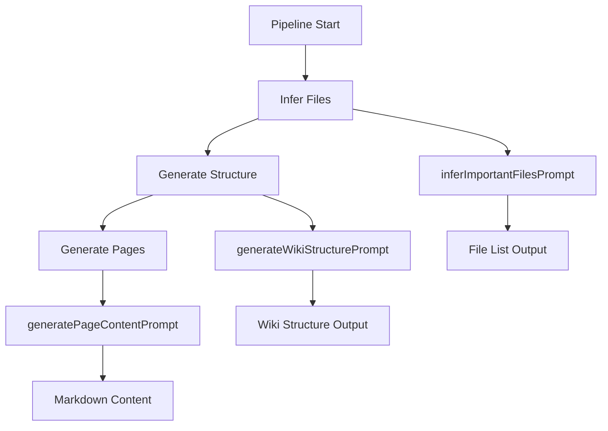
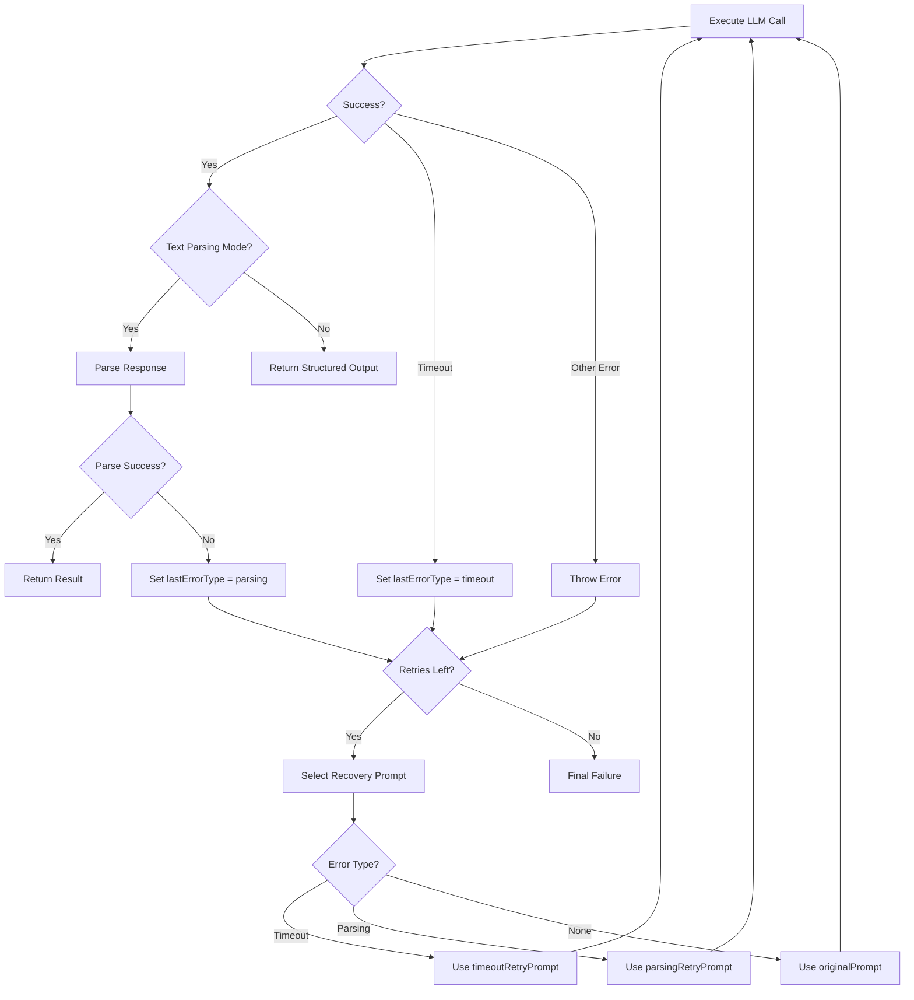

# Prompts & LLM Interaction Strategy

The repositories-wiki project employs a sophisticated prompt engineering and LLM interaction strategy to automatically generate comprehensive wiki documentation from source code repositories. This system orchestrates three distinct phases of LLM interaction—file inference, structure generation, and page content generation—each with tailored prompts, retry mechanisms, and error recovery strategies. The architecture emphasizes reliability through structured output validation, timeout handling, and adaptive prompt refinement to ensure high-quality documentation generation even when facing LLM instability or rate limits.

Sources: [packages/repository-wiki/src/pipeline/prompts.ts](../../../packages/repository-wiki/src/pipeline/prompts.ts)

## Prompt Generation Architecture

The system defines three primary prompt generation functions, each designed for a specific phase of the wiki generation pipeline. These prompts are carefully crafted to guide the LLM toward producing structured, accurate, and comprehensive documentation.



Sources: [packages/repository-wiki/src/pipeline/prompts.ts:1-300](../../../packages/repository-wiki/src/pipeline/prompts.ts#L1-L300)

### File Inference Prompt

The `inferImportantFilesPrompt` function generates a prompt designed to identify the most critical files in a repository that should be analyzed for wiki generation. This prompt emphasizes selecting core architectural files while excluding tests, generated code, and assets.

Key characteristics:
- Accepts a file tree and optional README content as inputs
- Configurable maximum file limit (default: 150 files)
- Explicitly excludes test files, build artifacts, and dependency directories
- Prioritizes widely-imported files, entry points, and configuration files
- Requests files ordered by importance

Sources: [packages/repository-wiki/src/pipeline/prompts.ts:35-79](../../../packages/repository-wiki/src/pipeline/prompts.ts#L35-L79)

### Wiki Structure Prompt

The `generateWikiStructurePrompt` function creates a comprehensive prompt for designing the overall wiki structure. This prompt emphasizes organic structure design based on repository complexity rather than arbitrary page counts.

```typescript
export function generateWikiStructurePrompt(
  repoName: string,
  commitId: string,
  fileTree: string,
  preloadedCoreFiles?: FileContentsMap
): string
```

Critical design principles embedded in the prompt:
- **Custom Structure**: Wiki sections and pages must emerge naturally from the codebase
- **Scale Matching**: Number of pages must organically match repository complexity
- **Quality Over Quantity**: Every page must "earn its place" with no filler content
- **Visual Documentation**: Includes pages that benefit from diagrams (architecture, data flows, component relationships)
- **Minimum File Coverage**: Each page must reference at least 5 relevant files

The prompt explicitly warns about the critical importance of scale matching, citing three reasons: quality/usability (avoiding information burial), performance (reducing timeout risks), and cost efficiency (avoiding wasted tokens).

Sources: [packages/repository-wiki/src/pipeline/prompts.ts:6-33](../../../packages/repository-wiki/src/pipeline/prompts.ts#L6-L33)

### Page Content Generation Prompt

The `generatePageContentPrompt` function produces the most detailed prompt in the system, guiding the LLM to create comprehensive, well-structured wiki pages with proper citations and visual aids.

```typescript
export function generatePageContentPrompt(
  page: WikiPage,
  sectionTitle: string,
  repoName: string,
  repoDescription: string,
  pageDepth: number,
  preloadedFiles?: Map<string, string>
): string
```

The prompt enforces nine strict content generation guidelines:

| Guideline | Requirement |
|-----------|-------------|
| Introduction | 1-2 paragraphs (max 300 characters) with cross-page links |
| Detailed Sections | H2/H3 headings with architecture and component explanations |
| Mermaid Diagrams | Visual representations with strict formatting rules (graph TD only, 3-4 word nodes) |
| Tables | Summarize features, APIs, configurations, data models |
| Code Snippets | Optional, well-formatted with language identifiers |
| Source Citations | **Mandatory** for every piece of information with exact line numbers |
| Technical Accuracy | Derived **solely** from provided source files |
| Clarity | Professional, concise technical language |
| Conclusion | Brief summary of key aspects |

The prompt includes critical Mermaid diagram rules to prevent common formatting errors, such as using "graph TD" instead of "graph LR" and avoiding flowchart-style labels in sequence diagrams.

Sources: [packages/repository-wiki/src/pipeline/prompts.ts:81-146](../../../packages/repository-wiki/src/pipeline/prompts.ts#L81-L146)

## Retry and Recovery Strategy

The system implements a sophisticated retry mechanism with adaptive prompt recovery for both timeout and parsing failures. This is centralized in the `retryWithRecovery` function, which handles two distinct operation modes: text parsing and structured output.



Sources: [packages/repository-wiki/src/utils/retry.ts](../../../packages/repository-wiki/src/utils/retry.ts)

### Retry Configuration

The retry system supports two distinct option types:

**Text Parsing Options:**
```typescript
export interface RetryWithTextParsingOptions<T> {
  run: (prompt: string) => Promise<AgentGenerateResult>;
  originalPrompt: string;
  timeoutRetryPrompt: string;
  parsingRetryPrompt: string;
  parse: (result: string) => T;
  label: string;
  maxRetries?: number;
}
```

**Structured Output Options:**
```typescript
export interface RetryWithStructuredOutputOptions<T> {
  run: (prompt: string) => Promise<{ structuredResponse?: T }>;
  originalPrompt: string;
  timeoutRetryPrompt: string;
  label: string;
  maxRetries?: number;
}
```

The system defaults to `MAX_RETRIES = 5` attempts and uses the `p-retry` library for exponential backoff.

Sources: [packages/repository-wiki/src/utils/retry.ts:14-44](../../../packages/repository-wiki/src/utils/retry.ts#L14-L44), [packages/repository-wiki/src/utils/consts.ts:3](../../../packages/repository-wiki/src/utils/consts.ts#L3)

### Adaptive Prompt Selection

The retry mechanism adaptively selects prompts based on the previous failure type:

```typescript
let prompt: string;
if (lastErrorType === "timeout") {
  prompt = timeoutRetryPrompt;
} else if (lastErrorType === "parsing" && useTextParsing) {
  prompt = options.parsingRetryPrompt;
} else {
  prompt = originalPrompt;
}
```

This allows the system to provide more concise prompts after timeouts or request proper formatting after parsing failures.

Sources: [packages/repository-wiki/src/utils/retry.ts:60-69](../../../packages/repository-wiki/src/utils/retry.ts#L60-L69)

### Timeout Recovery Prompts

Three specialized timeout recovery prompts are defined:

| Function | Purpose | Message |
|----------|---------|---------|
| `structureTimeoutRetryPrompt` | Wiki structure generation | "Your previous response was cut off due to a timeout. Please provide a complete but more concise wiki structure response." |
| `inferFilesTimeoutRetryPrompt` | File inference | "Your previous response was cut off due to a timeout. Please provide a complete but shorter list of important files." |
| `pageContentTimeoutRetryPrompt` | Page content generation | "Your previous response for page \"{pageTitle}\" was cut off due to a timeout. Please provide a complete but more concise wiki page." |

These prompts explicitly acknowledge the timeout and request more concise output to avoid repeated failures.

Sources: [packages/repository-wiki/src/pipeline/prompts.ts:148-158](../../../packages/repository-wiki/src/pipeline/prompts.ts#L148-L158)

## Pipeline Integration

The prompts and retry strategies are integrated into three pipeline steps, each leveraging the appropriate prompt generation function and retry configuration.

### Infer Files Step

The `InferFilesStep` uses structured output mode with the `InferredFilesOutputSchema` to ensure type-safe file list extraction:

```typescript
const { parsed: inferredResult } = await retryWithRecovery<InferredFilesOutput>({
  run: (prompt) =>
    agent.generate<InferredFilesOutput>({
      model: modelId,
      prompt,
      structuredOutput: InferredFilesOutputSchema,
    }),
  originalPrompt: inferPrompt,
  timeoutRetryPrompt: inferFilesTimeoutRetryPrompt(),
  label: "file inference",
});
```

This step runs a "fast, cheap LLM call" using the `llmExploration` configuration to quickly identify important files before deeper analysis.

Sources: [packages/repository-wiki/src/pipeline/steps/infer-files.step.ts:43-64](../../../packages/repository-wiki/src/pipeline/steps/infer-files.step.ts#L43-L64)

### Generate Structure Step

The `GenerateStructureStep` also uses structured output mode with `WikiStructureOutputSchema` to ensure the wiki structure conforms to the expected schema:

```typescript
const { parsed: structureOutput } = await retryWithRecovery<WikiStructureOutput>({
  run: (prompt) =>
    agent.generate<WikiStructureOutput>({
      model: llmConfig.modelID,
      prompt,
      structuredOutput: WikiStructureOutputSchema,
    }),
  originalPrompt: prompt,
  timeoutRetryPrompt: structureTimeoutRetryPrompt(),
  label: "structure generation",
});
```

The structured output is then transformed into a `WikiStructureModel` with enriched `relevantFiles` data.

Sources: [packages/repository-wiki/src/pipeline/steps/generate-structure.step.ts:35-56](../../../packages/repository-wiki/src/pipeline/steps/generate-structure.step.ts#L35-L56)

### Generate Pages Step

The `GeneratePagesStep` uses text parsing mode since it generates free-form Markdown content that must be extracted from `<content>` tags:

```typescript
const { parsed: content } = await retryWithRecovery<string>({
  run: (prompt) =>
    agent.generate({
      model: modelId,
      prompt,
      projectPath: repoPath,
    }),
  originalPrompt,
  timeoutRetryPrompt: pageContentTimeoutRetryPrompt(page.title),
  parsingRetryPrompt: originalPrompt + `Your previous response for page "${page.title}" was missing the required <content>...